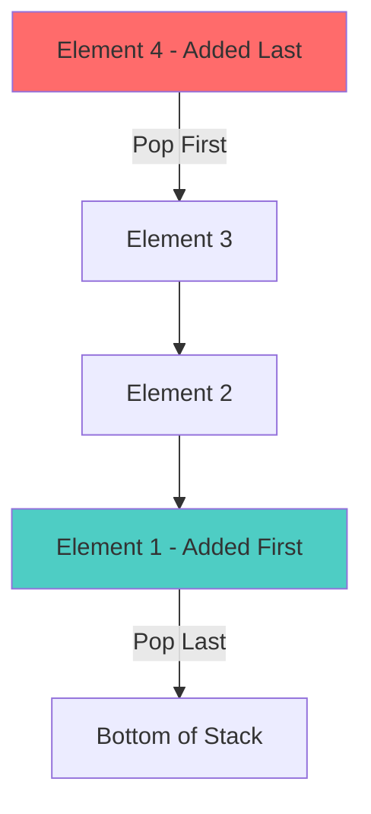
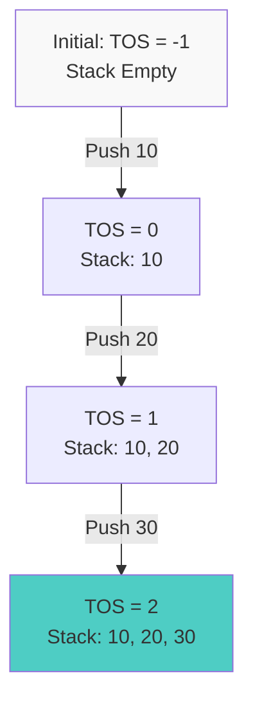
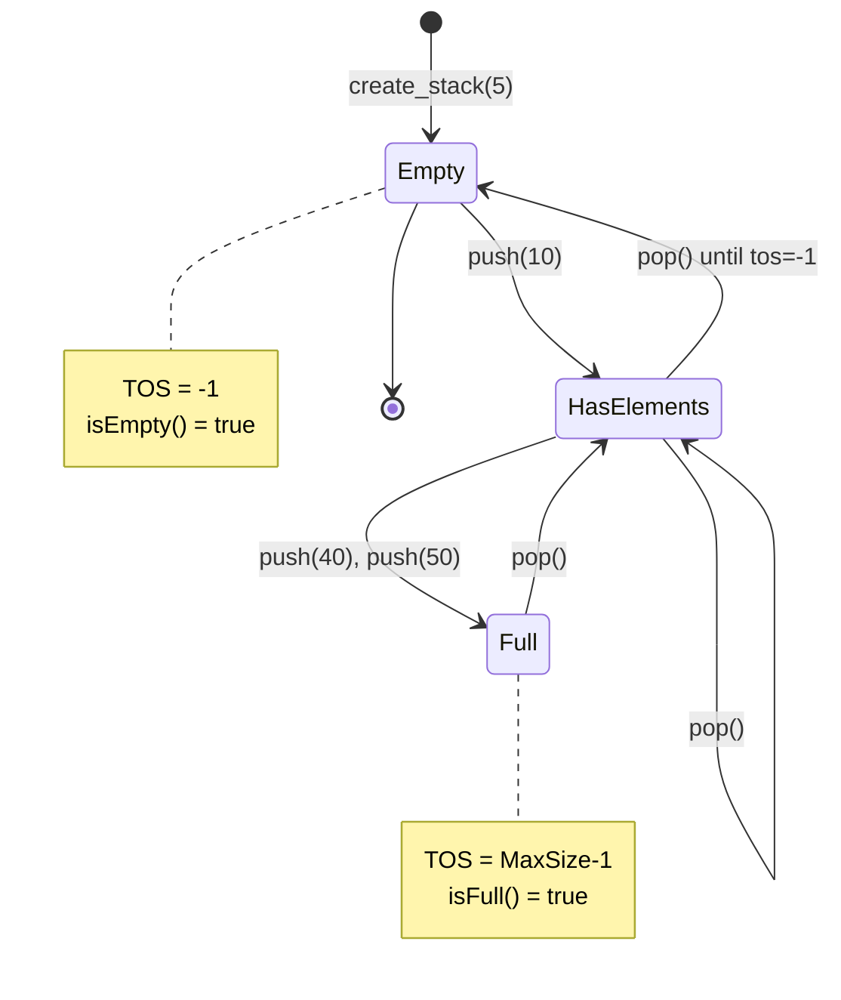

# Stack Fundamentals and Implementation

## Table of Contents
1. [Introduction to Stack](#introduction-to-stack)
2. [Stack Characteristics](#stack-characteristics)
3. [Stack Operations](#stack-operations)
4. [Array-Based Stack Implementation](#array-based-stack-implementation)
5. [Detailed Code Analysis](#detailed-code-analysis)
6. [Time and Space Complexity](#time-and-space-complexity)
7. [Stack Visualization](#stack-visualization)
8. [Advantages and Limitations](#advantages-and-limitations)
9. [Common Use Cases](#common-use-cases)

---

## Introduction to Stack

A **Stack** is a linear data structure that follows the **LIFO (Last In, First Out)** principle. This means the last element added to the stack will be the first one to be removed.

### Real-World Analogy
Think of a stack of plates:
- You can only add a plate on top (push)
- You can only remove the top plate (pop)
- You can see what's on top without removing it (peek)
- The last plate you placed is the first one you'll remove

### Key Concept: LIFO Principle



---

## Stack Characteristics

### 1. **Single Access Point**
- All operations happen at one end called the **TOP**
- No direct access to middle or bottom elements

### 2. **Ordered Collection**
- Elements are arranged in the order they were added
- Maintains insertion sequence

### 3. **Dynamic Size (in some implementations)**
- Can grow and shrink based on operations
- Array-based: Fixed size
- Linked-list based: Dynamic size

### 4. **Restricted Access**
- Cannot access elements at arbitrary positions
- Must follow LIFO discipline

---

## Stack Operations

### Primary Operations

| Operation | Description | Time Complexity |
|-----------|-------------|-----------------|
| **Push** | Add element to top of stack | O(1) |
| **Pop** | Remove and return top element | O(1) |
| **Peek/Top** | View top element without removing | O(1) |
| **isEmpty** | Check if stack is empty | O(1) |
| **isFull** | Check if stack is full (array-based) | O(1) |

### Secondary Operations

| Operation | Description | Time Complexity |
|-----------|-------------|-----------------|
| **Print** | Display all stack elements | O(n) |
| **Size** | Return number of elements | O(1) |
| **Clear** | Remove all elements | O(1) |

---

## Array-Based Stack Implementation

### Conceptual Structure

```
Array: [10] [20] [30] [40] [ ] [ ] [ ] [ ]
Index:   0    1    2    3   4   5   6   7
                          ↑
                         TOS (Top of Stack)
MaxSize = 8
TOS = 3 (points to index of top element)
```

### Implementation Components

1. **Array** - Storage for stack elements
2. **TOS (Top of Stack)** - Index pointer to top element
3. **MaxSize** - Maximum capacity of stack

---

## Detailed Code Analysis

### Stack Class Structure

```java
package Stack_Examples;

public class Stack_Class {
    // Data members
    int stack[];      // Array to store stack elements
    int tos;          // Top of Stack pointer (index)
    int MaxSize;      // Maximum capacity
    
    // Methods will be explained below
}
```

#### **Line-by-Line Explanation:**

- **Line 1**: `package Stack_Examples;`
  - Declares this class belongs to the `Stack_Examples` package
  - Organizes related classes together

- **Line 3**: `public class Stack_Class {`
  - Defines a public class named `Stack_Class`
  - Can be accessed from any other class

- **Line 5**: `int stack[];`
  - Declares an integer array to hold stack elements
  - Initially null, will be initialized in `create_stack()`

- **Line 6**: `int tos;`
  - **TOS** = Top of Stack
  - Stores the index of the topmost element
  - When stack is empty: `tos = -1`
  - When stack has elements: `tos` points to valid index

- **Line 7**: `int MaxSize;`
  - Stores the maximum capacity of the stack
  - Determines array size
  - Used in `is_full()` check

---

### 1. Create Stack Method

```java
void create_stack(int size) {
    tos = -1;                    // Initialize TOS to -1 (empty stack indicator)
    MaxSize = size;              // Set maximum capacity
    stack = new int[MaxSize];    // Allocate memory for array
}
```

#### **Flow Explanation:**

**Step 1:** `tos = -1;`
- Sets TOS to -1 indicating an empty stack
- **Why -1?** When we push the first element, we do `stack[++tos]`, which becomes `stack[0]`

**Step 2:** `MaxSize = size;`
- Stores the user-provided size as maximum capacity
- Example: If size = 5, stack can hold 5 elements

**Step 3:** `stack = new int[MaxSize];`
- Creates an integer array of specified size in memory
- **Heap Memory Allocation**: Array is created in heap
- All elements initialized to 0 by default in Java

**Example Execution:**
```
create_stack(5) called:
  ↓
tos = -1
MaxSize = 5
stack = [0, 0, 0, 0, 0]  (5 empty slots)
```

---

### 2. Push Operation

```java
void push(int element) {
    stack[++tos] = element;
}
```

#### **Line-by-Line Explanation:**

- **`stack[++tos] = element;`**
  - **Pre-increment operator**: `++tos` increments TOS FIRST, then uses new value
  - Stores the element at the incremented TOS position
  
#### **Detailed Execution Flow:**

```
Initial State: tos = -1, stack = [ ][ ][ ]

Push(10):
  ++tos → tos becomes 0
  stack[0] = 10
  Result: tos = 0, stack = [10][ ][ ]

Push(20):
  ++tos → tos becomes 1
  stack[1] = 20
  Result: tos = 1, stack = [10][20][ ]

Push(30):
  ++tos → tos becomes 2
  stack[2] = 30
  Result: tos = 2, stack = [10][20][30]
```

#### **Why Pre-Increment?**

```
If tos = -1 (empty stack):
  ++tos increments tos to 0, then accesses stack[0] ✓

If we used tos++:
  Would access stack[-1] first (error!), then increment ✗
```

**Visual Representation:**



---

### 3. Pop Operation

```java
int pop() {
    int temp = stack[tos];    // Store top element in temp
    tos--;                    // Decrement TOS pointer
    return temp;              // Return the removed element
}
```

#### **Line-by-Line Explanation:**

**Line 1:** `int temp = stack[tos];`
- Retrieves the element at current TOS position
- Stores it in temporary variable for returning
- **Does NOT remove from array** - just reads the value

**Line 2:** `tos--;`
- Decrements the TOS pointer
- Effectively "removes" the element by making it inaccessible
- **Logical Deletion**: Element still exists in array but is no longer part of stack

**Line 3:** `return temp;`
- Returns the popped element to caller
- Allows user to see what was removed

#### **Detailed Execution Flow:**

```
Initial State: tos = 2, stack = [10][20][30]

Pop():
  temp = stack[2] = 30    // Read top element
  tos = 2 - 1 = 1         // Move TOS down
  return 30               // Return removed element
  
Result: tos = 1, stack = [10][20][30]
                                  ↑
                           (still in array but inaccessible)
```

#### **Alternative Single-Line Implementation:**

```java
return stack[tos--];  // Post-decrement: uses tos, then decrements
```

**Why this works:**
- `stack[tos--]` returns `stack[tos]` 
- THEN decrements tos
- Same result, more concise

---

### 4. Peek Operation

```java
int peek() {
    return stack[tos];
}
```

#### **Line-by-Line Explanation:**

- **`return stack[tos];`**
  - Returns the element at TOS position
  - **Does NOT modify** TOS or stack
  - **Read-only operation**

#### **Key Difference from Pop:**
- **Peek**: Look at top element (TOS unchanged)
- **Pop**: Remove top element (TOS decremented)

**Example:**
```
State: tos = 2, stack = [10][20][30]

peek() → returns 30
State: tos = 2, stack = [10][20][30]  (unchanged)

pop() → returns 30
State: tos = 1, stack = [10][20][30]  (tos changed)
```

---

### 5. isEmpty Check

```java
boolean is_empty() {
    if (tos == -1)
        return true;
    else
        return false;
}
```

#### **Line-by-Line Explanation:**

**Line 1:** `if (tos == -1)`
- Checks if TOS is -1
- TOS = -1 means no elements in stack

**Line 2:** `return true;`
- Stack is empty if condition is true

**Line 4:** `return false;`
- Stack has elements if TOS ≥ 0

#### **Simplified Version:**

```java
boolean is_empty() {
    return (tos == -1);  // Direct boolean expression
}
```

**Truth Table:**
| TOS Value | tos == -1 | Result | Meaning |
|-----------|-----------|--------|---------|
| -1 | true | true | Empty |
| 0 | false | false | Has 1 element |
| 1 | false | false | Has 2 elements |
| 2 | false | false | Has 3 elements |

---

### 6. isFull Check

```java
boolean is_full() {
    return (tos == MaxSize - 1);
}
```

#### **Line-by-Line Explanation:**

- **`return (tos == MaxSize - 1);`**
  - Checks if TOS has reached maximum index
  - **Why MaxSize - 1?** Arrays are 0-indexed
  
**Example:**
```
MaxSize = 5
Array indices: 0, 1, 2, 3, 4
Last valid index = 4 = (5 - 1)

If tos = 4:
  Stack is full ✓
  
If tos = 3:
  Stack has 1 empty slot
```

**Comparison Table:**

| MaxSize | Valid Indices | Full when TOS = |
|---------|---------------|-----------------|
| 3 | 0, 1, 2 | 2 |
| 5 | 0, 1, 2, 3, 4 | 4 |
| 10 | 0, 1, 2, ..., 9 | 9 |

---

### 7. Print Stack

```java
void print_stack() {
    for (int i = tos; i >= 0; i--) {
        System.out.println(stack[i]);
        System.out.println("======");
    }
}
```

#### **Line-by-Line Explanation:**

**Line 1:** `for (int i = tos; i >= 0; i--)`
- **Initialization**: `i = tos` starts from top
- **Condition**: `i >= 0` continues until bottom
- **Update**: `i--` moves downward through stack

**Line 2:** `System.out.println(stack[i]);`
- Prints element at index i

**Line 3:** `System.out.println("======");`
- Prints separator line for visual clarity

#### **Execution Flow:**

```
State: tos = 2, stack = [10][20][30]

Iteration 1: i = 2
  Print: 30
  Print: ======

Iteration 2: i = 1
  Print: 20
  Print: ======

Iteration 3: i = 0
  Print: 10
  Print: ======

Output:
30
======
20
======
10
======
```

#### **Why Top to Bottom?**
- Represents actual stack visualization
- Top element printed first (most recently added)
- Follows LIFO display

---

## Time and Space Complexity

### Time Complexity Analysis

| Operation | Best Case | Average Case | Worst Case | Explanation |
|-----------|-----------|--------------|------------|-------------|
| **Push** | O(1) | O(1) | O(1) | Direct array access |
| **Pop** | O(1) | O(1) | O(1) | Direct array access |
| **Peek** | O(1) | O(1) | O(1) | Direct array access |
| **isEmpty** | O(1) | O(1) | O(1) | Single comparison |
| **isFull** | O(1) | O(1) | O(1) | Single comparison |
| **Print** | O(n) | O(n) | O(n) | Traverse all elements |

### Space Complexity

- **Array Storage**: O(n) where n = MaxSize
- **Additional Variables**: O(1) for tos, MaxSize
- **Total Space**: O(n)

### Why O(1) for Push/Pop?

```
Push Operation:
  1. Increment tos → 1 operation
  2. Assign value → 1 operation
  Total: 2 operations (constant, not dependent on n)

Pop Operation:
  1. Read value → 1 operation
  2. Decrement tos → 1 operation
  3. Return value → 1 operation
  Total: 3 operations (constant)
```

---

## Stack Visualization

### Empty Stack
```
TOS = -1
┌─────┐
│     │ ← Index 4
├─────┤
│     │ ← Index 3
├─────┤
│     │ ← Index 2
├─────┤
│     │ ← Index 1
├─────┤
│     │ ← Index 0
└─────┘
```

### Stack with Elements
```
TOS = 2
┌─────┐
│     │ ← Index 4 (Empty)
├─────┤
│     │ ← Index 3 (Empty)
├─────┤
│ 30  │ ← Index 2 (TOS) ⭐
├─────┤
│ 20  │ ← Index 1
├─────┤
│ 10  │ ← Index 0 (Bottom)
└─────┘
```

### Full Stack
```
TOS = 4 (MaxSize - 1)
┌─────┐
│ 50  │ ← Index 4 (TOS) ⭐ FULL
├─────┤
│ 40  │ ← Index 3
├─────┤
│ 30  │ ← Index 2
├─────┤
│ 20  │ ← Index 1
├─────┤
│ 10  │ ← Index 0 (Bottom)
└─────┘
```

### Complete Operation Flow Diagram



---

## Advantages and Limitations

### ✅ Advantages of Array-Based Stack

1. **Simple Implementation**
   - Easy to understand and code
   - Minimal memory overhead

2. **Fast Operations**
   - O(1) time for push, pop, peek
   - Direct array indexing

3. **Cache Friendly**
   - Contiguous memory allocation
   - Better CPU cache utilization

4. **No Pointer Overhead**
   - Unlike linked lists
   - More memory efficient per element

### ❌ Limitations of Array-Based Stack

1. **Fixed Size**
   - Must specify size at creation
   - Cannot grow beyond MaxSize
   - Wasted space if underutilized

2. **Stack Overflow**
   - Pushing to full stack causes error
   - Need to check `is_full()` before push

3. **Stack Underflow**
   - Popping from empty stack causes error
   - Need to check `is_empty()` before pop

4. **Memory Wastage**
   - If MaxSize = 1000 but only 10 elements used
   - 990 spaces wasted

### Comparison: Array vs Linked List Stack

| Feature | Array-Based | Linked List-Based |
|---------|-------------|-------------------|
| Size | Fixed | Dynamic |
| Memory | Contiguous | Scattered |
| Overhead | Low | High (pointers) |
| Resize | Not possible | Automatic |
| Implementation | Simpler | More complex |
| Cache Performance | Better | Worse |

---

## Common Use Cases

### 1. **Function Call Stack**
```
main() calls function1()
  function1() calls function2()
    function2() calls function3()
      ↓
Call Stack:
[function3] ← Current
[function2]
[function1]
[main]
```

### 2. **Expression Evaluation**
- Infix to Postfix conversion
- Postfix expression evaluation
- Checking balanced parentheses

### 3. **Undo Mechanism**
```
Text Editor:
Type "Hello" → Push to stack
Type "World" → Push to stack
Undo → Pop "World"
Undo → Pop "Hello"
```

### 4. **Browser History**
```
Visit page1.com → Push
Visit page2.com → Push
Visit page3.com → Push
Back button → Pop page3.com
Back button → Pop page2.com
```

### 5. **Recursion Implementation**
- Every recursive call creates a stack frame
- Stores local variables and return addresses
- Example: Factorial, Fibonacci

### 6. **Backtracking Algorithms**
- Maze solving
- N-Queens problem
- Sudoku solver

---

## Practice Problems

### Problem 1: Balanced Parentheses
Check if parentheses are balanced: `"((()))"` → valid, `"(()"` → invalid

**Approach:**
- Push opening brackets
- Pop for closing brackets
- Stack should be empty at end

### Problem 2: Reverse a String
Input: `"HELLO"` → Output: `"OLLEH"`

**Approach:**
- Push each character
- Pop all characters (LIFO gives reverse)

### Problem 3: Next Greater Element
For each element in array, find next greater element.
Input: `[4, 5, 2, 10]`
Output: `[5, 10, 10, -1]`

---

## Summary

### Key Takeaways

1. **LIFO Principle**: Last In, First Out - fundamental to stack behavior

2. **Three Critical Variables**:
   - `stack[]` - Array storage
   - `tos` - Top of Stack pointer
   - `MaxSize` - Capacity limit

3. **O(1) Operations**: Push, Pop, Peek are constant time

4. **Must Check Conditions**:
   - Check `is_full()` before Push
   - Check `is_empty()` before Pop/Peek

5. **TOS Initialization**: Always start with `tos = -1` for empty stack

6. **Pre vs Post Increment**:
   - Push uses `++tos` (pre-increment)
   - Pop can use `tos--` (post-decrement)

### Next Steps

- Learn [Infix to Postfix Conversion](file:///c:/Users/2706p/Desktop/mcq/java/02_Infix_to_Postfix_Conversion.md)
- Explore [Stack Applications](file:///c:/Users/2706p/Desktop/mcq/java/03_Stack_Applications.md)
- Understand Dynamic Stack with Linked Lists

---

**Author's Note**: This comprehensive guide covers stack fundamentals from basic concepts to implementation details. Practice the code, understand each line, and visualize the operations for deep learning.
