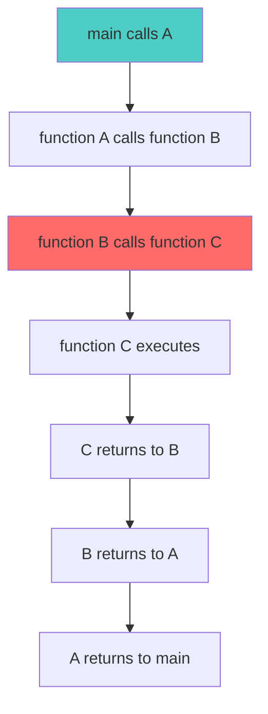

# Stack Applications and Advanced Concepts

## Table of Contents
1. [Function Call Stack](#function-call-stack)
2. [Recursion and Stack](#recursion-and-stack)
3. [Expression Evaluation](#expression-evaluation)
4. [Backtracking Problems](#backtracking-problems)
5. [Browser History Implementation](#browser-history-implementation)
6. [Undo/Redo Mechanism](#undo-redo-mechanism)
7. [Balanced Parentheses Checker](#balanced-parentheses-checker)
8. [Tower of Hanoi](#tower-of-hanoi)
9. [Real-World Applications](#real-world-applications)

---

## Function Call Stack

### How Function Calls Work

Every time a function is called, the system creates a **stack frame** containing:
- Function parameters
- Local variables
- Return address (where to return after execution)



### Stack Frame Example

```java
public class FunctionCallDemo {
    public static void main(String[] args) {
        System.out.println("Main started");
        function1();
        System.out.println("Main ended");
    }
    
    static void function1() {
        System.out.println("Function1 started");
        function2();
        System.out.println("Function1 ended");
    }
    
    static void function2() {
        System.out.println("Function2 started");
        function3();
        System.out.println("Function2 ended");
    }
    
    static void function3() {
        System.out.println("Function3 executing");
    }
}
```

**Call Stack Visualization:**

```
Step 1: main() called
┌─────────────┐
│   main()    │ ← Top
└─────────────┘

Step 2: function1() called from main
┌─────────────┐
│ function1() │ ← Top
├─────────────┤
│   main()    │
└─────────────┘

Step 3: function2() called from function1
┌─────────────┐
│ function2() │ ← Top
├─────────────┤
│ function1() │
├─────────────┤
│   main()    │
└─────────────┘

Step 4: function3() called from function2
┌─────────────┐
│ function3() │ ← Top (currently executing)
├─────────────┤
│ function2() │
├─────────────┤
│ function1() │
├─────────────┤
│   main()    │
└─────────────┘

Step 5: function3() completes, returns to function2
┌─────────────┐
│ function2() │ ← Top
├─────────────┤
│ function1() │
├─────────────┤
│   main()    │
└─────────────┘

... and so on until stack is empty
```

---

## Recursion and Stack

### Factorial Example

```java
public class RecursionExample {
    static int factorial(int n) {
        // Base case
        if (n == 0 || n == 1) {
            return 1;
        }
        // Recursive case
        return n * factorial(n - 1);
    }
    
    public static void main(String[] args) {
        int result = factorial(4);
        System.out.println("Factorial of 4 = " + result);
    }
}
```

### Call Stack for factorial(4)

```
Call 1: factorial(4)
  Returns: 4 * factorial(3)
  Stack:
  ┌──────────────────┐
  │ factorial(4)     │
  │ n = 4            │
  └──────────────────┘

Call 2: factorial(3) from factorial(4)
  Returns: 3 * factorial(2)
  Stack:
  ┌──────────────────┐
  │ factorial(3)     │
  │ n = 3            │
  ├──────────────────┤
  │ factorial(4)     │
  │ n = 4            │
  └──────────────────┘

Call 3: factorial(2) from factorial(3)
  Returns: 2 * factorial(1)
  Stack:
  ┌──────────────────┐
  │ factorial(2)     │
  │ n = 2            │
  ├──────────────────┤
  │ factorial(3)     │
  │ n = 3            │
  ├──────────────────┤
  │ factorial(4)     │
  │ n = 4            │
  └──────────────────┘

Call 4: factorial(1) from factorial(2)
  Base case reached!
  Returns: 1
  Stack:
  ┌──────────────────┐
  │ factorial(1)     │ ← Returns 1
  │ n = 1            │
  ├──────────────────┤
  │ factorial(2)     │
  │ n = 2            │
  ├──────────────────┤
  │ factorial(3)     │
  │ n = 3            │
  ├──────────────────┤
  │ factorial(4)     │
  │ n = 4            │
  └──────────────────┘

Unwinding Phase:
  factorial(1) returns 1
  factorial(2) returns 2 * 1 = 2
  factorial(3) returns 3 * 2 = 6
  factorial(4) returns 4 * 6 = 24
```

### Stack Overflow

```java
// This causes stack overflow!
static void infiniteRecursion() {
    infiniteRecursion();  // No base case
}
```

**What happens:**
- Each call adds a frame to call stack
- Stack has limited size
- Eventually runs out of space
- **StackOverflowError** thrown

---

## Expression Evaluation

### Postfix Expression Evaluation

**Algorithm:**
1. Create empty stack
2. Scan postfix expression left to right
3. If operand: push to stack
4. If operator: pop two operands, compute, push result
5. Final stack top is the answer

### Complete Implementation

```java
public class PostfixEvaluator {
    
    static int evaluatePostfix(String postfix) {
        Stack<Integer> stack = new Stack<>();
        
        // Scan each character
        for (int i = 0; i < postfix.length(); i++) {
            char ch = postfix.charAt(i);
            
            // If operand (digit), push to stack
            if (Character.isDigit(ch)) {
                stack.push(ch - '0');  // Convert char to int
            }
            // If operator, pop two operands and compute
            else {
                int operand2 = stack.pop();  // Second operand (top)
                int operand1 = stack.pop();  // First operand
                
                int result = 0;
                switch (ch) {
                    case '+': result = operand1 + operand2; break;
                    case '-': result = operand1 - operand2; break;
                    case '*': result = operand1 * operand2; break;
                    case '/': result = operand1 / operand2; break;
                    case '^': result = (int) Math.pow(operand1, operand2); break;
                }
                
                stack.push(result);  // Push result back
            }
        }
        
        // Final answer
        return stack.pop();
    }
    
    public static void main(String[] args) {
        String expr = "23*54*+";  // (2*3) + (5*4) = 6 + 20 = 26
        System.out.println("Result: " + evaluatePostfix(expr));
    }
}
```

### Step-by-Step Evaluation of `23*54*+`

| Step | Character | Stack Before | Operation | Stack After |
|------|-----------|--------------|-----------|-------------|
| 1 | `2` | `[]` | Push 2 | `[2]` |
| 2 | `3` | `[2]` | Push 3 | `[2, 3]` |
| 3 | `*` | `[2, 3]` | Pop 3, 2; Push 2*3=6 | `[6]` |
| 4 | `5` | `[6]` | Push 5 | `[6, 5]` |
| 5 | `4` | `[6, 5]` | Push 4 | `[6, 5, 4]` |
| 6 | `*` | `[6, 5, 4]` | Pop 4, 5; Push 5*4=20 | `[6, 20]` |
| 7 | `+` | `[6, 20]` | Pop 20, 6; Push 6+20=26 | `[26]` |
| 8 | END | `[26]` | Pop final result | **26** |

---

## Balanced Parentheses Checker

### Problem Statement
Check if parentheses in an expression are balanced:
- `((()))` → Valid
- `(()` → Invalid  
- `()()` → Valid
- `)(` → Invalid

### Complete Implementation

```java
public class ParenthesesChecker {
    
    static boolean isBalanced(String expr) {
        Stack<Character> stack = new Stack<>();
        
        for (int i = 0; i < expr.length(); i++) {
            char ch = expr.charAt(i);
            
            // If opening bracket, push to stack
            if (ch == '(' || ch == '[' || ch == '{') {
                stack.push(ch);
            }
            // If closing bracket
            else if (ch == ')' || ch == ']' || ch == '}') {
                // Stack empty means no matching opening
                if (stack.isEmpty()) {
                    return false;
                }
                
                char top = stack.pop();
                
                // Check if brackets match
                if ((ch == ')' && top != '(') ||
                    (ch == ']' && top != '[') ||
                    (ch == '}' && top != '{')) {
                    return false;
                }
            }
        }
        
        // Stack should be empty for balanced expression
        return stack.isEmpty();
    }
    
    public static void main(String[] args) {
        String[] tests = {
            "((()))",      // true
            "(())",        // true
            "()())",       // false
            "(()",         // false
            "{[()]}",      // true
            "{[(])}",      // false
        };
        
        for (String test : tests) {
            System.out.println(test + " → " + isBalanced(test));
        }
    }
}
```

### Execution Trace for `{[()]}`

| Step | Char | Stack | Action |
|------|------|-------|--------|
| 1 | `{` | `[{]` | Push opening |
| 2 | `[` | `[{, []` | Push opening |
| 3 | `(` | `[{, [, (]` | Push opening |
| 4 | `)` | `[{, []` | Pop `(`, matches `)` ✓ |
| 5 | `]` | `[{]` | Pop `[`, matches `]` ✓ |
| 6 | `}` | `[]` | Pop `{`, matches `}` ✓ |
| END | - | `[]` | Empty stack → **Balanced!** |

---

## Browser History Implementation

### Concept
- **Back button**: Pop from history stack
- **Forward button**: Requires two stacks
- **Visit new page**: Clear forward stack

### Implementation with Two Stacks

```java
public class BrowserHistory {
    Stack<String> backStack = new Stack<>();
    Stack<String> forwardStack = new Stack<>();
    String currentPage;
    
    // Visit a new URL
    void visit(String url) {
        if (currentPage != null) {
            backStack.push(currentPage);
        }
        currentPage = url;
        forwardStack.clear();  // Clear forward history
        System.out.println("Visited: " + url);
    }
    
    // Go back
    void back() {
        if (backStack.isEmpty()) {
            System.out.println("No previous page");
            return;
        }
        forwardStack.push(currentPage);
        currentPage = backStack.pop();
        System.out.println("Back to: " + currentPage);
    }
    
    // Go forward
    void forward() {
        if (forwardStack.isEmpty()) {
            System.out.println("No forward page");
            return;
        }
        backStack.push(currentPage);
        currentPage = forwardStack.pop();
        System.out.println("Forward to: " + currentPage);
    }
    
    void printCurrent() {
        System.out.println("Current: " + currentPage);
    }
}
```

### Usage Example

```java
public static void main(String[] args) {
    BrowserHistory browser = new BrowserHistory();
    
    browser.visit("google.com");        
    browser.visit("stackoverflow.com"); 
    browser.visit("github.com");        
    browser.back();                     // Back to stackoverflow.com
    browser.back();                     // Back to google.com
    browser.forward();                  // Forward to stackoverflow.com
    browser.visit("reddit.com");        // Forward stack cleared
    browser.back();                     // Back to stackoverflow.com
}
```

**Output:**
```
Visited: google.com
Visited: stackoverflow.com
Visited: github.com
Back to: stackoverflow.com
Back to: google.com
Forward to: stackoverflow.com
Visited: reddit.com
Back to: stackoverflow.com
```

---

## Undo/Redo Mechanism

### Text Editor Implementation

```java
public class TextEditor {
    Stack<String> undoStack = new Stack<>();
    Stack<String> redoStack = new Stack<>();
    String currentText = "";
    
    // Type text
    void type(String newText) {
        undoStack.push(currentText);  // Save current state
        currentText += newText;
        redoStack.clear();            // Clear redo history
        System.out.println("Text: " + currentText);
    }
    
    // Undo operation
    void undo() {
        if (undoStack.isEmpty()) {
            System.out.println("Nothing to undo");
            return;
        }
        redoStack.push(currentText);      // Save current for redo
        currentText = undoStack.pop();    // Restore previous state
        System.out.println("After undo: " + currentText);
    }
    
    // Redo operation
    void redo() {
        if (redoStack.isEmpty()) {
            System.out.println("Nothing to redo");
            return;
        }
        undoStack.push(currentText);      // Save current for undo
        currentText = redoStack.pop();    // Restore redone state
        System.out.println("After redo: " + currentText);
    }
    
    public static void main(String[] args) {
        TextEditor editor = new TextEditor();
        
        editor.type("Hello");
        editor.type(" World");
        editor.type("!");
        editor.undo();
        editor.undo();
        editor.redo();
    }
}
```

---

## Tower of Hanoi

### Problem Description
Move `n` disks from source peg to destination peg using auxiliary peg.

**Rules:**
1. Only one disk can be moved at a time
2. Only the top disk can be moved
3. Larger disk cannot be placed on smaller disk

### Recursive Solution

```java
public class TowerOfHanoi {
    
    static void towerOfHanoi(int n, char source, char destination, char auxiliary) {
        // Base case: only one disk
        if (n == 1) {
            System.out.println("Move disk 1 from " + source + " to " + destination);
            return;
        }
        
        // Move n-1 disks from source to auxiliary using destination
        towerOfHanoi(n - 1, source, auxiliary, destination);
        
        // Move nth disk from source to destination
        System.out.println("Move disk " + n + " from " + source + " to " + destination);
        
        // Move n-1 disks from auxiliary to destination using source
        towerOfHanoi(n - 1, auxiliary, destination, source);
    }
    
    public static void main(String[] args) {
        int n = 3;
        towerOfHanoi(n, 'A', 'C', 'B');
    }
}
```

**Output for n=3:**
```
Move disk 1 from A to C
Move disk 2 from A to B
Move disk 1 from C to B
Move disk 3 from A to C
Move disk 1 from B to A
Move disk 2 from B to C
Move disk 1 from A to C
```

---

## Real-World Applications

### 1. **Compiler Syntax Checking**
- Checking balanced braces in code
- Validating HTML/XML tags
- Error detection in expressions

### 2. **Memory Management**
- Function call stack
- Activation records
- Stack-based virtual machines (JVM)

### 3. **Graph Algorithms**
- Depth-First Search (DFS)
- Topological sorting
- Detecting cycles

### 4. **String Reversal**
```java
String reverse(String str) {
    Stack<Character> stack = new Stack<>();
    for (char ch : str.toCharArray()) {
        stack.push(ch);
    }
    StringBuilder reversed = new StringBuilder();
    while (!stack.isEmpty()) {
        reversed.append(stack.pop());
    }
    return reversed.toString();
}
```

### 5. **Parsing**
- Expression parsing
- JSON/XML parsing
- Programming language parsers

---

## Summary

### Key Applications Learned

| Application | Stack Usage | Real-World Example |
|-------------|-------------|-------------------|
| Function Calls | Store return addresses | All programming languages |
| Recursion | Implicit call stack | Factorial, Fibonacci |
| Expression Eval | Operand storage | Calculators |
| Parentheses Check | Match brackets | Code editors |
| Browser History | Page navigation | Web browsers |
| Undo/Redo | State management | Text editors, Photoshop |
| DFS | Store vertices | Graph traversal |

### Next Topics

- [Queue Fundamentals](file:///c:/Users/2706p/Desktop/mcq/java/04_Queue_Fundamentals_and_Linear_Queue.md)
- [Dynamic Stack with Linked List](file:///c:/Users/2706p/Desktop/mcq/java/10_Dynamic_Stack_and_Queue_with_LinkedList.md)
- [Backtracking Algorithms](#)

---

**Practice:** Implement these applications yourself to solidify understanding!
