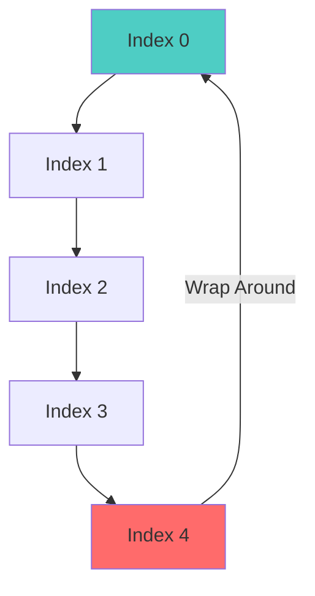

# Circular Queue Implementation

## Table of Contents
1. [Introduction](#introduction)
2. [Problem with Linear Queue](#problem-with-linear-queue)
3. [Circular Queue Solution](#circular-queue-solution)
4. [Modulo Arithmetic](#modulo-arithmetic)
5. [Complete Implementation](#complete-implementation)
6. [Detailed Code Analysis](#detailed-code-analysis)
7. [Full vs Empty Detection](#full-vs-empty-detection)
8. [Advantages](#advantages)
9. [Practice Problems](#practice-problems)

---

## Introduction

A **Circular Queue** is an improved version of the linear queue that overcomes the limitation of wasted space by treating the array as circular. When the rear reaches the end of the array, it wraps around to the beginning if space is available.

### Key Idea: Wrap-Around

```
Linear Queue:    [  ][  ][  ][  ][  ]
                 Start → → → → End (cannot go back)

Circular Queue:  [  ][  ][  ][  ][  ]
                  ↑                ↓
                  └←←←←←←←←←←←←←←←┘
                      (wraps around)
```

---

## Problem with Linear Queue

### Scenario Demonstrating Wastage

```
Queue of size 5:

Step 1: Enqueue 10, 20, 30, 40, 50
Array: [10][20][30][40][50]
Index:  0   1   2   3   4
        ↑              ↑
      front=0      rear=4
Status: FULL ✓

Step 2: Dequeue 3 times
Array: [10][20][30][40][50]
Index:  0   1   2   3   4
                    ↑   ↑
                front=3 rear=4
Status: 2 elements present

Step 3: Try Enqueue(60)
❌ rear = 4 = MaxSize-1
❌ is_full() returns true
❌ But indices 0, 1, 2 are FREE!
❌ 60% of queue space is WASTED!
```

### Root Cause

- `front` and `rear` only increment, never reset
- Cannot reuse freed space at array beginning
- Need a way to wrap around

---

## Circular Queue Solution

### Concept Visualization



### Wrap-Around Logic

```
rear at index 4, MaxSize = 5

Linear Queue:
  rear++ → rear = 5 (OUT OF BOUNDS! ❌)

Circular Queue:
  rear = (rear + 1) % MaxSize
  rear = (4 + 1) % 5
  rear = 5 % 5
  rear = 0 ✓ (Wraps to beginning!)
```

---

## Modulo Arithmetic

### Understanding the % Operator

The modulo operator gives the **remainder** after division.

```
0 % 5 = 0    (0 ÷ 5 = 0 remainder 0)
1 % 5 = 1    (1 ÷ 5 = 0 remainder 1)
2 % 5 = 2
3 % 5 = 3
4 % 5 = 4
5 % 5 = 0    (5 ÷ 5 = 1 remainder 0) ← Wraps!
6 % 5 = 1    (6 ÷ 5 = 1 remainder 1) ← Wraps!
7 % 5 = 2
8 % 5 = 3
```

### Circular Indexing Formula

```java
next_index = (current_index + 1) % MaxSize
```

**Examples:**
```
MaxSize = 5

current = 0 → next = (0 + 1) % 5 = 1
current = 1 → next = (1 + 1) % 5 = 2
current = 2 → next = (2 + 1) % 5 = 3
current = 3 → next = (3 + 1) % 5 = 4
current = 4 → next = (4 + 1) % 5 = 0 ← Wraps!
```

---

## Complete Implementation

### Circular_Queue.java

```java
package Queue_Examples;

public class Circular_Queue {
    int queue[];                    // Array storage
    int front, rear, MaxSize, count;  // Pointers and counter
    
    void create_Queue(int size) {
        rear = -1;
        front = 0;
        MaxSize = size;
        count = 0;              // NEW: Track number of elements
        queue = new int[MaxSize];
    }
    
    void enqueue(int e) {
        rear = (rear + 1) % MaxSize;  // Circular increment
        count++;                       // Increment count
        queue[rear] = e;
    }
    
    boolean is_full() {
        return (count == MaxSize);     // Full when count equals size
    }
    
    int dequeue() {
        int temp = queue[front];
        front = (front + 1) % MaxSize; // Circular increment
        count--;                        // Decrement count
        return temp;
    }
    
    boolean is_empty() {
        return (count == 0);           // Empty when count is 0
    }
    
    void print_queue() {
        int i = front, c = 0;
        while (c < count) {
            System.out.print(queue[i] + " - ");
            i = (i + 1) % MaxSize;      // Circular traversal
            c++;
        }
    }
}
```

---

## Detailed Code Analysis

### 1. Data Members

```java
int queue[];
int front, rear, MaxSize, count;
```

#### **New Addition: count Variable**

- **Purpose**: Track number of elements in queue
- **Why needed?** In circular queue, `front` and `rear` alone cannot determine if queue is full or empty

**Problem without count:**
```
Scenario 1: Empty Queue
  front = 0, rear = -1

Scenario 2: Full Queue (after wrap-around)
  front = 0, rear = 4 (for MaxSize=5)
  
But after dequeue and enqueue cycles:
  front = 0, rear = 4 could mean:
    - Queue is full (5 elements)
    - Queue has 0 elements (empty)
    - Hard to distinguish! ❌
    
Solution: Use count variable ✓
```

---

### 2. Create Queue

```java
void create_Queue(int size) {
    rear = -1;
    front = 0;
    MaxSize = size;
    count = 0;              // Initialize element count
    queue = new int[MaxSize];
}
```

**Only difference from linear queue:** Added `count = 0` initialization

---

### 3. Enqueue with Circular Logic

```java
void enqueue(int e) {
    rear = (rear + 1) % MaxSize;  // Line 1: Circular increment
    count++;                       // Line 2: Increment count
    queue[rear] = e;              // Line 3: Store element
}
```

#### **Line-by-Line Explanation:**

**Line 1:** `rear = (rear + 1) % MaxSize;`
- Increment rear in a circular manner
- **Modulo ensures wrap-around**

**Line 2:** `count++;`
- Increment the element count
- Used to check if queue is full/empty

**Line 3:** `queue[rear] = e;`
- Store element at new rear position

#### **Execution Example:**

```
MaxSize = 5, Initial: rear = -1, count = 0

Enqueue(10):
  rear = (-1 + 1) % 5 = 0
  count = 1
  queue[0] = 10
  State: rear=0, count=1
  Array: [10][ ][ ][ ][ ]

Enqueue(20):
  rear = (0 + 1) % 5 = 1
  count = 2
  queue[1] = 20
  State: rear=1, count=2
  Array: [10][20][ ][ ][ ]

... After filling queue and dequeuing ...

State: front=3, rear=4, count=2
Array: [  ][  ][  ][40][50]

Enqueue(60):
  rear = (4 + 1) % 5 = 0  ← WRAPS!
  count = 3
  queue[0] = 60
  State: front=3, rear=0, count=3
  Array: [60][  ][  ][40][50]
              ↑       ↑
            rear   front
```

---

### 4. is_full Using Count

```java
boolean is_full() {
    return (count == MaxSize);
}
```

#### **Why This Works:**

- **count** tracks exact number of elements
- Queue is full when count equals MaxSize
- **Simple and accurate!**

**Comparison with linear queue:**
```
Linear Queue:
  is_full() → rear == MaxSize - 1
  Problem: Works only when no wrap-around

Circular Queue:
  is_full() → count == MaxSize
  Works perfectly with wrap-around ✓
```

---

### 5. Dequeue with Circular Logic

```java
int dequeue() {
    int temp = queue[front];        // Line 1: Get element
    front = (front + 1) % MaxSize;  // Line 2: Circular increment
    count--;                         // Line 3: Decrement count
    return temp;                     // Line 4: Return element
}
```

#### **Line-by-Line Explanation:**

**Line 1:** `int temp = queue[front];`
- Read element at front position
- Store for returning

**Line 2:** `front = (front + 1) % MaxSize;`
- Move front forward circularly
- **Wrap-around if needed**

**Line 3:** `count--;`
- Decrement element count

**Line 4:** `return temp;`
- Return dequeued element

#### **Execution Example:**

```
MaxSize = 5
State: front=4, rear=1, count=3
Array: [20][30][  ][  ][10]
                        ↑
                      front

Dequeue():
  temp = queue[4] = 10
  front = (4 + 1) % 5 = 0  ← WRAPS!
  count = 2
  return 10
  
New State: front=0, rear=1, count=2
Array: [20][30][  ][  ][10]
        ↑   ↑
      front rear
```

---

### 6. is_empty Using Count

```java
boolean is_empty() {
    return (count == 0);
}
```

**Simple logic:** Queue is empty when no elements present.

---

### 7. Print Queue Circularly

```java
void print_queue() {
    int i = front, c = 0;           // Line 1: Initialize
    while (c < count) {              // Line 2: Loop condition
        System.out.print(queue[i] + " - ");  // Line 3: Print
        i = (i + 1) % MaxSize;       // Line 4: Circular increment
        c++;                          // Line 5: Increment counter
    }
}
```

#### **Line-by-Line Explanation:**

**Line 1:** `int i = front, c = 0;`
- `i` = traversal index (starts at front)
- `c` = counter for number of elements printed

**Line 2:** `while (c < count)`
- Loop exactly `count` times
- Print only valid elements

**Line 3:** `System.out.print(queue[i] + " - ");`
- Print element at index i

**Line 4:** `i = (i + 1) % MaxSize;`
- Move to next index circularly
- **Critical for wrap-around traversal**

**Line 5:** `c++;`
- Increment counter

#### **Execution Example:**

```
MaxSize = 5
State: front=3, rear=1, count=4
Array: [50][60][  ][20][30]
                   ↑   ↑
                 front rear

Print sequence:
  i=3, c=0: Print 20, i=(3+1)%5=4, c=1
  i=4, c=1: Print 30, i=(4+1)%5=0, c=2  ← Wraps!
  i=0, c=2: Print 50, i=(0+1)%5=1, c=3
  i=1, c=3: Print 60, i=(1+1)%5=2, c=4
  c=4: Exit loop

Output: 20 - 30 - 50 - 60 - 
```

---

## Full vs Empty Detection

### Challenge in Circular Queue

```
Problem: When is the queue full vs empty?

Scenario 1: Empty queue
  front = 0, rear = 4 (after all dequeued)
  
Scenario 2: Full queue
  front = 0, rear = 4 (all 5 slots filled)
  
Both have same front and rear values! ❌
How to distinguish?
```

### Solutions

#### **Solution 1: Use Count Variable (Our Approach)**

```java
int count;  // Tracks number of elements

is_full() → count == MaxSize
is_empty() → count == 0

Pros: ✓ Simple logic
      ✓ Accurate
Cons: ✗ Extra variable
```

#### **Solution 2: One Empty Slot**

```java
// Always keep one slot empty
is_full() → (rear + 1) % MaxSize == front
is_empty() → front == rear

Pros: ✓ No extra variable
Cons: ✗ Wastes one slot
      ✗ Can only store MaxSize-1 elements
```

#### **Solution 3: Flag Variable**

```java
boolean flag;  // true when queue is full

Pros: ✓ Uses all slots
Cons: ✗ Extra variable
      ✗ More complex logic
```

**Our implementation uses Solution 1** for simplicity and clarity.

---

## Advantages

### Circular Queue vs Linear Queue

| Feature | Linear Queue | Circular Queue |
|---------|--------------|----------------|
| **Space Utilization** | ❌ Poor (wastage) | ✅ Excellent |
| **Wrap-around** | ❌ No | ✅ Yes |
| **Reuse freed space** | ❌ No | ✅ Yes |
| **Implementation** | ✅ Simpler | Medium |
| **Efficiency** | Lower | ✅ Higher |

### Practical Benefit

```
Example: Queue of size 1000

Linear Queue after 500 enqueue + 500 dequeue:
  Used: 0 slots (all dequeued)
  Available for enqueue: 500 slots
  Wasted: 500 slots
  Efficiency: 50%

Circular Queue after same operations:
  Used: 0 slots
  Available for enqueue: 1000 slots
  Wasted: 0 slots
  Efficiency: 100%
```

---

## Practice Problems

### Problem 1: Trace Operations

Given queue of size 4, trace these operations:
```
create_Queue(4)
enqueue(10)
enqueue(20)
enqueue(30)
enqueue(40)
dequeue()
dequeue()
enqueue(50)
enqueue(60)
print_queue()
```

**Your answer:** What does print_queue output?

<details>
<summary>Solution</summary>

```
Step-by-step:

create_Queue(4): front=0, rear=-1, count=0
enqueue(10): rear=0, count=1, [10][ ][ ][ ]
enqueue(20): rear=1, count=2, [10][20][ ][ ]
enqueue(30): rear=2, count=3, [10][20][30][ ]
enqueue(40): rear=3, count=4, [10][20][30][40]
dequeue(): front=1, count=3, [10][20][30][40]
dequeue(): front=2, count=2, [10][20][30][40]
enqueue(50): rear=(3+1)%4=0, count=3, [50][20][30][40]
enqueue(60): rear=(0+1)%4=1, count=4, [50][60][30][40]

print_queue():
  Start i=2 (front), c=0
  Print 30, i=3, c=1
  Print 40, i=0, c=2
  Print 50, i=1, c=3
  Print 60, i=2, c=4
  
Output: 30 - 40 - 50 - 60 -
```
</details>

---

### Problem 2: Implement Using One Empty Slot

Modify the implementation to use the "one empty slot" approach instead of count variable.

---

## Summary

### Key Concepts

1. **Circular Logic**: Use modulo arithmetic for wrap-around
   ```java
   next_index = (current_index + 1) % MaxSize
   ```

2. **Count Variable**: Solves full/empty detection problem

3. **Space Efficiency**: 100% space utilization (no wastage)

4. **Modified Operations**:
   - Enqueue: `rear = (rear + 1) % MaxSize`
   - Dequeue: `front = (front + 1) % MaxSize`
   - Print: Circular traversal

### Comparison Table

| Aspect | Linear | Circular |
|--------|--------|----------|
| rear increment | `rear++` | `(rear+1) % MaxSize` |
| front increment | `front++` | `(front+1) % MaxSize` |
| Space reuse | No | Yes |
| is_full | `rear==MaxSize-1` | `count==MaxSize` |
| is_empty | `front>rear` | `count==0` |

### Next Topics

- [Priority Queue](file:///c:/Users/2706p/Desktop/mcq/java/06_Priority_Queue_Implementation.md)
- [Two Queues in One Array](file:///c:/Users/2706p/Desktop/mcq/java/07_Advanced_Queue_Applications.md)
- [Dynamic Queue](file:///c:/Users/2706p/Desktop/mcq/java/10_Dynamic_Stack_and_Queue_with_LinkedList.md)

---

**Master circular queue to understand how to efficiently use limited array space!**
