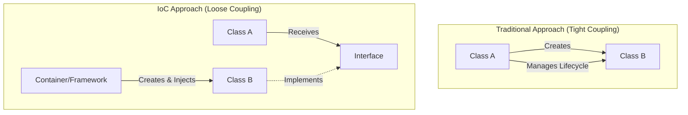
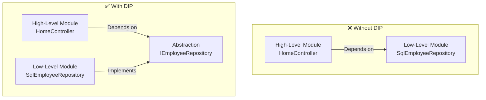
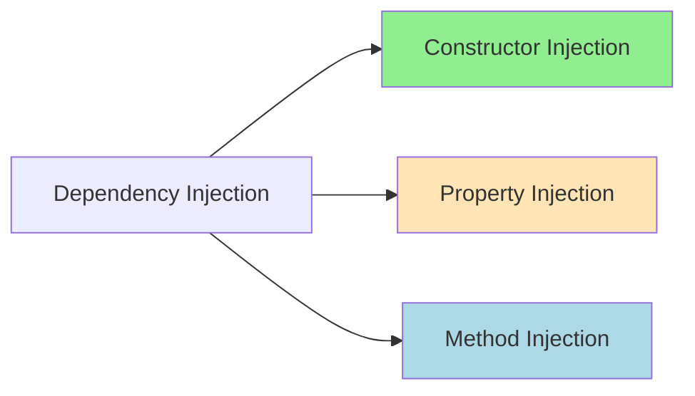
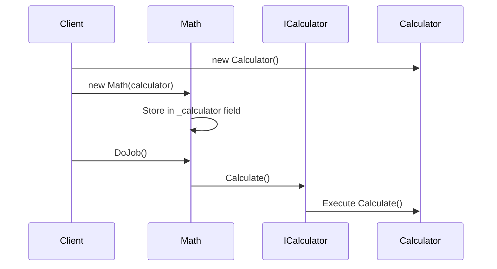
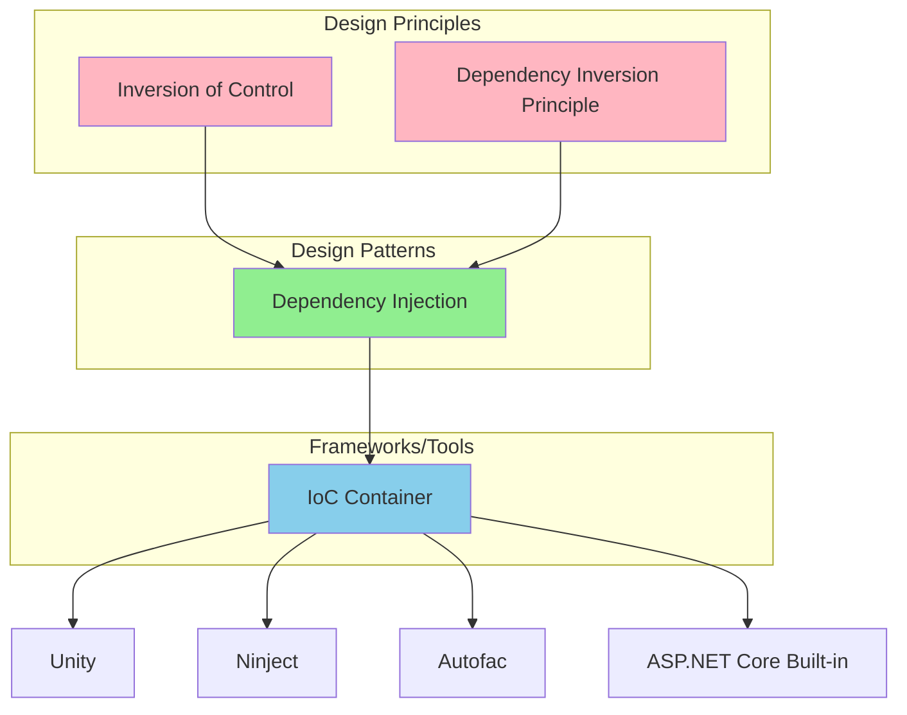

# 📚 Design Principles - IoC and DIP

## 🎯 Introduction

Before diving into Dependency Injection in ASP.NET Core, it's essential to understand the foundational design principles that make DI possible and effective. This note covers **Design Principles**, **Inversion of Control (IoC)**, **Dependency Inversion Principle (DIP)**, and **IoC Containers**.

---

## 📋 Table of Contents
1. [Design Principles vs Design Patterns](#design-principles-vs-design-patterns)
2. [Inversion of Control (IoC)](#inversion-of-control-ioc)
3. [Dependency Inversion Principle (DIP)](#dependency-inversion-principle-dip)
4. [Dependency Injection Design Pattern](#dependency-injection-design-pattern)
5. [IoC Containers](#ioc-containers)
6. [Complete Architecture Diagram](#complete-architecture-diagram)
7. [Key Takeaways](#key-takeaways)

---

## 🔷 Design Principles vs Design Patterns

### Design Principles
Design principles are **high-level guidelines** or mechanisms that help make software designs more:
- **Understandable** - Easy to read and comprehend
- **Flexible** - Can adapt to changing requirements
- **Maintainable** - Easy to modify and extend

> [!IMPORTANT]
> Design Principles do NOT provide implementation details. They are language-agnostic guidelines that you can apply regardless of the programming language.

**Example: SOLID Principles**
| Principle | Acronym | Description |
|-----------|---------|-------------|
| Single Responsibility | S | A class should have only one reason to change |
| Open/Closed | O | Open for extension, closed for modification |
| Liskov Substitution | L | Subtypes must be substitutable for base types |
| Interface Segregation | I | Many specific interfaces are better than one general |
| Dependency Inversion | D | Depend on abstractions, not concretions |

### Design Patterns
Design patterns are **reusable solutions** to commonly occurring problems in software design. They provide:
- Specific implementation guidance
- Tested and proven solutions
- Common vocabulary for developers

**Examples:**
- **Creational Patterns**: Singleton, Factory, Abstract Factory
- **Structural Patterns**: Adapter, Decorator, Facade
- **Behavioral Patterns**: Observer, Strategy, Command

> [!NOTE]
> The Gang of Four (GoF) Design Patterns are the most well-known collection of design patterns in software engineering.

---

## 🔷 Inversion of Control (IoC)

### What is IoC?

**Inversion of Control (IoC)** is a design principle that suggests inverting various types of controls in object-oriented design to achieve **loose coupling** between application classes.



### Main Objective of IoC
The main objective is to **remove dependencies** (remove tight coupling) between the objects of an application, making the application more:
- **Decoupled** - Classes don't directly depend on concrete implementations
- **Maintainable** - Changes in one class don't require changes in dependent classes
- **Testable** - Easy to mock dependencies for unit testing

### Real-World Example

Consider a **Repository class** that needs data from a data source:

```csharp
// ❌ WITHOUT IoC - Tight Coupling
public class Repository
{
    private SqlConnection _connection;
    
    public Repository()
    {
        // Repository creates its own connection - TIGHT COUPLING!
        _connection = new SqlConnection("Data Source=...");
    }
    
    public List<Data> GetData()
    {
        // Uses the internally created connection
        return _connection.Query<Data>("SELECT * FROM Data");
    }
}
```

```csharp
// ✅ WITH IoC - Loose Coupling
public class Repository
{
    private readonly IDbConnection _connection;
    
    // Connection is INJECTED through constructor
    public Repository(IDbConnection connection)
    {
        _connection = connection;
    }
    
    public List<Data> GetData()
    {
        return _connection.Query<Data>("SELECT * FROM Data");
    }
}
```

### Code Explanation

| Line | Without IoC | With IoC |
|------|-------------|----------|
| Field | `SqlConnection` (concrete) | `IDbConnection` (interface) |
| Constructor | Creates connection internally | Receives connection as parameter |
| Coupling | Tight - hardcoded to SQL Server | Loose - works with any IDbConnection |
| Testability | Hard to test | Easy to mock |

### Types of Control that can be Inverted

1. **Control over Object Creation** - Let a framework create objects
2. **Control over Object Binding** - Let a container wire dependencies
3. **Control over Application Flow** - Framework calls your code (Hollywood Principle)
4. **Control over Object Lifecycle** - Container manages creation and disposal

---

## 🔷 Dependency Inversion Principle (DIP)

### What is DIP?

The **Dependency Inversion Principle** is the "D" in SOLID principles. It states:

> **High-level modules should NOT depend on low-level modules. Both should depend on abstractions.**
>
> **Abstractions should NOT depend on details. Details should depend on abstractions.**

### Understanding High-Level and Low-Level Modules



### Why is DIP Important?

When a class **knows about the design and implementation** of another class:
- Changes to one class may **break** the other class
- Code becomes **rigid** and hard to modify
- **Testing** becomes difficult

### DIP Implementation Example

```csharp
// Step 1: Define the Abstraction (Interface)
public interface IEmployeeRepository
{
    Employee GetEmployee(int id);
    List<Employee> GetAllEmployees();
    void AddEmployee(Employee employee);
}
```

```csharp
// Step 2: Low-Level Module Implements the Abstraction
public class SqlEmployeeRepository : IEmployeeRepository
{
    private readonly DbContext _context;
    
    public SqlEmployeeRepository(DbContext context)
    {
        _context = context;
    }
    
    public Employee GetEmployee(int id)
    {
        return _context.Employees.Find(id);
    }
    
    public List<Employee> GetAllEmployees()
    {
        return _context.Employees.ToList();
    }
    
    public void AddEmployee(Employee employee)
    {
        _context.Employees.Add(employee);
        _context.SaveChanges();
    }
}
```

```csharp
// Step 3: High-Level Module Depends on Abstraction
public class HomeController : Controller
{
    // Depends on ABSTRACTION, not concrete implementation
    private readonly IEmployeeRepository _repository;
    
    public HomeController(IEmployeeRepository repository)
    {
        _repository = repository;
    }
    
    public IActionResult Index()
    {
        var employees = _repository.GetAllEmployees();
        return View(employees);
    }
}
```

### Line-by-Line Code Explanation

| Component | Code | Explanation |
|-----------|------|-------------|
| **Interface** | `IEmployeeRepository` | Defines the contract (abstraction) |
| **Low-Level** | `SqlEmployeeRepository : IEmployeeRepository` | Concrete implementation for SQL Server |
| **High-Level** | `IEmployeeRepository _repository` | Controller depends on interface, NOT class |
| **Constructor** | `public HomeController(IEmployeeRepository repository)` | Dependency is injected |

---

## 🔷 Dependency Injection Design Pattern

### What is Dependency Injection?

**Dependency Injection (DI)** is a design pattern that implements IoC by:
- **Injecting** the dependent objects rather than creating them internally
- Reducing **tight coupling** between software components
- Enabling better **testability** and **maintainability**

### Types of Dependency Injection



| Type | Description | Usage |
|------|-------------|-------|
| **Constructor Injection** | Dependencies are provided through the class constructor | Most common, recommended |
| **Property Injection** | Dependencies are set through public properties | Optional dependencies |
| **Method Injection** | Dependencies are passed as method parameters | Specific method needs |

### Constructor Injection Example

```csharp
public class Math
{
    // Field to hold the dependency
    private readonly ICalculator _calculator;
    
    // Constructor receives the dependency
    public Math(ICalculator calculator)
    {
        _calculator = calculator;
    }
    
    public void DoJob()
    {
        // Uses the injected dependency
        _calculator.Calculate();
    }
}
```

### Visual Representation

```csharp
// Interface (Abstraction)
interface ICalculator
{
    void Calculate();
}

// Implementation 1
public class Calculator : ICalculator
{
    public void Calculate()
    {
        // Modern calculator logic
    }
}

// Implementation 2
public class Abacus : ICalculator
{
    public void Calculate()
    {
        // Traditional abacus logic
    }
}

// Usage - Dependency Injection at work
Calculator calcObj = new Calculator();
Abacus abObj = new Abacus();

// Inject Calculator
Math math1 = new Math(calcObj);

// Inject Abacus - Same Math class, different behavior!
Math math2 = new Math(abObj);
```

### Execution Flow



---

## 🔷 IoC Containers

### What is an IoC Container?

An **IoC Container** (also called DI Container) is a framework that:
- **Creates** dependencies automatically
- **Manages** the lifecycle of objects
- **Injects** dependencies whenever required

> [!TIP]
> With IoC Containers, developers don't need to manually create and manage dependencies. The container handles everything automatically!

### Available IoC Containers in .NET

| Container | Description |
|-----------|-------------|
| **Built-in (ASP.NET Core)** | Simple, lightweight container included in framework |
| **Unity** | Microsoft's IoC container |
| **Ninject** | Lightweight, feature-rich container |
| **StructureMap** | One of the oldest .NET containers |
| **Autofac** | Powerful with advanced features |
| **Castle Windsor** | Full-featured, enterprise-grade |

### ASP.NET Core Built-in Container

ASP.NET Core includes a built-in IoC container represented by `IServiceCollection`:

```csharp
// Program.cs - Registering services with built-in container
var builder = WebApplication.CreateBuilder(args);

// Framework Services
builder.Services.AddControllersWithViews();

// Application Services - Register your dependencies
builder.Services.AddSingleton<IEmployeeRepository, SqlEmployeeRepository>();
builder.Services.AddScoped<IOrderService, OrderService>();
builder.Services.AddTransient<IEmailService, EmailService>();

var app = builder.Build();
```

---

## 🔷 Complete Architecture Diagram



### Relationship Summary

| Concept | Type | Purpose |
|---------|------|---------|
| IoC | Design Principle | Invert control to achieve loose coupling |
| DIP | Design Principle | Depend on abstractions, not concretions |
| DI | Design Pattern | Inject dependencies to implement IoC & DIP |
| IoC Container | Framework | Automate dependency creation and injection |

---

## 🔷 Key Takeaways

> [!IMPORTANT]
> **Must Remember Points for Exams/Interviews:**

1. **Design Principles** are high-level guidelines; **Design Patterns** are reusable solutions

2. **IoC (Inversion of Control)** removes dependencies between objects for loose coupling

3. **DIP (Dependency Inversion Principle)** states:
   - High-level modules should not depend on low-level modules
   - Both should depend on abstractions

4. **Dependency Injection** is a design pattern that implements IoC and DIP by:
   - Injecting dependencies through constructor, property, or method
   - Constructor injection is most common in ASP.NET Core

5. **IoC Containers** automate:
   - Object creation
   - Dependency resolution
   - Lifecycle management

6. **ASP.NET Core** has a built-in lightweight IoC container (`IServiceCollection`)

### Quick Reference Questions

| Question | Answer |
|----------|--------|
| What is IoC? | Design principle to achieve loose coupling by inverting control |
| What is DIP? | SOLID principle - depend on abstractions, not concretions |
| What is DI? | Design pattern to inject dependencies into classes |
| What is IoC Container? | Framework that automates dependency creation and injection |
| Built-in container in ASP.NET Core? | `IServiceCollection` interface |

---

## 📝 Practice Questions

1. What is the difference between Design Principles and Design Patterns?
2. Explain Inversion of Control with an example.
3. What does the Dependency Inversion Principle state?
4. List three types of Dependency Injection.
5. Name four IoC Containers available for .NET applications.
6. How does ASP.NET Core implement built-in dependency injection?

---

*Next Topic: [02 - Dependency Injection in ASP.NET Core](./02_Dependency_Injection_ASPNETCore.md)*
