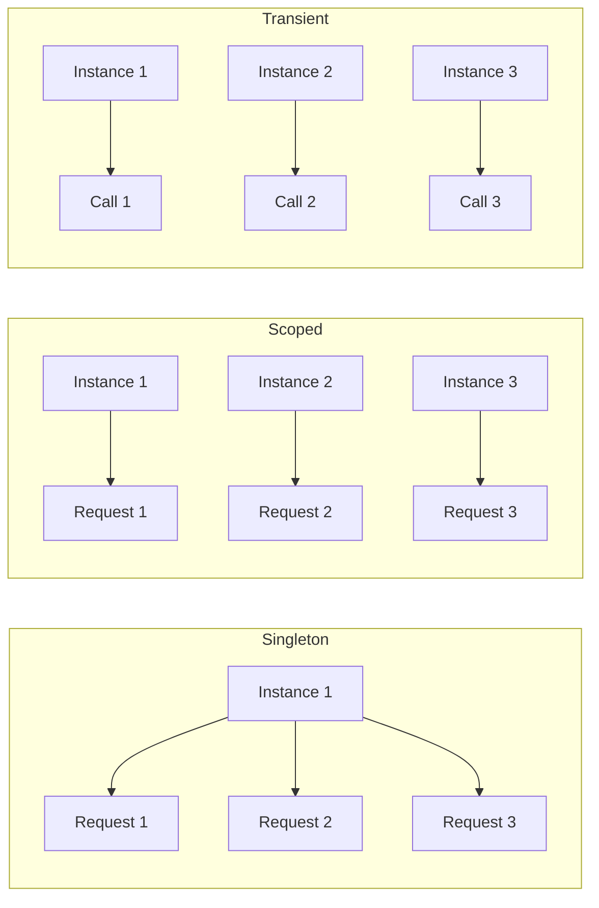
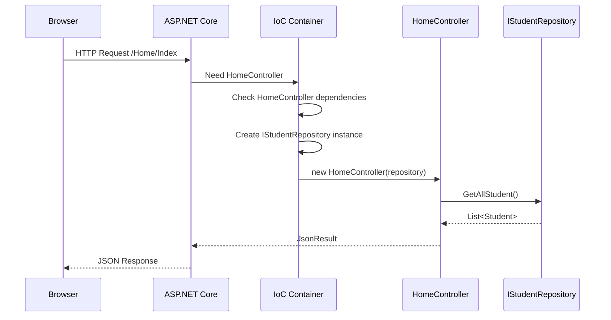

# 📚 Dependency Injection in ASP.NET Core

## 🎯 Introduction

ASP.NET Core is designed from the ground up to support **Dependency Injection (DI)**. Unlike traditional ASP.NET where DI was optional and required third-party frameworks, ASP.NET Core has a **built-in IoC container** that makes DI an integral part of the framework.

---

## 📋 Table of Contents
1. [Why Dependency Injection in ASP.NET Core?](#why-dependency-injection-in-aspnet-core)
2. [Built-in IoC Container](#built-in-ioc-container)
3. [Types of Services](#types-of-services)
4. [Registering Services](#registering-services)
5. [Constructor Injection](#constructor-injection)
6. [Action Method Injection](#action-method-injection)
7. [View Injection](#view-injection)
8. [Complete Working Example](#complete-working-example)
9. [Key Takeaways](#key-takeaways)

---

## 🔷 Why Dependency Injection in ASP.NET Core?

### The Problem Without DI

Consider a controller that needs to access student data:

```csharp
// ❌ WITHOUT Dependency Injection - Tight Coupling
public class HomeController : Controller
{
    public JsonResult Index()
    {
        // Creating repository directly - TIGHT COUPLING!
        TestStudentRepository repository = new TestStudentRepository();
        List<Student> allStudentDetails = repository.GetAllStudent();
        return Json(allStudentDetails);
    }
    
    public JsonResult GetStudentDetails(int Id)
    {
        // Creating another instance - TIGHT COUPLING!
        TestStudentRepository repository = new TestStudentRepository();
        Student studentDetails = repository.GetStudentById(Id);
        return Json(studentDetails);
    }
}
```

### Problems with This Approach

| Problem | Description |
|---------|-------------|
| **Tight Coupling** | Controller is tightly coupled to `TestStudentRepository` |
| **Hard to Test** | Cannot easily mock the repository for unit testing |
| **Violation of DIP** | High-level module depends on low-level module |
| **No Flexibility** | Cannot swap implementations without code changes |
| **Code Duplication** | Repository created in every method |

### The Solution: Dependency Injection

```csharp
// ✅ WITH Dependency Injection - Loose Coupling
public class HomeController : Controller
{
    private readonly IStudentRepository _repository;
    
    // Dependency injected through constructor
    public HomeController(IStudentRepository repository)
    {
        _repository = repository;
    }
    
    public JsonResult Index()
    {
        List<Student> allStudentDetails = _repository.GetAllStudent();
        return Json(allStudentDetails);
    }
    
    public JsonResult GetStudentDetails(int Id)
    {
        Student studentDetails = _repository.GetStudentById(Id);
        return Json(studentDetails);
    }
}
```

---

## 🔷 Built-in IoC Container

### IServiceCollection Interface

ASP.NET Core Framework provides a built-in IoC container represented by the `IServiceCollection` interface. This container:

- Supports **constructor injection** by default
- Manages **service lifetimes** automatically
- Disposes services when appropriate

```csharp
// Program.cs - The entry point where services are configured
var builder = WebApplication.CreateBuilder(args);

// builder.Services is IServiceCollection
// Add Framework Services
builder.Services.AddControllersWithViews();

// Add Application Services
builder.Services.AddSingleton<IStudentRepository, TestStudentRepository>();

var app = builder.Build();
```

### Third-Party IoC Containers

While ASP.NET Core has a built-in container, you can replace it with more feature-rich containers:

| Container | Features |
|-----------|----------|
| **Unity** | Auto-registration, interception |
| **StructureMap** | Convention-based registration |
| **Castle Windsor** | Advanced lifecycle management |
| **Ninject** | Contextual binding |
| **Autofac** | Decorator support, modules |

> [!NOTE]
> The built-in container is sufficient for most applications. Use third-party containers only when you need advanced features like auto-registration, scanning, interceptors, or decorators.

---

## 🔷 Types of Services

### 1. Framework Services
Services that are part of the ASP.NET Core framework:

```csharp
// Examples of Framework Services
IApplicationBuilder      // Configure HTTP pipeline
IHostingEnvironment      // Environment information
ILoggerFactory           // Logging functionality
IConfiguration           // Configuration access
```

### 2. Application Services
Custom services that you create for your application:

```csharp
// Examples of Application Services
IStudentRepository       // Your data access interface
IEmailService           // Your custom email service
IPaymentGateway         // Your payment processing
```

---

## 🔷 Registering Services

### Service Descriptor Method

The most explicit way to register services:

```csharp
var services = builder.Services;

// By default Singleton (passing instance)
services.Add(new ServiceDescriptor(
    typeof(IStudentRepository), 
    new TestStudentRepository()
));

// Explicit Singleton
services.Add(new ServiceDescriptor(
    typeof(IStudentRepository), 
    typeof(TestStudentRepository), 
    ServiceLifetime.Singleton
));

// Explicit Transient
services.Add(new ServiceDescriptor(
    typeof(IStudentRepository), 
    typeof(TestStudentRepository), 
    ServiceLifetime.Transient
));

// Explicit Scoped
services.Add(new ServiceDescriptor(
    typeof(IStudentRepository), 
    typeof(TestStudentRepository), 
    ServiceLifetime.Scoped
));
```

### Extension Methods (Recommended)

ASP.NET Core provides convenient extension methods:

```csharp
var services = builder.Services;

// Singleton - One instance for entire application lifetime
services.AddSingleton<IStudentRepository, TestStudentRepository>();

// Transient - New instance every time requested
services.AddTransient<IStudentRepository, TestStudentRepository>();

// Scoped - One instance per HTTP request
services.AddScoped<IStudentRepository, TestStudentRepository>();
```

### Service Lifetime Comparison



| Lifetime | Instance Creation | Disposed |
|----------|-------------------|----------|
| **Singleton** | Once for app lifetime | App shutdown |
| **Scoped** | Once per HTTP request | End of request |
| **Transient** | Every time requested | End of request |

---

## 🔷 Constructor Injection

### How It Works

Once a service is registered, the IoC container automatically injects it through the constructor.

```csharp
public class HomeController : Controller
{
    // Step 1: Create a readonly reference variable
    private readonly IStudentRepository _repository;
    
    // Step 2: Initialize through constructor
    public HomeController(IStudentRepository repository)
    {
        _repository = repository;  // Injected by IoC container
    }
    
    // Step 3: Use the dependency
    public JsonResult Index()
    {
        List<Student> allStudentDetails = _repository.GetAllStudent();
        return Json(allStudentDetails);
    }
    
    public JsonResult GetStudentDetails(int Id)
    {
        Student studentDetails = _repository.GetStudentById(Id);
        return Json(studentDetails);
    }
}
```

### Line-by-Line Explanation

| Line | Code | Explanation |
|------|------|-------------|
| 1 | `private readonly IStudentRepository _repository` | Declare a readonly field to hold the dependency |
| 2 | `public HomeController(IStudentRepository repository)` | Constructor parameter for the dependency |
| 3 | `_repository = repository` | Store the injected instance in the field |
| 4 | `_repository.GetAllStudent()` | Use the injected service to get data |

> [!TIP]
> We use `readonly` to ensure the dependency cannot be changed after injection. This is a best practice that prevents accidental reassignment.

### Execution Flow



---

## 🔷 Action Method Injection

When you need a dependency only in a specific action method, use `[FromServices]` attribute:

```csharp
public class HomeController : Controller
{
    // No constructor injection needed!
    public HomeController()
    {
    }
    
    // Inject dependency directly into the action method
    public JsonResult Index([FromServices] IStudentRepository repository)
    {
        List<Student> allStudentDetails = repository.GetAllStudent();
        return Json(allStudentDetails);
    }
}
```

### When to Use Action Method Injection

| Use Case | Recommendation |
|----------|----------------|
| Dependency needed in all/most methods | Use Constructor Injection |
| Dependency needed in only one method | Use Action Method Injection |
| Optional dependency | Use Action Method Injection |

---

## 🔷 View Injection

You can inject services directly into Razor views using the `@inject` directive:

```html
@using FirstCoreMVCWebApplication.Models
@inject IStudentRepository rep

@{
    List<Student> students = rep.GetAllStudent();
    
    foreach (var s in students)
    {
        <h2>@s.Name - @s.Gender - @s.Branch</h2>
    }
}
```

### Line-by-Line Explanation

| Line | Code | Explanation |
|------|------|-------------|
| 1 | `@using FirstCoreMVCWebApplication.Models` | Import the namespace containing models |
| 2 | `@inject IStudentRepository rep` | Inject the repository service as 'rep' |
| 3 | `rep.GetAllStudent()` | Use the injected service to get data |
| 4 | `@s.Name` | Display student properties |

> [!WARNING]
> View injection should be used sparingly. In most cases, data should come from the controller via the Model. Use view injection only for cross-cutting concerns like localization or configuration.

---

## 🔷 Complete Working Example

### Step 1: Create the Model

```csharp
// Models/Student.cs
namespace FirstCoreMVCWebApplication.Models
{
    public class Student
    {
        public int StudentId { get; set; }      // Primary key
        public string Name { get; set; }         // Student name
        public string Branch { get; set; }       // Department (CSE, ETC, etc.)
        public string Section { get; set; }      // Class section (A, B, etc.)
        public string Gender { get; set; }       // Male/Female
    }
}
```

### Step 2: Create the Service Interface

```csharp
// Models/IStudentRepository.cs
using System.Collections.Generic;

namespace FirstCoreMVCWebApplication.Models
{
    public interface IStudentRepository
    {
        Student GetStudentById(int StudentId);    // Get single student
        List<Student> GetAllStudent();             // Get all students
    }
}
```

### Step 3: Create the Service Implementation

```csharp
// Models/TestStudentRepository.cs
using System.Collections.Generic;
using System.Linq;

namespace FirstCoreMVCWebApplication.Models
{
    public class TestStudentRepository : IStudentRepository
    {
        // Private method to simulate database
        public List<Student> DataSource()
        {
            return new List<Student>()
            {
                new Student() { StudentId = 101, Name = "James", Branch = "CSE", Section = "A", Gender = "Male" },
                new Student() { StudentId = 102, Name = "Smith", Branch = "ETC", Section = "B", Gender = "Male" },
                new Student() { StudentId = 103, Name = "David", Branch = "CSE", Section = "A", Gender = "Male" },
                new Student() { StudentId = 104, Name = "Sara", Branch = "CSE", Section = "A", Gender = "Female" },
                new Student() { StudentId = 105, Name = "Pam", Branch = "ETC", Section = "B", Gender = "Female" }
            };
        }
        
        // Get student by ID
        public Student GetStudentById(int StudentId)
        {
            return DataSource().FirstOrDefault(e => e.StudentId == StudentId);
        }
        
        // Get all students
        public List<Student> GetAllStudent()
        {
            return DataSource();
        }
    }
}
```

### Step 4: Register Service in Program.cs

```csharp
// Program.cs
using FirstCoreMVCWebApplication.Models;

namespace FirstCoreMVCWebApplication
{
    public class Program
    {
        public static void Main(string[] args)
        {
            var builder = WebApplication.CreateBuilder(args);

            // Add MVC services (Framework Service)
            builder.Services.AddControllersWithViews();
            
            // Register our repository (Application Service)
            // Using Singleton - same instance for all requests
            builder.Services.AddSingleton<IStudentRepository, TestStudentRepository>();

            var app = builder.Build();

            // Configure the HTTP request pipeline
            if (!app.Environment.IsDevelopment())
            {
                app.UseExceptionHandler("/Home/Error");
                app.UseHsts();
            }

            app.UseHttpsRedirection();
            app.UseStaticFiles();
            app.UseRouting();
            app.UseAuthorization();

            app.MapControllerRoute(
                name: "default",
                pattern: "{controller=Home}/{action=Index}/{id?}");

            app.Run();
        }
    }
}
```

### Step 5: Create the Controller

```csharp
// Controllers/HomeController.cs
using FirstCoreMVCWebApplication.Models;
using Microsoft.AspNetCore.Mvc;
using System.Collections.Generic;

namespace FirstCoreMVCWebApplication.Controllers
{
    public class HomeController : Controller
    {
        // Private readonly field for the dependency
        private readonly IStudentRepository _repository;
        
        // Constructor injection - IoC container provides the instance
        public HomeController(IStudentRepository repository)
        {
            _repository = repository;
        }
        
        // Action method using constructor-injected dependency
        public JsonResult Index()
        {
            List<Student> allStudentDetails = _repository.GetAllStudent();
            return Json(allStudentDetails);
        }
        
        // Action method using constructor-injected dependency
        public JsonResult GetStudentDetails(int Id)
        {
            Student studentDetails = _repository.GetStudentById(Id);
            return Json(studentDetails);
        }
    }
}
```

### Step 6: Create View with View Injection

```html
@* Views/Student/ListStudent.cshtml *@
@using FirstCoreMVCWebApplication.Models
@inject IStudentRepository rep

@{
    List<Student> students = rep.GetAllStudent();
}

<h1>Student List (Using View Injection)</h1>

<table class="table">
    <thead>
        <tr>
            <th>ID</th>
            <th>Name</th>
            <th>Branch</th>
            <th>Section</th>
            <th>Gender</th>
        </tr>
    </thead>
    <tbody>
        @foreach (var s in students)
        {
            <tr>
                <td>@s.StudentId</td>
                <td>@s.Name</td>
                <td>@s.Branch</td>
                <td>@s.Section</td>
                <td>@s.Gender</td>
            </tr>
        }
    </tbody>
</table>
```

---

## 🔷 Key Takeaways

> [!IMPORTANT]
> **Must Remember Points:**

### Service Registration

| Method | Lifetime | When to Use |
|--------|----------|-------------|
| `AddSingleton<I, T>()` | App lifetime | Configuration, caching |
| `AddScoped<I, T>()` | HTTP request | DbContext, per-request data |
| `AddTransient<I, T>()` | Every injection | Stateless, lightweight services |

### Injection Types

| Type | Syntax | Use Case |
|------|--------|----------|
| **Constructor** | `public MyClass(IService service)` | Most common, all methods need it |
| **Action Method** | `[FromServices] IService service` | Single method needs it |
| **View** | `@inject IService service` | View needs direct access |

### Best Practices

1. **Always use interfaces** for dependencies, not concrete classes
2. Use **constructor injection** as the default approach
3. Mark injected fields as **readonly** to prevent reassignment
4. **Entity Framework contexts** should be registered as **Scoped**
5. Use **Transient** for parallel/concurrent scenarios
6. Use **Singleton** for application-wide configuration

### Quick Reference

```csharp
// Registration in Program.cs
builder.Services.AddSingleton<IService, MyService>();    // One instance
builder.Services.AddScoped<IService, MyService>();       // One per request
builder.Services.AddTransient<IService, MyService>();    // New every time

// Constructor Injection
public MyController(IService service) { _service = service; }

// Action Method Injection
public IActionResult Index([FromServices] IService service) { }

// View Injection
@inject IService service
```

---

## 📝 Practice Questions

1. What is the difference between Framework Services and Application Services?
2. Explain the three service lifetimes with examples.
3. What is the difference between constructor injection and action method injection?
4. How do you inject a service into a Razor view?
5. Why should we use `readonly` for injected dependencies?
6. What interface represents the built-in IoC container in ASP.NET Core?

---

*Previous: [01 - Design Principles - IoC and DIP](./01_Design_Principles_IoC_DIP.md)*

*Next: [03 - Service Lifetimes](./03_Service_Lifetimes.md)*
