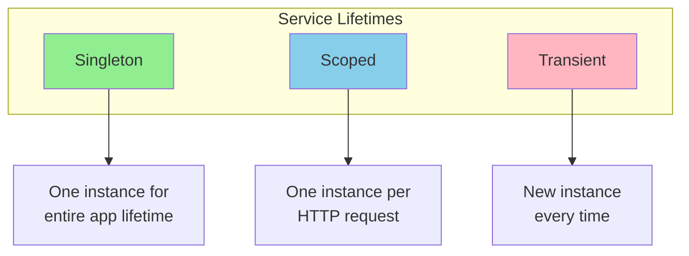
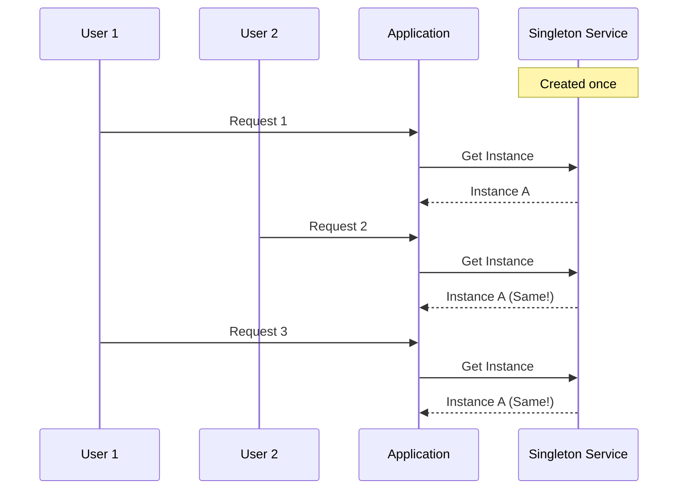
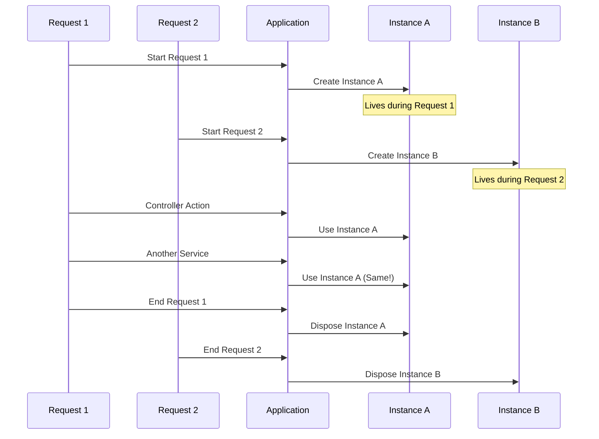
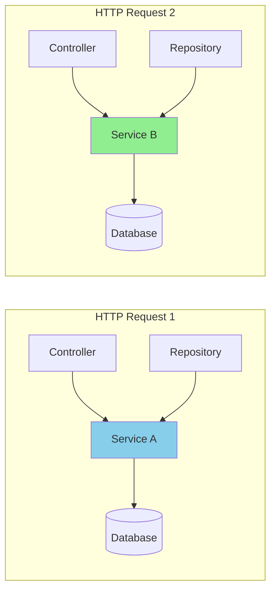
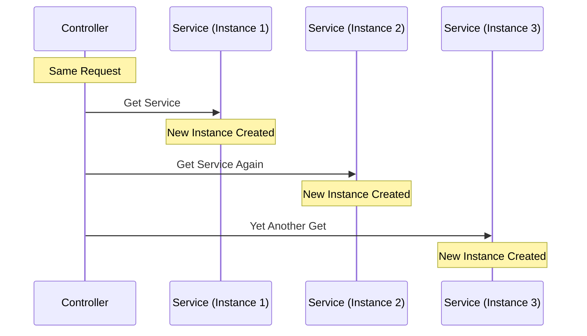
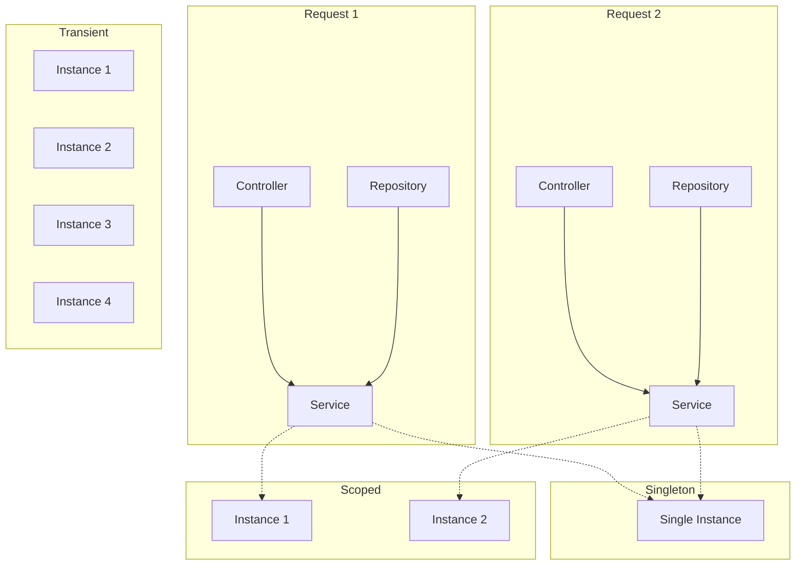
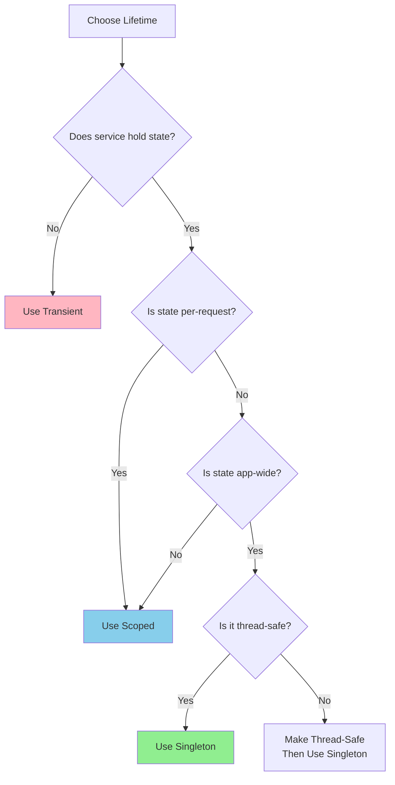
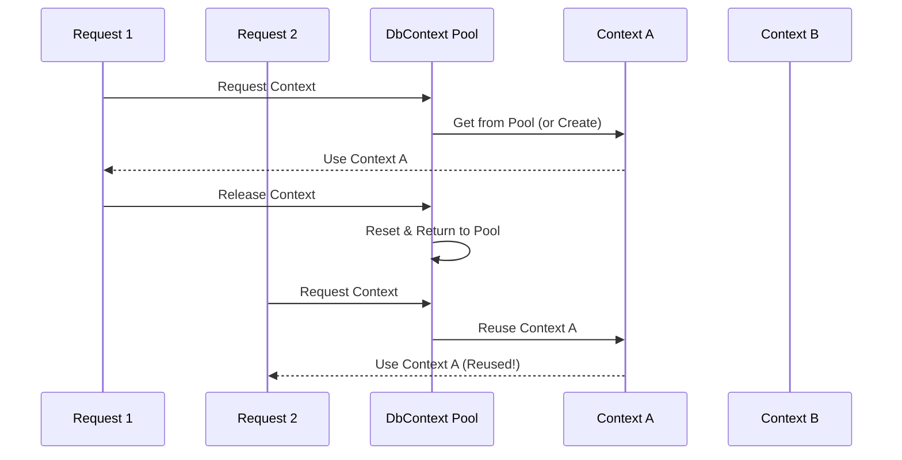

# 📚 Service Lifetimes - Singleton, Scoped, Transient

## 🎯 Introduction

Understanding service lifetimes is crucial for building efficient and correct ASP.NET Core applications. The **lifetime** of a service determines how and when instances are created and disposed by the IoC container.

---

## 📋 Table of Contents
1. [Overview of Service Lifetimes](#overview-of-service-lifetimes)
2. [Singleton Lifetime](#singleton-lifetime)
3. [Scoped Lifetime](#scoped-lifetime)
4. [Transient Lifetime](#transient-lifetime)
5. [Comparison Table](#comparison-table)
6. [When to Use What](#when-to-use-what)
7. [DbContext Pooling](#dbcontext-pooling)
8. [Key Takeaways](#key-takeaways)

---

## 🔷 Overview of Service Lifetimes

ASP.NET Core provides **three service lifetimes** that control when instances are created and shared:



### Registration Methods

```csharp
// Three ways to register services with different lifetimes
builder.Services.AddSingleton<IService, MyService>();   // Singleton
builder.Services.AddScoped<IService, MyService>();      // Scoped
builder.Services.AddTransient<IService, MyService>();   // Transient
```

---

## 🔷 Singleton Lifetime

### Definition
When you register a service as **Singleton**, only **ONE instance** is created and shared throughout the application's lifetime.

### Characteristics
- Created **once** when first requested
- **Same instance** used for all requests and all users
- Disposed when **application shuts down**
- Similar to having a **static object**

### Visual Representation



### Code Example

```csharp
// Registration
builder.Services.AddSingleton<IConfigurationService, ConfigurationService>();

// The ConfigurationService
public class ConfigurationService : IConfigurationService
{
    private readonly Dictionary<string, string> _settings;
    
    public ConfigurationService()
    {
        Console.WriteLine($"ConfigurationService created at {DateTime.Now}");
        _settings = new Dictionary<string, string>
        {
            { "AppName", "My Application" },
            { "Version", "1.0.0" }
        };
    }
    
    public string GetSetting(string key) => _settings[key];
}
```

### When Created

| Scenario | When Instance is Created |
|----------|--------------------------|
| First Request | First time the service is requested |
| Application Start | If registered with instance |
| Subsequent Requests | Uses existing instance |

---

## 🔷 Scoped Lifetime

### Definition
When you register a service as **Scoped**, **ONE instance** is created per **HTTP request** and shared across all components within that same request.

### Characteristics
- Created **once per HTTP request**
- **Same instance** within a single request
- **Different instance** for different requests
- Disposed at the **end of the request**

### Visual Representation



### Code Example

```csharp
// Registration - Scoped is RECOMMENDED for DbContext
builder.Services.AddScoped<IOrderService, OrderService>();
builder.Services.AddDbContextPool<AppDbContext>(options =>
    options.UseSqlServer(connectionString));

// The OrderService - uses scoped DbContext
public class OrderService : IOrderService
{
    private readonly AppDbContext _context;
    private readonly Guid _instanceId;
    
    public OrderService(AppDbContext context)
    {
        _context = context;
        _instanceId = Guid.NewGuid();
        Console.WriteLine($"OrderService created: {_instanceId}");
    }
    
    public async Task<Order> GetOrderAsync(int id)
    {
        Console.WriteLine($"Getting order using instance: {_instanceId}");
        return await _context.Orders.FindAsync(id);
    }
}
```

### Request Flow



---

## 🔷 Transient Lifetime

### Definition
When you register a service as **Transient**, a **NEW instance** is created **every time** the service is requested, regardless of the request.

### Characteristics
- Created **every time** requested
- **Never shared** between components
- Disposed at the **end of the request**
- Lightweight and stateless services

### Visual Representation



### Code Example

```csharp
// Registration
builder.Services.AddTransient<IEmailService, EmailService>();

// The EmailService - stateless
public class EmailService : IEmailService
{
    private readonly Guid _instanceId;
    
    public EmailService()
    {
        _instanceId = Guid.NewGuid();
        Console.WriteLine($"EmailService created: {_instanceId}");
    }
    
    public void SendEmail(string to, string subject, string body)
    {
        Console.WriteLine($"Sending email using instance: {_instanceId}");
        // Send email logic
    }
}
```

### Use Case: Parallel Processing

```csharp
// Transient is ideal for parallel processing
public class BatchProcessor
{
    private readonly IServiceProvider _serviceProvider;
    
    public BatchProcessor(IServiceProvider serviceProvider)
    {
        _serviceProvider = serviceProvider;
    }
    
    public void ProcessInParallel(List<Item> items)
    {
        Parallel.ForEach(items, item =>
        {
            // Each parallel thread gets its own instance
            using var scope = _serviceProvider.CreateScope();
            var processor = scope.ServiceProvider.GetRequiredService<IItemProcessor>();
            processor.Process(item);
        });
    }
}
```

---

## 🔷 Comparison Table

| Parameter | Singleton | Scoped | Transient |
|-----------|-----------|--------|-----------|
| **Instance** | Same for all requests/users | One per request | New every time |
| **Created** | First request | Start of request | Each injection |
| **Disposed** | App shutdown | End of request | End of request |
| **Memory** | Low (one instance) | Moderate | Higher (many instances) |
| **Thread-Safe** | Must be thread-safe | Safe within request | Always safe |
| **Use Case** | Configuration, caching | Database contexts | Stateless operations |

### Visual Comparison



---

## 🔷 When to Use What

### AddSingleton() - Use When:

```csharp
// ✅ Application-wide configuration
builder.Services.AddSingleton<IAppConfiguration, AppConfiguration>();

// ✅ Caching service
builder.Services.AddSingleton<ICacheService, MemoryCacheService>();

// ✅ Logger factory
builder.Services.AddSingleton<ILoggerFactory, LoggerFactory>();
```

> [!WARNING]
> Singleton services must be **thread-safe** since they're shared across multiple requests!

### AddScoped() - Use When:

```csharp
// ✅ Database contexts - RECOMMENDED by Microsoft
builder.Services.AddScoped<AppDbContext>();

// ✅ Per-request services
builder.Services.AddScoped<IUserContext, UserContext>();

// ✅ Unit of Work pattern
builder.Services.AddScoped<IUnitOfWork, UnitOfWork>();
```

### AddTransient() - Use When:

```csharp
// ✅ Lightweight, stateless services
builder.Services.AddTransient<IEmailService, EmailService>();

// ✅ Services used in parallel processing
builder.Services.AddTransient<IDocumentProcessor, DocumentProcessor>();

// ✅ Services that don't hold state
builder.Services.AddTransient<IValidator, InputValidator>();
```

### Decision Flowchart



---

## 🔷 DbContext Pooling

### AddDbContext vs AddDbContextPool

| Method | Description | Performance |
|--------|-------------|-------------|
| `AddDbContext<T>()` | Creates new context each time | Standard |
| `AddDbContextPool<T>()` | Reuses context from pool | Better in high-scale |

### AddDbContext

```csharp
// Creates a new DbContext instance for each request
builder.Services.AddDbContext<AppDbContext>(options =>
    options.UseSqlServer(connectionString));
```

### AddDbContextPool

```csharp
// Reuses DbContext instances from a pool
builder.Services.AddDbContextPool<AppDbContext>(options =>
    options.UseSqlServer(connectionString));
```

### How Pooling Works



### Key Differences

| Feature | AddDbContext | AddDbContextPool |
|---------|--------------|------------------|
| Instance per request | New instance | From pool (reused) |
| Initialization cost | Every request | Only when pool grows |
| Pool size | N/A | Default: 1024 (EF Core 6.0) |
| State reset | N/A | Automatic |

### When NOT to Use Pooling

```csharp
// ❌ Don't use pooling if you have private state in DbContext
public class MyDbContext : DbContext
{
    // This private field could leak between requests!
    private string _currentUserId;  // ❌ Don't do this with pooling
    
    public void SetUser(string userId)
    {
        _currentUserId = userId;
    }
}
```

> [!CAUTION]
> EF Core only resets the state it knows about. Private fields in your DbContext will persist between pooled instances!

---

## 🔷 Key Takeaways

> [!IMPORTANT]
> **Must Remember Points:**

### Quick Reference Table

| Question | Singleton | Scoped | Transient |
|----------|-----------|--------|-----------|
| When created? | First request | Each request | Each injection |
| Same instance? | Yes, always | Yes, within request | Never |
| Disposed when? | App shutdown | Request ends | Request ends |
| Thread-safe? | Must be | Not required | Not required |
| Best for? | Config, cache | DbContext | Stateless ops |

### Code Summary

```csharp
// Program.cs - Service Registration

// Singleton - One instance for entire app
builder.Services.AddSingleton<IConfigService, ConfigService>();

// Scoped - One instance per HTTP request (DbContext default)
builder.Services.AddScoped<IUserService, UserService>();
builder.Services.AddDbContextPool<AppDbContext>(options => 
    options.UseSqlServer(connectionString));

// Transient - New instance every time
builder.Services.AddTransient<IEmailService, EmailService>();
```

### Common Mistakes to Avoid

| Mistake | Problem | Solution |
|---------|---------|----------|
| Injecting Scoped into Singleton | Scoped service doesn't get updated | Use IServiceScopeFactory |
| Non-thread-safe Singleton | Race conditions | Make thread-safe or use Scoped |
| Using Singleton for DbContext | Concurrency issues | Use Scoped or Pooled |
| Overusing Transient | Memory overhead | Use Scoped when possible |

### Entity Framework Context Best Practice

```csharp
// ✅ RECOMMENDED - Scoped with Pooling
builder.Services.AddDbContextPool<AppDbContext>(options =>
    options.UseSqlServer(builder.Configuration.GetConnectionString("DefaultConnection")));

// Then inject into any service
public class EmployeeService
{
    private readonly AppDbContext _context;
    
    public EmployeeService(AppDbContext context)
    {
        _context = context;  // Scoped - same instance throughout request
    }
}
```

---

## 📝 Practice Questions

1. What is the difference between Singleton and Scoped lifetime?
2. Why is Scoped lifetime recommended for Entity Framework DbContext?
3. When would you use Transient lifetime?
4. What happens if you inject a Scoped service into a Singleton service?
5. Explain the difference between AddDbContext and AddDbContextPool.
6. Which lifetime should be used for caching services and why?

---

*Previous: [02 - Dependency Injection in ASP.NET Core](./02_Dependency_Injection_ASPNETCore.md)*

*Next: [04 - Repository Pattern with Entity Framework Core](./04_Repository_Pattern_EFCore.md)*
