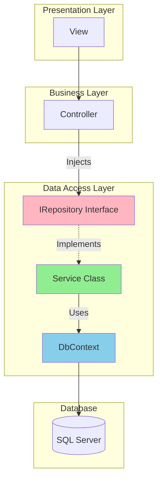
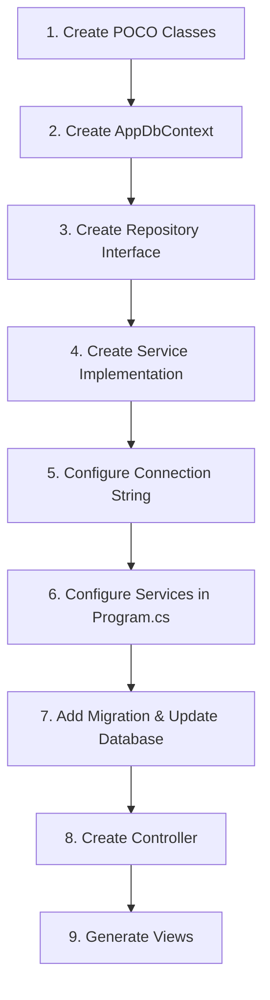

# 📚 Repository Pattern with Entity Framework Core

## 🎯 Introduction

The **Repository Pattern** is a design pattern that provides an abstraction layer between the data access layer and the business logic layer. Combined with **Entity Framework Core**, it creates a clean, testable, and maintainable data access architecture.

---

## 📋 Table of Contents
1. [Understanding Repository Pattern](#understanding-repository-pattern)
2. [Architecture Overview](#architecture-overview)
3. [Step-by-Step Implementation](#step-by-step-implementation)
4. [Complete Code with Explanations](#complete-code-with-explanations)
5. [Key Takeaways](#key-takeaways)

---

## 🔷 Understanding Repository Pattern

### What is Repository Pattern?

The Repository Pattern acts as a **mediator** between the domain and data mapping layers, providing a collection-like interface for accessing domain objects.

### Benefits

| Benefit | Description |
|---------|-------------|
| **Abstraction** | Hides data access complexity from business logic |
| **Testability** | Easy to mock for unit testing |
| **Flexibility** | Can switch data sources without changing business logic |
| **Single Responsibility** | Each layer has a focused responsibility |
| **Maintainability** | Changes isolated to specific layers |

---

## 🔷 Architecture Overview



### Layer Responsibilities

| Layer | Component | Responsibility |
|-------|-----------|----------------|
| **Presentation** | View | Display data to user |
| **Business** | Controller | Handle requests, coordinate operations |
| **Data Access** | Interface | Define data access contract |
| **Data Access** | Service | Implement data access logic |
| **Data Access** | DbContext | Communicate with database |
| **Database** | SQL Server | Store persistent data |

---

## 🔷 Step-by-Step Implementation

### Steps to Create MVC CRUD with Entity Framework



### Required NuGet Packages

```powershell
# Install via Package Manager Console
Install-Package Microsoft.EntityFrameworkCore
Install-Package Microsoft.EntityFrameworkCore.SqlServer
Install-Package Microsoft.EntityFrameworkCore.Tools
Install-Package Microsoft.EntityFrameworkCore.Design
Install-Package Microsoft.Extensions.Configuration.Json
Install-Package Microsoft.VisualStudio.Web.CodeGeneration.Design

# Or via .NET CLI
dotnet add package Microsoft.EntityFrameworkCore
dotnet add package Microsoft.EntityFrameworkCore.SqlServer
dotnet add package Microsoft.EntityFrameworkCore.Tools
```

---

## 🔷 Complete Code with Explanations

### Step 1: Create POCO Classes (Models)

```csharp
// Models/Employee.cs
using System.ComponentModel;
using System.ComponentModel.DataAnnotations;

namespace MVCEmpDept.Models
{
    public class Employee
    {
        // Primary Key - EF Core convention
        public int Id { get; set; }
        
        // Validation: Required field
        [Required]
        [DisplayName("Employee Name")]  // Display label in views
        public string? Name { get; set; }
        
        // Validation: Required + Email format
        [Required]
        [DataType(DataType.EmailAddress)]  // Input type hint
        public string? Email { get; set; }
        
        // Foreign Key to Department
        public int DepartmentId { get; set; }
        
        // Navigation Property
        public Department? Department { get; set; }
    }
}
```

```csharp
// Models/Department.cs
namespace MVCEmpDept.Models
{
    public class Department
    {
        public int Id { get; set; }          // Primary Key
        public string? Name { get; set; }     // Department name
        
        // Navigation Property - One-to-Many relationship
        public ICollection<Employee>? Employees { get; set; }
    }
}
```

#### Line-by-Line Explanation

| Line | Code | Purpose |
|------|------|---------|
| `[Key]` | Explicit primary key (optional if named `Id`) | Marks primary key |
| `[Required]` | Validation attribute | Field cannot be null/empty |
| `[DisplayName("...")]` | Display attribute | Custom label for views |
| `[DataType(DataType.EmailAddress)]` | Type hint | Affects input rendering |
| `public int DepartmentId` | Foreign key property | Links to Department |
| `public Department? Department` | Navigation property | Access related entity |
| `ICollection<Employee>` | Navigation property | One-to-many relationship |

---

### Step 2: Create DbContext Class

```csharp
// Repository/AppDbContextRepository.cs
using Microsoft.EntityFrameworkCore;
using MVCEmpDept.Models;

namespace MVCEmpDept.Repository
{
    public class AppDbContextRepository : DbContext
    {
        // Constructor receives options from DI container
        public AppDbContextRepository(DbContextOptions<AppDbContextRepository> options)
            : base(options)
        {
            // Options contain connection string and other settings
        }

        // DbSet represents a table in the database
        public DbSet<Employee> Employee { get; set; }
        public DbSet<Department> Department { get; set; }
    }
}
```

#### DbContext Explanation

| Component | Purpose |
|-----------|---------|
| `DbContext` | Base class for Entity Framework context |
| `DbContextOptions` | Contains connection string and configuration |
| `: base(options)` | Pass options to base DbContext constructor |
| `DbSet<T>` | Represents a table; enables CRUD operations |

---

### Step 3: Create Repository Interface

```csharp
// Service/IEmployeeService.cs
using MVCEmpDept.Models;

namespace MVCEmpDept.Service
{
    public interface IEmployeeService
    {
        // Read operations
        Employee? GetEmployee(int Id);              // Get single employee
        IEnumerable<Employee> GetAllEmployee();     // Get all employees
        IEnumerable<Department> GetAllDepartment(); // Get all departments
        
        // Write operations
        Employee Add(Employee employee);            // Create
        Employee Update(Employee employeeChanges);  // Update
        Employee? Delete(int Id);                   // Delete
    }
}
```

---

### Step 4: Create Service Implementation

```csharp
// Service/SqlEmployeeService.cs
using Microsoft.EntityFrameworkCore;
using MVCEmpDept.Models;
using MVCEmpDept.Repository;

namespace MVCEmpDept.Service
{
    public class SqlEmployeeService : IEmployeeService
    {
        // Private readonly field for DbContext
        private readonly AppDbContextRepository context;
        
        // Constructor Injection - receives DbContext from container
        public SqlEmployeeService(AppDbContextRepository context)
        {
            this.context = context;
        }
        
        // CREATE - Add new employee
        public Employee Add(Employee employee)
        {
            context.Employee.Add(employee);  // Add to DbSet
            context.SaveChanges();           // Persist to database
            return employee;
        }
        
        // READ - Get single employee by ID with related Department
        public Employee? GetEmployee(int Id)
        {
            // Include() loads related Department data (eager loading)
            Employee e = context.Employee
                .Include(e => e.Department)
                .FirstOrDefault(m => m.Id == Id);
            return e;
        }
        
        // READ - Get all employees with related Departments
        public IEnumerable<Employee> GetAllEmployee()
        {
            // Include navigation property to load Department
            return context.Employee.Include<Employee>("Department");
        }
        
        // READ - Get all departments
        public IEnumerable<Department> GetAllDepartment()
        {
            return context.Department;
        }
        
        // UPDATE - Modify existing employee
        public Employee Update(Employee employeeChanges)
        {
            // Mark entity as modified
            context.Entry(employeeChanges).State = EntityState.Modified;
            context.Update(employeeChanges);  // Update in DbSet
            context.SaveChanges();            // Persist changes
            return employeeChanges;
        }
        
        // DELETE - Remove employee by ID
        public Employee? Delete(int Id)
        {
            Employee? employee = context.Employee.Find(Id);
            if (employee != null)
            {
                context.Employee.Remove(employee);  // Remove from DbSet
                context.SaveChanges();              // Persist deletion
            }
            return employee;
        }
    }
}
```

#### CRUD Operations Explained

| Operation | Method | EF Core Method | Description |
|-----------|--------|----------------|-------------|
| **Create** | `Add()` | `context.Add()` + `SaveChanges()` | Insert new record |
| **Read** | `GetEmployee()` | `context.Find()` or `FirstOrDefault()` | Retrieve record |
| **Update** | `Update()` | `Entry().State = Modified` + `SaveChanges()` | Modify record |
| **Delete** | `Delete()` | `context.Remove()` + `SaveChanges()` | Remove record |

---

### Step 5: Configure Connection String

```json
// appsettings.json
{
  "Logging": {
    "LogLevel": {
      "Default": "Information",
      "Microsoft": "Warning",
      "Microsoft.Hosting.Lifetime": "Information"
    }
  },
  "ConnectionStrings": {
    "EmployeeDBConnection": "Data Source=(localdb)\\ProjectModels;Initial Catalog=DemoData;Integrated Security=True;"
  },
  "AllowedHosts": "*"
}
```

#### Connection String Components

| Part | Value | Description |
|------|-------|-------------|
| `Data Source` | `(localdb)\\Projects` | SQL Server instance |
| `Initial Catalog` | `DemoData` | Database name |
| `Integrated Security` | `True` | Windows authentication |

---

### Step 6: Configure Services in Program.cs

```csharp
// Program.cs
using Microsoft.EntityFrameworkCore;
using MVCEmpDept.Repository;
using MVCEmpDept.Service;
using System.Text.Json.Serialization;

public class Program
{
    public static void Main(string[] args)
    {
        var builder = WebApplication.CreateBuilder(args);

        // Add MVC services with JSON configuration
        // ReferenceHandler.IgnoreCycles prevents circular reference errors
        builder.Services.AddControllersWithViews()
            .AddJsonOptions(options =>
                options.JsonSerializerOptions.ReferenceHandler = ReferenceHandler.IgnoreCycles);

        // Register DbContext with connection pooling
        builder.Services.AddDbContextPool<AppDbContextRepository>(
            options => options.UseSqlServer(
                builder.Configuration.GetConnectionString("EmployeeDBConnection")
            )
        );

        // Register application service with Scoped lifetime
        builder.Services.AddScoped<IEmployeeService, SqlEmployeeService>();

        var app = builder.Build();

        // Configure HTTP request pipeline
        if (!app.Environment.IsDevelopment())
        {
            app.UseExceptionHandler("/Home/Error");
            app.UseHsts();
        }

        app.UseHttpsRedirection();
        app.UseStaticFiles();
        app.UseRouting();
        app.UseAuthorization();

        app.MapControllerRoute(
            name: "default",
            pattern: "{controller=Employee}/{action=Index}/{id?}");

        app.Run();
    }
}
```

#### Service Registration Explained

| Registration | Purpose |
|--------------|---------|
| `AddControllersWithViews()` | Add MVC framework services |
| `AddJsonOptions()` | Configure JSON serialization |
| `AddDbContextPool<T>()` | Register DbContext with pooling |
| `AddScoped<I, T>()` | Register service with Scoped lifetime |

---

### Step 7: Run Migrations

```powershell
# In Package Manager Console

# Create migration
Add-Migration CreateDemoDb

# Apply to database
Update-Database -Verbose

# The -Verbose flag shows all SQL commands being executed
```

---

### Step 8: Create Controller

```csharp
// Controllers/EmployeeController.cs
using Microsoft.AspNetCore.Mvc;
using Microsoft.AspNetCore.Mvc.Rendering;
using MVCEmpDept.Models;
using MVCEmpDept.Service;
using System.Diagnostics;

public class EmployeeController : Controller
{
    private readonly IEmployeeService _employeeRepository;
    private readonly ILogger<EmployeeController> _logger;

    // Constructor Injection
    public EmployeeController(
        IEmployeeService employeeRepository,
        ILogger<EmployeeController> logger)
    {
        _employeeRepository = employeeRepository;
        _logger = logger;
    }

    // GET: Employee
    public ActionResult Index()
    {
        _logger.LogInformation("Getting employee list");
        var model = _employeeRepository.GetAllEmployee();
        return View(model);
    }

    // GET: Employee/Details/5
    public ActionResult Details(int id)
    {
        var model = _employeeRepository.GetEmployee(id);
        if (model == null)
        {
            Response.StatusCode = 404;
            return View("Error", new ErrorViewModel { 
                RequestId = Activity.Current?.Id ?? HttpContext.TraceIdentifier 
            });
        }
        return View(model);
    }

    // GET: Employee/Create
    public ActionResult Create()
    {
        // Populate dropdown with departments
        IEnumerable<Department> departments = _employeeRepository.GetAllDepartment();
        ViewData["DepartmentId"] = new SelectList(departments, "Id", "Name");
        return View();
    }

    // POST: Employee/Create
    [HttpPost]
    [ValidateAntiForgeryToken]  // CSRF protection
    public ActionResult Create(Employee employee)
    {
        IEnumerable<Department> departments = _employeeRepository.GetAllDepartment();
        try
        {
            if (ModelState.IsValid)
            {
                _employeeRepository.Add(employee);
                return RedirectToAction(nameof(Index));
            }
            ViewData["DepartmentId"] = new SelectList(departments, "Id", "Name", employee.DepartmentId);
            return View(employee);
        }
        catch
        {
            return View(employee);
        }
    }

    // GET: Employee/Edit/5
    public ActionResult Edit(int id)
    {
        var model = _employeeRepository.GetEmployee(id);
        if (model == null)
            throw new Exception("Employee not found");

        IEnumerable<Department> departments = _employeeRepository.GetAllDepartment();
        ViewData["DepartmentId"] = new SelectList(departments, "Id", "Name", model.DepartmentId);
        return View(model);
    }

    // POST: Employee/Edit/5
    [HttpPost]
    [ValidateAntiForgeryToken]
    public ActionResult Edit(Employee emp)
    {
        if (ModelState.IsValid)
        {
            try
            {
                _employeeRepository.Update(emp);
                return RedirectToAction(nameof(Index));
            }
            catch
            {
                return View(emp);
            }
        }
        IEnumerable<Department> departments = _employeeRepository.GetAllDepartment();
        ViewData["DepartmentId"] = new SelectList(departments, "Id", "Name", emp.DepartmentId);
        return View(emp);
    }

    // GET: Employee/Delete/5
    public ActionResult Delete(int id)
    {
        var model = _employeeRepository.GetEmployee(id);
        if (model == null)
            return NotFound();
        return View(model);
    }

    // POST: Employee/Delete/5
    [HttpPost, ActionName("Delete")]
    [ValidateAntiForgeryToken]
    public ActionResult DeleteConfirmed(int id)
    {
        try
        {
            _employeeRepository.Delete(id);
            return RedirectToAction(nameof(Index));
        }
        catch
        {
            return View();
        }
    }
}
```

---

## 🔷 Entity Framework Methods Reference

### DbContext Methods

| Method | Description |
|--------|-------------|
| `Add<T>(entity)` | Add entity, marks as Added state |
| `Update(entity)` | Update entity, marks as Modified state |
| `Remove(entity)` | Remove entity, marks as Deleted state |
| `Find<T>(key)` | Find entity by primary key |
| `SaveChanges()` | Persist all changes to database |

### Entry State Methods

```csharp
// Ways to mark entity state
context.Add(entity);                           // EntityState.Added
context.Update(entity);                        // EntityState.Modified
context.Remove(entity);                        // EntityState.Deleted
context.Entry(entity).State = EntityState.Modified;  // Explicit state
```

### Attach vs Add vs Entry

| Method | Use Case |
|--------|----------|
| `Add()` | Insert NEW record |
| `Attach()` | Track EXISTING record (unchanged) |
| `Entry().State = Modified` | Track and mark ALL properties as modified |

> [!NOTE]
> `DbSet.Attach(entity)` is equivalent to `Entry(entity).State = EntityState.Unchanged`.
> Only use `Entry().State = Modified` when you want to update ALL fields.

---

## 🔷 Key Takeaways

> [!IMPORTANT]
> **Must Remember Points:**

### Architecture Flow

```
View → Controller → Interface → Service → DbContext → Database
                         ↓
              Dependency Injection
```

### Essential Steps

1. **Create Models** with Data Annotations for validation
2. **Create DbContext** inheriting from `DbContext`
3. **Create Interface** defining CRUD methods
4. **Create Service** implementing interface with DbContext injection
5. **Configure** connection string in `appsettings.json`
6. **Register Services** in `Program.cs`
7. **Run Migrations** to create database

### Code Patterns

```csharp
// Interface Pattern
public interface IRepository<T>
{
    T Get(int id);
    IEnumerable<T> GetAll();
    T Add(T entity);
    T Update(T entity);
    T Delete(int id);
}

// Service receives DbContext via constructor
public class Service : IService
{
    private readonly AppDbContext _context;
    public Service(AppDbContext context) => _context = context;
}

// Controller receives Service via constructor
public class Controller
{
    private readonly IService _service;
    public Controller(IService service) => _service = service;
}
```

---

## 📝 Practice Questions

1. What is the Repository Pattern and what are its benefits?
2. Explain the role of DbContext in Entity Framework Core.
3. What is the difference between `Add()`, `Attach()`, and `Update()` in EF Core?
4. Why is Scoped lifetime recommended for DbContext?
5. How do you include related entities when querying with EF Core?
6. What does `SaveChanges()` do?

---

*Previous: [03 - Service Lifetimes](./03_Service_Lifetimes.md)*

*Next: [05 - CRUD Operations with MVC Views](./05_CRUD_Operations_MVC.md)*
