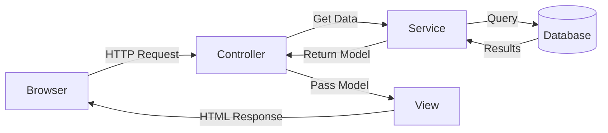

# 📚 MVC CRUD Views and Controller Actions

## 🎯 Introduction

This note covers the complete implementation of **CRUD (Create, Read, Update, Delete)** operations in ASP.NET Core MVC, including controller actions, views, and model validation.

---

## 📋 Table of Contents
1. [MVC Flow Overview](#mvc-flow-overview)
2. [Controller Action Methods](#controller-action-methods)
3. [Model Validation with Data Annotations](#model-validation-with-data-annotations)
4. [Complete View Templates](#complete-view-templates)
5. [Key Takeaways](#key-takeaways)

---

## 🔷 MVC Flow Overview



### Action Result Types

| Result Type | Description | Helper Method |
|-------------|-------------|---------------|
| `ViewResult` | Returns HTML view | `View()` |
| `JsonResult` | Returns JSON data | `Json()` |
| `RedirectResult` | Redirects to URL | `Redirect()` |
| `RedirectToActionResult` | Redirects to action | `RedirectToAction()` |
| `PartialViewResult` | Returns partial view | `PartialView()` |
| `ContentResult` | Returns plain text | `Content()` |
| `FileResult` | Returns file download | `File()` |
| `NotFoundResult` | Returns 404 status | `NotFound()` |

---

## 🔷 Controller Action Methods

### Complete Controller Implementation

```csharp
// Controllers/EmployeeController.cs
using Microsoft.AspNetCore.Mvc;
using Microsoft.AspNetCore.Mvc.Rendering;
using MVCEmpDept.Models;
using MVCEmpDept.Service;

public class EmployeeController : Controller
{
    private readonly IEmployeeService _employeeRepository;
    
    // Constructor Injection
    public EmployeeController(IEmployeeService employeeRepository)
    {
        _employeeRepository = employeeRepository;
    }
    
    // ═══════════════════════════════════════════════════════════════
    // INDEX - Display list of all employees
    // URL: GET /Employee or GET /Employee/Index
    // ═══════════════════════════════════════════════════════════════
    public ActionResult Index()
    {
        // Get all employees from repository
        var model = _employeeRepository.GetAllEmployee();
        
        // Pass model to view
        return View(model);
    }
    
    // ═══════════════════════════════════════════════════════════════
    // DETAILS - Display single employee details
    // URL: GET /Employee/Details/5
    // ═══════════════════════════════════════════════════════════════
    public ActionResult Details(int id)
    {
        // Find employee by ID
        var model = _employeeRepository.GetEmployee(id);
        
        // Handle not found
        if (model == null)
            return NotFound();
        
        return View(model);
    }
    
    // ═══════════════════════════════════════════════════════════════
    // CREATE (GET) - Display empty form
    // URL: GET /Employee/Create
    // ═══════════════════════════════════════════════════════════════
    public ActionResult Create()
    {
        // Prepare dropdown data for departments
        IEnumerable<Department> departments = _employeeRepository.GetAllDepartment();
        ViewData["DepartmentId"] = new SelectList(departments, "Id", "Name");
        
        // Return empty form
        return View();
    }
    
    // ═══════════════════════════════════════════════════════════════
    // CREATE (POST) - Process form submission
    // URL: POST /Employee/Create
    // ═══════════════════════════════════════════════════════════════
    [HttpPost]                      // Only respond to POST requests
    [ValidateAntiForgeryToken]      // CSRF protection
    public ActionResult Create(Employee employee)
    {
        IEnumerable<Department> departments = _employeeRepository.GetAllDepartment();
        
        try
        {
            // Check if model validation passed
            if (ModelState.IsValid)
            {
                // Add to database
                _employeeRepository.Add(employee);
                
                // Redirect to list
                return RedirectToAction(nameof(Index));
            }
            
            // Validation failed - redisplay form with errors
            ViewData["DepartmentId"] = new SelectList(departments, "Id", "Name", employee.DepartmentId);
            return View(employee);
        }
        catch
        {
            return View(employee);
        }
    }
    
    // ═══════════════════════════════════════════════════════════════
    // EDIT (GET) - Display form with existing data
    // URL: GET /Employee/Edit/5
    // ═══════════════════════════════════════════════════════════════
    public ActionResult Edit(int id)
    {
        // Get employee to edit
        var model = _employeeRepository.GetEmployee(id);
        
        if (model == null)
            return NotFound();
        
        // Prepare dropdown with current selection
        IEnumerable<Department> departments = _employeeRepository.GetAllDepartment();
        ViewData["DepartmentId"] = new SelectList(departments, "Id", "Name", model.DepartmentId);
        
        return View(model);
    }
    
    // ═══════════════════════════════════════════════════════════════
    // EDIT (POST) - Process update
    // URL: POST /Employee/Edit/5
    // ═══════════════════════════════════════════════════════════════
    [HttpPost]
    [ValidateAntiForgeryToken]
    public ActionResult Edit(Employee emp)
    {
        if (ModelState.IsValid)
        {
            try
            {
                // Update in database
                _employeeRepository.Update(emp);
                return RedirectToAction(nameof(Index));
            }
            catch
            {
                return View(emp);
            }
        }
        
        // Validation failed
        IEnumerable<Department> departments = _employeeRepository.GetAllDepartment();
        ViewData["DepartmentId"] = new SelectList(departments, "Id", "Name", emp.DepartmentId);
        return View(emp);
    }
    
    // ═══════════════════════════════════════════════════════════════
    // DELETE (GET) - Show confirmation page
    // URL: GET /Employee/Delete/5
    // ═══════════════════════════════════════════════════════════════
    public ActionResult Delete(int id)
    {
        var model = _employeeRepository.GetEmployee(id);
        
        if (model == null)
            return NotFound();
        
        return View(model);
    }
    
    // ═══════════════════════════════════════════════════════════════
    // DELETE (POST) - Process deletion
    // URL: POST /Employee/Delete/5
    // ═══════════════════════════════════════════════════════════════
    [HttpPost, ActionName("Delete")]  // ActionName maps to DELETE action
    [ValidateAntiForgeryToken]
    public ActionResult DeleteConfirmed(int id)
    {
        try
        {
            _employeeRepository.Delete(id);
            return RedirectToAction(nameof(Index));
        }
        catch
        {
            return View();
        }
    }
}
```

---

## 🔷 Model Validation with Data Annotations

### Common Validation Attributes

```csharp
public class Employee
{
    // Hidden input - ID is auto-generated
    [HiddenInput(DisplayValue = false)]
    public int Id { get; set; }
    
    // Required with custom error message
    [Required(ErrorMessage = "Please enter employee name")]
    [StringLength(50, MinimumLength = 3, ErrorMessage = "Name must be 3-50 characters")]
    [DisplayName("Employee Name")]
    public string? Name { get; set; }
    
    // Email validation with regex
    [Required(ErrorMessage = "Please enter email address")]
    [DataType(DataType.EmailAddress)]
    [RegularExpression(@"^[\w-\.]+@([\w-]+\.)+[\w]{2,6}$", 
        ErrorMessage = "Invalid email format")]
    public string? Email { get; set; }
    
    // Compare two fields
    [Compare("Email", ErrorMessage = "Email and Confirm Email must match")]
    public string? ConfirmEmail { get; set; }
    
    // Range validation
    [Range(18, 100, ErrorMessage = "Age must be between 18 and 100")]
    public int Age { get; set; }
    
    // Phone number regex
    [RegularExpression("[0-9]{10}", ErrorMessage = "Enter valid 10-digit phone number")]
    [DataType(DataType.PhoneNumber)]
    public string? Phone { get; set; }
    
    // Date format
    [DataType(DataType.Date)]
    [DisplayFormat(DataFormatString = "{0:dd/MM/yyyy}", ApplyFormatInEditMode = true)]
    public DateTime? HireDate { get; set; }
    
    // Password field
    [DataType(DataType.Password)]
    [StringLength(15, MinimumLength = 8, ErrorMessage = "Password must be 8-15 characters")]
    public string? Password { get; set; }
    
    // Multi-line text
    [DataType(DataType.MultilineText)]
    public string? Address { get; set; }
    
    // Currency display
    [DataType(DataType.Currency)]
    public decimal? Salary { get; set; }
    
    // URL validation
    [DataType(DataType.Url)]
    public string? Website { get; set; }
}
```

### Validation Attributes Reference

| Attribute | Purpose | Example |
|-----------|---------|---------|
| `[Required]` | Field cannot be empty | `[Required(ErrorMessage = "Required")]` |
| `[StringLength]` | Min/Max length | `[StringLength(50, MinimumLength = 3)]` |
| `[Range]` | Numeric range | `[Range(1, 100)]` |
| `[RegularExpression]` | Pattern matching | `[RegularExpression(@"[0-9]{10}")]` |
| `[Compare]` | Compare two properties | `[Compare("Password")]` |
| `[DataType]` | Input type hint | `[DataType(DataType.Password)]` |
| `[DisplayName]` | Custom label | `[DisplayName("Full Name")]` |
| `[DisplayFormat]` | Format display | `[DisplayFormat(DataFormatString = "{0:d}")]` |
| `[EmailAddress]` | Email format | Built-in email validation |
| `[Phone]` | Phone format | Built-in phone validation |
| `[Url]` | URL format | Built-in URL validation |

---

## 🔷 Complete View Templates

### Index View (List)

```html
@* Views/Employee/Index.cshtml *@
@model IEnumerable<MVCEmpDept.Models.Employee>

@{
    ViewData["Title"] = "Employees";
}

<h1>Employee List</h1>

<p>
    <a asp-action="Create" class="btn btn-primary">Create New</a>
</p>

<table class="table table-striped">
    <thead>
        <tr>
            <th>@Html.DisplayNameFor(model => model.Name)</th>
            <th>@Html.DisplayNameFor(model => model.Email)</th>
            <th>@Html.DisplayNameFor(model => model.Department)</th>
            <th>Actions</th>
        </tr>
    </thead>
    <tbody>
        @foreach (var item in Model)
        {
            <tr>
                <td>@Html.DisplayFor(modelItem => item.Name)</td>
                <td>@Html.DisplayFor(modelItem => item.Email)</td>
                <td>@Html.DisplayFor(modelItem => item.Department.Name)</td>
                <td>
                    <a asp-action="Edit" asp-route-id="@item.Id" class="btn btn-sm btn-warning">Edit</a>
                    <a asp-action="Details" asp-route-id="@item.Id" class="btn btn-sm btn-info">Details</a>
                    <a asp-action="Delete" asp-route-id="@item.Id" class="btn btn-sm btn-danger">Delete</a>
                </td>
            </tr>
        }
    </tbody>
</table>
```

### Create View

```html
@* Views/Employee/Create.cshtml *@
@model MVCEmpDept.Models.Employee

@{
    ViewData["Title"] = "Create Employee";
}

<h1>Create Employee</h1>

<div class="row">
    <div class="col-md-6">
        <form asp-action="Create">
            <div asp-validation-summary="ModelOnly" class="text-danger"></div>
            
            <div class="form-group mb-3">
                <label asp-for="Name" class="control-label"></label>
                <input asp-for="Name" class="form-control" />
                <span asp-validation-for="Name" class="text-danger"></span>
            </div>
            
            <div class="form-group mb-3">
                <label asp-for="Email" class="control-label"></label>
                <input asp-for="Email" class="form-control" />
                <span asp-validation-for="Email" class="text-danger"></span>
            </div>
            
            <div class="form-group mb-3">
                <label asp-for="DepartmentId" class="control-label">Department</label>
                <select asp-for="DepartmentId" asp-items="ViewBag.DepartmentId" class="form-control">
                    <option value="">-- Select Department --</option>
                </select>
                <span asp-validation-for="DepartmentId" class="text-danger"></span>
            </div>
            
            <div class="form-group">
                <input type="submit" value="Create" class="btn btn-primary" />
                <a asp-action="Index" class="btn btn-secondary">Back to List</a>
            </div>
        </form>
    </div>
</div>

@section Scripts {
    @{await Html.RenderPartialAsync("_ValidationScriptsPartial");}
}
```

### Edit View

```html
@* Views/Employee/Edit.cshtml *@
@model MVCEmpDept.Models.Employee

@{
    ViewData["Title"] = "Edit Employee";
}

<h1>Edit Employee</h1>

<div class="row">
    <div class="col-md-6">
        <form asp-action="Edit">
            <div asp-validation-summary="ModelOnly" class="text-danger"></div>
            
            <!-- Hidden field for ID -->
            <input type="hidden" asp-for="Id" />
            
            <div class="form-group mb-3">
                <label asp-for="Name" class="control-label"></label>
                <input asp-for="Name" class="form-control" />
                <span asp-validation-for="Name" class="text-danger"></span>
            </div>
            
            <div class="form-group mb-3">
                <label asp-for="Email" class="control-label"></label>
                <input asp-for="Email" class="form-control" />
                <span asp-validation-for="Email" class="text-danger"></span>
            </div>
            
            <div class="form-group mb-3">
                <label asp-for="DepartmentId" class="control-label">Department</label>
                <select asp-for="DepartmentId" asp-items="ViewBag.DepartmentId" class="form-control">
                </select>
                <span asp-validation-for="DepartmentId" class="text-danger"></span>
            </div>
            
            <div class="form-group">
                <input type="submit" value="Save" class="btn btn-primary" />
                <a asp-action="Index" class="btn btn-secondary">Back to List</a>
            </div>
        </form>
    </div>
</div>

@section Scripts {
    @{await Html.RenderPartialAsync("_ValidationScriptsPartial");}
}
```

### Details View

```html
@* Views/Employee/Details.cshtml *@
@model MVCEmpDept.Models.Employee

@{
    ViewData["Title"] = "Employee Details";
}

<h1>Employee Details</h1>

<div class="card">
    <div class="card-body">
        <dl class="row">
            <dt class="col-sm-3">@Html.DisplayNameFor(model => model.Name)</dt>
            <dd class="col-sm-9">@Html.DisplayFor(model => model.Name)</dd>
            
            <dt class="col-sm-3">@Html.DisplayNameFor(model => model.Email)</dt>
            <dd class="col-sm-9">@Html.DisplayFor(model => model.Email)</dd>
            
            <dt class="col-sm-3">Department</dt>
            <dd class="col-sm-9">@Html.DisplayFor(model => model.Department.Name)</dd>
        </dl>
    </div>
</div>

<div class="mt-3">
    <a asp-action="Edit" asp-route-id="@Model.Id" class="btn btn-warning">Edit</a>
    <a asp-action="Index" class="btn btn-secondary">Back to List</a>
</div>
```

### Delete View

```html
@* Views/Employee/Delete.cshtml *@
@model MVCEmpDept.Models.Employee

@{
    ViewData["Title"] = "Delete Employee";
}

<h1>Delete Employee</h1>

<div class="alert alert-danger">
    <h3>Are you sure you want to delete this employee?</h3>
</div>

<div class="card">
    <div class="card-body">
        <dl class="row">
            <dt class="col-sm-3">@Html.DisplayNameFor(model => model.Name)</dt>
            <dd class="col-sm-9">@Html.DisplayFor(model => model.Name)</dd>
            
            <dt class="col-sm-3">@Html.DisplayNameFor(model => model.Email)</dt>
            <dd class="col-sm-9">@Html.DisplayFor(model => model.Email)</dd>
        </dl>
    </div>
</div>

<form asp-action="Delete" class="mt-3">
    <input type="hidden" asp-for="Id" />
    <input type="submit" value="Delete" class="btn btn-danger" />
    <a asp-action="Index" class="btn btn-secondary">Cancel</a>
</form>
```

---

## 🔷 Tag Helpers Reference

| Tag Helper | Purpose | Example |
|------------|---------|---------|
| `asp-action` | Links to action method | `<a asp-action="Create">` |
| `asp-controller` | Links to controller | `<a asp-controller="Home">` |
| `asp-route-id` | Passes route parameter | `<a asp-route-id="@item.Id">` |
| `asp-for` | Binds to model property | `<input asp-for="Name">` |
| `asp-items` | Dropdown items | `<select asp-items="ViewBag.Items">` |
| `asp-validation-for` | Validation message | `<span asp-validation-for="Name">` |
| `asp-validation-summary` | All validation errors | `<div asp-validation-summary="All">` |

---

## 🔷 Key Takeaways

> [!IMPORTANT]
> **Must Remember Points:**

### CRUD Pattern

| Operation | HTTP | Action Method | View |
|-----------|------|---------------|------|
| List | GET | `Index()` | `Index.cshtml` |
| Details | GET | `Details(id)` | `Details.cshtml` |
| Create (Form) | GET | `Create()` | `Create.cshtml` |
| Create (Save) | POST | `Create(model)` | → Index |
| Edit (Form) | GET | `Edit(id)` | `Edit.cshtml` |
| Edit (Save) | POST | `Edit(model)` | → Index |
| Delete (Confirm) | GET | `Delete(id)` | `Delete.cshtml` |
| Delete (Execute) | POST | `DeleteConfirmed(id)` | → Index |

### Important Attributes

```csharp
[HttpPost]              // Handle POST requests only
[HttpGet]               // Handle GET requests only (default)
[ValidateAntiForgeryToken]  // CSRF protection
[ActionName("Delete")]  // Custom action name for routing
```

---

*Previous: [04 - Repository Pattern with EF Core](./04_Repository_Pattern_EFCore.md)*

*Next: [06 - AddMvc Methods Comparison](./06_AddMvc_Methods_Comparison.md)*
