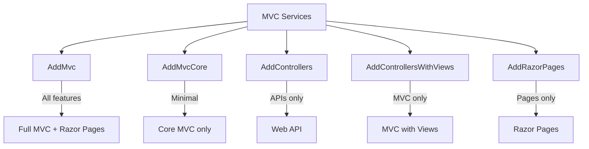
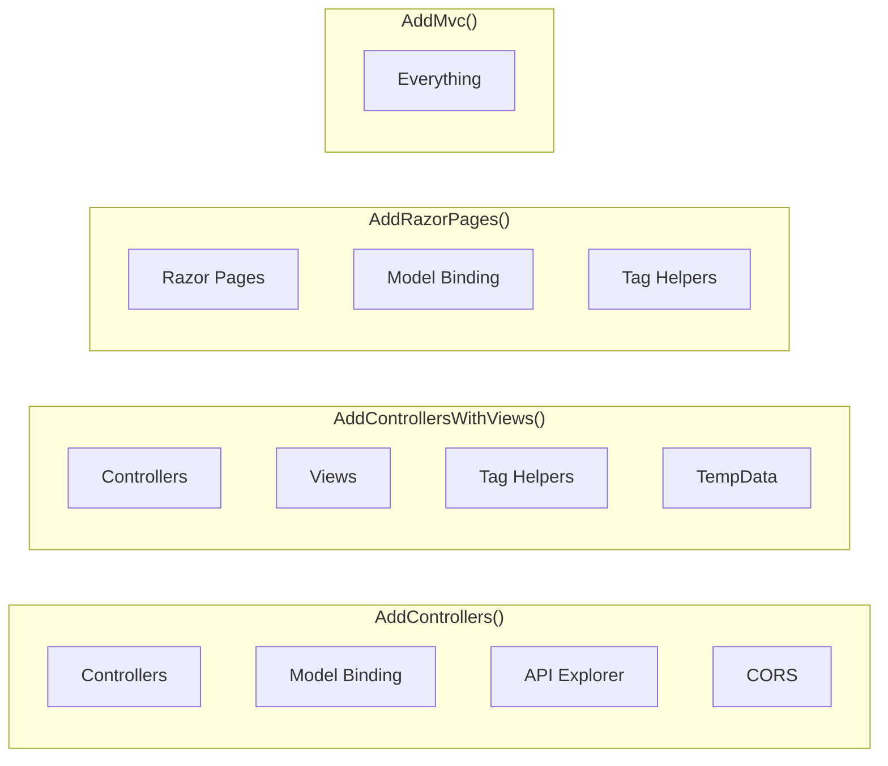
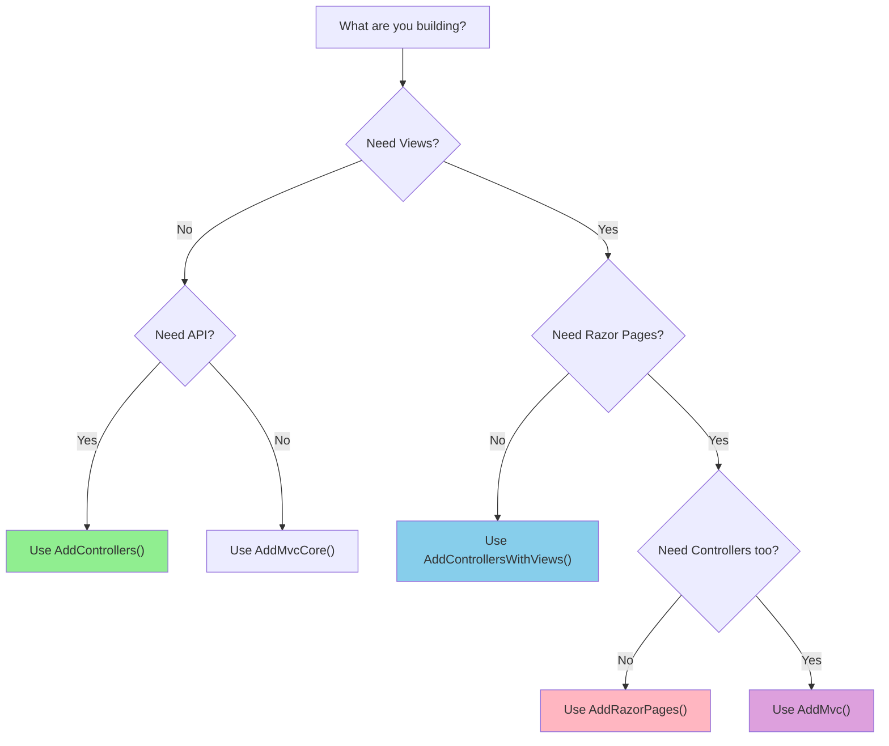

# 📚 AddMvc Methods Comparison

## 🎯 Introduction

ASP.NET Core provides several extension methods to add MVC services. Understanding the differences helps you choose the right method for your application type.

---

## 📋 Table of Contents
1. [Overview of Methods](#overview-of-methods)
2. [AddMvc vs AddMvcCore](#addmvc-vs-addmvccore)
3. [Feature Comparison](#feature-comparison)
4. [When to Use Which](#when-to-use-which)
5. [Key Takeaways](#key-takeaways)

---

## 🔷 Overview of Methods



---

## 🔷 AddMvc vs AddMvcCore

### AddMvcCore()
- Adds **only core MVC services**
- Minimal setup
- **Does NOT include** JSON formatters, View support, Authorization filters

```csharp
// ❌ This will fail for JSON responses!
builder.Services.AddMvcCore();

public class HomeController : Controller
{
    public JsonResult Index()
    {
        // Error: No service for JsonResultExecutor
        return Json(new { id = 1, name = "CDAC" });
    }
}
```

**Error Message:**
```
No service for type 'Microsoft.AspNetCore.Mvc.Formatters.Json.Internal.JsonResultExecutor' has been registered.
```

### AddMvc()
- Adds **all MVC services** including AddMvcCore
- Includes JSON formatters, View support, Tag Helpers, Authorization
- **Calls AddMvcCore() internally**

```csharp
// ✅ This works!
builder.Services.AddMvc();

public class HomeController : Controller
{
    public JsonResult Index()
    {
        return Json(new { id = 1, name = "CDAC" });  // Works!
    }
}
```

---

## 🔷 Feature Comparison

### Complete Feature Matrix

| Feature | AddControllers | AddControllersWithViews | AddRazorPages | AddMvc |
|---------|---------------|-------------------------|---------------|--------|
| **Controllers** | ✅ | ✅ | ❌ | ✅ |
| **Model Binding** | ✅ | ✅ | ✅ | ✅ |
| **API Explorer** | ✅ | ✅ | ❌ | ✅ |
| **Authorization** | ✅ | ✅ | ✅ | ✅ |
| **CORS** | ✅ | ✅ | ❌ | ✅ |
| **Data Annotations** | ✅ | ✅ | ✅ | ✅ |
| **Formatter Mapping** | ✅ | ✅ | ❌ | ✅ |
| **Antiforgery** | ❌ | ✅ | ✅ | ✅ |
| **TempData** | ❌ | ✅ | ✅ | ✅ |
| **Views** | ❌ | ✅ | ✅ | ✅ |
| **Razor Pages** | ❌ | ❌ | ✅ | ✅ |
| **Tag Helpers** | ❌ | ✅ | ✅ | ✅ |
| **Memory Cache** | ❌ | ✅ | ✅ | ✅ |

### Visual Comparison



---

## 🔷 When to Use Which

### AddControllers() - For Web API

```csharp
// Use for: REST APIs, microservices
builder.Services.AddControllers();

[ApiController]
[Route("api/[controller]")]
public class ProductsController : ControllerBase
{
    [HttpGet]
    public IActionResult GetAll() => Ok(products);
    
    [HttpPost]
    public IActionResult Create(Product product) => Created($"/api/products/{product.Id}", product);
}
```

**Best for:**
- Web APIs
- Microservices
- RESTful services
- No UI needed

### AddControllersWithViews() - For MVC Applications

```csharp
// Use for: Traditional MVC web apps
builder.Services.AddControllersWithViews();

public class HomeController : Controller
{
    public IActionResult Index()
    {
        return View();  // Returns Views/Home/Index.cshtml
    }
}
```

**Best for:**
- Traditional web applications
- Server-rendered HTML
- MVC pattern with Views

### AddRazorPages() - For Page-focused Apps

```csharp
// Use for: Razor Pages applications
builder.Services.AddRazorPages();

// Pages/Index.cshtml.cs
public class IndexModel : PageModel
{
    public void OnGet()
    {
        // Handle GET request
    }
}
```

**Best for:**
- CRUD applications
- Form-heavy applications
- Page-focused design

### AddMvc() - For Everything

```csharp
// Use for: Applications needing all features
builder.Services.AddMvc();
```

**Best for:**
- Hybrid applications (API + Views + Pages)
- When you need all MVC features

> [!WARNING]
> Using `AddMvc()` adds extra features even if not needed, which may slightly impact application startup time.

---

## 🔷 Decision Flowchart



---

## 🔷 Code Examples

### Web API Project

```csharp
var builder = WebApplication.CreateBuilder(args);

// Only API features needed
builder.Services.AddControllers();

var app = builder.Build();

app.UseHttpsRedirection();
app.UseAuthorization();
app.MapControllers();

app.Run();
```

### MVC Web Application

```csharp
var builder = WebApplication.CreateBuilder(args);

// MVC with Views but no Razor Pages
builder.Services.AddControllersWithViews();

var app = builder.Build();

app.UseHttpsRedirection();
app.UseStaticFiles();
app.UseRouting();
app.UseAuthorization();

app.MapControllerRoute(
    name: "default",
    pattern: "{controller=Home}/{action=Index}/{id?}");

app.Run();
```

### Full MVC Application

```csharp
var builder = WebApplication.CreateBuilder(args);

// All MVC features
builder.Services.AddMvc();

var app = builder.Build();

app.UseHttpsRedirection();
app.UseStaticFiles();
app.UseRouting();
app.UseAuthorization();

app.MapControllerRoute(
    name: "default",
    pattern: "{controller=Home}/{action=Index}/{id?}");
app.MapRazorPages();

app.Run();
```

---

## 🔷 Key Takeaways

> [!IMPORTANT]
> **Quick Reference:**

| Method | Use Case |
|--------|----------|
| `AddControllers()` | Web API only |
| `AddControllersWithViews()` | MVC web application |
| `AddRazorPages()` | Razor Pages application |
| `AddMvc()` | Everything (API + MVC + Pages) |
| `AddMvcCore()` | Minimal MVC core only |

### Remember

1. **AddMvc()** = AddMvcCore() + all MVC features
2. **AddControllersWithViews()** = AddControllers() + Views + TempData + TagHelpers
3. **AddControllers()** = API-focused, no Views support
4. Choose the **minimal** method that satisfies your requirements

---

*Previous: [05 - CRUD Operations with MVC](./05_CRUD_Operations_MVC.md)*

*Next: [07 - ASP.NET Core Project Structure](./07_ASPNETCore_Project_Structure.md)*
