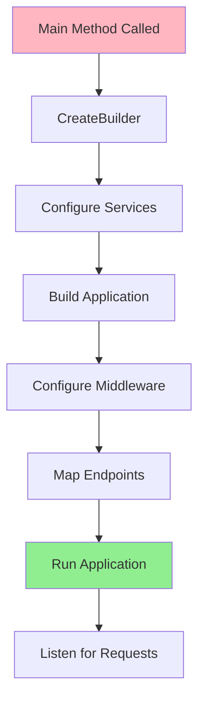
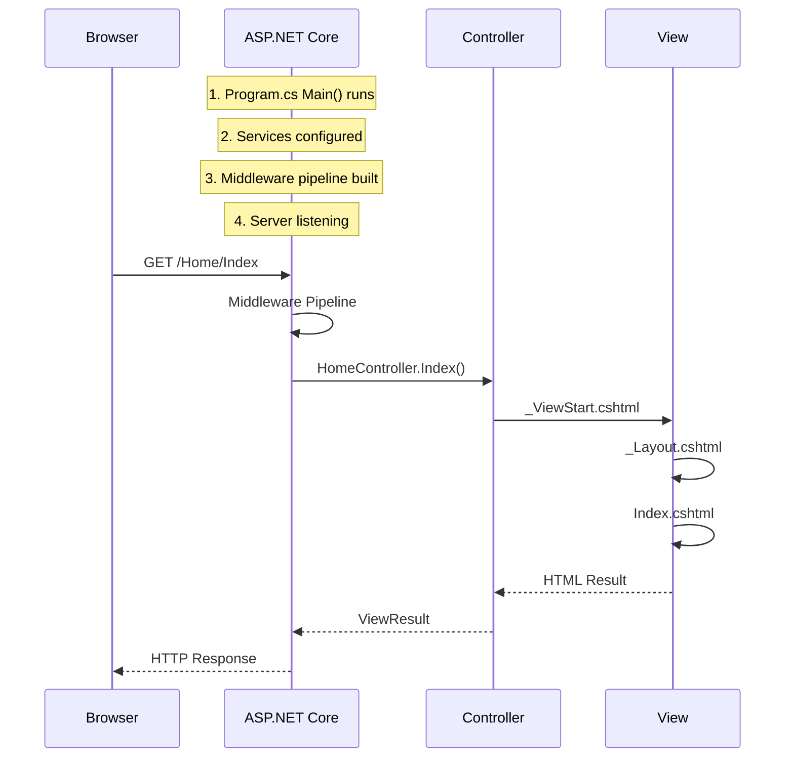

# 📚 ASP.NET Core Project Structure and Program.cs

## 🎯 Introduction

Understanding the structure of an ASP.NET Core application is fundamental to working effectively with the framework. This note covers the **Program.cs** file, **WebApplicationBuilder**, **WebApplication**, and the overall project structure.

---

## 📋 Table of Contents
1. [Project Structure Overview](#project-structure-overview)
2. [Program.cs Explained](#programcs-explained)
3. [WebApplicationBuilder in Detail](#webapplicationbuilder-in-detail)
4. [WebApplication Class](#webapplication-class)
5. [MVC Folder Structure](#mvc-folder-structure)
6. [Key Takeaways](#key-takeaways)

---

## 🔷 Project Structure Overview

```
MyMVCApplication/
├── 📁 Controllers/           # Controller classes
│   └── HomeController.cs
├── 📁 Models/                # Data models and ViewModels
│   └── Student.cs
├── 📁 Views/                 # Razor view files
│   ├── 📁 Home/             # Views for HomeController
│   │   └── Index.cshtml
│   ├── 📁 Shared/           # Shared views and layouts
│   │   ├── _Layout.cshtml
│   │   └── _ValidationScriptsPartial.cshtml
│   ├── _ViewImports.cshtml
│   └── _ViewStart.cshtml
├── 📁 wwwroot/               # Static files (CSS, JS, images)
│   ├── 📁 css/
│   ├── 📁 js/
│   └── 📁 lib/
├── 📁 Properties/            # Project properties
│   └── launchSettings.json
├── appsettings.json          # Configuration file
├── appsettings.Development.json
└── Program.cs                # Entry point
```

---

## 🔷 Program.cs Explained

### Why Does ASP.NET Core Have a Main() Method?

ASP.NET Core applications **start as Console Applications**. The `Main()` method is the **entry point** where:
1. The application bootstraps itself
2. Configures services
3. Builds the request pipeline
4. Starts the web server

```csharp
// Program.cs - Complete Example
using Microsoft.EntityFrameworkCore;
using MVCEmpDept.Models;
using MVCEmpDept.Repository;
using MVCEmpDept.Service;

namespace MVCEmpDept
{
    public class Program
    {
        // Entry point - application starts here
        public static void Main(string[] args)
        {
            // ═══════════════════════════════════════════════════════
            // STEP 1: Create WebApplicationBuilder
            // ═══════════════════════════════════════════════════════
            var builder = WebApplication.CreateBuilder(args);

            // ═══════════════════════════════════════════════════════
            // STEP 2: Configure Services (Dependency Injection)
            // ═══════════════════════════════════════════════════════
            
            // Add MVC services (Framework Service)
            builder.Services.AddControllersWithViews();
            
            // Add DbContext with pooling (Framework Service)
            builder.Services.AddDbContextPool<AppDbContextRepository>(
                options => options.UseSqlServer(
                    builder.Configuration.GetConnectionString("EmployeeDBConnection")
                )
            );
            
            // Add custom service (Application Service)
            builder.Services.AddScoped<IEmployeeService, SqlEmployeeService>();

            // ═══════════════════════════════════════════════════════
            // STEP 3: Build the WebApplication
            // ═══════════════════════════════════════════════════════
            var app = builder.Build();

            // ═══════════════════════════════════════════════════════
            // STEP 4: Configure Middleware Pipeline
            // ═══════════════════════════════════════════════════════
            if (!app.Environment.IsDevelopment())
            {
                app.UseExceptionHandler("/Home/Error");
                app.UseHsts();
            }

            app.UseHttpsRedirection();
            app.UseStaticFiles();
            app.UseRouting();
            app.UseAuthorization();

            // ═══════════════════════════════════════════════════════
            // STEP 5: Configure Endpoints
            // ═══════════════════════════════════════════════════════
            app.MapControllerRoute(
                name: "default",
                pattern: "{controller=Home}/{action=Index}/{id?}");

            // ═══════════════════════════════════════════════════════
            // STEP 6: Run the Application
            // ═══════════════════════════════════════════════════════
            app.Run();
        }
    }
}
```

### Execution Flow



---

## 🔷 WebApplicationBuilder in Detail

### What is WebApplicationBuilder?

`WebApplicationBuilder` is the **builder class** that provides:
- Access to `Services` (IServiceCollection)
- Access to `Configuration` (IConfiguration)
- Access to `Environment` (IWebHostEnvironment)
- Methods to build a `WebApplication`

```csharp
var builder = WebApplication.CreateBuilder(args);

// Access configuration
var connectionString = builder.Configuration.GetConnectionString("DefaultConnection");

// Access environment
if (builder.Environment.IsDevelopment())
{
    // Development-specific configuration
}

// Access services collection
builder.Services.AddControllersWithViews();
builder.Services.AddScoped<IMyService, MyService>();

// Build the application
var app = builder.Build();  // Returns WebApplication
```

### Key Properties

| Property | Type | Purpose |
|----------|------|---------|
| `Services` | `IServiceCollection` | Register dependencies |
| `Configuration` | `ConfigurationManager` | Access app settings |
| `Environment` | `IWebHostEnvironment` | Check environment (Dev/Prod) |
| `Host` | `ConfigureHostBuilder` | Configure host settings |
| `Logging` | `ILoggingBuilder` | Configure logging |

---

## 🔷 WebApplication Class

### What is WebApplication?

`WebApplication` is the built application that:
- Configures the HTTP request pipeline
- Maps endpoints (routes)
- Runs the web server

```csharp
var app = builder.Build();  // Returns WebApplication

// Configure middleware (order matters!)
app.UseHttpsRedirection();
app.UseStaticFiles();
app.UseRouting();
app.UseAuthorization();

// Map endpoints
app.MapControllerRoute(
    name: "default",
    pattern: "{controller=Home}/{action=Index}/{id?}");

// Run the server
app.Run();
```

### Key Methods

| Method | Purpose |
|--------|---------|
| `Use*()` methods | Add middleware to pipeline |
| `Map*()` methods | Map endpoints/routes |
| `Run()` | Start the application |
| `RunAsync()` | Start asynchronously |

---

## 🔷 MVC Folder Structure

### Controllers Folder

```csharp
// Controllers/HomeController.cs
public class HomeController : Controller
{
    public IActionResult Index()
    {
        return View();  // Looks for Views/Home/Index.cshtml
    }
}
```

> [!IMPORTANT]
> Controller classes **must** end with the word "Controller" (e.g., `HomeController`, `StudentController`).

### Views Folder

```
Views/
├── Home/                     # Views for HomeController
│   ├── Index.cshtml         # Home/Index action
│   └── About.cshtml         # Home/About action
├── Student/                  # Views for StudentController
│   ├── Index.cshtml
│   └── Details.cshtml
├── Shared/                   # Shared across all controllers
│   ├── _Layout.cshtml       # Master layout
│   ├── _ValidationScriptsPartial.cshtml
│   └── Error.cshtml
├── _ViewImports.cshtml      # Common using statements
└── _ViewStart.cshtml        # Common view configuration
```

### Special View Files

| File | Purpose |
|------|---------|
| `_Layout.cshtml` | Master template with @RenderBody() |
| `_ViewStart.cshtml` | Sets default layout for all views |
| `_ViewImports.cshtml` | Common namespaces and tag helpers |
| `_ValidationScriptsPartial.cshtml` | Client-side validation scripts |

### Models Folder

```csharp
// Models/Student.cs
public class Student
{
    public int Id { get; set; }
    public string Name { get; set; }
    public string Email { get; set; }
}
```

---

## 🔷 Application Execution Flow



### Step-by-Step Flow

1. **Program.Main()** executes
2. **_ViewStart.cshtml** runs (sets Layout)
3. **_Layout.cshtml** loads (master template)
4. **Index.cshtml** renders at @RenderBody()
5. Complete HTML sent to browser

---

## 🔷 Key Takeaways

> [!IMPORTANT]
> **Must Remember Points:**

### Quick Reference Questions & Answers

| Question | Answer |
|----------|--------|
| What does CreateBuilder() return? | `WebApplicationBuilder` |
| What does Build() return? | `WebApplication` |
| Which class configures HTTP pipeline? | `WebApplication` |
| Which property accesses services? | `builder.Services` |
| What method starts the application? | `app.Run()` |

### Code Summary

```csharp
// Complete minimal Program.cs
var builder = WebApplication.CreateBuilder(args);

builder.Services.AddControllersWithViews();           // Services
builder.Services.AddScoped<IService, MyService>();    // DI

var app = builder.Build();                            // Build

app.UseStaticFiles();                                 // Middleware
app.UseRouting();
app.MapControllerRoute("default", "{controller=Home}/{action=Index}/{id?}");

app.Run();                                            // Start
```

### Types of Services

| Type | Examples |
|------|----------|
| **Framework Services** | `IApplicationBuilder`, `IHostingEnvironment`, `ILoggerFactory` |
| **Application Services** | Your custom interfaces like `IStudentRepository` |

---

*Previous: [06 - AddMvc Methods Comparison](./06_AddMvc_Methods_Comparison.md)*

*Next: [08 - Hosting Models](./08_Hosting_Models.md)*
