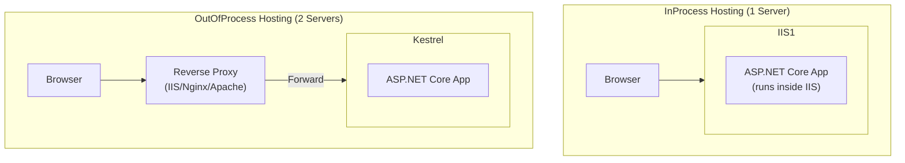
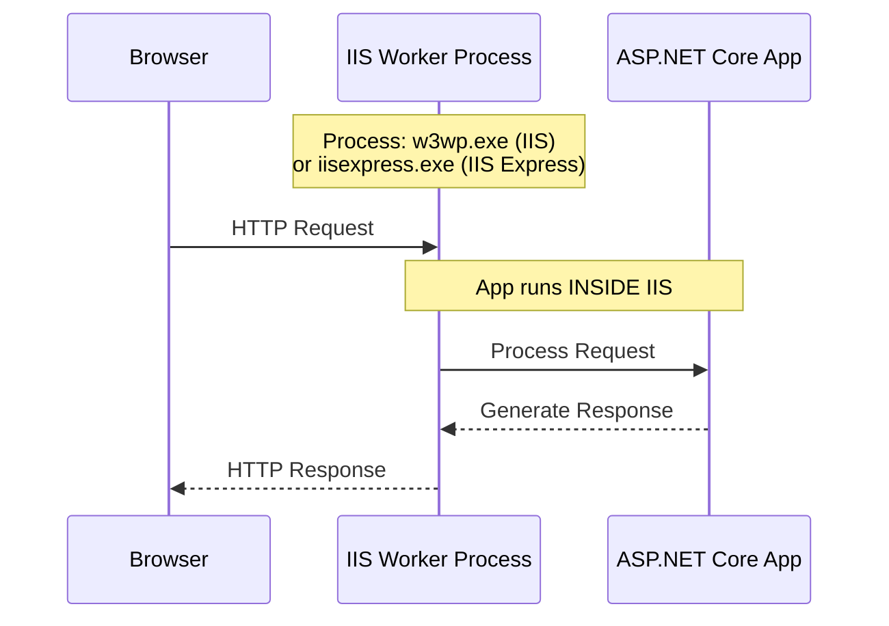
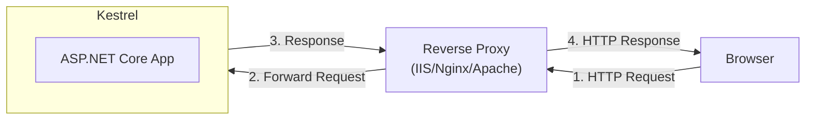
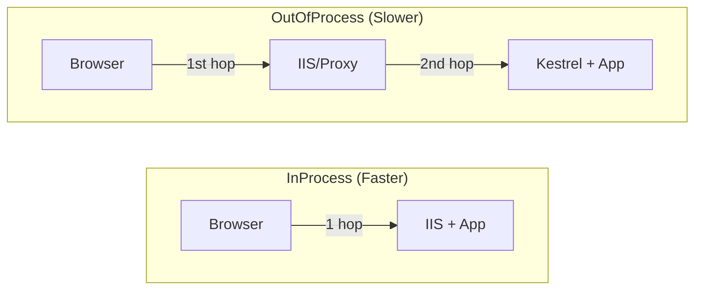

# 📚 Hosting Models - InProcess vs OutOfProcess

## 🎯 Introduction

ASP.NET Core supports two hosting models: **InProcess** and **OutOfProcess**. Understanding these models is crucial for deployment, performance optimization, and troubleshooting. This note covers everything from the PPT presentation on hosting models.

---

## 📋 Table of Contents
1. [Overview of Hosting Models](#overview-of-hosting-models)
2. [InProcess Hosting Detailed](#inprocess-hosting-detailed)
3. [OutOfProcess Hosting Detailed](#outofprocess-hosting-detailed)
4. [IIS Express Deep Dive](#iis-express-deep-dive)
5. [Performance Comparison](#performance-comparison)
6. [Configuration Methods](#configuration-methods)
7. [Complete Configuration Table](#complete-configuration-table)
8. [Practical Examples](#practical-examples)
9. [Key Takeaways](#key-takeaways)

---

## 🔷 Overview of Hosting Models

### What Happens in ASP.NET Core?

When we create a new ASP.NET Core Web application using any template, by default the project file is created with **InProcess hosting** which is used for hosting the application in IIS or IIS Express scenarios.

### Architecture Comparison



### Quick Comparison Summary

| Feature | InProcess | OutOfProcess |
|---------|-----------|--------------|
| **Number of Servers** | 1 | 2 |
| **Performance** | ✅ Higher throughput | Lower (proxy overhead) |
| **Worker Process (IIS)** | `w3wp.exe` | Project name / `dotnet.exe` |
| **Worker Process (IIS Express)** | `iisexpress.exe` | Project name |
| **Cross-Platform** | ❌ Windows only | ✅ Windows, Linux, macOS |
| **Default in ASP.NET Core** | ✅ Yes | No |
| **Internal Server** | IIS HTTP Server | Kestrel |
| **External Server** | None | IIS, Nginx, or Apache |

---

## 🔷 InProcess Hosting Detailed

### What is InProcess Hosting?

In **InProcess** hosting, the ASP.NET Core application runs **inside** the IIS worker process (`w3wp.exe` for IIS, `iisexpress.exe` for IIS Express).

### How It Works - Behind the Scenes

When `WebApplication.CreateBuilder()` sees the value as **InProcess** for the `AspNetCoreHostingModel` element in the project file:

1. Behind the scene, the `CreateBuilder()` method internally calls the `UseIIS()` method
2. The application is hosted inside the IIS worker process
3. For IIS: worker process is `w3wp.exe`
4. For IIS Express: worker process is `iisexpress.exe`



### How to Verify InProcess Hosting?

**Method 1: Project Properties in Visual Studio**
1. Right-click on your project
2. Select "Properties"
3. Go to "Debug" tab
4. Check "Hosting Model" dropdown - should show "Default (InProcess)"

**Method 2: Check the Project File (.csproj)**
```xml
<Project Sdk="Microsoft.NET.Sdk.Web">
  <PropertyGroup>
    <TargetFramework>net7.0</TargetFramework>
    <!-- InProcess is the default -->
    <AspNetCoreHostingModel>InProcess</AspNetCoreHostingModel>
  </PropertyGroup>
</Project>
```

### Verify Process Name Programmatically

You can verify the hosting model by displaying the worker process name:

```csharp
// Program.cs
var builder = WebApplication.CreateBuilder(args);
var app = builder.Build();

app.MapGet("/", async context =>
{
    string processName = System.Diagnostics.Process.GetCurrentProcess().ProcessName;
    await context.Response.WriteAsync($"Worker Process Name: {processName}");
});

app.Run();
```

**Expected Output:**
| Server | Process Name Displayed |
|--------|----------------------|
| IIS Express with InProcess | `iisexpress` |
| Full IIS with InProcess | `w3wp` |
| Kestrel (OutOfProcess) | Project name (e.g., `MyWebApp`) |
| `dotnet run` CLI | `dotnet` or project name |

---

## 🔷 OutOfProcess Hosting Detailed

### What is OutOfProcess Hosting?

In **OutOfProcess** hosting:
- **Kestrel** is the internal web server running the ASP.NET Core application
- **IIS/Nginx/Apache** acts as a reverse proxy, forwarding requests to Kestrel

### Architecture with OutOfProcess



### How to Configure OutOfProcess Hosting

**Method 1: In Project File (.csproj)**
```xml
<Project Sdk="Microsoft.NET.Sdk.Web">
  <PropertyGroup>
    <TargetFramework>net7.0</TargetFramework>
    <AspNetCoreHostingModel>OutOfProcess</AspNetCoreHostingModel>
  </PropertyGroup>
</Project>
```

**Method 2: Visual Studio Project Properties**
1. Right-click project → Properties
2. Debug tab
3. Hosting Model dropdown → Select "Out of Process"

### Testing OutOfProcess

When running with OutOfProcess hosting:

```bash
# Run from command line
dotnet run
```

Navigate to `http://localhost:5000` and check the worker process:
- **Output:** Process name will be your **project name** (not `iisexpress` or `w3wp`)

---

## 🔷 IIS Express Deep Dive

### What is IIS Express?

IIS Express is a **lightweight, self-contained version of IIS** that:
- Is optimized for web application development
- Used only in development, NOT in production
- In production, we generally use full IIS

> [!NOTE]
> By default, Visual Studio uses IIS Express when you run an application using F5 or Ctrl+F5.

### IIS Express vs Full IIS

| Feature | IIS Express | Full IIS |
|---------|-------------|----------|
| **Use Case** | Development only | Production |
| **Installation** | Bundled with Visual Studio | Windows Server feature |
| **Configuration** | launchSettings.json | IIS Manager |
| **Process** | `iisexpress.exe` | `w3wp.exe` |

---

## 🔷 Performance Comparison

### Why InProcess Hosting Gives Better Performance?

In **OutOfProcess hosting**, there are **2 web servers**:
1. **Internal web server**: Kestrel
2. **External web server**: IIS, Nginx, or Apache

With **InProcess hosting**, there is only **1 web server** (IIS).



### Performance Factors

| Factor | InProcess | OutOfProcess |
|--------|-----------|--------------|
| **Network Hops** | 1 | 2 |
| **Inter-process Communication** | None | Required |
| **Request Throughput** | ✅ Higher | Lower |
| **Latency** | ✅ Lower | Higher |
| **Overhead** | Minimal | Proxy overhead |

> [!IMPORTANT]
> From a performance point of view, **InProcess hosting delivers significantly higher request throughput** than OutOfProcess hosting because:
> - No performance penalty for navigating requests between internal and external web servers
> - No inter-process communication overhead

---

## 🔷 Configuration Methods

### Method 1: Edit Project File (.csproj)

Right-click on your project in Solution Explorer → "Edit Project File":

```xml
<!-- InProcess (Default, Faster) -->
<AspNetCoreHostingModel>InProcess</AspNetCoreHostingModel>

<!-- OutOfProcess (Cross-Platform) -->
<AspNetCoreHostingModel>OutOfProcess</AspNetCoreHostingModel>
```

### Method 2: Visual Studio Properties

1. Right-click project → Properties
2. Select "Debug" tab
3. Hosting Model dropdown has 3 values:
   - **Default (InProcess)**
   - **In Process**
   - **Out of Process**

---

## 🔷 Complete Configuration Table

This table shows which servers are used based on CommandName and Hosting Model:

| Profile | CommandName | AspNetCoreHostingModel | Internal Server | External Server | Total Servers |
|---------|-------------|------------------------|-----------------|-----------------|---------------|
| http/https | Project | (Ignored) | Kestrel | None | 1 |
| IIS Express | IISExpress | InProcess | IIS Express | None | 1 |
| IIS Express | IISExpress | OutOfProcess | Kestrel | IIS Express | 2 |
| IIS | IIS | InProcess | IIS | None | 1 |
| IIS | IIS | OutOfProcess | Kestrel | IIS | 2 |

### When CommandName is "Project"

When using `commandName: "Project"` in launchSettings.json:
- **Hosting model setting is IGNORED**
- Kestrel is ALWAYS used
- Only **1 server** regardless of `AspNetCoreHostingModel` value

---

## 🔷 Practical Examples

### Example 1: Display Process Name

```csharp
// Program.cs - Complete Example
namespace MyWebApp
{
    public class Program
    {
        public static void Main(string[] args)
        {
            var builder = WebApplication.CreateBuilder(args);
            builder.Services.AddControllersWithViews();
            
            var app = builder.Build();

            if (!app.Environment.IsDevelopment())
            {
                app.UseExceptionHandler("/Home/Error");
                app.UseHsts();
            }

            app.UseHttpsRedirection();
            app.UseStaticFiles();
            app.UseRouting();
            app.UseAuthorization();

            // Display process name to verify hosting model
            app.MapGet("/process", async context =>
            {
                string processName = System.Diagnostics.Process.GetCurrentProcess().ProcessName;
                await context.Response.WriteAsync($"Worker Process Name: {processName}");
            });

            app.MapControllerRoute(
                name: "default",
                pattern: "{controller=Home}/{action=Index}/{id?}");

            app.Run();
        }
    }
}
```

### Example 2: Using Endpoints to Display Process

```csharp
app.UseEndpoints(endpoints =>
{
    endpoints.MapGet("/", async context =>
    {
        await context.Response.WriteAsync(
            "Worker Process Name: " + 
            System.Diagnostics.Process.GetCurrentProcess().ProcessName
        );
    });
});
```

---

## 🔷 Key Takeaways

> [!IMPORTANT]
> **Must Remember Points for Exams/Interviews:**

### Quick Reference Q&A

| Question | Answer |
|----------|--------|
| Default hosting model in ASP.NET Core? | **InProcess** |
| How many servers in InProcess? | **1** (IIS only) |
| How many servers in OutOfProcess? | **2** (Kestrel + Reverse Proxy) |
| Which is faster? | **InProcess** (no proxy hop) |
| InProcess worker process for IIS? | `w3wp.exe` |
| InProcess worker process for IIS Express? | `iisexpress.exe` |
| OutOfProcess internal server? | **Kestrel** |
| OutOfProcess external servers? | **IIS**, **Nginx**, or **Apache** |
| What method does CreateBuilder() call for InProcess? | `UseIIS()` |
| What is IIS Express? | Lightweight, self-contained IIS for development |

### Configuration Summary

```xml
<!-- For InProcess (Default, Windows Only, Faster) -->
<AspNetCoreHostingModel>InProcess</AspNetCoreHostingModel>

<!-- For OutOfProcess (Cross-Platform, 2 Servers) -->
<AspNetCoreHostingModel>OutOfProcess</AspNetCoreHostingModel>
```

### Fill in the Blanks (From PPT)

1. In case of InProcess hosting, behind the scene the CreateBuilder() method internally calls the **`UseIIS()`** method.
2. Then host the application inside the IIS worker process (i.e. **`w3wp.exe`** for IIS and **`iisexpress.exe`** for IIS Express).
3. In the case of OutOfProcess hosting, there are **2** web servers.
4. The internal web server is called **Kestrel** and the external web server can be **IIS**, **Nginx**, or **Apache**.

### Decision Guide

| Scenario | Recommended Hosting |
|----------|---------------------|
| Windows production with IIS | **InProcess** |
| Linux/macOS deployment | **OutOfProcess** (Kestrel + Nginx) |
| Maximum performance on Windows | **InProcess** |
| Cross-platform development | **OutOfProcess** |
| Docker containers | **OutOfProcess** (Kestrel only) |

---

## 📝 Practice Questions

1. What is InProcess hosting and how does it work?
2. Why does InProcess hosting give better performance than OutOfProcess?
3. How many web servers are used in OutOfProcess hosting? Name them.
4. What is IIS Express and when should you use it?
5. How do you configure InProcess hosting in the project file?
6. What is the worker process name for IIS Express in InProcess mode?

---

*Previous: [07 - ASP.NET Core Project Structure](./07_ASPNETCore_Project_Structure.md)*

*Next: [09 - Kestrel Web Server](./09_Kestrel_Web_Server.md)*
