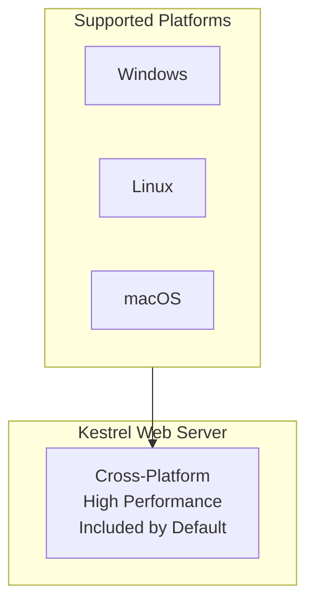
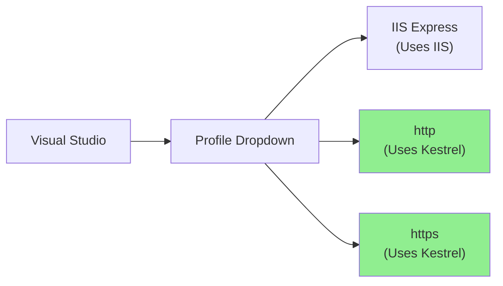
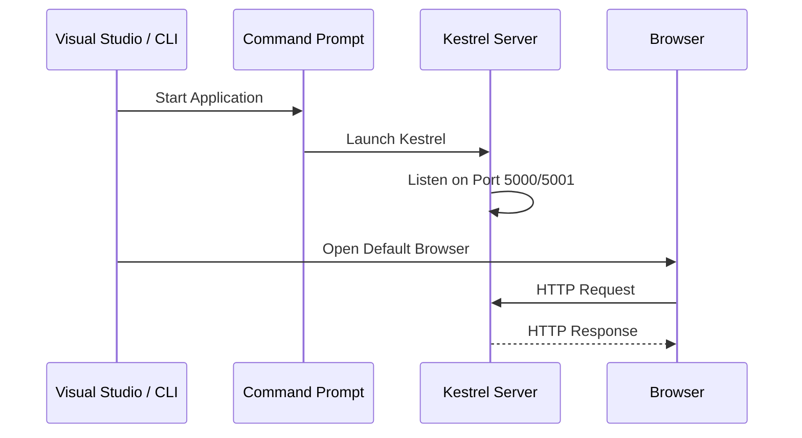
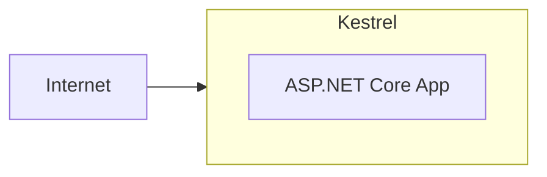
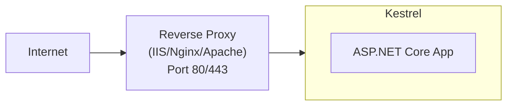

# 📚 Kestrel Web Server

## 🎯 Introduction

**Kestrel** is the cross-platform web server for ASP.NET Core. It's included by default and is the recommended web server for ASP.NET Core applications. This note covers all aspects of Kestrel from the PPT presentations.

---

## 📋 Table of Contents
1. [What is Kestrel?](#what-is-kestrel)
2. [Kestrel Features and Capabilities](#kestrel-features-and-capabilities)
3. [How to Run with Kestrel](#how-to-run-with-kestrel)
4. [launchSettings.json Profiles for Kestrel](#launchsettingsjson-profiles-for-kestrel)
5. [Running with .NET Core CLI](#running-with-net-core-cli)
6. [Port Configuration](#port-configuration)
7. [Kestrel as Edge Server vs Behind Proxy](#kestrel-as-edge-server-vs-behind-proxy)
8. [Key Takeaways](#key-takeaways)

---

## 🔷 What is Kestrel?

### Definition

As we already discussed, ASP.NET Core is a **cross-platform framework**. It means it supports developing and running applications on different types of operating systems such as **Windows**, **Linux**, or **Mac**.

**Kestrel** is the **cross-platform web server** for ASP.NET Core applications that:
- Supports **all platforms** and versions that ASP.NET Core supports
- Is included as the **internal web server** by default in .NET Core applications
- Can be used as an **edge server** (internet-facing) OR behind a reverse proxy



### Kestrel as Edge Server

When Kestrel is used as an **edge server** (internet-facing web server):
- It directly processes incoming HTTP requests from clients
- The **process name** used to host and run the application is the **project name**

### How Is This Different from IIS Express?

By default, Visual Studio uses **IIS Express** to host and run ASP.NET Core applications:
- Process name is `iisexpress`
- Only works on Windows

With **Kestrel**:
- Process name is the **project name** or `dotnet`
- Works on **all platforms**

---

## 🔷 Kestrel Features and Capabilities

### Core Features

| Feature | Description |
|---------|-------------|
| **Cross-Platform** | Windows, Linux, macOS |
| **High Performance** | Async I/O, minimal overhead |
| **HTTP/1.1, HTTP/2, HTTP/3** | Modern protocol support |
| **HTTPS** | Built-in TLS support |
| **WebSockets** | Real-time communication |
| **Request Limits** | Configurable limits for security |

### Performance Characteristics

- **Asynchronous I/O** - Non-blocking operations
- **Minimal memory footprint** - Efficient resource usage
- **Connection pooling** - Reuses connections
- **Keep-alive connections** - Reduces connection overhead

---

## 🔷 How to Run with Kestrel

### Method 1: Visual Studio - Select HTTP/HTTPS Profile

1. In Visual Studio, look at the toolbar dropdown next to the Run button
2. You'll see multiple profiles (from launchSettings.json):
   - **IIS Express** → Uses IIS Express server
   - **http** → Uses Kestrel server (HTTP)
   - **https** → Uses Kestrel server (HTTPS)
3. Select **http** or **https** profile
4. Press F5 or Ctrl+F5



### Method 2: .NET Core CLI

```bash
# Navigate to project folder
cd D:\Projects\Core\MyWebApplication

# Run with Kestrel
dotnet run
```

**Output:**
```
Building...
info: Microsoft.Hosting.Lifetime[14]
      Now listening on: http://localhost:5000
info: Microsoft.Hosting.Lifetime[14]
      Now listening on: https://localhost:5001
info: Microsoft.Hosting.Lifetime[0]
      Application started. Press Ctrl+C to shut down.
```

### What Happens When You Run with Kestrel?

When using the HTTP profile or `dotnet run`:

1. **Command prompt launches** - hosts the application using Kestrel
2. **URL and port** are from the profile in launchSettings.json
3. **Default browser** opens to that URL



---

## 🔷 launchSettings.json Profiles for Kestrel

### File Location

The `launchSettings.json` file is located inside the **Properties folder** of your application.

### Structure for Kestrel Profiles

```json
{
  "profiles": {
    "http": {
      "commandName": "Project",
      "dotnetRunMessages": true,
      "launchBrowser": true,
      "applicationUrl": "http://localhost:5000",
      "environmentVariables": {
        "ASPNETCORE_ENVIRONMENT": "Development"
      }
    },
    "https": {
      "commandName": "Project",
      "dotnetRunMessages": true,
      "launchBrowser": true,
      "applicationUrl": "https://localhost:5001;http://localhost:5000",
      "environmentVariables": {
        "ASPNETCORE_ENVIRONMENT": "Development"
      }
    },
    "IIS Express": {
      "commandName": "IISExpress",
      "launchBrowser": true,
      "environmentVariables": {
        "ASPNETCORE_ENVIRONMENT": "Development"
      }
    }
  }
}
```

### Profile Comparison

| Profile | commandName | Server Used | When Used |
|---------|-------------|-------------|-----------|
| **http** | `Project` | Kestrel | Select "http" in VS or `dotnet run` |
| **https** | `Project` | Kestrel | Select "https" in VS |
| **IIS Express** | `IISExpress` | IIS Express | Select "IIS Express" in VS |

> [!IMPORTANT]
> When `commandName` is **"Project"**, Kestrel is ALWAYS used regardless of the `AspNetCoreHostingModel` setting in the project file.

---

## 🔷 Running with .NET Core CLI

### What is .NET Core CLI?

The **CLI** stands for **Command Line Interface**. When we run an ASP.NET Core application using the .NET Core CLI, the .NET Core runtime uses **Kestrel** as the web server.

### Steps to Run with CLI

**Step 1:** Open Command Prompt (Windows) or Terminal (Linux/Mac)

**Step 2:** Navigate to your project folder
```bash
cd D:\Projects\Core\FirstCoreWebApplication\FirstCoreWebApplication
```

**Step 3:** Execute the `dotnet run` command
```bash
dotnet run
```

**Step 4:** Access the application
- Open browser
- Navigate to `http://localhost:5000`

### Verify Process Name with CLI

When running with `dotnet run`:

```csharp
app.MapGet("/", async context =>
{
    string processName = System.Diagnostics.Process.GetCurrentProcess().ProcessName;
    await context.Response.WriteAsync($"Worker Process Name: {processName}");
});
```

**Output:** `Worker Process Name: dotnet` (or your project name)

---

## 🔷 Port Configuration

### Default Ports

| Protocol | Default Port |
|----------|--------------|
| HTTP | 5000 |
| HTTPS | 5001 |

### Changing Port in launchSettings.json

If you want to change the port number for Kestrel Server:

**Original:**
```json
"applicationUrl": "http://localhost:5000"
```

**Changed to port 8080:**
```json
"applicationUrl": "http://localhost:8080"
```

### Complete Example with Custom Port

```json
{
  "profiles": {
    "http": {
      "commandName": "Project",
      "dotnetRunMessages": true,
      "launchBrowser": true,
      "applicationUrl": "http://localhost:8080",
      "environmentVariables": {
        "ASPNETCORE_ENVIRONMENT": "Development"
      }
    }
  }
}
```

### Changing Port via Command Line

```bash
# Override port at runtime
dotnet run --urls "http://localhost:9000"

# Multiple URLs
dotnet run --urls "http://localhost:9000;https://localhost:9001"
```

### Changing Port in Program.cs

```csharp
var builder = WebApplication.CreateBuilder(args);
var app = builder.Build();

// Configure custom ports
app.Urls.Add("http://localhost:3000");
app.Urls.Add("https://localhost:3001");

app.MapGet("/", () => "Hello World!");
app.Run();
```

---

## 🔷 Kestrel as Edge Server vs Behind Proxy

### Scenario 1: Kestrel as Edge Server

Kestrel directly handles all internet traffic:



**Use Cases:**
- Development
- Internal applications
- Microservices behind API Gateway

### Scenario 2: Kestrel Behind Reverse Proxy

Reverse proxy handles internet traffic, forwards to Kestrel:



**Use Cases:**
- Production web applications
- When you need SSL termination at proxy level
- Load balancing
- URL rewriting

---

## 🔷 Key Takeaways

> [!IMPORTANT]
> **Must Remember Points:**

### Quick Reference Q&A

| Question | Answer |
|----------|--------|
| What is Kestrel? | Cross-platform web server for ASP.NET Core |
| Default HTTP port? | **5000** |
| Default HTTPS port? | **5001** |
| Command to run with Kestrel? | `dotnet run` |
| Where is port configured? | `launchSettings.json` under "http" profile |
| launchSettings.json location? | **Properties** folder |
| What does `commandName: "Project"` mean? | Uses Kestrel server |
| Process name when using Kestrel? | Project name or `dotnet` |

### Fill in the Blanks (From PPT)

1. launchSettings.json file is present inside the **Properties** folder of your application.
2. When you run an ASP.NET Core application using .NET Core CLI, the .NET Core runtime uses **Kestrel** as the web server.
3. The Kestrel is the **cross-platform** web server for ASP.NET Core applications.
4. Kestrel Web Server can be used as an **edge server** (internet-facing web server).

### Quick Commands

```bash
# Run with default Kestrel settings
dotnet run

# Run with custom port
dotnet run --urls "http://localhost:8080"

# Run production build
dotnet MyApp.dll
```

---

## 📝 Practice Questions

1. What is the Kestrel Web Server and what are its main features?
2. How do you configure the port number for Kestrel Server?
3. Where is the launchSettings.json file located?
4. What happens when you use `dotnet run` command?
5. What is the difference between running with IIS Express and Kestrel?

---

*Previous: [08 - Hosting Models](./08_Hosting_Models.md)*

*Next: [10 - launchSettings.json Configuration](./10_LaunchSettings_Configuration.md)*
