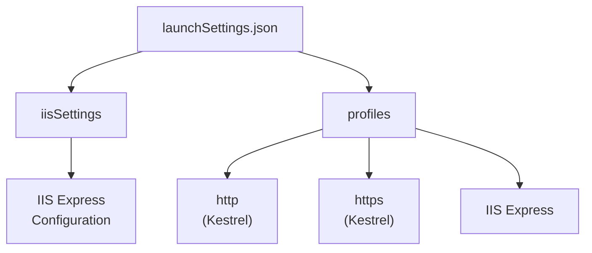
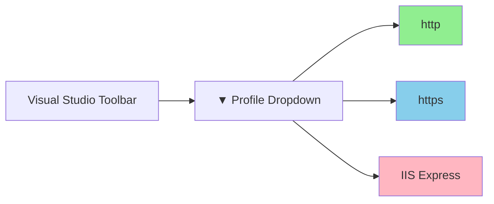

# 📚 launchSettings.json Configuration

## 🎯 Introduction

The **launchSettings.json** file configures how Visual Studio launches and debugs ASP.NET Core applications. It's located in the `Properties` folder and contains settings that are **only used during development**. This note covers all aspects from the PPT presentation.

---

## 📋 Table of Contents
1. [Understanding launchSettings.json](#understanding-launchsettingsjson)
2. [File Location and Structure](#file-location-and-structure)
3. [Profiles Section Deep Dive](#profiles-section-deep-dive)
4. [CommandName Property Values](#commandname-property-values)
5. [IIS Settings Section](#iis-settings-section)
6. [Environment Variables](#environment-variables)
7. [Key Takeaways](#key-takeaways)

---

## 🔷 Understanding launchSettings.json

### What is launchSettings.json?

The `launchSettings.json` file contains settings that are going to be used when we run the .NET Core application either:
- **From Visual Studio** (F5 or Ctrl+F5)
- **Using .NET Core CLI** (`dotnet run`)

### Important Points

> [!IMPORTANT]
> **Critical Information:**
> 1. This file is **only used on the local development machine**
> 2. This file is **NOT required** when publishing to a production server
> 3. For production settings, use **appsettings.json**
> 4. Generally, configuration settings are stored in **appsettings.json** file

### Development vs Production

| launchSettings.json | appsettings.json |
|---------------------|------------------|
| Development only | Development AND Production |
| Not deployed to production | Deployed to production |
| Launch/debug settings | Application configuration |
| Visual Studio specific | Used by application code |

---

## 🔷 File Location and Structure

### Location

```
MyProject/
├── Properties/
│   └── launchSettings.json    ← HERE
├── Controllers/
├── Models/
├── Views/
├── wwwroot/
├── Program.cs
└── appsettings.json
```

### Complete Structure

```json
{
  "$schema": "https://json.schemastore.org/launchsettings.json",
  "iisSettings": {
    "windowsAuthentication": false,
    "anonymousAuthentication": true,
    "iisExpress": {
      "applicationUrl": "http://localhost:60211",
      "sslPort": 44389
    }
  },
  "profiles": {
    "http": {
      "commandName": "Project",
      "dotnetRunMessages": true,
      "launchBrowser": true,
      "applicationUrl": "http://localhost:5000",
      "environmentVariables": {
        "ASPNETCORE_ENVIRONMENT": "Development"
      }
    },
    "https": {
      "commandName": "Project",
      "dotnetRunMessages": true,
      "launchBrowser": true,
      "applicationUrl": "https://localhost:5001;http://localhost:5000",
      "environmentVariables": {
        "ASPNETCORE_ENVIRONMENT": "Development"
      }
    },
    "IIS Express": {
      "commandName": "IISExpress",
      "launchBrowser": true,
      "environmentVariables": {
        "ASPNETCORE_ENVIRONMENT": "Development"
      }
    }
  }
}
```

### Two Main Sections



---

## 🔷 Profiles Section Deep Dive

### What are Profiles?

The **profiles** section contains different launch configurations. You can see these profiles in Visual Studio's dropdown next to the Run button.

### Profile Properties

| Property | Description | Example |
|----------|-------------|---------|
| `commandName` | How to launch the application | `"Project"`, `"IISExpress"`, `"IIS"` |
| `launchBrowser` | Whether to open browser on start | `true` or `false` |
| `applicationUrl` | URL(s) to listen on | `"http://localhost:5000"` |
| `environmentVariables` | Environment variables to set | `{"ASPNETCORE_ENVIRONMENT": "Development"}` |
| `dotnetRunMessages` | Show dotnet run output messages | `true` or `false` |

### Visual Studio Integration

In Visual Studio, you can find the profiles as shown:



### Which Profile is Used When?

| How You Run | Profile Used |
|-------------|--------------|
| Press F5 / Ctrl+F5 in VS | **Selected in dropdown** |
| `dotnet run` command | Profile with `commandName: "Project"` |
| `dotnet run --launch-profile "IIS Express"` | Specified profile |

> [!NOTE]
> When you run using **Visual Studio** (pressing CTRL+F5 or just F5), by default the profile with `"commandName": "IISExpress"` is used.
>
> When you run using **.NET Core CLI** (`dotnet run` command), the profile with `"commandName": "Project"` is used.

---

## 🔷 CommandName Property Values

### Three Possible Values

The `commandName` property can have one of these values:

| Value | Description | Server Used |
|-------|-------------|-------------|
| `Project` | Run using Kestrel | Kestrel |
| `IISExpress` | Run using IIS Express | IIS Express |
| `IIS` | Run using full IIS | IIS |

### How CommandName Affects Hosting

The `CommandName` property value along with the `AspNetCoreHostingModel` element determines which servers are used:

| commandName | AspNetCoreHostingModel | Internal Server | External Server | Total Servers |
|-------------|------------------------|-----------------|-----------------|---------------|
| `Project` | (Ignored) | Kestrel | None | 1 |
| `IISExpress` | InProcess | IIS Express | None | 1 |
| `IISExpress` | OutOfProcess | Kestrel | IIS Express | 2 |
| `IIS` | InProcess | IIS | None | 1 |
| `IIS` | OutOfProcess | Kestrel | IIS | 2 |

> [!IMPORTANT]
> When `commandName` is **"Project"**, the `AspNetCoreHostingModel` setting is **IGNORED** and Kestrel is always used!

---

## 🔷 IIS Settings Section

### Structure

```json
"iisSettings": {
  "windowsAuthentication": false,
  "anonymousAuthentication": true,
  "iisExpress": {
    "applicationUrl": "http://localhost:60211",
    "sslPort": 44389
  }
}
```

### Properties Explained

| Property | Description |
|----------|-------------|
| `windowsAuthentication` | Enable Windows Auth (domain login) |
| `anonymousAuthentication` | Allow anonymous access |
| `applicationUrl` | URL for IIS Express (HTTP) |
| `sslPort` | Port for HTTPS |

### URL Usage

| Profile Selected | URL Used |
|------------------|----------|
| **IIS Express** | From `iisSettings.iisExpress.applicationUrl` |
| **http** (Kestrel) | From `profiles.http.applicationUrl` |
| **https** (Kestrel) | From `profiles.https.applicationUrl` |

---

## 🔷 Environment Variables

### Setting Environment Variables

```json
"environmentVariables": {
  "ASPNETCORE_ENVIRONMENT": "Development",
  "ASPNETCORE_URLS": "http://localhost:5000",
  "MyCustomKey": "Custom Value"
}
```

### Common Environment Variables

| Variable | Purpose | Common Values |
|----------|---------|---------------|
| `ASPNETCORE_ENVIRONMENT` | Set environment mode | `Development`, `Staging`, `Production` |
| `ASPNETCORE_URLS` | Override listening URLs | `http://localhost:5000` |
| Custom variables | Your own settings | Any value |

### Environment Values

| Environment | Use Case | Behavior |
|-------------|----------|----------|
| `Development` | Local development | Detailed errors, developer exception page |
| `Staging` | Pre-production testing | Similar to production |
| `Production` | Live deployment | Minimal errors, performance optimized |

### Checking Environment in Code

```csharp
var builder = WebApplication.CreateBuilder(args);
var app = builder.Build();

if (app.Environment.IsDevelopment())
{
    app.UseDeveloperExceptionPage();
}
else if (app.Environment.IsStaging())
{
    // Staging specific code
}
else if (app.Environment.IsProduction())
{
    app.UseExceptionHandler("/Error");
}
```

---

## 🔷 Complete Examples

### Example 1: Adding Custom Environment Variable

```json
{
  "profiles": {
    "IIS Express": {
      "commandName": "IISExpress",
      "launchBrowser": true,
      "environmentVariables": {
        "ASPNETCORE_ENVIRONMENT": "Development",
        "MyCustomKey": "Value from launchSettings"
      }
    }
  }
}
```

### Example 2: Multiple URLs for HTTPS Profile

```json
{
  "profiles": {
    "https": {
      "commandName": "Project",
      "launchBrowser": true,
      "applicationUrl": "https://localhost:5001;http://localhost:5000",
      "environmentVariables": {
        "ASPNETCORE_ENVIRONMENT": "Development"
      }
    }
  }
}
```

### Example 3: Running Specific Profile via CLI

```bash
# Run with default profile
dotnet run

# Run with specific profile
dotnet run --launch-profile "IIS Express"

# Run with custom URL (overrides profile)
dotnet run --urls "http://localhost:8080"
```

---

## 🔷 Key Takeaways

> [!IMPORTANT]
> **Must Remember Points:**

### Quick Reference Q&A

| Question | Answer |
|----------|--------|
| Where is launchSettings.json located? | **Properties** folder |
| Is it used in production? | **No**, development only |
| What are the 3 commandName values? | `Project`, `IISExpress`, `IIS` |
| What does `commandName: "Project"` use? | **Kestrel** server |
| What does `commandName: "IISExpress"` use? | **IIS Express** server |
| Default environment in development? | `Development` |
| Which profile is used with F5 in VS? | Selected in dropdown (default: IIS Express) |
| Which profile is used with `dotnet run`? | Profile with `commandName: "Project"` |

### Fill in the Blanks (From PPT)

1. The launchSettings.json file is present inside the **Properties** folder.
2. This file is only used within the **local development machine**.
3. This file is **not required** when publishing to production.
4. For production settings, use the **appsettings.json** file.
5. When you run using F5 in Visual Studio, by default the profile with `commandName: "**IISExpress**"` is used.
6. When you run using .NET Core CLI, the profile with `commandName: "**Project**"` is used.

### Key Code References

```json
// For Kestrel (commandName = Project)
"commandName": "Project"

// For IIS Express
"commandName": "IISExpress"

// Set environment
"ASPNETCORE_ENVIRONMENT": "Development"

// Set URL
"applicationUrl": "http://localhost:8080"
```

---

## 📝 Practice Questions

1. Where is the launchSettings.json file located in an ASP.NET Core project?
2. Is launchSettings.json used in production? If not, which file should be used?
3. What are the three possible values for the commandName property?
4. Which profile is used when running `dotnet run` from the command line?
5. How do you configure a custom environment variable in launchSettings.json?

---

*Previous: [09 - Kestrel Web Server](./09_Kestrel_Web_Server.md)*

*Next: [11 - appsettings.json Configuration](./11_AppSettings_Configuration.md)*
