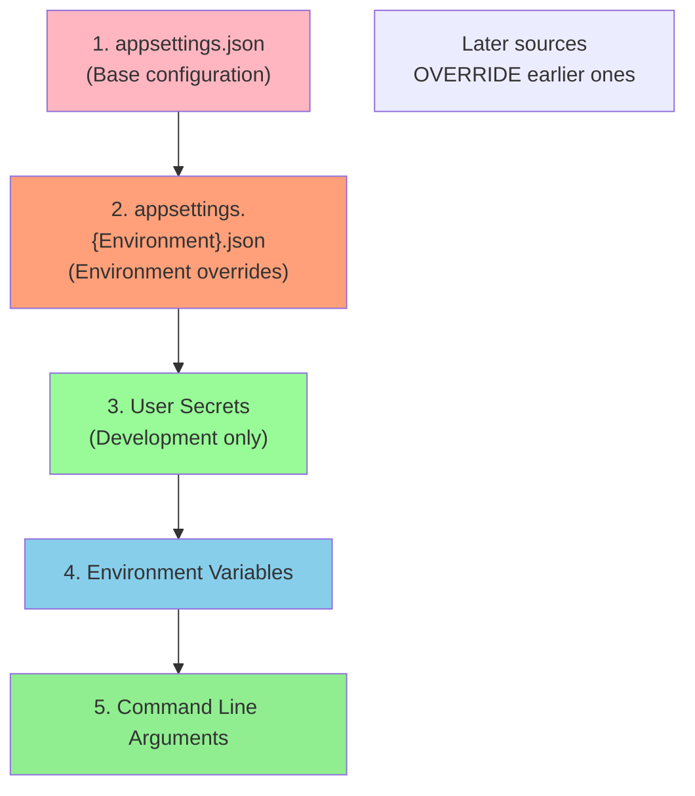
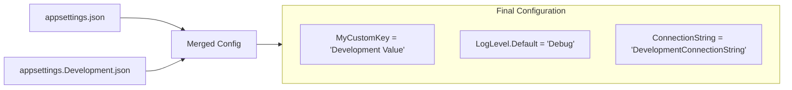

# 📚 appsettings.json and Configuration

## 🎯 Introduction

**appsettings.json** is the primary configuration file for ASP.NET Core applications. Unlike launchSettings.json which is only for development, appsettings.json is used in **both development and production**. This note covers all configuration concepts from the PPT presentations.

---

## 📋 Table of Contents
1. [Understanding Configuration in ASP.NET Core](#understanding-configuration-in-aspnet-core)
2. [Configuration Sources Hierarchy](#configuration-sources-hierarchy)
3. [appsettings.json Deep Dive](#appsettingsjson-deep-dive)
4. [Environment-Specific Configuration](#environment-specific-configuration)
5. [Accessing Configuration Values](#accessing-configuration-values)
6. [Configuration Priority (Execution Order)](#configuration-priority-execution-order)
7. [Complete Working Examples](#complete-working-examples)
8. [Key Takeaways](#key-takeaways)

---

## 🔷 Understanding Configuration in ASP.NET Core

### Configuration vs launchSettings

| File | Purpose | Used In |
|------|---------|---------|
| `launchSettings.json` | Launch/debug settings | Development ONLY |
| `appsettings.json` | Application configuration | Development AND Production |

> [!IMPORTANT]
> **Generally, configuration settings should be stored in appsettings.json file**, not in launchSettings.json. Use appsettings.json for:
> - Connection strings
> - API keys
> - Custom settings
> - Logging configuration

### How Configuration Gets Loaded

When we create an ASP.NET Core application, the `WebApplication.CreateBuilder()` method:
1. Creates a configuration object
2. Reads configuration from multiple sources
3. Makes it available to the application

---

## 🔷 Configuration Sources Hierarchy

### Default Configuration Sources

ASP.NET Core reads configuration from multiple sources in a specific order:



### Priority Order (From PPT)

Configuration is read in the following order, and each subsequent source **overrides** the previous:

1. **appsettings.json** - First (lowest priority)
2. **appsettings.{Environment}.json** - e.g., appsettings.Development.json
3. **User secrets** - stored on local machine (development only)
4. **Environment variables** - system-level
5. **Command-line arguments** - highest priority

> [!NOTE]
> The values in the configuration system can be overridden by other configuration sources. Consider the scenario where we have the same value in both appsettings.json and as a command-line argument. In that case, the command line argument value will be used.

---

## 🔷 appsettings.json Deep Dive

### Default Structure

```json
{
  "Logging": {
    "LogLevel": {
      "Default": "Information",
      "Microsoft": "Warning",
      "Microsoft.Hosting.Lifetime": "Information"
    }
  },
  "AllowedHosts": "*"
}
```

### Adding Custom Configuration

```json
{
  "Logging": {
    "LogLevel": {
      "Default": "Information",
      "Microsoft": "Warning",
      "Microsoft.Hosting.Lifetime": "Information"
    }
  },
  "AllowedHosts": "*",
  "ConnectionStrings": {
    "DefaultConnection": "Server=(localdb)\\mssqllocaldb;Database=MyDb;Trusted_Connection=True;",
    "AzureConnection": "Server=azure.database.windows.net;Database=MyDb;User Id=admin;Password=secret;"
  },
  "MyCustomKey": "Custom Value from appsettings.json",
  "ApplicationSettings": {
    "PageSize": 10,
    "EnableCache": true,
    "ApiEndpoint": "https://api.example.com"
  }
}
```

### Section Structure

| Section | Purpose |
|---------|---------|
| `Logging` | Configure logging levels |
| `AllowedHosts` | Restrict hosts (security) |
| `ConnectionStrings` | Database connection strings |
| Custom sections | Your application settings |

---

## 🔷 Environment-Specific Configuration

### How Environment-Specific Files Work

```
MyProject/
├── appsettings.json              ← Base config (always loaded)
├── appsettings.Development.json  ← Loaded in Development
├── appsettings.Staging.json      ← Loaded in Staging
├── appsettings.Production.json   ← Loaded in Production
```

### Example Files

**appsettings.json (Base):**
```json
{
  "Logging": {
    "LogLevel": {
      "Default": "Information"
    }
  },
  "MyCustomKey": "Base Value",
  "ConnectionStrings": {
    "DefaultConnection": "ProductionConnectionString"
  }
}
```

**appsettings.Development.json:**
```json
{
  "Logging": {
    "LogLevel": {
      "Default": "Debug",
      "Microsoft": "Information"
    }
  },
  "MyCustomKey": "Development Value",
  "ConnectionStrings": {
    "DefaultConnection": "DevelopmentConnectionString"
  }
}
```

### Merge Behavior



---

## 🔷 Accessing Configuration Values

### Method 1: Using Indexer

```csharp
var builder = WebApplication.CreateBuilder(args);

// Access simple value
string? myValue = builder.Configuration["MyCustomKey"];

// Access nested value (use colon separator)
string? logLevel = builder.Configuration["Logging:LogLevel:Default"];

// Access connection string
string? connString = builder.Configuration["ConnectionStrings:DefaultConnection"];
```

### Method 2: Using GetConnectionString

```csharp
// Shorthand for ConnectionStrings section
string? connString = builder.Configuration.GetConnectionString("DefaultConnection");

// This is equivalent to:
string? connString = builder.Configuration["ConnectionStrings:DefaultConnection"];
```

### Method 3: Using GetValue<T>

```csharp
// Get typed value
string? value = builder.Configuration.GetValue<string>("MyCustomKey");

// Get with default value
int pageSize = builder.Configuration.GetValue<int>("ApplicationSettings:PageSize", 20);

// Get boolean
bool enableCache = builder.Configuration.GetValue<bool>("ApplicationSettings:EnableCache", false);
```

### Method 4: Binding to Objects

```csharp
// Settings class
public class ApplicationSettings
{
    public int PageSize { get; set; }
    public bool EnableCache { get; set; }
    public string? ApiEndpoint { get; set; }
}

// Bind configuration section to object
var settings = new ApplicationSettings();
builder.Configuration.GetSection("ApplicationSettings").Bind(settings);
```

### Method 5: Using IOptions Pattern

```csharp
// In Program.cs
builder.Services.Configure<ApplicationSettings>(
    builder.Configuration.GetSection("ApplicationSettings"));

// In Controller or Service
public class HomeController : Controller
{
    private readonly ApplicationSettings _settings;
    
    public HomeController(IOptions<ApplicationSettings> options)
    {
        _settings = options.Value;
    }
    
    public IActionResult Index()
    {
        int pageSize = _settings.PageSize;
        return View();
    }
}
```

### Method 6: In Views

```csharp
// Inject configuration in Razor view
@inject Microsoft.Extensions.Configuration.IConfiguration Configuration

<h2>Value: @Configuration["MyCustomKey"]</h2>
```

---

## 🔷 Configuration Priority (Execution Order)

### Override Example

Consider this scenario:

```json
// appsettings.json
{
  "MyKey": "Value from appsettings.json"
}
```

```bash
# Command line
dotnet run MyKey="Value from Command Line"
```

**What value will be used?**

| Source | Value | Priority |
|--------|-------|----------|
| appsettings.json | "Value from appsettings.json" | 1 (lowest) |
| Command line | "Value from Command Line" | 5 (highest) |

**Result:** "Value from Command Line" wins!

### Complete Priority Demonstration

```csharp
// Program.cs - Display which source is used
var builder = WebApplication.CreateBuilder(args);
var app = builder.Build();

app.MapGet("/", async context =>
{
    string? value = builder.Configuration["MyKey"];
    await context.Response.WriteAsync($"MyKey Value: {value}");
});

app.Run();
```

**Test Commands:**
```bash
# Uses appsettings.json value
dotnet run

# Overrides with command line value
dotnet run MyKey="CommandLineValue"

# Overrides with environment variable
set MyKey=EnvironmentValue && dotnet run
```

---

## 🔷 Complete Working Examples

### Example 1: Displaying Configuration in Response

```csharp
// Program.cs
var builder = WebApplication.CreateBuilder(args);
var app = builder.Build();

app.MapGet("/", async context =>
{
    string? myValue = builder.Configuration["MyCustomKey"];
    string? connString = builder.Configuration.GetConnectionString("DefaultConnection");
    
    await context.Response.WriteAsync($"MyCustomKey: {myValue}\n");
    await context.Response.WriteAsync($"Connection: {connString}");
});

app.Run();
```

### Example 2: Type-Safe Configuration

```csharp
// EmailSettings.cs
public class EmailSettings
{
    public string? SmtpServer { get; set; }
    public int Port { get; set; }
    public string? Username { get; set; }
    public string? Password { get; set; }
}

// appsettings.json
{
  "EmailSettings": {
    "SmtpServer": "smtp.example.com",
    "Port": 587,
    "Username": "admin@example.com",
    "Password": "secret"
  }
}

// Program.cs
builder.Services.Configure<EmailSettings>(
    builder.Configuration.GetSection("EmailSettings"));

// In Service
public class EmailService
{
    private readonly EmailSettings _settings;
    
    public EmailService(IOptions<EmailSettings> options)
    {
        _settings = options.Value;
    }
    
    public void SendEmail(string to, string subject, string body)
    {
        // Use _settings.SmtpServer, _settings.Port, etc.
    }
}
```

---

## 🔷 Key Takeaways

> [!IMPORTANT]
> **Must Remember Points:**

### Quick Reference Q&A

| Question | Answer |
|----------|--------|
| For configuration settings, which file to use? | **appsettings.json** |
| Is appsettings.json used in production? | **Yes** |
| Which has higher priority: appsettings.json or command line? | **Command line** |
| How to access nested config? | Use **colon separator**: `"Section:Key"` |
| How to get connection string? | `Configuration.GetConnectionString("Name")` |
| Configuration sources order (low to high)? | appsettings → Environment-specific → User Secrets → Env Vars → Command Line |

### Fill in the Blanks (From PPT)

1. Generally, configuration settings should be stored in **appsettings.json** file.
2. Configuration is read in the following order: **appsettings.json**, **appsettings.{Environment}.json**, User secrets, Environment variables, Command-line arguments.
3. If the same value is in both appsettings.json and command line, the **command line** value will be used.
4. Environment-specific files are named appsettings.**{Environment}**.json.

### Configuration Access Summary

```csharp
// Simple value
Configuration["Key"]

// Nested value
Configuration["Section:SubSection:Key"]

// Connection string
Configuration.GetConnectionString("Name")

// Typed value
Configuration.GetValue<int>("Key")

// With default
Configuration.GetValue<int>("Key", 10)

// Bind to object
Configuration.GetSection("Section").Bind(myObject)
```

---

## 📝 Practice Questions

1. Where should you store configuration settings - launchSettings.json or appsettings.json?
2. What is the order of configuration sources from lowest to highest priority?
3. How do you access a nested configuration value?
4. How do you create environment-specific configuration?
5. What happens when the same key exists in multiple configuration sources?

---

*Previous: [10 - launchSettings.json Configuration](./10_LaunchSettings_Configuration.md)*

*Next: [12 - Request Processing Pipeline](./12_Request_Processing_Pipeline.md)*
