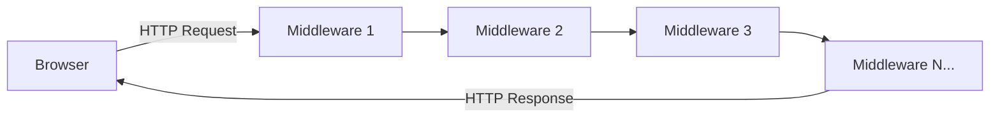
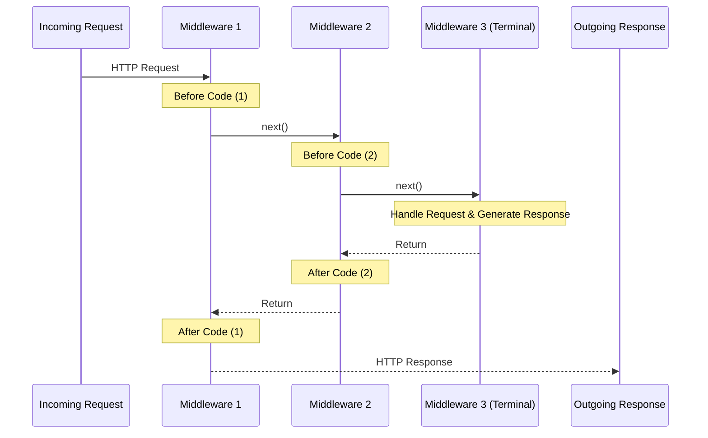
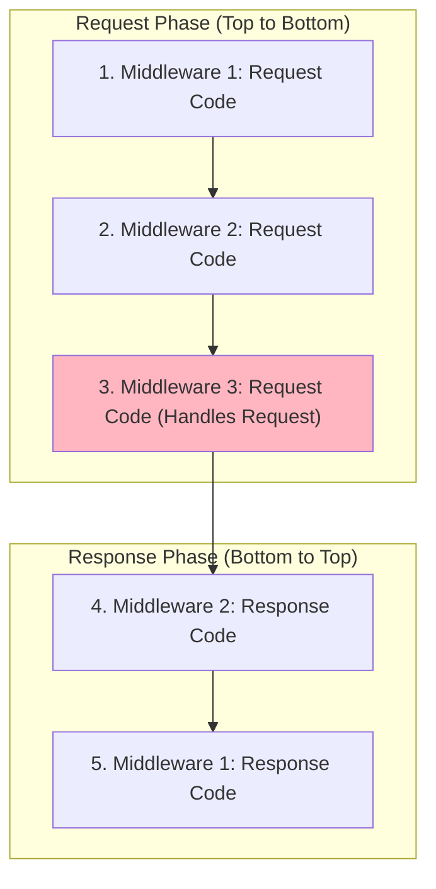
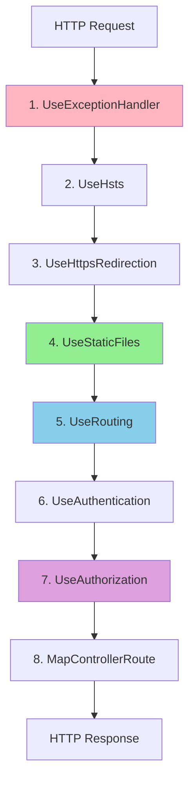

# 📚 Request Processing Pipeline

## 🎯 Introduction

The **HTTP Request Processing Pipeline** in ASP.NET Core is the mechanism by which HTTP requests are processed and responses are generated. Understanding this pipeline is fundamental to building ASP.NET Core applications. This note covers all concepts from the PPT presentation.

---

## 📋 Table of Contents
1. [What is Request Processing Pipeline?](#what-is-request-processing-pipeline)
2. [Request Delegates](#request-delegates)
3. [Middleware in the Pipeline](#middleware-in-the-pipeline)
4. [Pipeline Execution Flow](#pipeline-execution-flow)
5. [Complete Code Examples](#complete-code-examples)
6. [Key Takeaways](#key-takeaways)

---

## 🔷 What is Request Processing Pipeline?

### Definition

In ASP.NET Core, the **HTTP Request Processing Pipeline** is a mechanism by which:
- **Requests** are processed from the time they're received
- **Responses** are generated and sent back to clients

### Pipeline Components

The request processing pipeline consists of a sequence of **request delegates** (middleware) that are called one after the other:



### Key Concept

> [!IMPORTANT]
> Each middleware component in the pipeline is a **request delegate** that can:
> 1. **Handle the request** and generate a response (terminate the pipeline)
> 2. **Pass the request** to the next middleware (continue the pipeline)
> 3. Execute code **before AND after** the next middleware

---

## 🔷 Request Delegates

### What is a Request Delegate?

A **Request Delegate** is simply a delegate that handles an HTTP request. It takes an `HttpContext` parameter and returns a `Task`.

```csharp
// Signature of a Request Delegate
public delegate Task RequestDelegate(HttpContext context);
```

### Components of a Request Delegate

| Component | Description |
|-----------|-------------|
| `HttpContext` | Contains all HTTP-specific information about the request and response |
| `HttpContext.Request` | Access incoming request data (headers, body, query string) |
| `HttpContext.Response` | Write response data |
| `Task` | Allows asynchronous processing |

---

## 🔷 Middleware in the Pipeline

### What is Middleware?

**Middleware** is software that's assembled into an application pipeline to handle requests and responses.

Each middleware in the pipeline:
1. **Chooses** whether to pass the request to the next component
2. Can perform work **before** the next component is invoked
3. Can perform work **after** the next component is invoked

### Middleware Execution Pattern



---

## 🔷 Pipeline Execution Flow

### Understanding the Flow

When a request comes in, it flows through each middleware in the order they are registered. When a response is generated, it flows back through the middleware in **reverse order**.

### Detailed Flow



### Execution Order Explained

Given this pipeline:
```csharp
app.Use(async (context, next) => {
    // Code A (before)
    await next();
    // Code D (after)
});

app.Use(async (context, next) => {
    // Code B (before)
    await next();
    // Code E (after)
});

app.Run(async context => {
    // Code C (terminal)
});
```

**Execution Order:** A → B → C → E → D

| Step | Location | When |
|------|----------|------|
| 1 | Code A | Request enters Middleware 1 |
| 2 | Code B | Request enters Middleware 2 |
| 3 | Code C | Terminal middleware handles request |
| 4 | Code E | Response goes back through Middleware 2 |
| 5 | Code D | Response goes back through Middleware 1 |

---

## 🔷 Complete Code Examples

### Example 1: Basic Pipeline with Output

```csharp
// Program.cs
var builder = WebApplication.CreateBuilder(args);
var app = builder.Build();

// Middleware 1
app.Use(async (context, next) =>
{
    await context.Response.WriteAsync("Middleware1: Incoming Request\n");
    await next();
    await context.Response.WriteAsync("Middleware1: Outgoing Response\n");
});

// Middleware 2
app.Use(async (context, next) =>
{
    await context.Response.WriteAsync("Middleware2: Incoming Request\n");
    await next();
    await context.Response.WriteAsync("Middleware2: Outgoing Response\n");
});

// Middleware 3 (Terminal)
app.Run(async (context) =>
{
    await context.Response.WriteAsync("Middleware3: Request Handled\n");
});

app.Run();
```

### Line-by-Line Explanation

| Line | Code | Explanation |
|------|------|-------------|
| 1 | `app.Use(async (context, next) => ...)` | Register non-terminal middleware using Use() |
| 2 | `context.Response.WriteAsync(...)` | Write to the HTTP response |
| 3 | `await next()` | Call the next middleware in the pipeline |
| 4 | Code after `next()` | Executes when response is coming back |
| 5 | `app.Run(...)` | Register terminal middleware (doesn't call next) |

### Expected Output

```
Middleware1: Incoming Request
Middleware2: Incoming Request
Middleware3: Request Handled
Middleware2: Outgoing Response
Middleware1: Outgoing Response
```

### Example 2: Standard ASP.NET Core MVC Pipeline

```csharp
var builder = WebApplication.CreateBuilder(args);
builder.Services.AddControllersWithViews();

var app = builder.Build();

// 1. Exception Handler
if (!app.Environment.IsDevelopment())
{
    app.UseExceptionHandler("/Home/Error");
    app.UseHsts();
}

// 2. HTTPS Redirection
app.UseHttpsRedirection();

// 3. Static Files
app.UseStaticFiles();

// 4. Routing
app.UseRouting();

// 5. Authentication (if needed)
// app.UseAuthentication();

// 6. Authorization
app.UseAuthorization();

// 7. Endpoint Mapping
app.MapControllerRoute(
    name: "default",
    pattern: "{controller=Home}/{action=Index}/{id?}");

app.Run();
```

### Middleware Order (Critical!)



> [!WARNING]
> **Order matters!** Middleware must be in the correct order:
> - `UseRouting()` BEFORE `UseAuthorization()`
> - `UseAuthentication()` BEFORE `UseAuthorization()`
> - `UseStaticFiles()` typically early (to short-circuit for static content)
> - `UseExceptionHandler()` first (to catch all exceptions)

---

## 🔷 Key Takeaways

> [!IMPORTANT]
> **Must Remember Points:**

### Quick Reference Q&A

| Question | Answer |
|----------|--------|
| What is request processing pipeline? | Mechanism to process HTTP requests and generate responses |
| What is a request delegate? | Delegate that handles HTTP request (takes HttpContext) |
| What is middleware? | Software assembled into pipeline to handle requests/responses |
| Execution order for request? | Same order as registered (top to bottom) |
| Execution order for response? | Reverse order (bottom to top) |
| How to call next middleware? | `await next()` |
| How does request flow? | Incoming: 1 → 2 → 3, Outgoing: 3 → 2 → 1 |

### Fill in the Blanks (From PPT)

1. In ASP.NET Core, the HTTP Request Processing Pipeline is a mechanism by which **requests** are processed and **responses** are generated.
2. The request processing pipeline consists of a sequence of **request delegates** that are called one after the other.
3. Each middleware can perform work **before** and **after** the next component.
4. The order in which middleware is registered in `Configure` method determines the order of **execution**.

### Summary Code Patterns

```csharp
// Non-terminal middleware (calls next)
app.Use(async (context, next) =>
{
    // Before next middleware
    await next();
    // After next middleware
});

// Terminal middleware (doesn't call next)
app.Run(async context =>
{
    await context.Response.WriteAsync("Done");
});
```

---

## 📝 Practice Questions

1. What is the HTTP Request Processing Pipeline in ASP.NET Core?
2. What is a Request Delegate and what are its parameters?
3. Explain the execution order of middleware for incoming requests vs outgoing responses.
4. Why is middleware order important?
5. What is the difference between `Use()` and `Run()` middleware?

---

*Previous: [11 - appsettings.json Configuration](./11_AppSettings_Configuration.md)*

*Next: [13 - Middleware Components](./13_Middleware_Components.md)*
