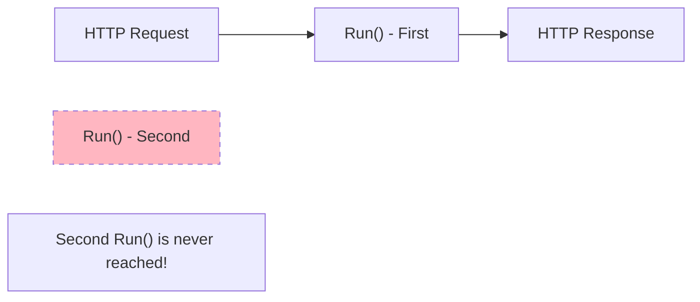
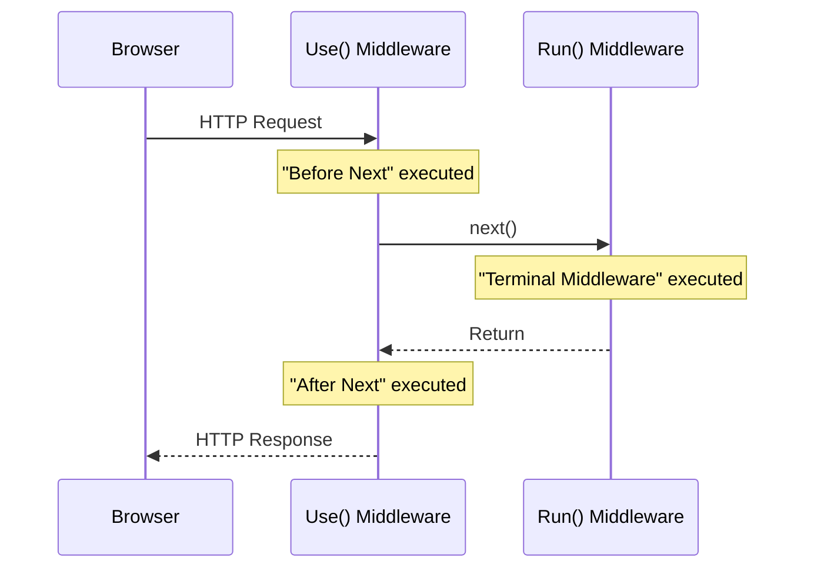
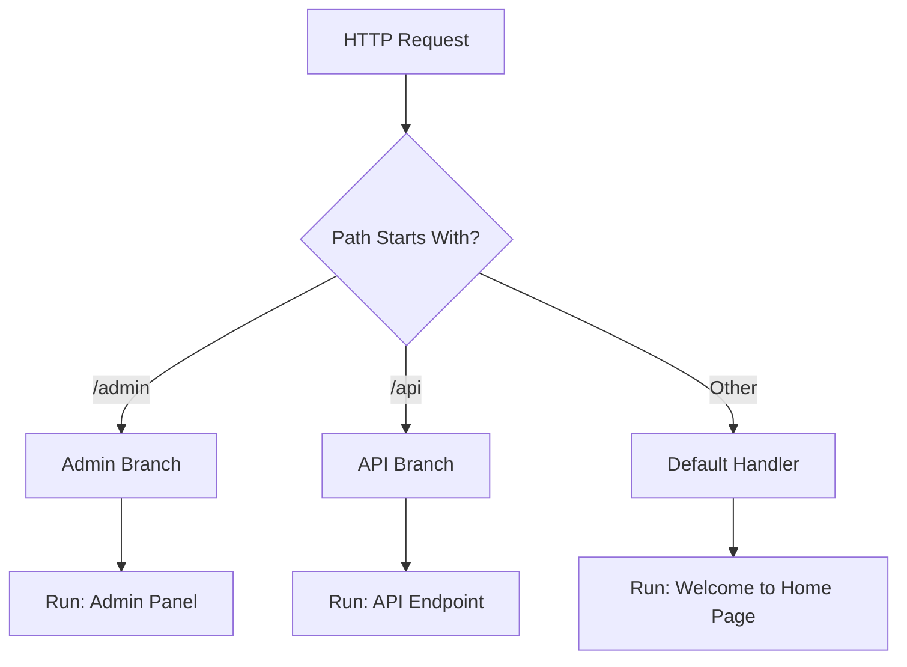

# 📚 Middleware Components (Use, Run, Map)

## 🎯 Introduction

ASP.NET Core provides three primary extension methods for registering middleware in the request pipeline: **Use()**, **Run()**, and **Map()**. Each has a specific purpose and behavior. This note covers all concepts from the PPT presentation.

---

## 📋 Table of Contents
1. [Request Delegates Revisited](#request-delegates-revisited)
2. [Run() Extension Method](#run-extension-method)
3. [Use() Extension Method](#use-extension-method)
4. [Map() Extension Method](#map-extension-method)
5. [Short-Circuiting the Pipeline](#short-circuiting-the-pipeline)
6. [Complete Examples](#complete-examples)
7. [Key Takeaways](#key-takeaways)

---

## 🔷 Request Delegates Revisited

### What is a Request Delegate?

A **Request Delegate** is a delegate that takes an `HttpContext` and returns a `Task`. In ASP.NET Core, we configure the request delegates using these three methods:

| Method | Purpose | Calls Next? |
|--------|---------|-------------|
| `Run()` | Terminal middleware | ❌ No |
| `Use()` | Intermediate middleware | ✅ Optional |
| `Map()` | Branch pipeline by path | Creates new branch |

### The Request Delegate Signature

```csharp
public delegate Task RequestDelegate(HttpContext context);
```

---

## 🔷 Run() Extension Method

### Definition

The `Run()` method adds a **terminal middleware** to the request pipeline. A terminal middleware:
- Does **NOT** call the next middleware
- **Terminates** the pipeline
- Is typically used for the final response handler

### Signature

```csharp
public static void Run(
    this IApplicationBuilder app, 
    RequestDelegate handler);
```

### Basic Example

```csharp
var builder = WebApplication.CreateBuilder(args);
var app = builder.Build();

app.Run(async (context) =>
{
    await context.Response.WriteAsync("Hello from Terminal Middleware");
});

app.Run();  // Start the application
```

### Multiple Run() Middleware - Only First Executes!

```csharp
app.Run(async (context) =>
{
    await context.Response.WriteAsync("First Middleware\n");
});

app.Run(async (context) =>
{
    // ❌ This will NEVER execute!
    await context.Response.WriteAsync("Second Middleware\n");
});
```

**Output:** `First Middleware` only

> [!CAUTION]
> **Run() is terminal!** Any middleware registered after `Run()` will **never execute** because `Run()` does not call `next()`.

### Visual Representation



---

## 🔷 Use() Extension Method

### Definition

The `Use()` method adds an **intermediate middleware** that **CAN** call the next middleware in the pipeline.

### Signature

```csharp
public static IApplicationBuilder Use(
    this IApplicationBuilder app, 
    Func<HttpContext, Func<Task>, Task> middleware);
```

### Parameters

| Parameter | Type | Description |
|-----------|------|-------------|
| `context` | `HttpContext` | Current HTTP context with Request and Response |
| `next` | `Func<Task>` | Delegate to invoke next middleware |

### Basic Example with next()

```csharp
app.Use(async (context, next) =>
{
    // Code BEFORE next middleware
    await context.Response.WriteAsync("Before Next\n");
    
    // Call the next middleware
    await next();
    
    // Code AFTER next middleware returns
    await context.Response.WriteAsync("After Next\n");
});

app.Run(async context =>
{
    await context.Response.WriteAsync("Terminal Middleware\n");
});

// Output:
// Before Next
// Terminal Middleware
// After Next
```

### Execution Flow Diagram



### Use() Without Calling next() - Short-Circuit

```csharp
app.Use(async (context, next) =>
{
    // Check some condition
    if (context.Request.Query["key"] != "secret")
    {
        await context.Response.WriteAsync("Unauthorized - Access Denied");
        return;  // Don't call next() - short-circuit!
    }
    
    await next();  // Only called if authorized
});

app.Run(async context =>
{
    await context.Response.WriteAsync("Welcome to the secure area!");
});
```

**Results:**
- URL: `/?key=wrong` → Output: `Unauthorized - Access Denied`
- URL: `/?key=secret` → Output: `Welcome to the secure area!`

---

## 🔷 Map() Extension Method

### Definition

The `Map()` method branches the request pipeline based on the **request path**. When a request matches the specified path, it goes to a separate pipeline branch.

### Basic Example

```csharp
var builder = WebApplication.CreateBuilder(args);
var app = builder.Build();

// Branch for /admin path
app.Map("/admin", adminApp =>
{
    adminApp.Run(async context =>
    {
        await context.Response.WriteAsync("Admin Panel");
    });
});

// Branch for /api path
app.Map("/api", apiApp =>
{
    apiApp.Run(async context =>
    {
        await context.Response.WriteAsync("API Endpoint");
    });
});

// Default for other paths
app.Run(async context =>
{
    await context.Response.WriteAsync("Welcome to Home Page");
});

app.Run();
```

### URL to Response Mapping

| Request URL | Response |
|-------------|----------|
| `/` | "Welcome to Home Page" |
| `/admin` | "Admin Panel" |
| `/admin/users` | "Admin Panel" |
| `/admin/settings` | "Admin Panel" |
| `/api` | "API Endpoint" |
| `/api/products` | "API Endpoint" |
| `/other` | "Welcome to Home Page" |

### Visual Representation



### MapWhen() - Conditional Branching

`MapWhen()` branches based on a **condition** (not just path):

```csharp
// Branch based on query string
app.MapWhen(
    context => context.Request.Query.ContainsKey("debug"),
    debugApp =>
    {
        debugApp.Run(async context =>
        {
            await context.Response.WriteAsync("Debug Mode Active");
        });
    });

// Regular request
app.Run(async context =>
{
    await context.Response.WriteAsync("Normal Mode");
});
```

**Results:**
- URL: `/` → Output: `Normal Mode`
- URL: `/?debug=true` → Output: `Debug Mode Active`

---

## 🔷 Short-Circuiting the Pipeline

### What is Short-Circuiting?

**Short-circuiting** means stopping the request pipeline early without passing the request to subsequent middleware.

### When to Short-Circuit

| Scenario | Action |
|----------|--------|
| Authentication failed | Short-circuit with 401 |
| Authorization failed | Short-circuit with 403 |
| Request validation failed | Short-circuit with 400 |
| Cached response available | Short-circuit with cached data |
| Static file found | Short-circuit with file |

### Example: Authentication Short-Circuit

```csharp
app.Use(async (context, next) =>
{
    // Check for API key
    var apiKey = context.Request.Headers["X-API-Key"].FirstOrDefault();
    
    if (string.IsNullOrEmpty(apiKey))
    {
        context.Response.StatusCode = 401;
        await context.Response.WriteAsync("API Key Required");
        return;  // Short-circuit - don't call next()
    }
    
    if (apiKey != "valid-api-key")
    {
        context.Response.StatusCode = 403;
        await context.Response.WriteAsync("Invalid API Key");
        return;  // Short-circuit
    }
    
    await next();  // API key valid, continue
});

app.Run(async context =>
{
    await context.Response.WriteAsync("Protected Resource");
});
```

---

## 🔷 Complete Examples

### Example 1: Complete Pipeline with All Three Methods

```csharp
var builder = WebApplication.CreateBuilder(args);
var app = builder.Build();

// Middleware 1 - Use() with before/after code
app.Use(async (context, next) =>
{
    await context.Response.WriteAsync("Use1: Request In\n");
    await next();
    await context.Response.WriteAsync("Use1: Response Out\n");
});

// Branch for /special path
app.Map("/special", specialApp =>
{
    specialApp.Run(async context =>
    {
        await context.Response.WriteAsync("Special Branch Handler\n");
    });
});

// Middleware 2 - Use()
app.Use(async (context, next) =>
{
    await context.Response.WriteAsync("Use2: Request In\n");
    await next();
    await context.Response.WriteAsync("Use2: Response Out\n");
});

// Terminal middleware - Run()
app.Run(async context =>
{
    await context.Response.WriteAsync("Run: Terminal Handler\n");
});

app.Run();
```

**Output for `/`:**
```
Use1: Request In
Use2: Request In
Run: Terminal Handler
Use2: Response Out
Use1: Response Out
```

**Output for `/special`:**
```
Use1: Request In
Special Branch Handler
Use1: Response Out
```

---

## 🔷 Key Takeaways

> [!IMPORTANT]
> **Must Remember Points:**

### Quick Reference Q&A

| Question | Answer |
|----------|--------|
| Does Run() call next middleware? | **No**, it's terminal |
| Does Use() call next middleware? | **Optionally** (with `await next()`) |
| What does Map() do? | Branches pipeline based on **path** |
| What is short-circuiting? | Stopping pipeline by not calling `next()` |
| What happens if you have two Run()? | Only **first** Run() executes |

### Fill in the Blanks (From PPT)

1. `Run()` adds a **terminal** middleware.
2. A terminal middleware does not call the **next** middleware.
3. `Use()` adds an **intermediate** middleware that can call next().
4. `Map()` branches the request pipeline based on the **request path**.
5. Short-circuiting means not calling **next()** to stop the pipeline.

### Quick Reference Code

```csharp
// Terminal - doesn't call next
app.Run(async context => {
    await context.Response.WriteAsync("Done");
});

// Intermediate - can call next
app.Use(async (context, next) => {
    // Before
    await next();
    // After
});

// Branching - based on path
app.Map("/path", branch => {
    branch.Run(async ctx => { });
});

// Conditional branching
app.MapWhen(ctx => condition, branch => { });
```

### Common Mistakes

| Mistake | Result |
|---------|--------|
| Multiple `Run()` middleware | Only first executes |
| Forgetting `await next()` in `Use()` | Short-circuits unintentionally |
| Wrong middleware order | Incorrect behavior |
| Writing after `Run()` | Never executes |

---

## 📝 Practice Questions

1. What is the difference between `Run()` and `Use()` middleware?
2. Why does only the first `Run()` middleware execute?
3. How does `Map()` branch the request pipeline?
4. What is short-circuiting and when would you use it?
5. Write a middleware that logs request path before and after processing.

---

*Previous: [12 - Request Processing Pipeline](./12_Request_Processing_Pipeline.md)*

*Next: [14 - Custom Middleware](./14_Custom_Middleware.md)*
