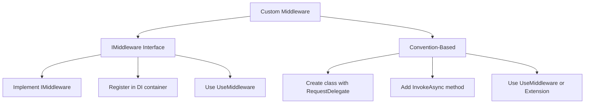

# 📚 Custom Middleware Development

## 🎯 Introduction

While ASP.NET Core provides many built-in middleware components, you often need to create **custom middleware** for specific application requirements like logging, authentication, error handling, request modification, etc. This note covers all concepts from the PPT presentation including both approaches to creating custom middleware.

---

## 📋 Table of Contents
1. [Why Create Custom Middleware?](#why-create-custom-middleware)
2. [Two Approaches to Create Middleware](#two-approaches-to-create-middleware)
3. [Approach 1: IMiddleware Interface](#approach-1-imiddleware-interface)
4. [Approach 2: Convention-Based Middleware](#approach-2-convention-based-middleware)
5. [Creating Extension Methods](#creating-extension-methods)
6. [Middleware with Dependencies](#middleware-with-dependencies)
7. [Complete Working Examples](#complete-working-examples)
8. [Key Takeaways](#key-takeaways)

---

## 🔷 Why Create Custom Middleware?

### Common Use Cases

| Use Case | Description |
|----------|-------------|
| **Logging** | Log request/response details |
| **Authentication** | Custom auth schemes |
| **Authorization** | Role-based access |
| **Request Modification** | Modify headers, body |
| **Response Caching** | Cache responses |
| **Error Handling** | Custom error pages |
| **Rate Limiting** | Throttle requests |
| **Localization** | Set culture |

---

## 🔷 Two Approaches to Create Middleware

ASP.NET Core provides two ways to create custom middleware:

| Approach | Registration | Lifetime | DI Support |
|----------|--------------|----------|------------|
| **IMiddleware Interface** | Must register in DI | Configurable (Transient/Scoped/Singleton) | ✅ Full DI support |
| **Convention-Based** | Automatic | Singleton-like | ✅ Constructor only |



---

## 🔷 Approach 1: IMiddleware Interface

### Step 1: Create the Middleware Class

Create a class that implements the `IMiddleware` interface:

```csharp
// CustomMiddlewareDemo.cs
using Microsoft.AspNetCore.Http;
using System.Threading.Tasks;

namespace WebApplication1
{
    public class CustomMiddlewareDemo : IMiddleware
    {
        // IMiddleware interface requires this method
        public async Task InvokeAsync(HttpContext context, RequestDelegate next)
        {
            // Code BEFORE passing to next middleware
            await context.Response.WriteAsync("Custom Middleware: Before Next\n");
            
            // Pass control to the next middleware in the pipeline
            await next(context);
            
            // Code AFTER next middleware returns
            await context.Response.WriteAsync("Custom Middleware: After Next\n");
        }
    }
}
```

### Line-by-Line Explanation

| Line | Code | Explanation |
|------|------|-------------|
| 1 | `public class CustomMiddlewareDemo : IMiddleware` | Implement IMiddleware interface |
| 2 | `public async Task InvokeAsync(...)` | Required method by IMiddleware |
| 3 | `HttpContext context` | Contains request and response |
| 4 | `RequestDelegate next` | Delegate to call next middleware |
| 5 | `await next(context)` | Invoke next middleware |

### Step 2: Register in DI Container

The middleware class **must** be registered in the DI container:

```csharp
// Program.cs
var builder = WebApplication.CreateBuilder(args);

// Register middleware in DI container (REQUIRED for IMiddleware)
builder.Services.AddTransient<CustomMiddlewareDemo>();

var app = builder.Build();
```

### Step 3: Add to Pipeline

```csharp
// Add middleware to request pipeline
app.UseMiddleware<CustomMiddlewareDemo>();

// Terminal middleware
app.Run(async context =>
{
    await context.Response.WriteAsync("Terminal Middleware\n");
});

app.Run();
```

### Complete IMiddleware Example

```csharp
// Program.cs
using WebApplication1;

var builder = WebApplication.CreateBuilder(args);
builder.Services.AddControllersWithViews();

// Step 1: Register middleware class in DI
builder.Services.AddTransient<CustomMiddlewareDemo>();

var app = builder.Build();

if (!app.Environment.IsDevelopment())
{
    app.UseExceptionHandler("/Home/Error");
    app.UseHsts();
}

// Step 2: Add middleware to pipeline
app.UseMiddleware<CustomMiddlewareDemo>();

app.Run(async context =>
{
    await context.Response.WriteAsync("Hello from Terminal\n");
});

app.Run();
```

**Output:**
```
Custom Middleware: Before Next
Hello from Terminal
Custom Middleware: After Next
```

---

## 🔷 Approach 2: Convention-Based Middleware

### Convention Requirements

To create middleware using the convention-based approach, your class must:

| Requirement | Description |
|-------------|-------------|
| **Constructor** | Must accept `RequestDelegate next` as parameter |
| **Method Name** | Must have `Invoke` or `InvokeAsync` method |
| **First Parameter** | `HttpContext` |
| **Return Type** | `Task` |

### Step 1: Create the Middleware Class

```csharp
// LoggingMiddleware.cs
using Microsoft.AspNetCore.Builder;
using Microsoft.AspNetCore.Http;
using System.Threading.Tasks;

namespace MVCMiddleware
{
    public class LoggingMiddleware
    {
        // REQUIRED: Store the next delegate
        private readonly RequestDelegate _next;
        
        // REQUIRED: Constructor with RequestDelegate parameter
        public LoggingMiddleware(RequestDelegate next)
        {
            _next = next;
        }
        
        // REQUIRED: Invoke or InvokeAsync method with HttpContext
        public async Task InvokeAsync(HttpContext httpContext)
        {
            // Code BEFORE next middleware
            await httpContext.Response.WriteAsync("Logging: Request Started\n");
            
            // Call the next middleware
            await _next(httpContext);
            
            // Code AFTER next middleware
            await httpContext.Response.WriteAsync("Logging: Request Completed\n");
        }
    }
}
```

### Line-by-Line Explanation

| Line | Code | Explanation |
|------|------|-------------|
| 1 | `private readonly RequestDelegate _next` | Store reference to next middleware |
| 2 | `public LoggingMiddleware(RequestDelegate next)` | Constructor receives next delegate |
| 3 | `_next = next` | Save reference for later use |
| 4 | `public async Task InvokeAsync(HttpContext httpContext)` | Method called for each request |
| 5 | `await _next(httpContext)` | Call next middleware in pipeline |

### Step 2: Use in Pipeline

```csharp
// Program.cs
var builder = WebApplication.CreateBuilder(args);
var app = builder.Build();

// Use the middleware (no DI registration needed!)
app.UseMiddleware<LoggingMiddleware>();

app.Run(async context =>
{
    await context.Response.WriteAsync("Hello World\n");
});

app.Run();
```

**Output:**
```
Logging: Request Started
Hello World
Logging: Request Completed
```

---

## 🔷 Creating Extension Methods

### Why Use Extension Methods?

Extension methods provide a **cleaner syntax** for adding middleware:

```csharp
// Without extension method
app.UseMiddleware<LoggingMiddleware>();

// With extension method (cleaner!)
app.UseLoggingMiddleware();
```

### Creating Extension Method

```csharp
// LoggingMiddleware.cs (add this to the same file or separate)
namespace MVCMiddleware
{
    // Extension method class
    public static class LoggingMiddlewareExtensions
    {
        public static IApplicationBuilder UseLoggingMiddleware(
            this IApplicationBuilder builder)
        {
            return builder.UseMiddleware<LoggingMiddleware>();
        }
    }
}
```

### Using the Extension Method

```csharp
// Program.cs
var builder = WebApplication.CreateBuilder(args);
var app = builder.Build();

// Clean syntax with extension method
app.UseLoggingMiddleware();

app.Run(async context =>
{
    await context.Response.WriteAsync("Hello World\n");
});

app.Run();
```

---

## 🔷 Middleware with Dependencies

### Convention-Based with ILogger

Convention-based middleware can receive dependencies through method injection:

```csharp
public class LoggingMiddleware
{
    private readonly RequestDelegate _next;
    private readonly ILogger<LoggingMiddleware> _logger;
    
    // Constructor injection - ILogger can be injected
    public LoggingMiddleware(
        RequestDelegate next, 
        ILogger<LoggingMiddleware> logger)
    {
        _next = next;
        _logger = logger;
    }
    
    public async Task InvokeAsync(HttpContext httpContext)
    {
        // Use logger
        _logger.LogInformation($"Request Path: {httpContext.Request.Path}");
        _logger.LogInformation($"Request Method: {httpContext.Request.Method}");
        
        var startTime = DateTime.UtcNow;
        
        await _next(httpContext);
        
        var elapsed = DateTime.UtcNow - startTime;
        _logger.LogInformation($"Response Status: {httpContext.Response.StatusCode}");
        _logger.LogInformation($"Request completed in {elapsed.TotalMilliseconds}ms");
    }
}
```

### IMiddleware with Dependencies

```csharp
public class AuthMiddleware : IMiddleware
{
    private readonly IUserService _userService;
    private readonly ILogger<AuthMiddleware> _logger;
    
    // Full DI support - services from container
    public AuthMiddleware(IUserService userService, ILogger<AuthMiddleware> logger)
    {
        _userService = userService;
        _logger = logger;
    }
    
    public async Task InvokeAsync(HttpContext context, RequestDelegate next)
    {
        var userId = context.Request.Headers["X-User-Id"].FirstOrDefault();
        
        if (string.IsNullOrEmpty(userId))
        {
            _logger.LogWarning("No user ID provided");
            context.Response.StatusCode = 401;
            await context.Response.WriteAsync("User ID required");
            return;
        }
        
        var user = await _userService.GetUserAsync(userId);
        if (user == null)
        {
            _logger.LogWarning($"User {userId} not found");
            context.Response.StatusCode = 403;
            await context.Response.WriteAsync("Invalid user");
            return;
        }
        
        _logger.LogInformation($"User {user.Name} authenticated");
        await next(context);
    }
}

// Registration
builder.Services.AddTransient<AuthMiddleware>();
```

---

## 🔷 Complete Working Examples

### Example 1: Request Timing Middleware

```csharp
// RequestTimingMiddleware.cs
public class RequestTimingMiddleware
{
    private readonly RequestDelegate _next;
    
    public RequestTimingMiddleware(RequestDelegate next)
    {
        _next = next;
    }
    
    public async Task InvokeAsync(HttpContext context)
    {
        var watch = System.Diagnostics.Stopwatch.StartNew();
        
        // Add custom header before processing
        context.Response.OnStarting(() =>
        {
            watch.Stop();
            context.Response.Headers["X-Response-Time-Ms"] = 
                watch.ElapsedMilliseconds.ToString();
            return Task.CompletedTask;
        });
        
        await _next(context);
    }
}

// Extension method
public static class RequestTimingMiddlewareExtensions
{
    public static IApplicationBuilder UseRequestTiming(
        this IApplicationBuilder builder)
    {
        return builder.UseMiddleware<RequestTimingMiddleware>();
    }
}
```

### Example 2: Error Handling Middleware

```csharp
// ErrorHandlingMiddleware.cs
public class ErrorHandlingMiddleware
{
    private readonly RequestDelegate _next;
    private readonly ILogger<ErrorHandlingMiddleware> _logger;
    
    public ErrorHandlingMiddleware(
        RequestDelegate next, 
        ILogger<ErrorHandlingMiddleware> logger)
    {
        _next = next;
        _logger = logger;
    }
    
    public async Task InvokeAsync(HttpContext context)
    {
        try
        {
            await _next(context);
        }
        catch (Exception ex)
        {
            _logger.LogError(ex, "Unhandled exception occurred");
            
            context.Response.StatusCode = 500;
            context.Response.ContentType = "application/json";
            
            await context.Response.WriteAsync($@"{{
                ""error"": ""An error occurred"",
                ""message"": ""{ex.Message}""
            }}");
        }
    }
}
```

---

## 🔷 Comparison Table

| Feature | IMiddleware | Convention-Based |
|---------|-------------|------------------|
| **Interface** | Implements IMiddleware | No interface needed |
| **Registration** | Must register in DI | Automatic |
| **DI Lifetime** | Transient/Scoped/Singleton | Singleton-like |
| **Method DI** | ✅ Full support | Constructor only |
| **Per-Request Services** | ✅ Yes | ❌ No |
| **Testing** | Easier to mock | Standard testing |

---

## 🔷 Key Takeaways

> [!IMPORTANT]
> **Must Remember Points:**

### Quick Reference Q&A

| Question | Answer |
|----------|--------|
| Two ways to create middleware? | **IMiddleware** and **Convention-based** |
| IMiddleware required method? | `InvokeAsync(HttpContext, RequestDelegate)` |
| Convention-based required method? | `InvokeAsync(HttpContext)` or `Invoke(HttpContext)` |
| Does IMiddleware need DI registration? | **Yes** |
| Does Convention-based need DI registration? | **No** |
| Why create extension methods? | Cleaner, more readable code |

### Fill in the Blanks (From PPT)

1. Custom middleware can be created by implementing the **IMiddleware** interface.
2. The IMiddleware interface requires the **InvokeAsync** method.
3. Convention-based middleware must have a constructor that accepts **RequestDelegate**.
4. Extension methods provide a **cleaner syntax** for registering middleware.
5. IMiddleware must be registered in the **DI container**.

### Code Patterns Summary

```csharp
// IMiddleware Approach
public class MyMiddleware : IMiddleware
{
    public async Task InvokeAsync(HttpContext context, RequestDelegate next)
    {
        // Before
        await next(context);
        // After
    }
}
// Required: builder.Services.AddTransient<MyMiddleware>();
// Usage: app.UseMiddleware<MyMiddleware>();

// Convention-Based Approach
public class MyMiddleware
{
    private readonly RequestDelegate _next;
    public MyMiddleware(RequestDelegate next) => _next = next;
    
    public async Task InvokeAsync(HttpContext context)
    {
        // Before
        await _next(context);
        // After
    }
}
// Usage: app.UseMiddleware<MyMiddleware>();
```

---

## 📝 Practice Questions

1. What are the two approaches to create custom middleware?
2. What are the requirements for convention-based middleware?
3. Why must IMiddleware be registered in the DI container?
4. How do you create an extension method for middleware?
5. What is the difference between constructor DI and method DI in middleware?

---

*Previous: [13 - Middleware Components](./13_Middleware_Components.md)*

*Next: [15 - Static Files and wwwroot](./15_Static_Files_wwwroot.md)*
