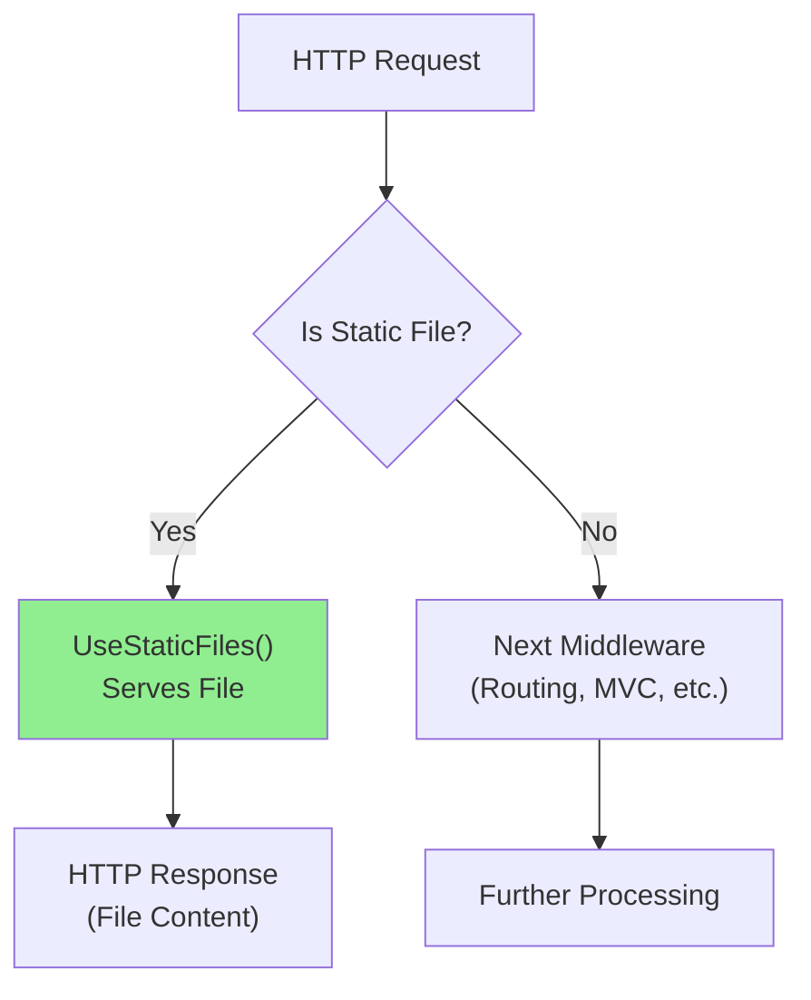

# 📚 Static Files and wwwroot

## 🎯 Introduction

The **wwwroot** folder is the web root directory in ASP.NET Core where **static files** (CSS, JavaScript, images, HTML) are stored. By default, static files are served from this folder using the `UseStaticFiles()` middleware. This note covers all concepts from the PPT presentation.

---

## 📋 Table of Contents
1. [What is wwwroot Folder?](#what-is-wwwroot-folder)
2. [Why UseStaticFiles is Required?](#why-usestaticfiles-is-required)
3. [How Static Files Middleware Works](#how-static-files-middleware-works)
4. [Project Templates and wwwroot](#project-templates-and-wwwroot)
5. [Complete Examples](#complete-examples)
6. [Key Takeaways](#key-takeaways)

---

## 🔷 What is wwwroot Folder?

### Definition

The **wwwroot** folder is the **root** folder from which static files are served. By convention:
- Only files within the **wwwroot** folder are accessible over HTTP
- Files outside wwwroot are **not accessible** directly via URL

### Folder Structure

```
MyProject/
├── Controllers/              ← Not accessible via HTTP
├── Models/                   ← Not accessible via HTTP
├── Views/                    ← Not accessible via HTTP
├── wwwroot/                  ← WEB ROOT (static files)
│   ├── css/
│   │   ├── site.css
│   │   └── bootstrap.min.css
│   ├── js/
│   │   ├── site.js
│   │   └── jquery.min.js
│   ├── images/
│   │   ├── logo.png
│   │   └── banner.jpg
│   ├── lib/                  ← Third-party libraries
│   │   ├── bootstrap/
│   │   └── jquery/
│   └── index.html
├── Program.cs
└── appsettings.json
```

### URL Mapping

The `wwwroot` folder name is **NOT included** in the URL:

| File Path | Accessible URL |
|-----------|----------------|
| `wwwroot/site.css` | `/site.css` |
| `wwwroot/css/style.css` | `/css/style.css` |
| `wwwroot/images/logo.png` | `/images/logo.png` |
| `wwwroot/js/app.js` | `/js/app.js` |
| `wwwroot/lib/bootstrap/bootstrap.css` | `/lib/bootstrap/bootstrap.css` |


> [!NOTE]
> By default, only files within the **wwwroot** folder are accessible over HTTP. If you want to access files that are outside of the wwwroot folder then you need to configure it.

---

## 🔷 Why UseStaticFiles is Required?

### Without UseStaticFiles Middleware

In ASP.NET Core, **static files are NOT served by default**. You must explicitly enable static file serving.

```csharp
// ❌ WITHOUT UseStaticFiles - static files won't work!
var builder = WebApplication.CreateBuilder(args);
var app = builder.Build();

app.Run(async context =>
{
    await context.Response.WriteAsync("Hello World");
});

app.Run();
```

**What happens:**
- Navigate to `/images/logo.png`
- **Result:** Shows "Hello World" instead of the image!

### With UseStaticFiles Middleware

```csharp
// ✅ WITH UseStaticFiles - static files work!
var builder = WebApplication.CreateBuilder(args);
var app = builder.Build();

// Enable static files middleware
app.UseStaticFiles();

app.Run(async context =>
{
    await context.Response.WriteAsync("Hello World");
});

app.Run();
```

**What happens:**
- Navigate to `/images/logo.png`
- **Result:** Shows the actual image!

> [!IMPORTANT]
> `UseStaticFiles()` is **mandatory** to serve static files. Without it, requests for static files will not be handled and will fall through to other middleware.

---

## 🔷 How Static Files Middleware Works

### Middleware Pipeline Position



### Short-Circuiting Behavior

When `UseStaticFiles()` finds a matching file:
1. It **short-circuits** the pipeline
2. Returns the file directly
3. Does **NOT** call subsequent middleware

This is why `UseStaticFiles()` should be placed **early** in the pipeline for performance.

### Complete Pipeline Example

```csharp
var builder = WebApplication.CreateBuilder(args);
builder.Services.AddControllersWithViews();

var app = builder.Build();

if (!app.Environment.IsDevelopment())
{
    app.UseExceptionHandler("/Home/Error");
    app.UseHsts();
}

app.UseHttpsRedirection();

// Static files - placed early for performance
app.UseStaticFiles();

app.UseRouting();
app.UseAuthorization();

app.MapControllerRoute(
    name: "default",
    pattern: "{controller=Home}/{action=Index}/{id?}");

app.Run();
```

---

## 🔷 Project Templates and wwwroot

### Empty Template

When you create an **Empty project** in Visual Studio:
- The **wwwroot** folder is **NOT created** by default
- You must create it manually if needed

### MVC/Web Application Template

When you create an **MVC** or **Web Application** project:
- The **wwwroot** folder is created **automatically**
- Contains default CSS, JS, and library files

```
wwwroot/
├── css/
│   └── site.css
├── js/
│   └── site.js
├── lib/
│   ├── bootstrap/
│   ├── jquery/
│   └── jquery-validation/
└── favicon.ico
```

---

## 🔷 Complete Examples

### Example 1: Basic Static Files Setup

```csharp
// Program.cs
var builder = WebApplication.CreateBuilder(args);
var app = builder.Build();

// Enable static files
app.UseStaticFiles();

app.Run(async context =>
{
    await context.Response.WriteAsync(@"
        <html>
        <head>
            <link rel='stylesheet' href='/css/site.css' />
        </head>
        <body>
            
            <script src='/js/site.js'></script>
        </body>
        </html>
    ");
});

app.Run();
```

### Example 2: Accessing Static Files in Razor Views

```html
@* Views/Home/Index.cshtml *@
<!DOCTYPE html>
<html>
<head>
    <!-- Link to CSS file in wwwroot -->
    <link rel="stylesheet" href="~/css/site.css" />
    
    <!-- With cache-busting version -->
    <link rel="stylesheet" href="~/css/site.css" asp-append-version="true" />
</head>
<body>
    <!-- Image from wwwroot -->
    
    
    <!-- JavaScript from wwwroot -->
    <script src="~/js/site.js"></script>
</body>
</html>
```

> [!TIP]
> The `~` (tilde) in Razor views represents the **web root** (wwwroot folder). The `asp-append-version` tag helper adds a version hash for cache busting.

### Example 3: Serving Files from Custom Folder

```csharp
// Serve files from a different folder
app.UseStaticFiles(new StaticFileOptions
{
    FileProvider = new PhysicalFileProvider(
        Path.Combine(builder.Environment.ContentRootPath, "MyStaticFiles")),
    RequestPath = "/StaticFiles"
});
```

**Mapping:**
| File Path | Accessible URL |
|-----------|----------------|
| `MyStaticFiles/doc.pdf` | `/StaticFiles/doc.pdf` |

---

## 🔷 Key Takeaways

> [!IMPORTANT]
> **Must Remember Points:**

### Quick Reference Q&A

| Question | Answer |
|----------|--------|
| What is wwwroot? | **Root folder** for serving static files |
| Is wwwroot in the URL? | **No**, it's not included in URL |
| Is UseStaticFiles() required? | **Yes**, static files don't work without it |
| Empty template has wwwroot? | **No**, you must create it manually |
| MVC template has wwwroot? | **Yes**, created automatically |
| What files go in wwwroot? | CSS, JS, images, HTML, fonts, etc. |

### Fill in the Blanks (From PPT)

1. The **wwwroot** folder is the root folder from which static files are served.
2. By default, only files within the **wwwroot** folder are accessible over HTTP.
3. Static files are not served by default; you must add **UseStaticFiles()** middleware.
4. The wwwroot folder name is **not included** in the URL.
5. When using Empty template, the wwwroot folder is **not created** by default.

### Code Summary

```csharp
// Enable static files (REQUIRED)
app.UseStaticFiles();

// In Razor views, use ~ for web root
<link href="~/css/site.css" rel="stylesheet" />

<script src="~/js/site.js"></script>

// With cache busting
<link href="~/css/site.css" asp-append-version="true" rel="stylesheet" />
```

---

## 📝 Practice Questions

1. What is the purpose of the wwwroot folder?
2. Why must you add UseStaticFiles() middleware?
3. Is the wwwroot folder name included in the URL?
4. What happens if you don't add UseStaticFiles()?
5. Which project template creates wwwroot folder automatically?

---

*Previous: [14 - Custom Middleware](./14_Custom_Middleware.md)*

*Next: [16 - Default Pages and FileServer](./16_Default_Pages_FileServer.md)*
