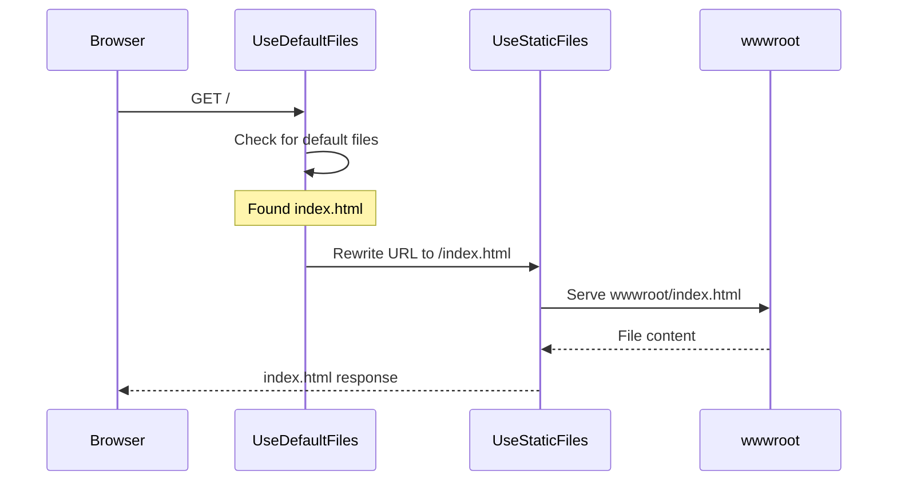

# 📚 Default Pages and FileServer

## 🎯 Introduction

ASP.NET Core provides middleware to set **default pages** (like index.html) for directory requests and a combined **UseFileServer** middleware that includes multiple static file features. This note covers all concepts from the PPT presentation on setting default pages.

---

## 📋 Table of Contents
1. [UseDefaultFiles Middleware](#usedefaultfiles-middleware)
2. [Default Files Searched](#default-files-searched)
3. [Setting Custom Default Page](#setting-custom-default-page)
4. [UseFileServer Middleware](#usefileserver-middleware)
5. [Complete Examples](#complete-examples)
6. [Key Takeaways](#key-takeaways)

---

## 🔷 UseDefaultFiles Middleware

### What is UseDefaultFiles?

`UseDefaultFiles()` is a **URL rewriter** middleware that:
- Checks if the request is for a directory (e.g., `/` or `/folder/`)
- Searches for default files in that directory
- **Rewrites** the URL to the default file
- Does **NOT** actually serve the file (that's StaticFiles' job)

> [!IMPORTANT]
> `UseDefaultFiles()` is a **URL rewriter** that only rewrites the request URL. It does **not serve files**. You must also add `UseStaticFiles()` to actually serve the file.

### How It Works



### Critical Order Requirement

```csharp
// ✅ CORRECT ORDER
app.UseDefaultFiles();   // First: Rewrite URL
app.UseStaticFiles();    // Then: Serve file

// ❌ WRONG ORDER (DefaultFiles won't work!)
app.UseStaticFiles();    // Serves files before rewriting
app.UseDefaultFiles();   // Never gets to rewrite!
```

> [!WARNING]
> `UseDefaultFiles()` **must** come **before** `UseStaticFiles()` because it only rewrites the URL - it doesn't serve files!

---

## 🔷 Default Files Searched

### Default Search Order

By default, `UseDefaultFiles()` searches for these files in order:

| Priority | Default File |
|----------|--------------|
| 1 | `default.htm` |
| 2 | `default.html` |
| 3 | `index.htm` |
| 4 | `index.html` |

The **first file found** in this order is served.

### Example Directory

```
wwwroot/
├── index.html         ← Served for /
├── about/
│   └── default.html   ← Served for /about/
└── contact/
    └── index.htm      ← Served for /contact/
```

| Request URL | File Served |
|-------------|-------------|
| `/` | `wwwroot/index.html` |
| `/about/` | `wwwroot/about/default.html` |
| `/contact/` | `wwwroot/contact/index.htm` |

---

## 🔷 Setting Custom Default Page

### Why Set Custom Default Page?

You may have a custom page name that isn't in the default list:
- `home.html`
- `start.html`
- `MyCustomPage.html`

### Step-by-Step Configuration

```csharp
var builder = WebApplication.CreateBuilder(args);
var app = builder.Build();

// Step 1: Create DefaultFilesOptions object
DefaultFilesOptions defaultFilesOptions = new DefaultFilesOptions();

// Step 2: Clear the default list
defaultFilesOptions.DefaultFileNames.Clear();

// Step 3: Add your custom page
defaultFilesOptions.DefaultFileNames.Add("MyCustomPage.html");

// Step 4: Use with options (BEFORE UseStaticFiles!)
app.UseDefaultFiles(defaultFilesOptions);

// Step 5: Enable static files
app.UseStaticFiles();

app.Run();
```

### Line-by-Line Explanation

| Line | Code | Explanation |
|------|------|-------------|
| 1 | `new DefaultFilesOptions()` | Create options object |
| 2 | `.DefaultFileNames.Clear()` | Remove default files (default.htm, index.html, etc.) |
| 3 | `.DefaultFileNames.Add(...)` | Add your custom file |
| 4 | `app.UseDefaultFiles(options)` | Use middleware with options |
| 5 | `app.UseStaticFiles()` | Enable file serving |

### Complete Example

```csharp
// Program.cs
var builder = WebApplication.CreateBuilder(args);
var app = builder.Build();

// Configure custom default page
DefaultFilesOptions options = new DefaultFilesOptions();
options.DefaultFileNames.Clear();
options.DefaultFileNames.Add("MyCustomPage.html");

// Apply middleware in correct order
app.UseDefaultFiles(options);
app.UseStaticFiles();

app.Run(async context =>
{
    await context.Response.WriteAsync("Fallback - No matching route or file");
});

app.Run();
```

Now when you navigate to `/`, the `wwwroot/MyCustomPage.html` file will be served.

---

## 🔷 UseFileServer Middleware

### What is UseFileServer?

`UseFileServer()` is a **combined middleware** that includes:
1. `UseDefaultFiles()` - URL rewriting for default pages
2. `UseStaticFiles()` - Serving static files
3. `UseDirectoryBrowser()` - Optional directory listing

### Basic Usage

```csharp
// Instead of two separate middleware calls:
// app.UseDefaultFiles();
// app.UseStaticFiles();

// Use single combined middleware:
app.UseFileServer();
```

### Comparison

| Approach | Lines of Code | Features |
|----------|---------------|----------|
| Separate | 2 (UseDefaultFiles + UseStaticFiles) | Default files + Static files |
| Combined | 1 (UseFileServer) | Default files + Static files |

### UseFileServer with Custom Default Page

```csharp
var builder = WebApplication.CreateBuilder(args);
var app = builder.Build();

// Create FileServerOptions
FileServerOptions fileServerOptions = new FileServerOptions();

// Clear default files
fileServerOptions.DefaultFilesOptions.DefaultFileNames.Clear();

// Add custom default page
fileServerOptions.DefaultFilesOptions.DefaultFileNames.Add("MyCustomPage.html");

// Enable optional directory browsing (be careful in production!)
// fileServerOptions.EnableDirectoryBrowsing = true;

// Use combined middleware
app.UseFileServer(fileServerOptions);

app.Run();
```

### FileServerOptions Properties

| Property | Type | Description |
|----------|------|-------------|
| `DefaultFilesOptions` | `DefaultFilesOptions` | Configure default files |
| `StaticFileOptions` | `StaticFileOptions` | Configure static file serving |
| `EnableDirectoryBrowsing` | `bool` | Allow directory listing |
| `EnableDefaultFiles` | `bool` | Enable default file rewriting |

---

## 🔷 Complete Examples

### Example 1: Basic Default Files

```csharp
// Program.cs
var builder = WebApplication.CreateBuilder(args);
var app = builder.Build();

// Enable default files (default.htm, default.html, index.htm, index.html)
app.UseDefaultFiles();

// Enable static files
app.UseStaticFiles();

app.Run();
```

**wwwroot/index.html:**
```html
<!DOCTYPE html>
<html>
<head>
    <title>Home Page</title>
</head>
<body>
    <h1>Welcome to Default Page!</h1>
</body>
</html>
```

Navigate to `http://localhost:5000/` → Shows `index.html`

### Example 2: Custom Default with FileServer

```csharp
// Program.cs
var builder = WebApplication.CreateBuilder(args);
var app = builder.Build();

// Configure FileServer with custom default
FileServerOptions options = new FileServerOptions();
options.DefaultFilesOptions.DefaultFileNames.Clear();
options.DefaultFilesOptions.DefaultFileNames.Add("home.html");

app.UseFileServer(options);

app.MapControllerRoute(
    name: "default",
    pattern: "{controller=Home}/{action=Index}/{id?}");

app.Run();
```

### Example 3: Multiple Default Files in Order

```csharp
DefaultFilesOptions options = new DefaultFilesOptions();
options.DefaultFileNames.Clear();

// Add multiple files in priority order
options.DefaultFileNames.Add("home.html");      // Priority 1
options.DefaultFileNames.Add("default.html");   // Priority 2
options.DefaultFileNames.Add("index.html");     // Priority 3

app.UseDefaultFiles(options);
app.UseStaticFiles();
```

---

## 🔷 Key Takeaways

> [!IMPORTANT]
> **Must Remember Points:**

### Quick Reference Q&A

| Question | Answer |
|----------|--------|
| What does UseDefaultFiles() do? | **Rewrites URL** to default file |
| Does UseDefaultFiles() serve files? | **No**, only rewrites URL |
| What order: UseDefaultFiles or UseStaticFiles? | **UseDefaultFiles first** |
| Default files searched? | `default.htm`, `default.html`, `index.htm`, `index.html` |
| What is UseFileServer? | **Combined** UseDefaultFiles + UseStaticFiles |
| How to set custom default page? | Use `DefaultFilesOptions.DefaultFileNames` |

### Fill in the Blanks (From PPT)

1. `UseDefaultFiles()` is a **URL rewriter** that only rewrites the request URL.
2. `UseDefaultFiles()` must come **before** `UseStaticFiles()`.
3. By default, these files are searched: **default.htm**, **default.html**, **index.htm**, **index.html**.
4. To set a custom default page, use **DefaultFilesOptions**.
5. `UseFileServer()` combines **UseDefaultFiles** and **UseStaticFiles**.

### Code Patterns

```csharp
// Basic default files
app.UseDefaultFiles();
app.UseStaticFiles();

// Custom default page
DefaultFilesOptions options = new DefaultFilesOptions();
options.DefaultFileNames.Clear();
options.DefaultFileNames.Add("MyCustomPage.html");
app.UseDefaultFiles(options);
app.UseStaticFiles();

// Combined with FileServer
app.UseFileServer();

// FileServer with custom default
FileServerOptions fsOptions = new FileServerOptions();
fsOptions.DefaultFilesOptions.DefaultFileNames.Clear();
fsOptions.DefaultFilesOptions.DefaultFileNames.Add("MyCustomPage.html");
app.UseFileServer(fsOptions);
```

---

## 📝 Practice Questions

1. What does UseDefaultFiles() middleware do?
2. Why must UseDefaultFiles() come before UseStaticFiles()?
3. What are the default files searched by UseDefaultFiles()?
4. How do you set a custom default page?
5. What is the difference between UseDefaultFiles + UseStaticFiles vs UseFileServer?

---

*Previous: [15 - Static Files and wwwroot](./15_Static_Files_wwwroot.md)*

*Next: [17 - Developer Exception Page](./17_Developer_Exception_Page.md)*
