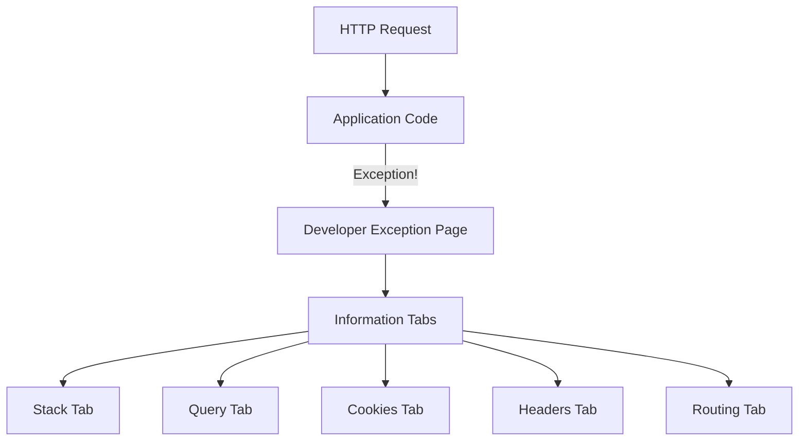
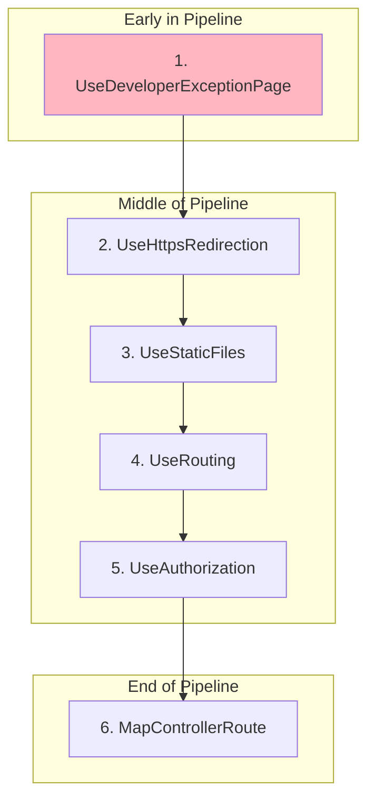

# 📚 Developer Exception Page

## 🎯 Introduction

The **Developer Exception Page** middleware displays detailed exception information during development. It provides comprehensive error details to help developers debug issues quickly. This note covers all concepts from the PPT presentation.

---

## 📋 Table of Contents
1. [What is Developer Exception Page?](#what-is-developer-exception-page)
2. [Information Displayed](#information-displayed)
3. [How to Enable](#how-to-enable)
4. [Customizing the Exception Page](#customizing-the-exception-page)
5. [Production Error Handling](#production-error-handling)
6. [Complete Examples](#complete-examples)
7. [Key Takeaways](#key-takeaways)

---

## 🔷 What is Developer Exception Page?

### Definition

The `UseDeveloperExceptionPage()` middleware provides a **detailed HTML error page** when an unhandled exception occurs. It shows:
- Exception type and message
- Stack trace with source code
- Query string parameters
- Cookies
- HTTP headers
- Routing information

### Visual Representation



### Development Only!

> [!CAUTION]
> **Never use Developer Exception Page in Production!**
> 
> The detailed error information exposes:
> - Source code snippets
> - File paths
> - Stack traces
> - Environment variables
> - Connection strings
> 
> This is a **security risk** in production!

---

## 🔷 Information Displayed

### Tab Overview

The Developer Exception Page has multiple tabs showing different information:

| Tab | Information Displayed |
|-----|----------------------|
| **Stack** | Exception type, message, full stack trace, source code around error |
| **Query** | Query string parameters |
| **Cookies** | All request cookies |
| **Headers** | HTTP request headers |
| **Routing** | Route pattern, HTTP method |

### Stack Tab Details

The **Stack** tab provides the most detailed information:

1. **Exception Type** - e.g., `System.NullReferenceException`
2. **Exception Message** - Description of what went wrong
3. **Stack Trace** - Full call stack with:
   - File names
   - Line numbers
   - Method names
4. **Source Code** - Lines of code around the error (highlighted)

### Example Output

```
System.Exception: Something went wrong!
   at WebApplication1.Program.<>c.<<Main>$>b__0_0(HttpContext context) in
   D:\Projects\WebApplication1\Program.cs:line 15
```

---

## 🔷 How to Enable

### Basic Usage

```csharp
var builder = WebApplication.CreateBuilder(args);
var app = builder.Build();

// Enable Developer Exception Page in Development
if (app.Environment.IsDevelopment())
{
    app.UseDeveloperExceptionPage();
}

app.MapGet("/", () =>
{
    throw new Exception("Something went wrong!");
});

app.Run();
```

### Pipeline Position

Developer Exception Page middleware should be added **very early** in the pipeline to catch exceptions from all subsequent middleware:

```csharp
var builder = WebApplication.CreateBuilder(args);
builder.Services.AddControllersWithViews();

var app = builder.Build();

// First middleware - catches all exceptions
if (app.Environment.IsDevelopment())
{
    app.UseDeveloperExceptionPage();
}
else
{
    app.UseExceptionHandler("/Home/Error");
    app.UseHsts();
}

// Subsequent middleware
app.UseHttpsRedirection();
app.UseStaticFiles();
app.UseRouting();
app.UseAuthorization();

app.MapControllerRoute(
    name: "default",
    pattern: "{controller=Home}/{action=Index}/{id?}");

app.Run();
```

### Middleware Order Visualization



> [!IMPORTANT]
> `UseDeveloperExceptionPage()` must be **early** in the pipeline to catch exceptions from all subsequent middleware.

---

## 🔷 Customizing the Exception Page

### Using DeveloperExceptionPageOptions

You can customize the Developer Exception Page using `DeveloperExceptionPageOptions`:

```csharp
if (app.Environment.IsDevelopment())
{
    DeveloperExceptionPageOptions options = new DeveloperExceptionPageOptions
    {
        // Number of source code lines to show around the error
        SourceCodeLineCount = 10  // Default is 6
    };
    
    app.UseDeveloperExceptionPage(options);
}
```

### Configurable Options

| Option | Type | Default | Description |
|--------|------|---------|-------------|
| `SourceCodeLineCount` | `int` | 6 | Lines of source code to display |

### Example with More Context

```csharp
var devOptions = new DeveloperExceptionPageOptions()
{
    SourceCodeLineCount = 15  // Show 15 lines around error
};

app.UseDeveloperExceptionPage(devOptions);
```

---

## 🔷 Production Error Handling

### Why Different Handling for Production?

| Environment | Error Page | Reason |
|-------------|------------|--------|
| Development | Developer Exception Page | Need detailed info for debugging |
| Production | Generic Error Page | Security (hide internal details) |

### Using UseExceptionHandler for Production

```csharp
var builder = WebApplication.CreateBuilder(args);
builder.Services.AddControllersWithViews();

var app = builder.Build();

if (!app.Environment.IsDevelopment())
{
    // Production: Use generic error handler
    app.UseExceptionHandler("/Home/Error");
    app.UseHsts();
}
else
{
    // Development: Show detailed exception page
    app.UseDeveloperExceptionPage();
}

app.UseHttpsRedirection();
app.UseStaticFiles();
app.UseRouting();
app.UseAuthorization();

app.MapControllerRoute(
    name: "default",
    pattern: "{controller=Home}/{action=Index}/{id?}");

app.Run();
```

### Error Controller and View

```csharp
// Controllers/HomeController.cs
public class HomeController : Controller
{
    [Route("Home/Error")]
    [ResponseCache(Duration = 0, Location = ResponseCacheLocation.None, NoStore = true)]
    public IActionResult Error()
    {
        return View(new ErrorViewModel 
        { 
            RequestId = Activity.Current?.Id ?? HttpContext.TraceIdentifier 
        });
    }
}
```

```html
@* Views/Shared/Error.cshtml *@
@model ErrorViewModel

<h1 class="text-danger">Error</h1>
<h2 class="text-danger">An error occurred while processing your request.</h2>

@if (Model.ShowRequestId)
{
    <p>
        <strong>Request ID:</strong> <code>@Model.RequestId</code>
    </p>
}

<h3>Development Mode</h3>
<p>
    Swapping to <strong>Development</strong> environment will display more detailed 
    information about the error that occurred.
</p>
```

---

## 🔷 Complete Examples

### Example 1: Basic Exception Handling

```csharp
// Program.cs
var builder = WebApplication.CreateBuilder(args);
var app = builder.Build();

// Development: Show detailed errors
if (app.Environment.IsDevelopment())
{
    app.UseDeveloperExceptionPage();
}

app.MapGet("/", () =>
{
    throw new InvalidOperationException("This is a test exception!");
});

app.Run();
```

Navigate to `http://localhost:5000/` and you'll see the detailed exception page.

### Example 2: With Custom Source Code Lines

```csharp
var builder = WebApplication.CreateBuilder(args);
var app = builder.Build();

if (app.Environment.IsDevelopment())
{
    var options = new DeveloperExceptionPageOptions
    {
        SourceCodeLineCount = 20  // Show more context
    };
    app.UseDeveloperExceptionPage(options);
}

app.MapGet("/error", () =>
{
    // Line 15
    // Line 16
    // Line 17
    throw new Exception("Error on line 18");  // Line 18
    // Line 19
    // Line 20
});

app.Run();
```

### Example 3: Environment-Based Configuration

```csharp
var builder = WebApplication.CreateBuilder(args);
builder.Services.AddControllersWithViews();

var app = builder.Build();

// Configure based on environment
if (app.Environment.IsDevelopment())
{
    // Development: Detailed errors
    app.UseDeveloperExceptionPage();
}
else if (app.Environment.IsStaging())
{
    // Staging: Similar to production
    app.UseExceptionHandler("/Error");
}
else
{
    // Production: Generic error page
    app.UseExceptionHandler("/Home/Error");
    app.UseHsts();  // HTTP Strict Transport Security
}

app.UseHttpsRedirection();
app.UseStaticFiles();
app.UseRouting();
app.UseAuthorization();

app.MapControllerRoute(
    name: "default",
    pattern: "{controller=Home}/{action=Index}/{id?}");

app.Run();
```

---

## 🔷 Key Takeaways

> [!IMPORTANT]
> **Must Remember Points:**

### Quick Reference Q&A

| Question | Answer |
|----------|--------|
| What does UseDeveloperExceptionPage show? | Detailed exception information |
| When to use it? | **Development only!** |
| What tabs are available? | Stack, Query, Cookies, Headers, Routing |
| Where in pipeline to add? | **Very early** (to catch all exceptions) |
| Options class name? | `DeveloperExceptionPageOptions` |
| Production alternative? | `UseExceptionHandler("/Error")` |
| Why not use in production? | **Security** - exposes sensitive information |

### Fill in the Blanks (From PPT)

1. `UseDeveloperExceptionPage()` middleware provides a **detailed HTML error page**.
2. The exception page shows **Stack**, **Query**, **Cookies**, **Headers**, and **Routing** tabs.
3. This middleware should be added **early** in the pipeline.
4. In **production**, use `UseExceptionHandler()` instead.
5. The `SourceCodeLineCount` property controls how many **source code lines** are displayed.

### Code Pattern Summary

```csharp
// Development: Detailed errors
if (app.Environment.IsDevelopment())
{
    app.UseDeveloperExceptionPage();
}

// Production: Generic error page
else
{
    app.UseExceptionHandler("/Error");
}

// With options
var options = new DeveloperExceptionPageOptions()
{
    SourceCodeLineCount = 10
};
app.UseDeveloperExceptionPage(options);
```

### Security Checklist

| ✅ Do | ❌ Don't |
|-------|---------|
| Use in Development only | Use in Production |
| Check `IsDevelopment()` | Hardcode `UseDeveloperExceptionPage()` |
| Use `UseExceptionHandler` in Production | Expose stack traces to users |

---

## 📝 Practice Questions

1. What is the purpose of UseDeveloperExceptionPage middleware?
2. What information is displayed in the Stack tab?
3. Why should you never use Developer Exception Page in production?
4. Where in the middleware pipeline should you add this middleware?
5. What is the production alternative to Developer Exception Page?
6. How do you configure the number of source code lines shown?

---

## 📋 Notes Summary

Congratulations! You've completed all 17 comprehensive notes on ASP.NET Core MVC:

| Part | Notes | Topics |
|------|-------|--------|
| **Part 1** | 01-03 | Design Principles, DI, Service Lifetimes |
| **Part 2** | 04-06 | Repository Pattern, CRUD, AddMvc Methods |
| **Part 3** | 07-11 | Project Structure, Hosting, Kestrel, Configuration |
| **Part 4** | 12-14 | Pipeline, Middleware Components, Custom Middleware |
| **Part 5** | 15-17 | Static Files, Default Pages, Exception Page |

---

*Previous: [16 - Default Pages and FileServer](./16_Default_Pages_FileServer.md)*
