# 📚 MVC Routing in ASP.NET Core

## 🎯 Introduction

**Routing** in ASP.NET Core is the mechanism that maps incoming HTTP requests to specific controller actions. Understanding routing is essential for building well-structured MVC applications. This note covers all routing concepts from the PPT presentations.

---

## 📋 Table of Contents
1. [What is Routing?](#what-is-routing)
2. [Route Configuration](#route-configuration)
3. [Route Template Syntax](#route-template-syntax)
4. [Default Route Configuration](#default-route-configuration)
5. [URL Pattern Examples](#url-pattern-examples)
6. [Multiple Routes](#multiple-routes)
7. [Key Takeaways](#key-takeaways)

---

## 🔷 What is Routing?

### Definition

In traditional applications (like PHP), every URL must match with a specific file:
```
http://domain/studentsinfo.php → studentsinfo.php file
```

In ASP.NET Core MVC, **routing** defines URL patterns that map to **controller action methods** instead of physical files.

### How Routing Works


Route defines:
1. **URL pattern** - The structure of the URL
2. **Handler information** - Which controller/action handles the request

All configured routes are stored in the **Endpoint** class which determines the appropriate handler for incoming requests.

---

## 🔷 Route Configuration

### Basic Route Setup

Every MVC application must configure at least one route. The default route is configured using `MapControllerRoute`:

```csharp
// Program.cs
app.MapControllerRoute(
    name: "default",
    pattern: "{controller=Home}/{action=Index}/{id?}");
```

### Line-by-Line Explanation

| Part | Code | Explanation |
|------|------|-------------|
| 1 | `name: "default"` | Unique identifier for this route |
| 2 | `pattern: "{controller=Home}"` | First segment maps to controller, default is "Home" |
| 3 | `{action=Index}` | Second segment maps to action method, default is "Index" |
| 4 | `{id?}` | Third segment is optional parameter (? = optional) |

### What MapControllerRoute Does

From the PPT documentation:
> Adds endpoints for controller actions to the `IEndpointRouteBuilder` and specifies a route with the given name, pattern, defaults, constraints, and dataTokens.

---

## 🔷 Route Template Syntax

### URL Pattern Structure

```
{controller}/{action}/{id}
```

The URL pattern is considered only **after the domain name**:

```
http://localhost:1234/{controller}/{action}/{id}
                     └──────── URL Pattern ────────┘
```

### Route Parameters

| Parameter | Type | Description |
|-----------|------|-------------|
| `{controller}` | Required | Name of controller class (without "Controller" suffix) |
| `{action}` | Required | Name of action method |
| `{id?}` | Optional | Route data (the `?` makes it optional) |
| `{controller=Home}` | Default | Use "Home" if not specified |

### How Controller Names Work

When ASP.NET Core finds `/Home` as the first segment:
- It internally appends the word "Controller"
- Maps to `HomeController` class

```mermaid
flowchart LR
    URL["/Home/Details/2"] --> Parse["Parse URL"]
    Parse --> C["Segment 1: Home → HomeController"]
    Parse --> A["Segment 2: Details → Details()"]
    Parse --> P["Segment 3: 2 → id parameter"]
```



---

## 🔷 Default Route Configuration

### Default Values

In the pattern `{controller=Home}/{action=Index}/{id?}`:
- `Home` is the default controller
- `Index` is the default action
- `id` is optional

### URL Mapping Examples

| URL | Controller | Action | Id |
|-----|------------|--------|-----|
| `http://localhost/` | HomeController | Index | null |
| `http://localhost/home` | HomeController | Index | null |
| `http://localhost/home/index` | HomeController | Index | null |
| `http://localhost/home/index/123` | HomeController | Index | 123 |
| `http://localhost/home/about` | HomeController | About | null |
| `http://localhost/home/contact` | HomeController | Contact | null |
| `http://localhost/student` | StudentController | Index | null |
| `http://localhost/student/edit/123` | StudentController | Edit | 123 |

### Visual Example


---

## 🔷 URL Pattern Examples

### Understanding Route Segments

The following URLs all map to the same action method of the Home Controller:
- `http://localhost:52190` → HomeController.Index()
- `http://localhost:52190/Home` → HomeController.Index()
- `http://localhost:52190/Home/Index` → HomeController.Index()

### Optional Parameters

With `{id?}` (optional id), these URLs both work:
- `/Home/Details/1` → id = 1
- `/Home/Details` → id = null

### Complete Example

```csharp
// HomeController.cs
public class HomeController : Controller
{
    // URL: /Home or /Home/Index
    public IActionResult Index()
    {
        return View();
    }
    
    // URL: /Home/Details/5
    public IActionResult Details(int id)
    {
        // id parameter comes from URL segment {id}
        var item = _repository.GetById(id);
        return View(item);
    }
    
    // URL: /Home/About
    public IActionResult About()
    {
        return View();
    }
}
```

---

## 🔷 Multiple Routes

### Custom Route Configuration

You can configure multiple custom routes with different names:

```csharp
// Student route - more specific
app.MapControllerRoute(
    name: "Student",
    pattern: "students/{id}",
    defaults: new { controller = "Student", action = "Index" }
);

// Default route - general fallback
app.MapControllerRoute(
    name: "Default",
    pattern: "{controller}/{action}/{id?}",
    defaults: new { controller = "Home", action = "Index" }
);
```

### Route Evaluation Order

MVC framework evaluates routes **in sequence**:
1. First checks if URL matches "Student" route
2. If not, checks "Default" route
3. Uses first matching route


### Student Route Examples

With the "Student" route (`students/{id}`):

| URL | Controller | Action | Id |
|-----|------------|--------|-----|
| `/student/123` | StudentController | Index | 123 |
| `/student/index/123` | StudentController | Index | 123 |
| `/student?Id=123` | StudentController | Index | 123 |

---

## 🔷 Complete Code Example

### Program.cs with Routes

```csharp
var builder = WebApplication.CreateBuilder(args);
builder.Services.AddControllersWithViews();

var app = builder.Build();

if (!app.Environment.IsDevelopment())
{
    app.UseExceptionHandler("/Home/Error");
    app.UseHsts();
}

app.UseHttpsRedirection();
app.UseStaticFiles();
app.UseRouting();
app.UseAuthorization();

// Custom route for API-like URLs
app.MapControllerRoute(
    name: "api",
    pattern: "api/{controller}/{id?}",
    defaults: new { action = "Index" });

// Default route  
app.MapControllerRoute(
    name: "default",
    pattern: "{controller=Home}/{action=Index}/{id?}");

app.Run();
```

---

## 🔷 Key Takeaways

> [!IMPORTANT]
> **Must Remember Points:**

### Quick Reference Q&A

| Question | Answer |
|----------|--------|
| What does routing do? | Maps URLs to controller action methods |
| Default controller? | **Home** (from `{controller=Home}`) |
| Default action? | **Index** (from `{action=Index}`) |
| How to make id optional? | Add `?` → `{id?}` |
| Route evaluation order? | **Sequential** (first match wins) |
| Where is controller suffix? | Not in URL; framework adds "Controller" |

### Fill in the Blanks (From PPT)

1. The URL pattern is considered only after the **domain name** part in the URL.
2. If the URL doesn't contain anything after the domain, the **default** controller and action handle the request.
3. When ASP.NET Core finds `/Home`, it internally appends the word **Controller**.
4. MVC framework evaluates each route in **sequence**.
5. The `?` in `{id?}` makes the parameter **optional**.

---

## 📝 Practice Questions

1. What is the purpose of routing in ASP.NET Core?
2. How do you configure the default route in Program.cs?
3. What URL patterns map to HomeController.Index()?
4. How do you make a route parameter optional?
5. In what order are multiple routes evaluated?

---

*This is an Extra Note covering additional topics from the PPT presentations*
