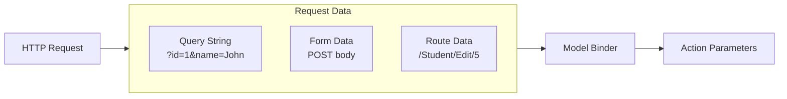
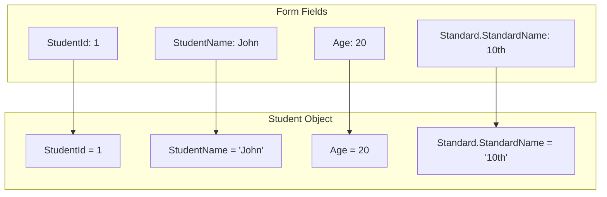

# 📚 Model Binding in ASP.NET Core MVC

## 🎯 Introduction

**Model Binding** in ASP.NET Core automatically maps data from HTTP requests (query strings, form data, route data) to action method parameters. This feature significantly simplifies data extraction from incoming requests. This note covers all model binding concepts from the PPT presentations.

---

## 📋 Table of Contents
1. [What is Model Binding?](#what-is-model-binding)
2. [Binding to Primitive Types](#binding-to-primitive-types)
3. [Binding to Complex Types](#binding-to-complex-types)
4. [FormCollection](#formcollection)
5. [Bind Attribute](#bind-attribute)
6. [HTTP Methods and Model Binding](#http-methods-and-model-binding)
7. [Key Takeaways](#key-takeaways)

---

## 🔷 What is Model Binding?

### Definition

**Model binding** is the process of automatically mapping incoming request data to action method parameters. ASP.NET Core's model binding:
- Maps **URL query strings** to parameters
- Maps **form data** to parameters
- Maps **route data** to parameters
- Is **case-insensitive** (id, Id, ID all work)

### How Model Binding Works



---

## 🔷 Binding to Primitive Types

### Query String Binding

The HTTP GET request embeds data into a query string. MVC framework automatically converts query string to action method parameters if **names match**.

```csharp
// URL: http://localhost/Student/Edit?id=1
public ActionResult Edit(int id)
{
    // id automatically gets value 1 from query string
    return View();
}
```

### Multiple Parameters

```csharp
// URL: http://localhost/Student/Edit?id=1&name=John
public ActionResult Edit(int id, string name)
{
    // id = 1
    // name = "John"
    return View();
}
```

### Case Insensitivity

> [!NOTE]
> Model binding is **case insensitive**. So "id" parameter can be "ID" or "Id" in the URL.

| URL | Works? |
|-----|--------|
| `?id=1` | ✅ Yes |
| `?Id=1` | ✅ Yes |
| `?ID=1` | ✅ Yes |
| `?iD=1` | ✅ Yes |

---

## 🔷 Binding to Complex Types

### What are Complex Types?

Complex types are classes with multiple properties. Model binding automatically maps form fields to properties if **names match**.

### Example Complex Type

```csharp
// Models/Student.cs
public class Student
{
    public int StudentId { get; set; }
    public string StudentName { get; set; }
    public int Age { get; set; }
    public Standard Standard { get; set; }  // Nested complex type
}

public class Standard
{
    public int StandardId { get; set; }
    public string StandardName { get; set; }
}
```

### Action Method with Complex Type

```csharp
[HttpPost]
public ActionResult Edit(Student std)
{
    var id = std.StudentId;
    var name = std.StudentName;
    var age = std.Age;
    var standardName = std.Standard.StandardName;  // Nested property
    
    // Update database...
    
    return RedirectToAction("Index");
}
```

### How It Works

When the form submits:
1. MVC looks at the `Student` parameter type
2. Creates a new `Student` instance
3. Maps each form field to matching property names
4. Passes populated object to action method



### Nested Object Binding

For nested objects, use dot notation in form field names:

```html
<form asp-action="Edit" method="post">
    <input asp-for="StudentId" />
    <input asp-for="StudentName" />
    <input asp-for="Age" />
    <input asp-for="Standard.StandardName" />  <!-- Nested -->
    <button type="submit">Submit</button>
</form>
```

---

## 🔷 FormCollection

### Alternative to Model Binding

You can use `FormCollection` to manually access form values:

```csharp
[HttpPost]
public ActionResult Create(FormCollection collection)
{
    string name = collection["Name"];
    string email = collection["Email"];
    string department = collection["Department"];
    
    // Create employee...
    
    return RedirectToAction("Index");
}
```

### When to Use FormCollection

| Approach | Use Case |
|----------|----------|
| **Model Binding** | Preferred for structured data |
| **FormCollection** | When you don't have a model class |
| **FormCollection** | Dynamic forms with unknown fields |

---

## 🔷 Bind Attribute

### Over-Posting Protection

The `[Bind]` attribute specifies which properties to include/exclude during model binding. This prevents **over-posting attacks**.

### Using Bind to Include Properties

```csharp
[HttpPost]
[ValidateAntiForgeryToken]
public async Task<IActionResult> Create(
    [Bind("Id,Name,Email,Department")] Employee employee)
{
    if (ModelState.IsValid)
    {
        _context.Add(employee);
        await _context.SaveChangesAsync();
        return RedirectToAction(nameof(Index));
    }
    return View(employee);
}
```

### Line-by-Line Explanation

| Line | Code | Explanation |
|------|------|-------------|
| 1 | `[Bind("Id,Name,Email,Department")]` | Only bind these 4 properties |
| 2 | `Employee employee` | Model parameter |
| 3 | Any other property | Will NOT be bound (security) |

### Edit Action with Bind

```csharp
[HttpPost]
[ValidateAntiForgeryToken]
public async Task<IActionResult> Edit(
    int id, 
    [Bind("Id,Name,Email,Department")] Employee employee)
{
    if (id != employee.Id)
    {
        return NotFound();
    }
    
    if (ModelState.IsValid)
    {
        _context.Update(employee);
        await _context.SaveChangesAsync();
        return RedirectToAction(nameof(Index));
    }
    return View(employee);
}
```

---

## 🔷 HTTP Methods and Model Binding

### GET vs POST Binding

| HTTP Method | Data Source | Example |
|-------------|-------------|---------|
| **GET** | Query String, Route | `/Student/Edit?id=1` |
| **POST** | Form Body | Form submission |

### Action Method Attributes

```csharp
// GET - Show edit form
public ActionResult Edit(int id)
{
    var student = _repository.GetById(id);
    return View(student);
}

// POST - Process form submission
[HttpPost]
[ValidateAntiForgeryToken]
public ActionResult Edit(Student student)
{
    if (ModelState.IsValid)
    {
        _repository.Update(student);
        return RedirectToAction("Index");
    }
    return View(student);
}
```

### Delete Action Pattern

```csharp
// GET - Show delete confirmation
public ActionResult Delete(int id)
{
    var student = _repository.GetById(id);
    return View(student);
}

// POST - Perform deletion
[HttpPost]
[ActionName("Delete")]  // Maps to same action name
[ValidateAntiForgeryToken]
public ActionResult DeleteConfirmed(int id)
{
    _repository.Delete(id);
    return RedirectToAction("Index");
}
```

---

## 🔷 Complete Example

### Controller with Model Binding

```csharp
public class EmployeeController : Controller
{
    private readonly IEmployeeRepository _repository;
    
    public EmployeeController(IEmployeeRepository repository)
    {
        _repository = repository;
    }
    
    // GET: /Employee
    public ActionResult Index()
    {
        var employees = _repository.GetAllEmployee();
        return View(employees);
    }
    
    // GET: /Employee/Details/5
    public ActionResult Details(int id)  // id from route
    {
        var employee = _repository.GetEmployee(id);
        return View(employee);
    }
    
    // GET: /Employee/Create
    public ActionResult Create()
    {
        return View();
    }
    
    // POST: /Employee/Create
    [HttpPost]
    [ValidateAntiForgeryToken]
    public ActionResult Create(Employee employee)  // Complex type binding
    {
        try
        {
            if (ModelState.IsValid)
            {
                _repository.Add(employee);
                return RedirectToAction(nameof(Index));
            }
            return View(employee);
        }
        catch
        {
            return View();
        }
    }
    
    // GET: /Employee/Edit/5
    public ActionResult Edit(int id)
    {
        var employee = _repository.GetEmployee(id);
        return View(employee);
    }
    
    // POST: /Employee/Edit/5
    [HttpPost]
    [ValidateAntiForgeryToken]
    public ActionResult Edit(int id, Employee emp)
    {
        try
        {
            if (id == emp.Id && ModelState.IsValid)
            {
                _repository.Update(emp);
                return RedirectToAction(nameof(Index));
            }
            return View(emp);
        }
        catch
        {
            return View();
        }
    }
}
```

---

## 🔷 Key Takeaways

> [!IMPORTANT]
> **Must Remember Points:**

### Quick Reference Q&A

| Question | Answer |
|----------|--------|
| What is model binding? | Automatic mapping of request data to parameters |
| Is it case sensitive? | **No**, case insensitive |
| Primitive type binding source? | Query string, route data |
| Complex type binding source? | Form data (POST body) |
| How to bind nested objects? | Use **dot notation** (e.g., `Standard.StandardName`) |
| What is [Bind] attribute for? | **Over-posting protection** |

### Fill in the Blanks (From PPT)

1. By default, parameter values are retrieved from the request's **data collection**.
2. Model binding is **case insensitive** - "id" can be "ID" or "Id".
3. Model binding also works on **complex types**.
4. For nested objects, use **dot notation** in form field names.
5. The **[Bind]** attribute specifies which properties to include during binding.

### Data Sources Priority

```csharp
// Model binding searches in this order:
1. Form values (POST body)
2. Route values ({controller}/{action}/{id})
3. Query string (?id=1)
```

---

## 📝 Practice Questions

1. What is model binding in ASP.NET Core?
2. How does model binding handle primitive types from query strings?
3. How do you bind nested complex types in forms?
4. What is the purpose of the [Bind] attribute?
5. What is FormCollection and when would you use it?

---

*This is an Extra Note covering additional topics from the PPT presentations*
