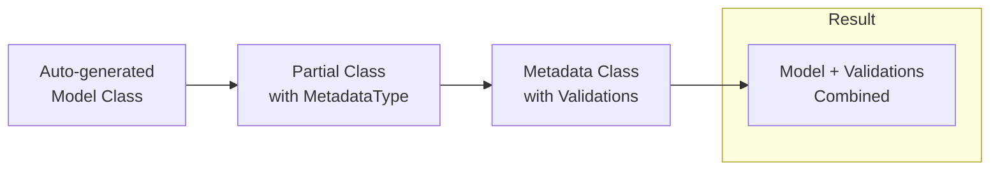

# 📚 Data Annotations & Model Validation in ASP.NET Core

## 🎯 Introduction

**Data Annotations** are attributes that define validation rules and display formatting for model properties. ASP.NET Core uses these annotations for both **client-side** and **server-side validation**. This note covers all validation attributes from the PPT presentations.

---

## 📋 Table of Contents
1. [What are Data Annotations?](#what-are-data-annotations)
2. [Validation Attributes](#validation-attributes)
3. [Display Attributes](#display-attributes)
4. [DataType Attributes](#datatype-attributes)
5. [MetadataType Attribute](#metadatatype-attribute)
6. [Complete Example](#complete-example)
7. [Key Takeaways](#key-takeaways)

---

## 🔷 What are Data Annotations?

### Definition

Data Annotations are attributes from `System.ComponentModel.DataAnnotations` namespace that:
- Define **validation rules**
- Control **display formatting**
- Generate **HTML input types**
- Provide **error messages**

### Namespaces Required

```csharp
using System.ComponentModel;
using System.ComponentModel.DataAnnotations;
```

---

## 🔷 Validation Attributes

### Built-in Validation Attributes Table

| Attribute | Purpose | Example |
|-----------|---------|---------|
| `[Required]` | Field is mandatory | `[Required]` |
| `[Required(ErrorMessage="...")]` | Custom error message | `[Required(ErrorMessage = "Please enter name")]` |
| `[Range(min, max)]` | Numeric range | `[Range(1, 100)]` |
| `[StringLength(max)]` | Max string length | `[StringLength(50)]` |
| `[StringLength(max, MinimumLength = min)]` | Min and max length | `[StringLength(10, MinimumLength = 5)]` |
| `[MinLength(n)]` | Minimum length | `[MinLength(3)]` |
| `[MaxLength(n)]` | Maximum length | `[MaxLength(50)]` |
| `[Compare("property")]` | Compare two properties | `[Compare("Password")]` |
| `[RegularExpression(pattern)]` | Match regex pattern | `[RegularExpression("[0-9]{10}")]` |

### Validation Code Examples

```csharp
public class Customer
{
    [Key]
    public int Id { get; set; }
    
    [Required]
    [DisplayName("Customer Name")]
    [StringLength(15, MinimumLength = 3)]
    public string Name { get; set; }
    
    [Required]
    [Range(18, 105)]
    public int Age { get; set; }
    
    [Required]
    [DataType(DataType.EmailAddress)]
    [RegularExpression(@"^[\w-\._\+%]+@(?:[\w-]+\.)+[\w]{2,6}$", 
        ErrorMessage = "Please enter a valid email address")]
    public string Email { get; set; }
    
    [Compare("Email", ErrorMessage = "Email and confirm Email should match")]
    public string ConfirmEmail { get; set; }
    
    [RegularExpression("[0-9]{10}", 
        ErrorMessage = "Please enter a valid mobile number")]
    [Required(ErrorMessage = "Please enter your phone number")]
    public string Mobile { get; set; }
    
    [RegularExpression("[0-9]{6}", 
        ErrorMessage = "Please enter a valid Postal Code")]
    [Required(ErrorMessage = "Please enter your Pin code")]
    public string PostalCode { get; set; }
}
```

### Line-by-Line Explanation

| Line | Attribute | Explanation |
|------|-----------|-------------|
| 1 | `[Required]` | Name cannot be empty |
| 2 | `[StringLength(15, MinimumLength = 3)]` | Name must be 3-15 characters |
| 3 | `[Range(18, 105)]` | Age must be between 18 and 105 |
| 4 | `[RegularExpression(@"...")]` | Email must match regex pattern |
| 5 | `[Compare("Email")]` | ConfirmEmail must equal Email |
| 6 | `[RegularExpression("[0-9]{10}")]` | Mobile must be exactly 10 digits |

---

## 🔷 Display Attributes

### Display Name Attributes

| Attribute | Purpose | Generated HTML |
|-----------|---------|----------------|
| `[DisplayName("...")]` | Label text | `<label>Employee ID</label>` |
| `[Display(Name = "...")]` | Label text (alternative) | `<label>Hire Date</label>` |
| `[HiddenInput]` | Render as hidden | `<input type="hidden">` |

### Examples

```csharp
public class Employee
{
    [HiddenInput(DisplayValue = false)]
    public int Id { get; set; }
    
    [DisplayName("Employee Name")]  // Using DisplayName
    [Required]
    public string Name { get; set; }
    
    [Display(Name = "Office Email")]  // Using Display
    [Required]
    public string Email { get; set; }
    
    [Display(Name = "Hire Date")]
    [DisplayFormat(DataFormatString = "{0:dd/MM/yyyy}")]
    public DateTime? HireDate { get; set; }
}
```

### DisplayFormat Attribute

```csharp
// Date format
[DisplayFormat(DataFormatString = "{0:dd/MM/yyyy}")]
public DateTime DOB { get; set; }

// Currency format
[DisplayFormat(DataFormatString = "{0:C}")]
public decimal Salary { get; set; }

// Date with 12-hour time format with AM/PM
[DisplayFormat(DataFormatString = "{0:dd/MM/yyyy hh:mm:ss tt}")]
public DateTime HireDate { get; set; }

// Apply format in edit mode
[DisplayFormat(DataFormatString = "{0:d}", ApplyFormatInEditMode = true)]
public DateTime DOB { get; set; }
```

---

## 🔷 DataType Attributes

### HTML Input Type Generation

The `[DataType]` attribute influences the HTML input type generated:

| Attribute | Generated Input | HTML |
|-----------|-----------------|------|
| `[DataType(DataType.Password)]` | Password field | `<input type="password">` |
| `[DataType(DataType.EmailAddress)]` | Email field | `<input type="email">` |
| `[DataType(DataType.Date)]` | Date picker | `<input type="date">` |
| `[DataType(DataType.PhoneNumber)]` | Phone field | `<input type="tel">` |
| `[DataType(DataType.Url)]` | URL field | `<input type="url">` |
| `[DataType(DataType.MultilineText)]` | Textarea | `<textarea>` |
| `[DataType(DataType.Currency)]` | Currency | Formatted currency |

### Complete Example with DataTypes

```csharp
public class CustomerMetadata
{
    [Key]
    public int Id { get; set; }
    
    [Required]
    [DisplayName("Customer Name")]
    public string Name { get; set; }
    
    [Required]
    public string Photo { get; set; }
    
    [StringLength(15, MinimumLength = 8)]
    [Required]
    [DataType(DataType.Password)]  // Renders: <input type="password">
    public string Password { get; set; }
    
    [Required]
    [DataType(DataType.MultilineText)]  // Renders: <textarea>
    public string Address { get; set; }
    
    [Required]
    [DataType(DataType.Date)]  // Renders: <input type="date"> (calendar)
    [DisplayFormat(DataFormatString = "{0:d}", ApplyFormatInEditMode = true)]
    public DateTime DOB { get; set; }
    
    [Required(ErrorMessage = "Please enter your URL correctly")]
    [DataType(DataType.Url)]  // Renders: <input type="url">
    public string URL { get; set; }
    
    [Required]
    [DataType(DataType.EmailAddress)]  // Renders: <input type="email">
    public string Email { get; set; }
    
    [DataType(DataType.PhoneNumber)]  // Renders: <input type="tel">
    public string Mobile { get; set; }
    
    public bool Remember { get; set; }  // bool = checkbox automatically
}
```

---

## 🔷 MetadataType Attribute

### Purpose

The `[MetadataType]` attribute associates a class with a **data-model partial class**. This is useful when:
- Model is auto-generated (Entity Framework)
- You can't modify the original model class
- You want to add validation to existing models

### How It Works

```csharp
// Original Employee class (maybe auto-generated)
public partial class Employee
{
    public int Id { get; set; }
    public string Name { get; set; }
    public string Gender { get; set; }
    public string City { get; set; }
    public int DepartmentId { get; set; }
}

// Add MetadataType to link metadata class
[MetadataType(typeof(EmployeeMetaData))]
public partial class Employee
{
}

// Metadata class with validations
public class EmployeeMetaData
{
    [Required]
    public string Name { get; set; }
    
    [Required]
    public string Gender { get; set; }
    
    [Required]
    public string City { get; set; }
    
    [Required]
    [Display(Name = "Department")]
    public int DepartmentId { get; set; }
}
```

### Benefits



---

## 🔷 Enum Dropdown

### Using Enum for Dropdown

```csharp
// Define enum
public enum Dept
{
    HR,
    Payroll,
    IT
}

// Model with enum property
public class Employee
{
    public int Id { get; set; }
    
    [Required, MaxLength(50, ErrorMessage = "Name cannot exceed 50 characters")]
    public string? Name { get; set; }
    
    [Display(Name = "Office Email")]
    [RegularExpression(@"^[a-zA-Z0-9_.+-]+@[a-zA-Z0-9-]+\.[a-zA-Z0-9-.]+$",
        ErrorMessage = "Invalid email format")]
    [Required]
    public string? Email { get; set; }
    
    [Required]
    public Dept? Department { get; set; }
}
```

### Razor View for Enum Dropdown

```html
<div class="form-group">
    <label asp-for="Department" class="control-label"></label>
    <select asp-for="Department"
            asp-items="Html.GetEnumSelectList<Dept>()">
    </select>
    <span asp-validation-for="Department" class="text-danger"></span>
</div>
```

---

## 🔷 UIHint Attribute

### Custom Display Template

The `[UIHint]` attribute specifies which **template** to use for displaying the property:

```csharp
public class EmployeeMetaData
{
    [DataType(DataType.Url)]
    [UIHint("OpenInNewWindow")]  // Use custom template
    public string PersonalWebSite { get; set; }
}
```

This tells MVC to look for a template named `OpenInNewWindow.cshtml` in:
- `Views/Shared/DisplayTemplates/`
- `Views/Shared/EditorTemplates/`

---

## 🔷 Complete Example

### Full Model with All Validations

```csharp
using System.ComponentModel;
using System.ComponentModel.DataAnnotations;

public class Customer
{
    [Key]
    public int Id { get; set; }
    
    // Name: Required, 3-15 characters
    [Required]
    [DisplayName("Customer Name")]
    [StringLength(15, MinimumLength = 3)]
    public string Name { get; set; }
    
    // Password: Required, 8-15 characters, password field
    [StringLength(15, MinimumLength = 8)]
    [Required]
    [DataType(DataType.Password)]
    public string Password { get; set; }
    
    // Address: Textarea
    [Required]
    [DataType(DataType.MultilineText)]
    public string Address { get; set; }
    
    // DOB: Date picker
    [Required]
    [DataType(DataType.Date)]
    [DisplayFormat(DataFormatString = "{0:d}", ApplyFormatInEditMode = true)]
    public DateTime DOB { get; set; }
    
    // Age: 18-105 range
    [Required]
    [Range(18, 105)]
    public int Age { get; set; }
    
    // URL: URL validation
    [Required(ErrorMessage = "Please enter your URL correctly")]
    [DataType(DataType.Url)]
    public string URL { get; set; }
    
    // Email: Email format + regex validation
    [Required]
    [DataType(DataType.EmailAddress)]
    [RegularExpression(@"^[\w-\._\+%]+@(?:[\w-]+\.)+[\w]{2,6}$", 
        ErrorMessage = "Please enter a valid email address")]
    public string Email { get; set; }
    
    // Confirm Email: Must match Email
    [Compare("Email", ErrorMessage = "Email and confirm Email should match")]
    public string ConfirmEmail { get; set; }
    
    // Mobile: 10 digits
    [RegularExpression("[0-9]{10}", 
        ErrorMessage = "Please enter a valid mobile number")]
    [Required(ErrorMessage = "Please enter your phone number")]
    [DataType(DataType.PhoneNumber)]
    public string Mobile { get; set; }
    
    // Gender: Dropdown (can be string or enum)
    public string Gender { get; set; }
    
    // Remember: Checkbox (bool = checkbox)
    public bool Remember { get; set; }
    
    // Postal Code: 6 digits
    [RegularExpression("[0-9]{6}", 
        ErrorMessage = "Please enter a valid Postal Code")]
    [Required(ErrorMessage = "Please enter your Pin code")]
    public string PostalCode { get; set; }
}
```

---

## 🔷 Key Takeaways

> [!IMPORTANT]
> **Must Remember Points:**

### Quick Reference Table

| Validation Type | Attribute | Example |
|-----------------|-----------|---------|
| Required field | `[Required]` | `[Required(ErrorMessage = "...")]` |
| String length | `[StringLength]` | `[StringLength(50, MinimumLength = 3)]` |
| Numeric range | `[Range]` | `[Range(1, 100)]` |
| Regex pattern | `[RegularExpression]` | `[RegularExpression("[0-9]+")]` |
| Compare fields | `[Compare]` | `[Compare("Password")]` |
| Display name | `[DisplayName]` | `[DisplayName("Emp ID")]` |
| Input type | `[DataType]` | `[DataType(DataType.Password)]` |

### Fill in the Blanks (From PPT)

1. Data annotations are defined in the **System.ComponentModel.DataAnnotations** namespace.
2. `[DataType(DataType.Password)]` renders as **`<input type="password">`**.
3. `[DataType(DataType.MultilineText)]` renders as **`<textarea>`**.
4. The **[MetadataType]** attribute links a metadata class to a model.
5. **bool** properties automatically render as **checkboxes**.
6. **[Compare]** attribute compares two properties of a model.

---

## 📝 Practice Questions

1. What namespace contains data annotation attributes?
2. How do you make a field required with a custom error message?
3. What DataType generates a calendar input?
4. How do you validate that two password fields match?
5. What is the purpose of MetadataType attribute?
6. How do you create a dropdown from an enum?

---

*This is an Extra Note covering additional topics from the PPT presentations*
