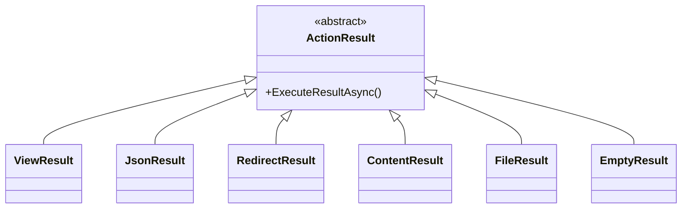
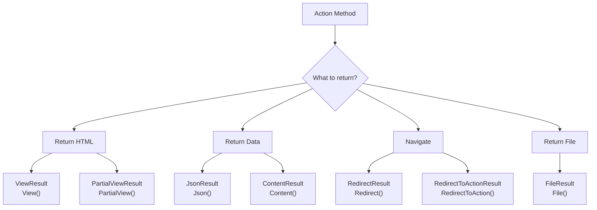

# 📚 Action Results in ASP.NET Core MVC

## 🎯 Introduction

**Action Results** are what controller action methods return to generate HTTP responses. ASP.NET Core MVC provides many result types for different response scenarios - from rendering views to returning JSON data. This note covers all Action Result types from the PPT presentations.

---

## 📋 Table of Contents
1. [What is ActionResult?](#what-is-actionresult)
2. [Result Classes](#result-classes)
3. [Controller Helper Methods](#controller-helper-methods)
4. [ViewResult](#viewresult)
5. [JsonResult](#jsonresult)
6. [Redirect Results](#redirect-results)
7. [Complete Examples](#complete-examples)
8. [Key Takeaways](#key-takeaways)

---

## 🔷 What is ActionResult?

### Definition

`ActionResult` is the **base class** for all action method return types. It encapsulates the result of an action method and is executed by the MVC framework to generate an HTTP response.

### Base Class Hierarchy



### Why Use ActionResult?

The `ActionResult` class is the base class of all result classes, so it can be the **return type** of action method that returns **any result** type:

```csharp
public ActionResult Index()  // Can return any result type
{
    if (someCondition)
        return View();         // ViewResult
    else
        return Json(data);     // JsonResult
}
```

---

## 🔷 Result Classes

### Complete Result Classes Table (From PPT)

| Result Class | Description | Base Controller Method |
|--------------|-------------|------------------------|
| **ViewResult** | Represents HTML and markup | `View()` |
| **EmptyResult** | Represents No response | - |
| **ContentResult** | Represents string literal | `Content()` |
| **FileContentResult** | Content of a file (bytes) | `File()` |
| **FilePathResult** | Content of a file (path) | `File()` |
| **FileStreamResult** | Content of a file (stream) | `File()` |
| **JavaScriptResult** | JavaScript script | `JavaScript()` |
| **JsonResult** | JSON for AJAX | `Json()` |
| **RedirectResult** | Redirection to new URL | `Redirect()` |
| **RedirectToRouteResult** | Redirection to route | `RedirectToRoute()` |
| **PartialViewResult** | Partial view HTML | `PartialView()` |
| **HttpUnauthorizedResult** | HTTP 403 status | - |

### Visual Overview



---

## 🔷 Controller Helper Methods

### Built-in Methods from Controller Base Class

The `Controller` base class includes helper methods that create result objects:

```csharp
public class HomeController : Controller  // Inherits helper methods
{
    // View() - Returns ViewResult
    public IActionResult Index()
    {
        return View();  // Returns ViewResult
    }
    
    // Json() - Returns JsonResult
    public IActionResult GetData()
    {
        return Json(new { id = 1, name = "Test" });
    }
    
    // Content() - Returns ContentResult
    public IActionResult GetText()
    {
        return Content("Hello World");
    }
    
    // Redirect() - Returns RedirectResult
    public IActionResult GoToGoogle()
    {
        return Redirect("https://www.google.com");
    }
    
    // RedirectToAction() - Returns RedirectToActionResult
    public IActionResult GoToIndex()
    {
        return RedirectToAction("Index");
    }
    
    // File() - Returns FileResult
    public IActionResult Download()
    {
        return File(fileBytes, "application/pdf", "document.pdf");
    }
    
    // PartialView() - Returns PartialViewResult
    public IActionResult GetPartial()
    {
        return PartialView("_MyPartial");
    }
}
```

---

## 🔷 ViewResult

### Returning HTML Views

The `View()` method returns a `ViewResult` that renders a Razor view to HTML:

```csharp
public class StudentController : Controller
{
    // Returns default view (Index.cshtml)
    public IActionResult Index()
    {
        return View();
    }
    
    // Returns view with model
    public IActionResult Index()
    {
        List<Student> students = _repository.GetAll();
        return View(students);  // Pass model to view
    }
    
    // Returns specific view
    public IActionResult ShowAll()
    {
        return View("Index");  // Looks for Index.cshtml
    }
    
    // Returns view with model and view name
    public IActionResult Details(int id)
    {
        Student student = _repository.GetById(id);
        return View("StudentDetails", student);
    }
}
```

### View Search Locations

When you call `View()`, MVC searches for the view in this order:
1. `Views/{Controller}/{Action}.cshtml`
2. `Views/Shared/{Action}.cshtml`

```
Views/
├── Student/
│   ├── Index.cshtml        ← View("Index") finds this
│   └── Details.cshtml
└── Shared/
    ├── _Layout.cshtml
    └── Error.cshtml         ← Shared views
```

---

## 🔷 JsonResult

### Returning JSON Data

The `Json()` method returns JSON data, commonly used for **AJAX requests**:

```csharp
public class HomeController : Controller
{
    private readonly IStudentRepository _repository;
    
    public HomeController(IStudentRepository repository)
    {
        _repository = repository;
    }
    
    // Return JSON for all students
    public JsonResult Index()
    {
        List<Student> allStudentDetails = _repository.GetAllStudent();
        return Json(allStudentDetails);
    }
    
    // Return JSON for single student
    public JsonResult GetStudentDetails(int Id)
    {
        Student studentDetails = _repository.GetStudentById(Id);
        return Json(studentDetails);
    }
}
```

### JSON Serialization Options

To handle circular references in JSON serialization:

```csharp
// Program.cs
builder.Services.AddControllersWithViews()
    .AddJsonOptions(options => 
        options.JsonSerializerOptions.ReferenceHandler = ReferenceHandler.IgnoreCycles);
```

Or use `[JsonIgnore]` attribute:

```csharp
public class Employee
{
    public int Id { get; set; }
    public string Name { get; set; }
    public int DepartmentId { get; set; }
    
    [JsonIgnore]  // Prevents circular reference
    public Department? Department { get; set; }
}
```

---

## 🔷 Redirect Results

### Types of Redirects

| Method | Purpose | Example |
|--------|---------|---------|
| `Redirect(url)` | Redirect to URL | External sites |
| `RedirectToAction(action)` | Redirect to action | Same controller |
| `RedirectToAction(action, controller)` | Redirect to action | Different controller |
| `RedirectToRoute(routeName)` | Redirect to named route | Custom routes |

### Code Examples

```csharp
public class EmployeeController : Controller
{
    // Redirect to external URL
    public IActionResult GoToGoogle()
    {
        return Redirect("https://www.google.com");
    }
    
    // Redirect to action in same controller
    public IActionResult Create(Employee employee)
    {
        _repository.Add(employee);
        return RedirectToAction("Index");
        // Or: return RedirectToAction(nameof(Index));
    }
    
    // Redirect to action in different controller
    public IActionResult GoToHome()
    {
        return RedirectToAction("Index", "Home");
    }
    
    // Redirect with route values
    public IActionResult GoToDetails(int id)
    {
        return RedirectToAction("Details", new { id = id });
    }
}
```

### After POST - Redirect Pattern

The **Post-Redirect-Get (PRG)** pattern prevents duplicate form submissions:

```csharp
[HttpPost]
[ValidateAntiForgeryToken]
public ActionResult Create(Employee employee)
{
    if (ModelState.IsValid)
    {
        _repository.Add(employee);
        return RedirectToAction(nameof(Index));  // PRG pattern
    }
    return View(employee);
}
```

---

## 🔷 Other Result Types

### ContentResult

Returns plain text:

```csharp
public IActionResult GetText()
{
    return Content("Hello World", "text/plain");
}
```

### NotFound Result

Returns 404 status:

```csharp
public IActionResult Details(int? id)
{
    if (id == null)
    {
        return NotFound();  // HTTP 404
    }
    
    var employee = _repository.GetById(id.Value);
    if (employee == null)
    {
        return NotFound();
    }
    
    return View(employee);
}
```

### FileResult

Returns file download:

```csharp
public IActionResult Download()
{
    byte[] fileBytes = System.IO.File.ReadAllBytes("path/to/file.pdf");
    return File(fileBytes, "application/pdf", "document.pdf");
}
```

### StatusCode Results

```csharp
public IActionResult CustomStatus()
{
    return StatusCode(418);  // I'm a teapot
}

public IActionResult Forbidden()
{
    return Forbid();  // HTTP 403
}

public IActionResult Unauthorized()
{
    return Unauthorized();  // HTTP 401
}
```

---

## 🔷 Complete Examples

### Controller with Multiple Return Types

```csharp
public class EmployeeController : Controller
{
    private readonly IEmployeeRepository _employeeRepository;
    
    public EmployeeController(IEmployeeRepository employeeRepository)
    {
        _employeeRepository = employeeRepository;
    }
    
    // ViewResult - HTML page
    public ActionResult Index()
    {
        var model = _employeeRepository.GetAllEmployee();
        return View(model);
    }
    
    // ViewResult - Details page
    public ActionResult Details(int id)
    {
        var model = _employeeRepository.GetEmployee(id);
        if (model == null)
        {
            Response.StatusCode = 404;
            return View("Error", new ErrorViewModel { 
                RequestId = Activity.Current?.Id ?? HttpContext.TraceIdentifier 
            });
        }
        return View(model);
    }
    
    // JsonResult - AJAX endpoint
    public IActionResult Display([FromServices] IEmployeeService es)
    {
        var model = es.GetAllEmployee();
        return Json(model);
    }
    
    // ViewResult - Form page
    public ActionResult Create()
    {
        return View();
    }
    
    // RedirectResult - After POST
    [HttpPost]
    [ValidateAntiForgeryToken]
    public ActionResult Create(Employee employee)
    {
        try
        {
            if (ModelState.IsValid)
            {
                _employeeRepository.Add(employee);
                return RedirectToAction(nameof(Index));
            }
            return View(employee);
        }
        catch
        {
            return View(employee);
        }
    }
    
    // RedirectResult - After Delete
    [HttpPost]
    [ActionName("Delete")]
    [ValidateAntiForgeryToken]
    public ActionResult DeleteData(int id)
    {
        try
        {
            _employeeRepository.Delete(id);
            return RedirectToAction(nameof(Index));
        }
        catch
        {
            return View();
        }
    }
}
```

---

## 🔷 Key Takeaways

> [!IMPORTANT]
> **Must Remember Points:**

### Quick Reference Table

| To Return... | Use Method | Result Class |
|--------------|------------|--------------|
| HTML View | `View()` | `ViewResult` |
| JSON Data | `Json()` | `JsonResult` |
| Plain Text | `Content()` | `ContentResult` |
| Redirect to URL | `Redirect()` | `RedirectResult` |
| Redirect to Action | `RedirectToAction()` | `RedirectToActionResult` |
| File Download | `File()` | `FileResult` |
| Partial View | `PartialView()` | `PartialViewResult` |
| 404 Error | `NotFound()` | `NotFoundResult` |

### Fill in the Blanks (From PPT)

1. **ActionResult** is the base class for all result classes.
2. To return JSON data for AJAX, use the **Json()** method.
3. **ViewResult** represents HTML and markup.
4. **RedirectToAction()** redirects to another action in the same or different controller.
5. The **View()** method is defined in the **Controller** base class.
6. To pass data to a view, use `View(**data**)`.

### Return Type Best Practices

```csharp
// Use IActionResult for flexibility
public IActionResult Index()
{
    if (someCondition)
        return View();
    else
        return NotFound();
}

// Use specific type when you always return same type
public ViewResult Details(int id)
{
    return View(_repository.GetById(id));
}

public JsonResult GetJson()
{
    return Json(data);
}
```

---

## 📝 Practice Questions

1. What is ActionResult and why is it used?
2. What method returns a ViewResult?
3. How do you return JSON data for AJAX requests?
4. What is the difference between Redirect() and RedirectToAction()?
5. What result type would you use for file downloads?
6. What is the PRG (Post-Redirect-Get) pattern?

---

*This is an Extra Note covering additional topics from the PPT presentations*
