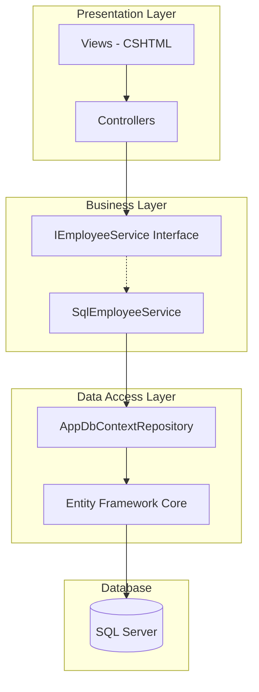
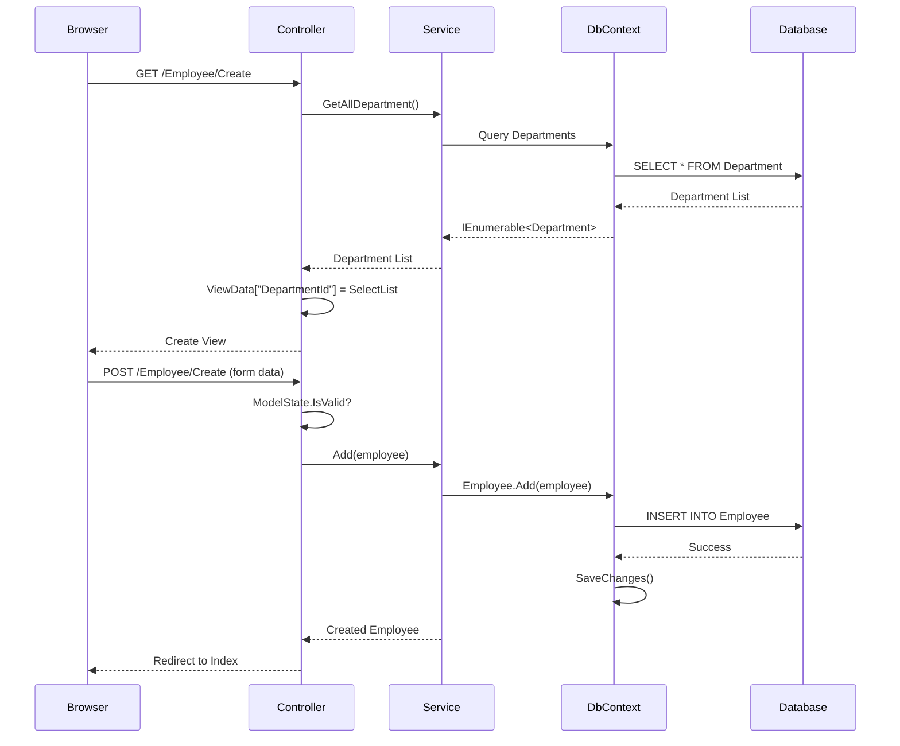

# Entity Framework Core CRUD Operations in ASP.NET Core MVC

## Table of Contents
1. [Introduction](#1-introduction)
2. [Architecture Overview](#2-architecture-overview)
3. [Step-by-Step Implementation](#3-step-by-step-implementation)
4. [Code with Line-by-Line Analysis](#4-code-with-line-by-line-analysis)
5. [Execution Flow](#5-execution-flow)
6. [Best Practices](#6-best-practices)
7. [Quick Reference](#7-quick-reference)

---

## 1. Introduction

### What is Entity Framework Core?
Entity Framework Core (EF Core) is an open-source, lightweight, extensible, and cross-platform Object-Relational Mapper (ORM) for .NET. It enables developers to work with databases using .NET objects, eliminating the need for most data-access code.

### Key Concepts
| Term | Description |
|------|-------------|
| **POCO** | Plain Old CLR Object - Simple classes without framework dependencies |
| **DbContext** | Represents a session with the database |
| **DbSet** | Represents a collection of entities in the context |
| **Migration** | Version control for your database schema |
| **Repository Pattern** | Abstraction layer between data access and business logic |

### Required NuGet Packages
```
Microsoft.EntityFrameworkCore
Microsoft.EntityFrameworkCore.SqlServer
Microsoft.EntityFrameworkCore.Tools
Microsoft.EntityFrameworkCore.Design
Microsoft.Extensions.Configuration.Json
Microsoft.VisualStudio.Web.CodeGeneration.Design
```

---

## 2. Architecture Overview



### Layer Responsibilities
| Layer | Responsibility |
|-------|----------------|
| **Presentation** | Handle HTTP requests, render views |
| **Business** | Business logic, service orchestration |
| **Data Access** | Database operations, entity mappings |
| **Database** | Data persistence |

---

## 3. Step-by-Step Implementation

### Step 1: Create POCO Classes (Models)

#### Department.cs
```csharp
namespace MVCEmpDept.Models
{
    public class Department
    {
        public int Id { get; set; }
        public string? Name { get; set; }
        public ICollection<Employee>? Employees { get; set; }
    }
}
```

#### Line-by-Line Analysis - Department.cs
| Line | Code | Explanation |
|------|------|-------------|
| 1 | `namespace MVCEmpDept.Models` | Declares the namespace for model classes |
| 3 | `public class Department` | Defines the Department entity class |
| 5 | `public int Id { get; set; }` | Primary key property (EF Core convention) |
| 6 | `public string? Name { get; set; }` | Nullable string for department name |
| 7 | `public ICollection<Employee>? Employees` | Navigation property - One-to-Many relationship |

#### Employee.cs
```csharp
using System.ComponentModel;
using System.ComponentModel.DataAnnotations;

namespace MVCEmpDept.Models
{
    public class Employee
    {
        public int Id { get; set; }
        
        [Required]
        [DisplayName("Employee Name")]
        public string? Name { get; set; }
        
        [Required]
        [DataType(DataType.EmailAddress)]
        public string? Email { get; set; }
        
        public int DepartmentId { get; set; }
        public Department? Department { get; set; }
    }
}
```

#### Line-by-Line Analysis - Employee.cs
| Line | Code | Explanation |
|------|------|-------------|
| 1-2 | `using System.ComponentModel...` | Import namespaces for data annotations |
| 6 | `public class Employee` | Defines the Employee entity class |
| 8 | `public int Id { get; set; }` | Primary key (auto-generated by EF Core) |
| 10 | `[Required]` | Validation attribute - field must have value |
| 11 | `[DisplayName("Employee Name")]` | Custom label text for UI display |
| 12 | `public string? Name { get; set; }` | Employee name property |
| 14-15 | `[Required][DataType(...)]` | Stacked validation attributes |
| 18 | `public int DepartmentId` | Foreign key property |
| 19 | `public Department? Department` | Navigation property to parent entity |

---

### Step 2: Create DbContext Class

```csharp
using Microsoft.EntityFrameworkCore;
using MVCEmpDept.Models;

namespace MVCEmpDept.Repository
{
    public class AppdbContextRepository : DbContext
    {
        public AppdbContextRepository(DbContextOptions<AppdbContextRepository> options)
            : base(options)
        {
        }

        public DbSet<Employee> Employee { get; set; }
        public DbSet<Department> Department { get; set; }
    }
}
```

#### Line-by-Line Analysis - AppdbContextRepository.cs
| Line | Code | Explanation |
|------|------|-------------|
| 1 | `using Microsoft.EntityFrameworkCore` | Import EF Core namespace |
| 5 | `public class AppdbContextRepository : DbContext` | Inherit from DbContext base class |
| 7-10 | Constructor with `DbContextOptions` | Accepts configuration options via DI |
| 8 | `: base(options)` | Pass options to base DbContext class |
| 12 | `public DbSet<Employee> Employee` | Creates Employee table representation |
| 13 | `public DbSet<Department> Department` | Creates Department table representation |

---

### Step 3: Create Service Interface

```csharp
using MVCEmpDept.Models;

namespace MVCEmpDept.Service
{
    public interface IEmployeeService
    {
        Employee? GetEmployee(int Id);
        IEnumerable<Employee> GetAllEmployee();
        Employee Add(Employee employee);
        Employee Update(Employee employeeChanges);
        Employee? Delete(int Id);
        IEnumerable<Department> GetAllDepartment();
    }
}
```

#### Line-by-Line Analysis - IEmployeeService.cs
| Line | Code | Explanation |
|------|------|-------------|
| 5 | `public interface IEmployeeService` | Interface for dependency injection abstraction |
| 7 | `Employee? GetEmployee(int Id)` | Get single employee (nullable return) |
| 8 | `IEnumerable<Employee> GetAllEmployee()` | Get all employees as enumerable |
| 9 | `Employee Add(Employee employee)` | Create new employee |
| 10 | `Employee Update(Employee employeeChanges)` | Update existing employee |
| 11 | `Employee? Delete(int Id)` | Delete employee by ID |
| 12 | `IEnumerable<Department> GetAllDepartment()` | Get all departments for dropdowns |

---

### Step 4: Implement Service Class

```csharp
using Microsoft.EntityFrameworkCore;
using MVCEmpDept.Models;
using MVCEmpDept.Repository;

namespace MVCEmpDept.Service
{
    public class SqlEmployeeService : IEmployeeService
    {
        private readonly AppdbContextRepository context;
        
        public SqlEmployeeService(AppdbContextRepository context)
        {
            this.context = context;
        }
        
        public Employee Add(Employee employee)
        {
            context.Employee.Add(employee);
            context.SaveChanges();
            return employee;
        }
        
        public Employee? Delete(int Id)
        {
            Employee? employee = context.Employee.Find(Id);
            if (employee != null)
            {
                context.Employee.Remove(employee);
                context.SaveChanges();
            }
            return employee;
        }
        
        public IEnumerable<Department> GetAllDepartment()
        {
            return context.Department;
        }
        
        public IEnumerable<Employee> GetAllEmployee()
        {
            return context.Employee.Include<Employee>("Department");
        }
        
        public Employee? GetEmployee(int Id)
        {
            Employee e = context.Employee
                .Include(e => e.Department)
                .FirstOrDefault(m => m.Id == Id);
            return e;
        }
        
        public Employee Update(Employee employeeChanges)
        {
            context.Entry(employeeChanges).State = EntityState.Modified;
            context.Update(employeeChanges);
            context.SaveChanges();
            return employeeChanges;
        }
    }
}
```

#### Line-by-Line Analysis - SqlEmployeeService.cs
| Line | Code | Explanation |
|------|------|-------------|
| 7 | `public class SqlEmployeeService : IEmployeeService` | Implements the interface |
| 9 | `private readonly AppdbContextRepository context` | DbContext injected via DI |
| 11-14 | Constructor | Receives DbContext through dependency injection |
| 16-21 | `Add()` method | Adds entity to DbSet, saves changes |
| 18 | `context.Employee.Add(employee)` | Tracks entity in Added state |
| 19 | `context.SaveChanges()` | Persists changes to database |
| 23-31 | `Delete()` method | Finds entity, removes, saves |
| 25 | `context.Employee.Find(Id)` | Finds entity by primary key |
| 28 | `context.Employee.Remove(employee)` | Marks entity for deletion |
| 40 | `Include<Employee>("Department")` | Eager loading of related entity |
| 45-47 | `Include(e => e.Department)` | Lambda syntax for eager loading |
| 52 | `context.Entry(...).State = EntityState.Modified` | Explicitly set entity state |

---

### Step 5: Configure Connection String (appsettings.json)

```json
{
  "ConnectionStrings": {
    "EmployeeDBConnection": "Server=LAPTOP-NAME\\SQLSERVER;Database=EmployeeDB;Trusted_Connection=True;TrustServerCertificate=True"
  }
}
```

---

### Step 6: Configure Services (Program.cs)

```csharp
using Microsoft.EntityFrameworkCore;
using MVCEmpDept.Models;
using MVCEmpDept.Repository;
using MVCEmpDept.Service;
using System.Text.Json.Serialization;

public class Program
{
    public static void Main(string[] args)
    {
        var builder = WebApplication.CreateBuilder(args);

        // Add MVC services with JSON options to handle circular references
        builder.Services.AddControllersWithViews()
            .AddJsonOptions(options =>
                options.JsonSerializerOptions.ReferenceHandler = ReferenceHandler.IgnoreCycles);

        // Configure DbContext with connection string
        builder.Services.AddDbContextPool<AppdbContextRepository>(
            options => options.UseSqlServer(
                builder.Configuration.GetConnectionString("EmployeeDBConnection")));

        // Register service with Scoped lifetime
        builder.Services.AddScoped<IEmployeeService, SqlEmployeeService>();

        var app = builder.Build();

        // Configure HTTP request pipeline
        if (!app.Environment.IsDevelopment())
        {
            app.UseExceptionHandler("/Home/Error");
            app.UseHsts();
        }
        else
        {
            app.UseStatusCodePagesWithRedirects("/Home/Error/{0}");
        }

        app.UseMiddleware<ExceptionHandlingMiddleware>();
        app.UseHttpsRedirection();
        app.UseStaticFiles();
        app.UseRouting();
        app.UseAuthorization();

        app.MapControllerRoute(
            name: "default",
            pattern: "{controller=Employee}/{action=Index}/{id?}");

        app.Run();
    }
}
```

#### Line-by-Line Analysis - Program.cs
| Line | Code | Explanation |
|------|------|-------------|
| 11 | `WebApplication.CreateBuilder(args)` | Creates application builder with defaults |
| 14-16 | `AddControllersWithViews().AddJsonOptions(...)` | Adds MVC services with JSON cycle handling |
| 16 | `ReferenceHandler.IgnoreCycles` | Prevents JSON serialization errors for circular references |
| 19-21 | `AddDbContextPool<...>` | Registers DbContext with connection pooling |
| 24 | `AddScoped<IEmployeeService, SqlEmployeeService>` | Registers service with scoped lifetime |
| 37 | `UseMiddleware<ExceptionHandlingMiddleware>()` | Adds custom exception handling |
| 44-46 | `MapControllerRoute(...)` | Sets up default routing pattern |

---

### Step 7: Create Controller

```csharp
using Microsoft.AspNetCore.Mvc;
using Microsoft.AspNetCore.Mvc.Rendering;
using MVCEmpDept.Models;
using MVCEmpDept.Service;
using System.Diagnostics;

public class EmployeeController : Controller
{
    private IEmployeeService _employeeRepository;
    private readonly ILogger<EmployeeController> _logger;

    public EmployeeController(IEmployeeService employeeRepository,
        ILogger<EmployeeController> logger)
    {
        _employeeRepository = employeeRepository;
        this._logger = logger;
    }

    // Dependency Injection in Action Method
    public IActionResult Display([FromServices] IEmployeeService es)
    {
        var model = es.GetAllEmployee();
        return Json(model);
    }

    // GET: Employee
    public ActionResult Index()
    {
        _logger.LogInformation("Getting emp details");
        var model = _employeeRepository.GetAllEmployee();
        return View(model);
    }

    // GET: Employee/Details/5
    public ActionResult Details(int id)
    {
        var model = _employeeRepository.GetEmployee(id);
        if (model == null)
        {
            Response.StatusCode = 404;
            return View("Error", new ErrorViewModel { 
                RequestId = Activity.Current?.Id ?? HttpContext.TraceIdentifier 
            });
        }
        return View(model);
    }

    // GET: Employee/Create
    public ActionResult Create()
    {
        IEnumerable<Department> DepartmentName = _employeeRepository.GetAllDepartment();
        ViewData["DepartmentId"] = new SelectList(DepartmentName, "Id", "Name");
        return View();
    }

    // POST: Employee/Create
    [HttpPost]
    [ValidateAntiForgeryToken]
    public ActionResult Create(Employee employee)
    {
        IEnumerable<Department> DepartmentName = _employeeRepository.GetAllDepartment();
        try
        {
            if (!ModelState.IsValid)
            {
                var model = _employeeRepository.Add(employee);
                return RedirectToAction(nameof(Index));
            }
            ViewData["DepartmentId"] = new SelectList(DepartmentName, "Id", "Name", employee.DepartmentId);
            return View(employee);
        }
        catch
        {
            return View(employee);
        }
    }

    // GET: Employee/Edit/5
    public ActionResult Edit(int id)
    {
        var model = _employeeRepository.GetEmployee(id);
        if (model == null)
            throw new Exception();

        IEnumerable<Department> DepartmentName = _employeeRepository.GetAllDepartment();
        ViewData["DepartmentId"] = new SelectList(DepartmentName, "Id", "Name", model.DepartmentId);
        return View(model);
    }

    // POST: Employee/Edit/5
    [HttpPost]
    [ValidateAntiForgeryToken]
    public ActionResult Edit(Employee emp)
    {
        if (ModelState.IsValid)
        {
            try
            {
                var model = _employeeRepository.Update(emp);
                return RedirectToAction(nameof(Index));
            }
            catch
            {
                return View(emp);
            }
        }
        IEnumerable<Department> DepartmentName = _employeeRepository.GetAllDepartment();
        ViewData["DepartmentId"] = new SelectList(DepartmentName, "Id", "Name", emp.DepartmentId);
        return View(emp);
    }

    // GET: Employee/Delete/5
    public ActionResult Delete(int id)
    {
        var model = _employeeRepository.GetEmployee(id);
        if (model == null)
            return NotFound();
        return View(model);
    }

    // POST: Employee/Delete/5
    [HttpPost]
    [ActionName("Delete")]
    [ValidateAntiForgeryToken]
    public ActionResult DeleteData(int id)
    {
        try
        {
            var model = _employeeRepository.Delete(id);
            return RedirectToAction(nameof(Index));
        }
        catch
        {
            return View();
        }
    }
}
```

---

## 4. Dependency Injection Types

### Constructor Injection (Recommended)
```csharp
public EmployeeController(IEmployeeService employeeRepository)
{
    _employeeRepository = employeeRepository;
}
```

### Method Injection
```csharp
public IActionResult Display([FromServices] IEmployeeService es)
{
    var model = es.GetAllEmployee();
    return Json(model);
}
```

### View Injection
```cshtml
@using MVCEmpDept.Service
@inject IEmployeeService context

<ol>
    @foreach(var empobj in context.GetAllEmployee())
    {
        <li>@empobj.Name</li>
        <li>@empobj.Email</li>
    }
</ol>
```

---

## 5. Execution Flow

### Create Employee Flow


---

## 6. Best Practices

### DO ✅
| Practice | Reason |
|----------|--------|
| Use `AddDbContextPool` | Better performance through connection pooling |
| Use interfaces for services | Enables unit testing and loose coupling |
| Use `async/await` for I/O | Better scalability |
| Handle null references | Prevent runtime exceptions |
| Use `Include()` for related data | Avoid N+1 query problems |

### DON'T ❌
| Practice | Reason |
|----------|--------|
| Avoid `IFormCollection` | Poor type safety, no model binding |
| Don't skip `SaveChanges()` | Changes won't persist |
| Don't ignore circular references | JSON serialization will fail |
| Don't skip `[ValidateAntiForgeryToken]` | Security vulnerability |

---

## 7. Quick Reference

### EF Core Migration Commands
```powershell
# Add new migration
Add-Migration InitialCreate

# Update database
Update-Database

# Remove last migration
Remove-Migration

# Generate SQL script
Script-Migration
```

### Service Lifetimes
| Lifetime | Description |
|----------|-------------|
| **Transient** | New instance every request |
| **Scoped** | One instance per HTTP request |
| **Singleton** | One instance for application lifetime |

### Common DbContext Methods
| Method | Purpose |
|--------|---------|
| `Add()` | Insert new entity |
| `Update()` | Update existing entity |
| `Remove()` | Delete entity |
| `Find()` | Find by primary key |
| `SaveChanges()` | Persist all changes |
| `Entry().State` | Manually set entity state |

---

## 8. Common Errors & Solutions

### JSON Circular Reference Error
**Error:** `JsonException: A possible object cycle was detected`

**Solution 1:** Configure JSON options
```csharp
builder.Services.AddControllersWithViews()
    .AddJsonOptions(options =>
        options.JsonSerializerOptions.ReferenceHandler = ReferenceHandler.IgnoreCycles);
```

**Solution 2:** Use `[JsonIgnore]` attribute
```csharp
public class Employee
{
    // ... other properties
    
    [JsonIgnore]
    public Department? Department { get; set; }
}
```

---

## 9. Interview Questions

1. **What is the difference between `Add()` and `Update()` in EF Core?**
   - `Add()` tracks entity in Added state, generates INSERT
   - `Update()` tracks entity in Modified state, generates UPDATE

2. **What is the purpose of `SaveChanges()`?**
   - Persists all tracked changes to the database in a single transaction

3. **Explain eager loading vs lazy loading**
   - Eager: Related data loaded with initial query using `Include()`
   - Lazy: Related data loaded on demand when accessed

4. **Why use `AddDbContextPool` instead of `AddDbContext`?**
   - Connection pooling improves performance by reusing connections

5. **What are the three service lifetimes in ASP.NET Core DI?**
   - Transient, Scoped, Singleton
