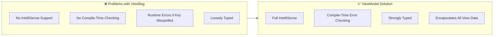
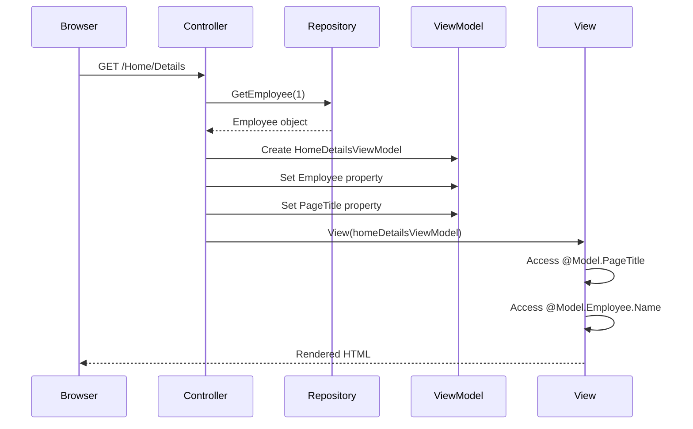
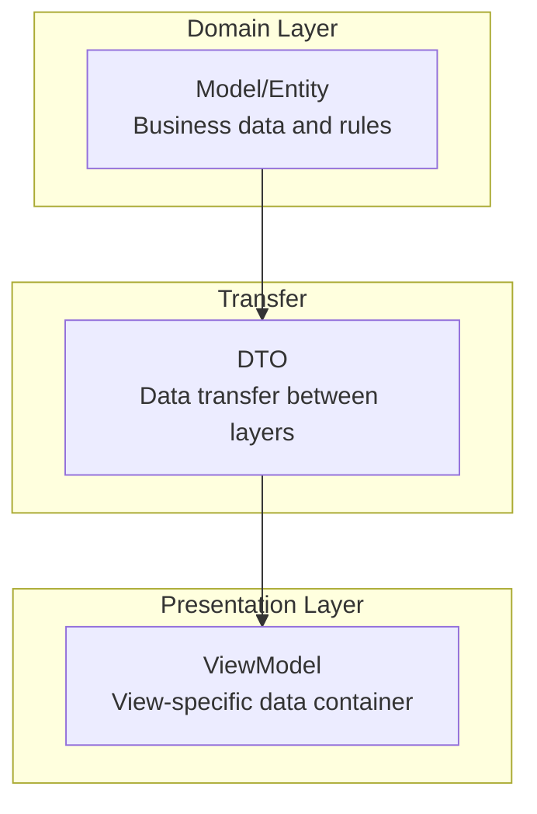

# ViewModel Pattern in ASP.NET Core MVC

## Table of Contents
1. [Introduction](#1-introduction)
2. [Why ViewModel is Needed](#2-why-viewmodel-is-needed)
3. [Creating ViewModels](#3-creating-viewmodels)
4. [Implementation](#4-implementation)
5. [Execution Flow](#5-execution-flow)
6. [Best Practices](#6-best-practices)
7. [Quick Reference](#7-quick-reference)

---

## 1. Introduction

### What is a ViewModel?
A ViewModel is a class that contains all the data a view needs. It acts as a bridge between the Controller and the View, combining data from multiple sources into a single object specifically designed for a particular view.

### Key Terminology
| Term | Description |
|------|-------------|
| **ViewModel** | A class containing data specifically designed for a view |
| **Model** | Represents the domain/business data (e.g., Employee, Department) |
| **DTO** | Data Transfer Object - used to transfer data between layers |
| **Strongly-Typed View** | A view that specifies its model type using @model directive |

---

## 2. Why ViewModel is Needed

### The Problem: Passing Multiple Data Types to a View

Consider this scenario where a controller needs to pass both employee details and a page title to a view:

```csharp
public class HomeController : Controller
{
    public ViewResult Details()
    {
        Employee model = _employeeRepository.GetEmployee(1);
        ViewBag.PageTitle = "Employee Details";  // ❌ Not ideal
        
        return View(model);
    }
}
```

### Problems with Using ViewBag/ViewData



### Comparison: ViewBag vs ViewModel

| Aspect | ViewBag | ViewModel |
|--------|---------|-----------|
| **Type Safety** | ❌ No | ✅ Yes |
| **IntelliSense** | ❌ No | ✅ Yes |
| **Compile-Time Checking** | ❌ No | ✅ Yes |
| **Refactoring Support** | ❌ Poor | ✅ Excellent |
| **Testability** | ❌ Difficult | ✅ Easy |
| **Maintenance** | ❌ Error-Prone | ✅ Clean |

---

## 3. Creating ViewModels

### Step 1: Create ViewModels Folder
Create a folder named `ViewModels` at the root of your project for better organization.

```
ProjectRoot/
├── Controllers/
├── Models/
├── ViewModels/       ← Create this folder
│   └── HomeDetailsViewModel.cs
├── Views/
└── ...
```

### Step 2: Create ViewModel Class

```csharp
using EmployeeManagement.Models;

namespace EmployeeManagement.ViewModels
{
    public class HomeDetailsViewModel
    {
        public Employee Employee { get; set; }
        public string PageTitle { get; set; }
    }
}
```

#### Line-by-Line Analysis
| Line | Code | Explanation |
|------|------|-------------|
| 1 | `using EmployeeManagement.Models` | Import the Models namespace to access Employee class |
| 3 | `namespace EmployeeManagement.ViewModels` | Separate namespace for ViewModels |
| 5 | `public class HomeDetailsViewModel` | ViewModel class named after Controller + Action |
| 7 | `public Employee Employee { get; set; }` | Property to hold Employee domain model |
| 8 | `public string PageTitle { get; set; }` | Property to hold page-specific data |

### Naming Convention
| Component | Pattern | Example |
|-----------|---------|---------|
| Controller | HomeController | "Home" |
| Action | Details() | "Details" |
| ViewModel | Home + Details + ViewModel | `HomeDetailsViewModel` |

---

## 4. Implementation

### Controller Code

```csharp
using EmployeeManagement.Models;
using EmployeeManagement.ViewModels;
using Microsoft.AspNetCore.Mvc;

public class HomeController : Controller
{
    private IEmployeeRepository _employeeRepository;

    public HomeController(IEmployeeRepository employeeRepository)
    {
        _employeeRepository = employeeRepository;
    }

    public ViewResult Details()
    {
        // Instantiate ViewModel and populate with data
        HomeDetailsViewModel homeDetailsViewModel = new HomeDetailsViewModel()
        {
            Employee = _employeeRepository.GetEmployee(1),
            PageTitle = "Employee Details"
        };

        // Pass the ViewModel to the View
        return View(homeDetailsViewModel);
    }
}
```

#### Line-by-Line Analysis - Controller
| Line | Code | Explanation |
|------|------|-------------|
| 1-2 | `using` statements | Import Models and ViewModels namespaces |
| 6 | `private IEmployeeRepository` | Field to hold injected repository |
| 8-11 | Constructor | Dependency injection of repository |
| 13 | `public ViewResult Details()` | Action method returning ViewResult |
| 16-20 | `new HomeDetailsViewModel()` | Object initializer syntax to create and populate ViewModel |
| 18 | `Employee = _employeeRepository.GetEmployee(1)` | Get employee from repository |
| 19 | `PageTitle = "Employee Details"` | Set page title |
| 23 | `return View(homeDetailsViewModel)` | Pass ViewModel to View() helper |

### View Code

```cshtml
@model EmployeeManagement.ViewModels.HomeDetailsViewModel

<html>
<head>
    <title></title>
</head>
<body>
    <h3>@Model.PageTitle</h3>

    <div>
        Name : @Model.Employee.Name
    </div>
    <div>
        Email : @Model.Employee.Email
    </div>
    <div>
        Department : @Model.Employee.Department
    </div>
</body>
</html>
```

#### Line-by-Line Analysis - View
| Line | Code | Explanation |
|------|------|-------------|
| 1 | `@model HomeDetailsViewModel` | Declares the ViewModel type (lowercase 'm') |
| 8 | `@Model.PageTitle` | Access PageTitle property (uppercase 'M') |
| 11 | `@Model.Employee.Name` | Navigate to nested Employee properties |
| 14 | `@Model.Employee.Email` | Access Employee's Email |
| 17 | `@Model.Employee.Department` | Access Employee's Department |

### Important: @model vs @Model

| Directive | Case | Purpose |
|-----------|------|---------|
| `@model` | lowercase | Declares the type of model the view expects |
| `@Model` | UPPERCASE | Accesses the instance of the model passed to the view |

---

## 5. Execution Flow



### Step-by-Step Execution
1. **Request Arrives**: Browser sends GET request to `/Home/Details`
2. **Controller Action Invoked**: MVC routing invokes `Details()` method
3. **Data Retrieval**: Controller fetches Employee from repository
4. **ViewModel Creation**: Controller creates new `HomeDetailsViewModel` instance
5. **Data Population**: Controller populates ViewModel with Employee and PageTitle
6. **View Rendering**: Controller passes ViewModel to View via `View()` helper
7. **Data Access in View**: View accesses ViewModel properties using `@Model`
8. **HTML Response**: Rendered HTML is sent back to browser

---

## 6. Best Practices

### DO ✅
| Practice | Reason |
|----------|--------|
| Use separate ViewModels folder | Better code organization |
| Name ViewModels descriptively | `{Controller}{Action}ViewModel` pattern |
| Include only view-specific data | Keep ViewModels focused |
| Use strongly-typed views | Compile-time checking |
| Prefer ViewModels over ViewBag | Type safety and IntelliSense |

### DON'T ❌
| Practice | Reason |
|----------|--------|
| Don't put business logic in ViewModels | ViewModels are for data transfer only |
| Don't add unrelated properties | Keep it focused on single view |
| Don't skip validation attributes | Apply validation as needed |
| Don't mix ViewBag with ViewModel | Choose one approach consistently |

---

## 7. Quick Reference

### ViewModel vs Model vs DTO



| Type | Purpose | Example |
|------|---------|---------|
| **Model** | Domain/business entities | `Employee`, `Department` |
| **DTO** | Transfer data between layers | `EmployeeDTO` |
| **ViewModel** | Data specifically for a view | `HomeDetailsViewModel` |

### Creating ViewModels Checklist

- [ ] Create `ViewModels` folder in project root
- [ ] Name class using `{Controller}{Action}ViewModel` pattern
- [ ] Add properties for all data the view needs
- [ ] Add `using` statement for Models namespace
- [ ] Update view with `@model` directive
- [ ] Replace ViewBag/ViewData with ViewModel properties

---

## 8. Advanced ViewModel Scenarios

### ViewModel with Multiple Entities

```csharp
public class DashboardViewModel
{
    public Employee Employee { get; set; }
    public IEnumerable<Department> Departments { get; set; }
    public string PageTitle { get; set; }
    public int TotalEmployees { get; set; }
    public DateTime LastUpdated { get; set; }
}
```

### ViewModel with Validation

```csharp
using System.ComponentModel.DataAnnotations;

public class CreateEmployeeViewModel
{
    [Required(ErrorMessage = "Name is required")]
    [MaxLength(50)]
    public string Name { get; set; }

    [Required]
    [EmailAddress]
    public string Email { get; set; }

    [Display(Name = "Department")]
    public int DepartmentId { get; set; }

    public IEnumerable<SelectListItem> Departments { get; set; }
}
```

### ViewModel with SelectList for Dropdowns

```csharp
public class EmployeeCreateViewModel
{
    public Employee Employee { get; set; }
    public SelectList DepartmentList { get; set; }
}
```

---

## 9. Interview Questions

1. **What is a ViewModel in ASP.NET Core MVC?**
   - A class specifically designed to hold data required by a view, combining data from multiple sources into a single object.

2. **Why use ViewModel instead of ViewBag?**
   - Type safety, IntelliSense support, compile-time checking, better refactoring support, and improved testability.

3. **What's the difference between @model and @Model?**
   - `@model` (lowercase) declares the type; `@Model` (uppercase) accesses the instance.

4. **Can a ViewModel contain multiple entities?**
   - Yes, a ViewModel can contain properties of different types, combined specifically for a view's needs.

5. **Where should ViewModels be placed in the project?**
   - In a dedicated `ViewModels` folder at the project root or within specific feature folders.

---

## 10. Practice Exercise

Create a ViewModel for an Employee Edit page that:
1. Contains Employee data
2. Has a dropdown for Department selection
3. Includes page title
4. Has a success message property

```csharp
// Your solution here
public class EmployeeEditViewModel
{
    public Employee Employee { get; set; }
    public IEnumerable<SelectListItem> DepartmentList { get; set; }
    public string PageTitle { get; set; }
    public string SuccessMessage { get; set; }
}
```
