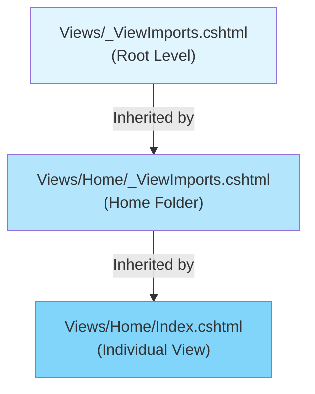

# _ViewImports.cshtml Configuration in ASP.NET Core MVC

## Table of Contents
1. [Introduction](#1-introduction)
2. [Purpose and Benefits](#2-purpose-and-benefits)
3. [Supported Directives](#3-supported-directives)
4. [Hierarchical Behavior](#4-hierarchical-behavior)
5. [Implementation Examples](#5-implementation-examples)
6. [Best Practices](#6-best-practices)
7. [Quick Reference](#7-quick-reference)

---

## 1. Introduction

### What is _ViewImports.cshtml?
`_ViewImports.cshtml` is a special Razor file used to include common namespaces, directives, and tag helpers that should be available to multiple views. Instead of adding repetitive `@using` statements to every view, you define them once in `_ViewImports.cshtml`.

### File Location
```
Views/
├── _ViewImports.cshtml     ← Root level (affects all views)
├── _ViewStart.cshtml
├── Home/
│   ├── _ViewImports.cshtml ← Folder level (affects Home views only)
│   ├── Index.cshtml
│   └── Details.cshtml
├── Employee/
│   └── Index.cshtml
└── Shared/
    └── _Layout.cshtml
```

---

## 2. Purpose and Benefits

### The Problem: Repetitive Code

Without `_ViewImports.cshtml`, you need to add namespace imports to every view:

```cshtml
@* In Index.cshtml *@
@using EmployeeManagement.Models
@using EmployeeManagement.ViewModels
@model HomeDetailsViewModel

@* In Details.cshtml *@
@using EmployeeManagement.Models
@using EmployeeManagement.ViewModels
@model EmployeeDetailsViewModel

@* Repeated in every view! ❌ *@
```

### The Solution: Centralized Configuration

With `_ViewImports.cshtml`:

```cshtml
@* _ViewImports.cshtml - Define once *@
@using EmployeeManagement.Models
@using EmployeeManagement.ViewModels
@addTagHelper *, Microsoft.AspNetCore.Mvc.TagHelpers
```

```cshtml
@* Index.cshtml - Clean! ✅ *@
@model HomeDetailsViewModel

<h1>Welcome</h1>
```

### Benefits Comparison

| Without _ViewImports | With _ViewImports |
|---------------------|-------------------|
| ❌ Repetitive code | ✅ DRY principle |
| ❌ Easy to forget imports | ✅ Consistent across views |
| ❌ Harder to maintain | ✅ Single point of change |
| ❌ Longer view files | ✅ Cleaner view files |

---

## 3. Supported Directives

### All Supported Directives in _ViewImports.cshtml

| Directive | Purpose | Example |
|-----------|---------|---------|
| `@using` | Import namespaces | `@using EmployeeManagement.Models` |
| `@addTagHelper` | Enable tag helpers | `@addTagHelper *, Microsoft.AspNetCore.Mvc.TagHelpers` |
| `@removeTagHelper` | Disable specific tag helpers | `@removeTagHelper AuthoringTagHelper, MyAssembly` |
| `@tagHelperPrefix` | Set prefix for tag helpers | `@tagHelperPrefix th:` |
| `@model` | Set default model (rarely used here) | `@model BaseViewModel` |
| `@inherits` | Set base class for views | `@inherits CustomRazorPage<TModel>` |
| `@inject` | Inject services into views | `@inject IConfiguration Config` |

---

### 3.1 @using Directive

Import namespaces to make types available without fully qualified names.

```cshtml
@* _ViewImports.cshtml *@
@using EmployeeManagement.Models
@using EmployeeManagement.ViewModels
@using EmployeeManagement.Services
@using System.Collections.Generic
```

#### Line-by-Line Analysis
| Line | Code | Explanation |
|------|------|-------------|
| 1 | `@using EmployeeManagement.Models` | Makes all types in Models namespace accessible |
| 2 | `@using EmployeeManagement.ViewModels` | Makes ViewModels accessible |
| 3 | `@using EmployeeManagement.Services` | Makes Services accessible |
| 4 | `@using System.Collections.Generic` | Makes generic collections accessible |

---

### 3.2 @addTagHelper Directive

Enable tag helpers in views.

```cshtml
@* Enable ALL built-in tag helpers *@
@addTagHelper *, Microsoft.AspNetCore.Mvc.TagHelpers

@* Enable specific tag helper *@
@addTagHelper AuthoringTagHelper, MyAssembly

@* Enable tag helpers from your application *@
@addTagHelper *, EmployeeManagement
```

#### Syntax Breakdown
```
@addTagHelper {TagHelper}, {Assembly}
```

| Part | Description | Example |
|------|-------------|---------|
| `*` | Wildcard - all tag helpers | `@addTagHelper *, Assembly` |
| TagHelper Name | Specific tag helper class | `@addTagHelper AnchorTagHelper, Assembly` |
| Assembly | Assembly containing tag helpers | `Microsoft.AspNetCore.Mvc.TagHelpers` |

---

### 3.3 @tagHelperPrefix Directive

Require a prefix for tag helper attributes to distinguish from regular HTML.

```cshtml
@* _ViewImports.cshtml *@
@tagHelperPrefix th:
```

```cshtml
@* In View - with prefix *@
<a th:asp-controller="Home" th:asp-action="Index">Home</a>

@* Without prefix - treated as regular HTML *@
<a asp-controller="Home" asp-action="Index">Home</a>  @* Won't work! *@
```

---

### 3.4 @inject Directive

Inject services into views using dependency injection.

```cshtml
@* _ViewImports.cshtml *@
@inject IConfiguration Configuration
@inject IHttpContextAccessor HttpContextAccessor
@inject IEmployeeService EmployeeService
```

```cshtml
@* In View - use injected service *@
<p>App Name: @Configuration["AppName"]</p>
<p>User: @HttpContextAccessor.HttpContext.User.Identity.Name</p>
```

---

## 4. Hierarchical Behavior

### How Hierarchy Works



### Inheritance Rules

| Level | Scope | Overrides |
|-------|-------|-----------|
| **Root** (`Views/_ViewImports.cshtml`) | All views in application | - |
| **Folder** (`Views/Home/_ViewImports.cshtml`) | Views in Home folder only | Root settings |
| **View** (Individual .cshtml file) | Single view only | Folder & Root settings |

### Example: Hierarchical Configuration

```cshtml
@* Views/_ViewImports.cshtml - Root Level *@
@using EmployeeManagement.Models
@using EmployeeManagement.ViewModels
@addTagHelper *, Microsoft.AspNetCore.Mvc.TagHelpers
```

```cshtml
@* Views/Admin/_ViewImports.cshtml - Admin Folder *@
@using EmployeeManagement.Admin.ViewModels
@inject IAdminService AdminService
@* Inherits from root + adds admin-specific imports *@
```

```cshtml
@* Views/Admin/Dashboard.cshtml - Individual View *@
@model AdminDashboardViewModel
@* Has access to: 
   - EmployeeManagement.Models (from root)
   - EmployeeManagement.ViewModels (from root)
   - Tag Helpers (from root)
   - EmployeeManagement.Admin.ViewModels (from folder)
   - IAdminService (from folder)
*@
```

---

## 5. Implementation Examples

### Basic _ViewImports.cshtml

```cshtml
@using EmployeeManagement
@using EmployeeManagement.Models
@using EmployeeManagement.ViewModels
@addTagHelper *, Microsoft.AspNetCore.Mvc.TagHelpers
```

### Advanced _ViewImports.cshtml

```cshtml
@* Namespace Imports *@
@using EmployeeManagement
@using EmployeeManagement.Models
@using EmployeeManagement.ViewModels
@using EmployeeManagement.Helpers
@using System.Globalization

@* Tag Helpers *@
@addTagHelper *, Microsoft.AspNetCore.Mvc.TagHelpers
@addTagHelper *, EmployeeManagement

@* Dependency Injection *@
@inject IConfiguration Configuration
@inject IHttpContextAccessor HttpContextAccessor

@* Optional: Set tag helper prefix *@
@* @tagHelperPrefix th: *@
```

### Line-by-Line Analysis
| Line | Code | Explanation |
|------|------|-------------|
| 2-6 | `@using` statements | Import common namespaces |
| 9 | `@addTagHelper *, Microsoft...` | Enable built-in tag helpers (form, anchor, etc.) |
| 10 | `@addTagHelper *, EmployeeManagement` | Enable custom tag helpers from app |
| 13 | `@inject IConfiguration Configuration` | Inject configuration service |
| 14 | `@inject IHttpContextAccessor` | Inject HTTP context accessor |

---

## 6. Best Practices

### DO ✅

| Practice | Reason |
|----------|--------|
| Place common namespaces in root `_ViewImports.cshtml` | DRY principle, consistent access |
| Use folder-level `_ViewImports.cshtml` for area-specific imports | Keep imports organized |
| Always include `@addTagHelper` for built-in tag helpers | Enables form helpers, anchor helpers, etc. |
| Group related `@using` statements | Better readability |

### DON'T ❌

| Practice | Reason |
|----------|--------|
| Don't overload with too many `@inject` | Can impact view performance |
| Don't add rarely-used namespaces | Keep it focused |
| Don't define `@model` in `_ViewImports.cshtml` | Each view should specify its own model |
| Don't forget to add new ViewModels namespace | Views won't find ViewModel classes |

---

## 7. Quick Reference

### Default _ViewImports.cshtml Template

```cshtml
@using YourApplicationName
@using YourApplicationName.Models
@using YourApplicationName.ViewModels
@addTagHelper *, Microsoft.AspNetCore.Mvc.TagHelpers
```

### Directive Summary Table

| Directive | Required | Common Usage |
|-----------|----------|--------------|
| `@using` | ✅ Yes | Always include Models and ViewModels |
| `@addTagHelper` | ✅ Yes | Required for tag helpers to work |
| `@inject` | Optional | Only when services needed in views |
| `@tagHelperPrefix` | Optional | When disambiguation is needed |
| `@model` | ❌ No | Specify in individual views |
| `@inherits` | ❌ Rare | Only for custom base pages |

### Troubleshooting

| Issue | Solution |
|-------|----------|
| Tag helpers not working | Add `@addTagHelper *, Microsoft.AspNetCore.Mvc.TagHelpers` |
| Type not found in view | Add `@using Namespace.Name` to _ViewImports |
| Changes not reflecting | Restart application or clear cache |
| Folder-specific imports not working | Check file is named exactly `_ViewImports.cshtml` |

---

## 8. Interview Questions

1. **What is the purpose of _ViewImports.cshtml?**
   - To define common directives (using, addTagHelper, inject) that are automatically available to all views, following DRY principle.

2. **What directives are supported in _ViewImports.cshtml?**
   - @using, @addTagHelper, @removeTagHelper, @tagHelperPrefix, @model, @inherits, @inject

3. **How does the hierarchical behavior work?**
   - Settings from parent folders are inherited. Folder-level settings override root settings, and individual view settings override folder settings.

4. **Why is @addTagHelper important?**
   - Without it, built-in tag helpers (asp-controller, asp-action, asp-for, etc.) won't work in views.

5. **Can you have multiple _ViewImports.cshtml files?**
   - Yes, you can have one at root level and additional ones in specific view folders for area-specific imports.
