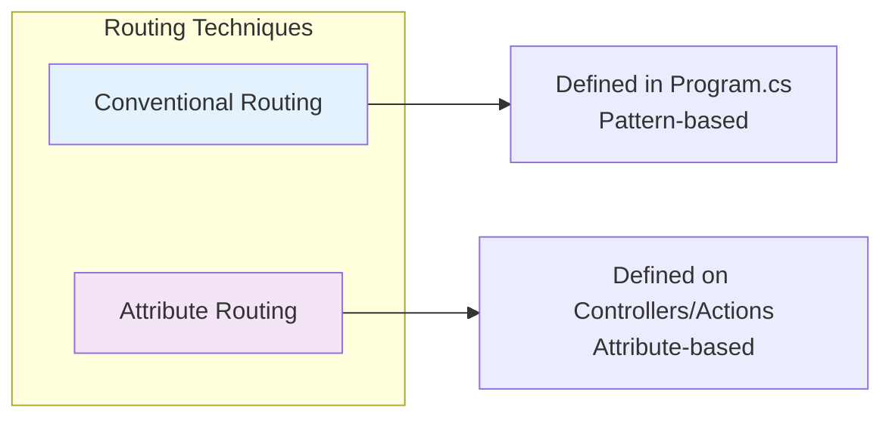
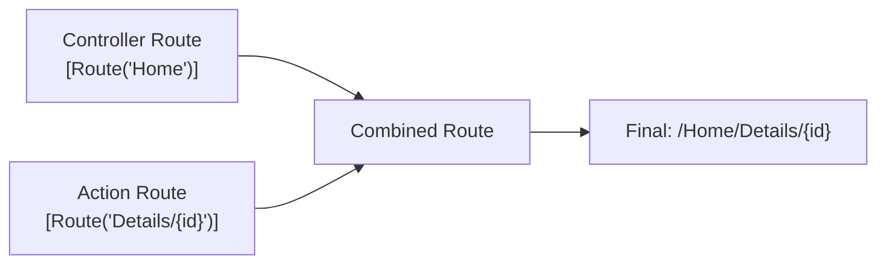
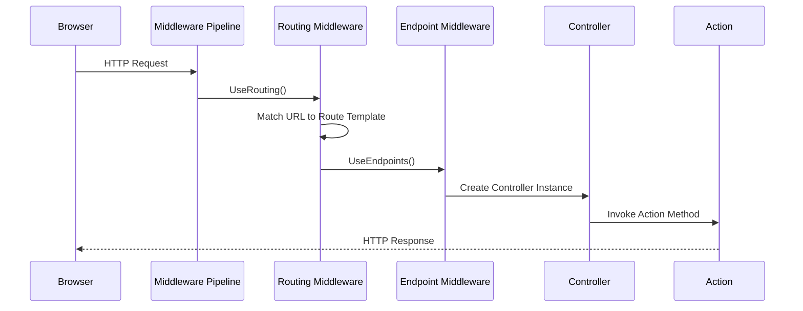

# Routing Fundamentals in ASP.NET Core MVC

## Table of Contents
1. [Introduction](#1-introduction)
2. [Conventional Routing](#2-conventional-routing)
3. [Attribute Routing](#3-attribute-routing)
4. [Route Parameters](#4-route-parameters)
5. [Token Replacement](#5-token-replacement)
6. [Execution Flow](#6-execution-flow)
7. [Best Practices](#7-best-practices)
8. [Quick Reference](#8-quick-reference)

---

## 1. Introduction

### What is Routing?
Routing is the mechanism that maps incoming HTTP requests to specific controller action methods. It determines which code handles each request based on the URL pattern.

### Two Routing Techniques in ASP.NET Core MVC



| Type | Definition Location | Best For |
|------|---------------------|----------|
| **Conventional** | Program.cs (centralized) | MVC apps serving HTML pages |
| **Attribute** | Controllers/Actions (decentralized) | REST APIs |

---

## 2. Conventional Routing

### Default Route Configuration

```csharp
// Program.cs
var app = builder.Build();

app.UseRouting();

app.UseEndpoints(endpoints =>
{
    endpoints.MapControllerRoute(
        name: "default",
        pattern: "{controller=Home}/{action=Index}/{id?}");
});

// Or simplified version
app.MapControllerRoute(
    name: "default",
    pattern: "{controller=Home}/{action=Index}/{id?}");
```

### Route Template Breakdown

```
{controller=Home}/{action=Index}/{id?}
```

| Segment | Meaning | Example |
|---------|---------|---------|
| `{controller=Home}` | Controller name (default: Home) | `/Employees` → EmployeesController |
| `{action=Index}` | Action method name (default: Index) | `/Details` → Details() |
| `{id?}` | Optional parameter | `/1` → id = 1 |

### URL to Action Mapping Examples

| URL | Controller | Action | id |
|-----|------------|--------|-----|
| `/` | HomeController | Index() | null |
| `/Home` | HomeController | Index() | null |
| `/Home/Index` | HomeController | Index() | null |
| `/Employees/Details/1` | EmployeesController | Details(1) | 1 |
| `/Employees/Details` | EmployeesController | Details() | null |

### Line-by-Line Analysis
| Line | Code | Explanation |
|------|------|-------------|
| 1 | `endpoints.MapControllerRoute(` | Configures MVC routing |
| 2 | `name: "default"` | Names this route for reference |
| 3 | `pattern: "{controller=Home}..."` | Defines URL pattern template |
| - | `{controller=Home}` | First segment maps to controller, default is "Home" |
| - | `{action=Index}` | Second segment maps to action, default is "Index" |
| - | `{id?}` | Third segment is optional id parameter |

---

## 3. Attribute Routing

### Basic Attribute Routing

```csharp
public class HomeController : Controller
{
    [Route("")]           // Matches: /
    [Route("Home")]       // Matches: /Home
    [Route("Home/Index")] // Matches: /Home/Index
    public ViewResult Index()
    {
        return View();
    }
}
```

### Controller-Level Route Attribute

```csharp
[Route("Home")]
public class HomeController : Controller
{
    [Route("")]           // Matches: /Home
    [Route("Index")]      // Matches: /Home/Index
    public ViewResult Index()
    {
        var model = _employeeRepository.GetAllEmployees();
        return View(model);
    }

    [Route("Details/{id?}")] // Matches: /Home/Details/5
    public ViewResult Details(int? id)
    {
        HomeDetailsViewModel viewModel = new HomeDetailsViewModel()
        {
            Employee = _employeeRepository.GetEmployee(id ?? 1),
            PageTitle = "Employee Details"
        };
        return View(viewModel);
    }
}
```

### Hierarchical Route Combining



### Absolute vs Relative Routes

```csharp
[Route("Home")]
public class HomeController : Controller
{
    [Route("/")]        // ABSOLUTE - /
    [Route("")]         // RELATIVE - /Home
    [Route("Index")]    // RELATIVE - /Home/Index
    public ViewResult Index()
    {
        return View();
    }
}
```

| Route Type | Prefix | Example | Result |
|------------|--------|---------|--------|
| **Relative** | No `/` | `[Route("Index")]` | `/Home/Index` |
| **Absolute** | Starts with `/` | `[Route("/")]` | `/` |

---

## 4. Route Parameters

### Required Parameters

```csharp
[Route("Home/Details/{id}")]
public ViewResult Details(int id)
{
    // id is required - 404 if missing
    var employee = _employeeRepository.GetEmployee(id);
    return View(employee);
}
```

### Optional Parameters

```csharp
[Route("Home/Details/{id?}")]   // ? makes id optional
public ViewResult Details(int? id)  // ? makes parameter nullable
{
    // If id is null, use default value 1
    var employee = _employeeRepository.GetEmployee(id ?? 1);
    return View(employee);
}
```

### Line-by-Line Analysis
| Line | Code | Explanation |
|------|------|-------------|
| 1 | `[Route("Home/Details/{id?}")]` | `{id?}` - question mark makes route parameter optional |
| 2 | `public ViewResult Details(int? id)` | `int?` - nullable int matches optional route parameter |
| 5 | `id ?? 1` | Null coalescing - use 1 if id is null |

### Multiple Route Parameters

```csharp
[Route("Products/{category}/{id?}")]
public IActionResult Product(string category, int? id)
{
    // category is required, id is optional
    return View();
}
```

### Route Constraints

```csharp
[Route("Employees/{id:int}")]           // id must be integer
[Route("Employees/{id:int:min(1)}")]    // id must be int >= 1
[Route("Products/{name:alpha}")]         // name must be alphabetic
[Route("Documents/{*path}")]             // Catch-all parameter
```

| Constraint | Description | Example |
|------------|-------------|---------|
| `{id:int}` | Must be integer | `/5` ✅ `/abc` ❌ |
| `{id:min(1)}` | Minimum value | `/1` ✅ `/0` ❌ |
| `{name:alpha}` | Alphabetic only | `/test` ✅ `/123` ❌ |
| `{*path}` | Catch-all (rest of URL) | `/docs/a/b/c` |

---

## 5. Token Replacement

### Using [controller] and [action] Tokens

```csharp
[Route("[controller]/[action]")]
public class DepartmentsController : Controller
{
    public string List()
    {
        return "List() of DepartmentsController";
    }

    public string Details()
    {
        return "Details() of DepartmentsController";
    }
}
```

### Token Replacement Results
| Action | Generated Route |
|--------|-----------------|
| `DepartmentsController.List()` | `/Departments/List` |
| `DepartmentsController.Details()` | `/Departments/Details` |

### Advantages of Token Replacement
- ✅ Automatically updates if controller/action is renamed
- ✅ Less maintenance
- ✅ Reduces typos
- ✅ Better refactoring support

---

## 6. Execution Flow

### Request Processing Flow



### Step-by-Step URL Resolution

For URL: `http://localhost/Employees/Details/1`

1. **Request Arrives**: Browser sends HTTP request
2. **UseRouting()**: Routing middleware examines the URL
3. **Pattern Matching**: URL matched against `{controller}/{action}/{id?}`
4. **Segment Extraction**:
   - `/Employees` → Controller = "Employees"
   - `/Details` → Action = "Details"
   - `/1` → id = 1
5. **Controller Location**: Find `EmployeesController` class
6. **Action Location**: Find `Details(int id)` method
7. **Model Binding**: Bind URL value `1` to parameter `id`
8. **Action Execution**: Execute `Details(1)`
9. **Response**: Return view/result to browser

---

## 7. Best Practices

### Conventional vs Attribute Routing

| Scenario | Recommended Approach |
|----------|---------------------|
| MVC app serving HTML pages | Conventional Routing |
| REST API | Attribute Routing |
| Mixed application | Both (can coexist) |

### DO ✅
| Practice | Reason |
|----------|--------|
| Use consistent naming | URLs become predictable |
| Use token replacement `[controller]/[action]` | Less maintenance, refactoring-safe |
| Make id parameters optional when sensible | Better user experience |
| Use route constraints | Prevent invalid data reaching action |

### DON'T ❌
| Practice | Reason |
|----------|--------|
| Don't hardcode URLs in views | Use Tag Helpers instead |
| Don't create overly complex routes | Hard to maintain |
| Don't mix styles inconsistently | Confusing for developers |

---

## 8. Quick Reference

### Route Template Syntax

| Syntax | Meaning |
|--------|---------|
| `{name}` | Required parameter |
| `{name?}` | Optional parameter |
| `{name=value}` | Default value |
| `{*name}` | Catch-all parameter |
| `{name:constraint}` | Constrained parameter |

### Common Route Constraints

| Constraint | Example | Matches |
|------------|---------|---------|
| `int` | `{id:int}` | `123` |
| `bool` | `{active:bool}` | `true`, `false` |
| `datetime` | `{date:datetime}` | `2024-01-01` |
| `decimal` | `{price:decimal}` | `19.99` |
| `guid` | `{id:guid}` | `CD2C1638-...` |
| `length(n)` | `{code:length(5)}` | Exactly 5 chars |
| `minlength(n)` | `{name:minlength(3)}` | At least 3 chars |
| `maxlength(n)` | `{name:maxlength(50)}` | At most 50 chars |
| `min(n)` | `{age:min(18)}` | >= 18 |
| `max(n)` | `{quantity:max(100)}` | <= 100 |
| `range(m,n)` | `{month:range(1,12)}` | 1 through 12 |
| `alpha` | `{name:alpha}` | Alphabetic only |
| `regex(exp)` | `{ssn:regex(^\d{3}-\d{2}-\d{4}$)}` | Pattern match |

### Attribute Routing Attributes

| Attribute | Purpose |
|-----------|---------|
| `[Route("path")]` | Define route template |
| `[HttpGet]` | Map to GET requests |
| `[HttpPost]` | Map to POST requests |
| `[HttpPut]` | Map to PUT requests |
| `[HttpDelete]` | Map to DELETE requests |
| `[ActionName("name")]` | Override action name |

---

## 9. Interview Questions

1. **What are the two routing techniques in ASP.NET Core MVC?**
   - Conventional Routing (defined in Program.cs) and Attribute Routing (defined on controllers/actions)

2. **What does the `?` mean in `{id?}` route template?**
   - Makes the parameter optional

3. **How do route templates get combined when applied to both controller and action?**
   - Controller route is prepended to action route unless action route starts with `/`

4. **What are the [controller] and [action] tokens?**
   - Placeholder tokens replaced by actual controller and action names at runtime

5. **When would you use Attribute Routing over Conventional Routing?**
   - For REST APIs where routes are placed next to action methods for clarity

6. **What is model binding in routing context?**
   - The process of mapping URL parameter values to action method parameters
