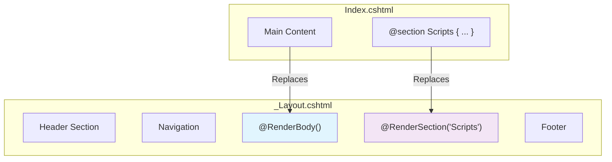
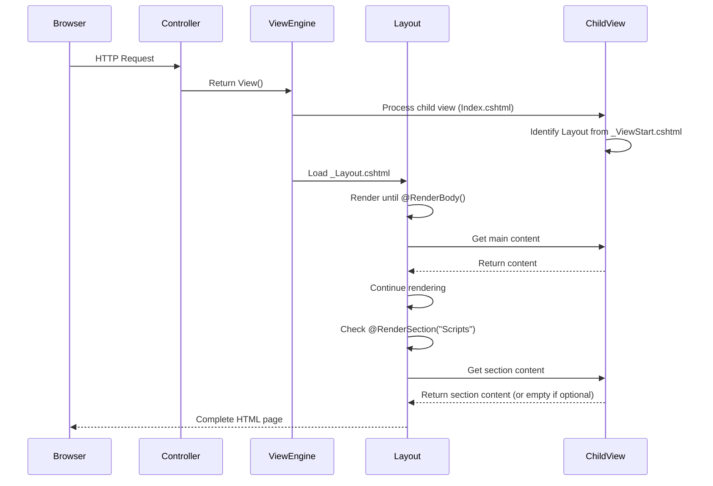

# Sections, Scripts, and Layout in ASP.NET Core MVC

## Table of Contents
1. [Introduction](#1-introduction)
2. [RenderBody Method](#2-renderbody-method)
3. [RenderSection Method](#3-rendersection-method)
4. [Optional vs Required Sections](#4-optional-vs-required-sections)
5. [Script Placement Best Practices](#5-script-placement-best-practices)
6. [Execution Flow](#6-execution-flow)
7. [Quick Reference](#7-quick-reference)

---

## 1. Introduction

### What are Sections in Layout Views?
Sections are placeholders in layout views where child views can inject content. They allow flexible page construction where different views can provide custom content for specific areas of the layout.

### Layout Architecture



---

## 2. RenderBody Method

### Purpose
`@RenderBody()` is called in the layout view to render the content of the child view. It marks the location where the child view's main content will be inserted.

### Basic Layout Structure

```cshtml
<!DOCTYPE html>
<html>
<head>
    <meta name="viewport" content="width=device-width" />
    <title>@ViewBag.Title</title>
</head>
<body>
    <table border="1" style="width:800px; font-family:Arial">
        <tr>
            <td colspan="2" style="text-align:center">
                <h3>Website Header</h3>
            </td>
        </tr>
        <tr>
            <td style="width:200px">
                <h3>Left Navigation Menus</h3>
            </td>
            <td style="width:600px">
                @RenderBody()  <!-- Child view content inserted here -->
            </td>
        </tr>
        <tr>
            <td colspan="2" style="text-align:center; font-size:x-small">
                <h3>Website Footer</h3>
            </td>
        </tr>
    </table>
</body>
</html>
```

### Line-by-Line Analysis
| Line | Code | Explanation |
|------|------|-------------|
| 5 | `@ViewBag.Title` | Dynamically set page title from child view |
| 17 | `@RenderBody()` | Placeholder for child view content |

---

## 3. RenderSection Method

### Purpose
`@RenderSection()` allows child views to inject content into specific sections of the layout, separate from the main body.

### RenderSection Overloads

```csharp
// Method signatures
HtmlString RenderSection(string name);
HtmlString RenderSection(string name, bool required);

// Async versions
Task<HtmlString> RenderSectionAsync(string name);
Task<HtmlString> RenderSectionAsync(string name, bool required);
```

### Layout with Section

```cshtml
<!DOCTYPE html>
<html>
<head>
    <meta name="viewport" content="width=device-width" />
    <title>@ViewBag.Title</title>
</head>
<body>
    <table border="1" style="width:800px; font-family:Arial">
        <tr>
            <td colspan="2" style="text-align:center">
                <h3>Website Header</h3>
            </td>
        </tr>
        <tr>
            <td style="width:200px">
                <h3>Left Navigation Menus</h3>
            </td>
            <td style="width:600px">
                @RenderBody()
            </td>
        </tr>
        <tr>
            <td colspan="2" style="text-align:center; font-size:x-small">
                <h3>Website Footer</h3>
            </td>
        </tr>
    </table>
    
    @RenderSection("Scripts")  <!-- Section for page-specific scripts -->
</body>
</html>
```

### Providing Section Content in View

```cshtml
@{
    ViewBag.Title = "Home Page";
    Layout = "~/Views/Shared/_Layout.cshtml";
}

<h1>Home Page</h1>

@section Scripts {
    <script src="~/js/CustomJavascript.js"></script>
}
```

### Line-by-Line Analysis
| Line | Code | Explanation |
|------|------|-------------|
| 1-4 | Razor block | Set ViewBag properties and layout |
| 6 | `<h1>Home Page</h1>` | This goes into @RenderBody() |
| 8-10 | `@section Scripts { ... }` | Content for the Scripts section |

---

## 4. Optional vs Required Sections

### Required Section (Default)

```cshtml
@* In Layout *@
@RenderSection("Scripts")  <!-- Required - throws error if not provided -->
```

**Error if section not provided:**
```
InvalidOperationException: The following sections have been defined but have not been rendered...
```

### Optional Section - Method 1

```cshtml
@RenderSection("Scripts", required: false)
```

### Optional Section - Method 2 (Using IsSectionDefined)

```cshtml
@if (IsSectionDefined("Scripts"))
{
    @RenderSection("Scripts", required: false)
}
```

### Complete Layout with Optional Section

```cshtml
<!DOCTYPE html>
<html>
<head>
    <meta name="viewport" content="width=device-width" />
    <title>@ViewBag.Title</title>
</head>
<body>
    <table border="1" style="width:800px; font-family:Arial">
        <tr>
            <td colspan="2" style="text-align:center">
                <h3>Website Header</h3>
            </td>
        </tr>
        <tr>
            <td style="width:200px">
                <h3>Left Navigation Menus</h3>
            </td>
            <td style="width:600px">
                @RenderBody()
            </td>
        </tr>
        <tr>
            <td colspan="2" style="text-align:center; font-size:x-small">
                <h3>Website Footer</h3>
            </td>
        </tr>
    </table>
    
    @RenderSection("Scripts", false)  <!-- false = optional -->
</body>
</html>
```

### Comparison Table

| Approach | Syntax | Use Case |
|----------|--------|----------|
| **Required** | `@RenderSection("Name")` | Section must be in every view |
| **Optional (Simple)** | `@RenderSection("Name", false)` | Section may or may not exist |
| **Optional (Conditional)** | `@if (IsSectionDefined("Name")) { ... }` | Execute logic based on section existence |

---

## 5. Script Placement Best Practices

### Scenario 1: Script Required by All Views

Place in layout file directly:

```cshtml
<body>
    <!-- Page content -->
    @RenderBody()
    
    <!-- Scripts at bottom for all views -->
    <script src="~/js/CustomJavascript.js"></script>
</body>
</html>
```

### Scenario 2: Script Required by Specific Views Only

Use sections:

**Layout:**
```cshtml
<body>
    @RenderBody()
    
    @RenderSection("Scripts", required: false)
</body>
</html>
```

**View (only views that need the script):**
```cshtml
@section Scripts {
    <script src="~/js/CustomJavascript.js"></script>
}
```

### Bootstrap Layout with Sections

```cshtml
<!DOCTYPE html>
<html>
<head>
    <meta charset="utf-8" />
    <meta name="viewport" content="width=device-width, initial-scale=1.0">
    <title>@ViewBag.Title - My ASP.NET Application</title>
    
    <environment include="Development">
        <link href="~/lib/bootstrap/css/bootstrap.css" rel="stylesheet" />
        <script src="~/lib/jquery/jquery.js"></script>
        <script src="~/lib/bootstrap/js/bootstrap.js"></script>
    </environment>
    
    <environment exclude="Development">
        <link rel="stylesheet" 
              href="https://stackpath.bootstrapcdn.com/bootstrap/4.3.1/css/bootstrap.min.css"
              integrity="sha384-ggOyR0iXCbMQv3Xipma34MD+dH/1fQ784/j6cY/iJTQUOhcWr7x9JvoRxT2MZw1T" 
              crossorigin="anonymous" />
    </environment>
    
    <link href="~/css/site.css" rel="stylesheet" />
</head>
<body>
    <div class="container">
        <nav class="navbar navbar-expand-sm bg-dark navbar-dark">
            <a class="navbar-brand" asp-controller="home" asp-action="index">
                
            </a>
            <div class="collapse navbar-collapse">
                <ul class="navbar-nav">
                    <li class="nav-item">
                        <a class="nav-link" asp-controller="home" asp-action="index">List</a>
                    </li>
                    <li class="nav-item">
                        <a class="nav-link" asp-controller="home" asp-action="create">Create</a>
                    </li>
                </ul>
            </div>
        </nav>
        
        <div>
            @RenderBody()
        </div>
        
        @if (IsSectionDefined("Scripts"))
        {
            @RenderSection("Scripts", required: false)
        }
    </div>
</body>
</html>
```

---

## 6. Execution Flow

### Layout Rendering Process



### Rendering Order
1. Controller action executes and returns `View()`
2. View engine identifies the layout (from _ViewStart.cshtml or @Layout directive)
3. Layout begins rendering from top
4. When `@RenderBody()` is encountered, child view content is inserted
5. When `@RenderSection()` is encountered, section content is inserted
6. Complete HTML is sent to browser

---

## 7. Quick Reference

### Section Methods

| Method | Description |
|--------|-------------|
| `@RenderBody()` | Renders child view content |
| `@RenderSection("name")` | Renders required named section |
| `@RenderSection("name", false)` | Renders optional named section |
| `@RenderSection("name", required: false)` | Same as above, explicit syntax |
| `IsSectionDefined("name")` | Returns true if section exists |

### Section Declaration in View

```cshtml
@section SectionName {
    <!-- Section content here -->
}
```

### Common Patterns

| Pattern | Layout Code | View Code |
|---------|-------------|-----------|
| **Required Section** | `@RenderSection("Scripts")` | Must include `@section Scripts {}` |
| **Optional Section** | `@RenderSection("Scripts", false)` | May include `@section Scripts {}` |
| **Conditional Section** | `@if (IsSectionDefined("Sidebar")) { @RenderSection("Sidebar") }` | Optional |

---

## 8. Interview Questions

1. **What is the difference between @RenderBody() and @RenderSection()?**
   - `@RenderBody()` renders the entire child view content; `@RenderSection()` renders a specific named section defined in the child view

2. **How do you make a section optional?**
   - Use `@RenderSection("Name", false)` or `@RenderSection("Name", required: false)`

3. **What happens if a required section is not defined in the child view?**
   - An `InvalidOperationException` is thrown at runtime

4. **What is IsSectionDefined() used for?**
   - To check whether a section is defined in the child view before rendering it, often used for conditional logic

5. **Where should scripts typically be placed in a layout?**
   - Just before the closing `</body>` tag for better page load performance

6. **Can you have multiple sections in a layout?**
   - Yes, you can define multiple sections like Scripts, Styles, Sidebar, etc.
