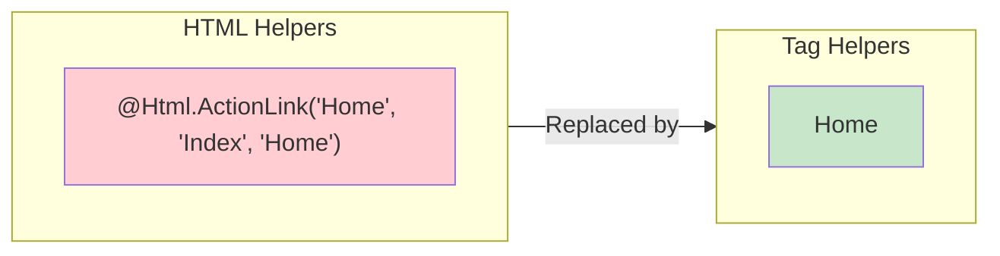
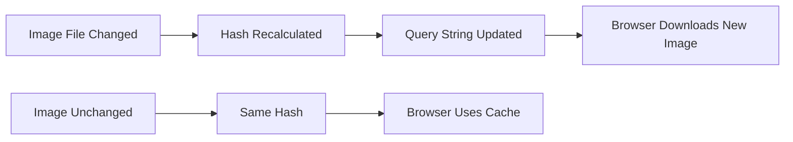

# Tag Helpers Complete Guide in ASP.NET Core MVC

## Table of Contents
1. [Introduction](#1-introduction)
2. [Importing Tag Helpers](#2-importing-tag-helpers)
3. [Anchor Tag Helper](#3-anchor-tag-helper)
4. [Form Tag Helper](#4-form-tag-helper)
5. [Input Tag Helper](#5-input-tag-helper)
6. [Label Tag Helper](#6-label-tag-helper)
7. [Select Tag Helper](#7-select-tag-helper)
8. [Image Tag Helper](#8-image-tag-helper)
9. [Comparison with HTML Helpers](#9-comparison-with-html-helpers)
10. [Quick Reference](#10-quick-reference)

---

## 1. Introduction

### What are Tag Helpers?
Tag Helpers enable server-side code to participate in creating and rendering HTML elements in Razor files. They look like standard HTML but add server-side processing capabilities.

### Benefits of Tag Helpers



| Aspect | HTML Helpers | Tag Helpers |
|--------|--------------|-------------|
| **Syntax** | C# method calls | HTML-like attributes |
| **IntelliSense** | Partial | Full HTML and server support |
| **Designer Friendly** | ❌ No | ✅ Yes |
| **Readability** | ❌ Mixed C# and HTML | ✅ Clean HTML |
| **Tooling Support** | ❌ Limited | ✅ Excellent |

---

## 2. Importing Tag Helpers

### In _ViewImports.cshtml

```cshtml
@* Enable ALL built-in tag helpers *@
@addTagHelper *, Microsoft.AspNetCore.Mvc.TagHelpers

@* Enable custom tag helpers from your application *@
@addTagHelper *, YourApplicationName
```

### Tag Helper Import Syntax

```
@addTagHelper {TagHelper}, {Assembly}
```

| Part | Description |
|------|-------------|
| `*` | Wildcard - includes all tag helpers |
| `TagHelperName` | Specific tag helper class |
| `Assembly` | Assembly containing tag helpers |

### Removing Tag Helpers

```cshtml
@* Remove specific tag helper *@
@removeTagHelper Microsoft.AspNetCore.Mvc.TagHelpers.AnchorTagHelper, Microsoft.AspNetCore.Mvc.TagHelpers
```

---

## 3. Anchor Tag Helper

### Purpose
Generates HTML anchor elements (`<a>`) with dynamic URLs based on routing.

### Basic Usage

```cshtml
<a asp-controller="Home" asp-action="Details" asp-route-id="5">View Details</a>
```

**Generated HTML:**
```html
<a href="/Home/Details/5">View Details</a>
```

### Anchor Tag Helper Attributes

| Attribute | Purpose | Example |
|-----------|---------|---------|
| `asp-controller` | Target controller | `asp-controller="Home"` |
| `asp-action` | Target action method | `asp-action="Index"` |
| `asp-route-{value}` | Route parameter | `asp-route-id="5"` |
| `asp-area` | Target MVC area | `asp-area="Admin"` |
| `asp-page` | Target Razor Page | `asp-page="/Index"` |
| `asp-fragment` | URL fragment (#) | `asp-fragment="section1"` |
| `asp-protocol` | URL protocol | `asp-protocol="https"` |
| `asp-host` | URL host | `asp-host="www.example.com"` |

### Examples

```cshtml
@* Basic navigation link *@
<a asp-controller="Home" asp-action="Index">Home</a>

@* Link with route parameter *@
<a asp-controller="Employee" asp-action="Details" asp-route-id="@Model.Id">
    View Details
</a>

@* Link with multiple route parameters *@
<a asp-controller="Product" 
   asp-action="Search" 
   asp-route-category="Electronics" 
   asp-route-page="1">
    Electronics
</a>

@* Link with fragment *@
<a asp-controller="Home" asp-action="Index" asp-fragment="contact">
    Contact Section
</a>
```

### Line-by-Line Analysis
| Line | Attribute | Generated URL Part |
|------|-----------|-------------------|
| `asp-controller="Employee"` | Controller segment | `/Employee` |
| `asp-action="Details"` | Action segment | `/Employee/Details` |
| `asp-route-id="5"` | Route parameter | `/Employee/Details/5` |

---

## 4. Form Tag Helper

### Purpose
Generates HTML form elements with proper action URLs and anti-forgery tokens.

### Basic Usage

```cshtml
<form asp-controller="Employee" asp-action="Create" method="post">
    <!-- Form fields here -->
    <button type="submit">Create</button>
</form>
```

**Generated HTML:**
```html
<form action="/Employee/Create" method="post">
    <input name="__RequestVerificationToken" type="hidden" value="CfDJ8..." />
    <!-- Form fields here -->
    <button type="submit">Create</button>
</form>
```

### Form Tag Helper Attributes

| Attribute | Purpose |
|-----------|---------|
| `asp-controller` | Target controller |
| `asp-action` | Target action method |
| `asp-area` | Target MVC area |
| `asp-page` | Target Razor Page |
| `asp-route-{value}` | Route parameters |
| `asp-antiforgery` | Include AntiForgeryToken (default: true) |

### Complete Form Example

```cshtml
<form asp-controller="Employee" asp-action="Create" method="post">
    <div asp-validation-summary="ModelOnly" class="text-danger"></div>
    
    <div class="form-group">
        <label asp-for="Name" class="control-label"></label>
        <input asp-for="Name" class="form-control" />
        <span asp-validation-for="Name" class="text-danger"></span>
    </div>
    
    <div class="form-group">
        <label asp-for="Email" class="control-label"></label>
        <input asp-for="Email" class="form-control" />
        <span asp-validation-for="Email" class="text-danger"></span>
    </div>
    
    <div class="form-group">
        <label asp-for="DepartmentId" class="control-label"></label>
        <select asp-for="DepartmentId" asp-items="ViewBag.DepartmentList" class="form-control">
            <option value="">Please Select</option>
        </select>
        <span asp-validation-for="DepartmentId" class="text-danger"></span>
    </div>
    
    <button type="submit" class="btn btn-primary">Create</button>
</form>
```

---

## 5. Input Tag Helper

### Purpose
Generates HTML input elements with proper name, id, type, and value attributes based on the model property.

### Basic Usage

```cshtml
<input asp-for="Name" class="form-control" />
```

**Given Model:**
```csharp
public class Employee
{
    [Required]
    [DisplayName("Employee Name")]
    public string Name { get; set; }
}
```

**Generated HTML:**
```html
<input class="form-control" 
       type="text" 
       id="Name" 
       name="Name"
       data-val="true" 
       data-val-required="The Employee Name field is required." />
```

### Type Inference

| Model Property Type | HTML Input Type |
|--------------------|-----------------|
| `string` | `type="text"` |
| `int`, `double`, `decimal` | `type="number"` |
| `bool` | `type="checkbox"` |
| `DateTime` | `type="datetime-local"` |
| `[DataType(DataType.Password)]` | `type="password"` |
| `[DataType(DataType.EmailAddress)]` | `type="email"` |
| `[DataType(DataType.Url)]` | `type="url"` |
| `[DataType(DataType.PhoneNumber)]` | `type="tel"` |

### Input Tag Helper with DataType

```csharp
// Model
public class Employee
{
    [Required]
    [DataType(DataType.EmailAddress)]
    public string Email { get; set; }

    [Required]
    [DataType(DataType.Password)]
    public string Password { get; set; }
}
```

```cshtml
@* View *@
<input asp-for="Email" class="form-control" />
<input asp-for="Password" class="form-control" />
```

**Generated HTML:**
```html
<input type="email" id="Email" name="Email" class="form-control" />
<input type="password" id="Password" name="Password" class="form-control" />
```

---

## 6. Label Tag Helper

### Purpose
Generates HTML label elements with proper `for` attribute and display text based on the model property.

### Basic Usage

```cshtml
<label asp-for="Name" class="control-label"></label>
```

**Given Model:**
```csharp
public class Employee
{
    [DisplayName("Employee Name")]
    public string Name { get; set; }
}
```

**Generated HTML:**
```html
<label class="control-label" for="Name">Employee Name</label>
```

### Line-by-Line Analysis
| Model Attribute | Effect on Label |
|-----------------|-----------------|
| `[DisplayName("Employee Name")]` | Uses "Employee Name" as label text |
| `[Display(Name = "Employee Name")]` | Alternative way to set display name |
| No attribute | Uses property name "Name" |

---

## 7. Select Tag Helper

### Purpose
Generates HTML select (dropdown) elements populated with data from the model or ViewData.

### Basic Usage

```cshtml
<select asp-for="DepartmentId" asp-items="ViewBag.DepartmentList" class="form-control">
    <option value="">Please Select</option>
</select>
```

### Creating SelectList in Controller

```csharp
public ActionResult Create()
{
    IEnumerable<Department> departments = _employeeRepository.GetAllDepartment();
    ViewData["DepartmentId"] = new SelectList(departments, "Id", "Name");
    return View();
}
```

### Line-by-Line Analysis
| Line | Code | Explanation |
|------|------|-------------|
| `asp-for="DepartmentId"` | Binds to model property | Sets name, id, selected value |
| `asp-items="ViewBag.DepartmentList"` | Data source | Provides option values |
| `new SelectList(departments, "Id", "Name")` | Creates SelectList | Id=value, Name=text |

### Select with Enum

**Model:**
```csharp
public enum Gender
{
    Male,
    Female,
    Other
}

public class Employee
{
    public Gender? Gender { get; set; }  // Nullable for validation
}
```

**View:**
```cshtml
<select asp-for="Gender" 
        asp-items="Html.GetEnumSelectList<Gender>()" 
        class="form-control">
    <option value="">Please Select</option>
</select>
```

**Generated HTML:**
```html
<select class="form-control" id="Gender" name="Gender">
    <option value="">Please Select</option>
    <option value="0">Male</option>
    <option value="1">Female</option>
    <option value="2">Other</option>
</select>
```

---

## 8. Image Tag Helper

### Purpose
Generates HTML img elements with cache-busting query string for automatic CDN cache invalidation.

### Basic Usage

```cshtml

```

**Generated HTML:**
```html

```

### How Version Caching Works



### Benefits
| Feature | Benefit |
|---------|---------|
| **Cache Busting** | Forces browser to download new image when content changes |
| **Automatic** | No manual version management needed |
| **Hash-Based** | Version derived from file content, not timestamp |

---

## 9. Comparison with HTML Helpers

### Side-by-Side Comparison

| Task | HTML Helper | Tag Helper |
|------|-------------|------------|
| **Anchor Link** | `@Html.ActionLink("Details", "Details", new { id = 1 })` | `<a asp-action="Details" asp-route-id="1">Details</a>` |
| **Text Input** | `@Html.TextBoxFor(m => m.Name)` | `<input asp-for="Name" />` |
| **Label** | `@Html.LabelFor(m => m.Name)` | `<label asp-for="Name"></label>` |
| **Dropdown** | `@Html.DropDownListFor(m => m.DeptId, ViewBag.List)` | `<select asp-for="DeptId" asp-items="ViewBag.List"></select>` |
| **Validation** | `@Html.ValidationMessageFor(m => m.Name)` | `<span asp-validation-for="Name"></span>` |
| **Form** | `@using (Html.BeginForm()) { }` | `<form asp-action="Create"></form>` |

### Tag Helpers Advantages
1. ✅ Looks like standard HTML
2. ✅ Full IntelliSense support
3. ✅ Better designer/front-end developer experience
4. ✅ Easier to read and maintain
5. ✅ Better tooling support

---

## 10. Quick Reference

### Common Tag Helper Attributes

| Tag | Common Attributes |
|-----|-------------------|
| `<a>` | `asp-controller`, `asp-action`, `asp-route-*`, `asp-area` |
| `<form>` | `asp-controller`, `asp-action`, `asp-antiforgery` |
| `<input>` | `asp-for` |
| `<label>` | `asp-for` |
| `<select>` | `asp-for`, `asp-items` |
| `<textarea>` | `asp-for` |
| `<span>` | `asp-validation-for` |
| `<div>` | `asp-validation-summary` |
| `` | `asp-append-version` |

### Validation Summary Options

```cshtml
@* Show all errors *@
<div asp-validation-summary="All" class="text-danger"></div>

@* Show only model-level errors *@
<div asp-validation-summary="ModelOnly" class="text-danger"></div>

@* Show no errors *@
<div asp-validation-summary="None" class="text-danger"></div>
```

### Complete Form Pattern

```cshtml
@model Employee

<form asp-action="Create" method="post">
    <div asp-validation-summary="ModelOnly" class="text-danger"></div>
    
    <div class="form-group">
        <label asp-for="Name"></label>
        <input asp-for="Name" class="form-control" />
        <span asp-validation-for="Name" class="text-danger"></span>
    </div>
    
    <button type="submit" class="btn btn-primary">Submit</button>
</form>

@section Scripts {
    @{await Html.RenderPartialAsync("_ValidationScriptsPartial");}
}
```

---

## 11. Interview Questions

1. **What are Tag Helpers in ASP.NET Core MVC?**
   - Server-side code that participates in rendering HTML elements using HTML-like syntax with `asp-` prefixed attributes.

2. **How do you enable Tag Helpers in views?**
   - Add `@addTagHelper *, Microsoft.AspNetCore.Mvc.TagHelpers` in `_ViewImports.cshtml`

3. **What is the difference between Tag Helpers and HTML Helpers?**
   - Tag Helpers use HTML-like syntax, provide better IntelliSense, and are more designer-friendly. HTML Helpers use C# method syntax.

4. **What does asp-append-version do on an image tag?**
   - Adds a hash-based query string for cache busting, so browsers download new images when content changes.

5. **How does asp-for work on input elements?**
   - It binds to a model property and generates appropriate name, id, type, and validation attributes.

6. **What happens when you use asp-items with an enum?**
   - Use `Html.GetEnumSelectList<EnumType>()` to generate dropdown options from enum values.
