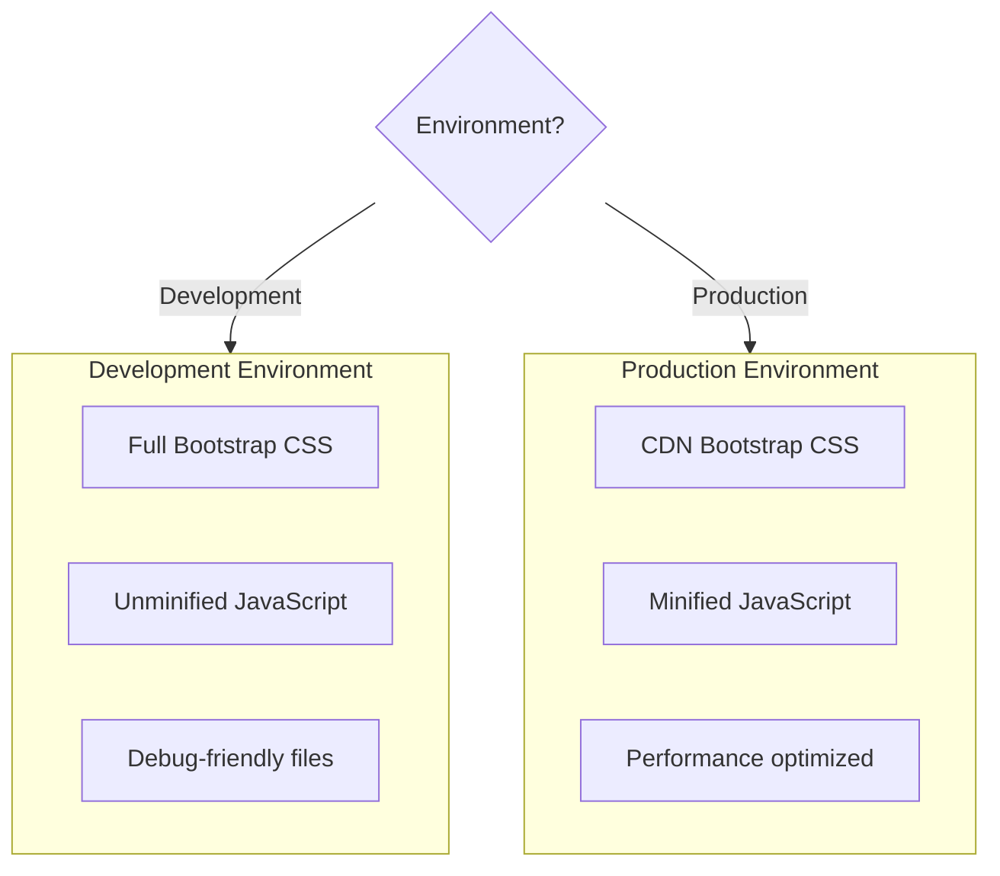

# Environment Tag Helper in ASP.NET Core MVC

## Table of Contents
1. [Introduction](#1-introduction)
2. [ASPNETCORE_ENVIRONMENT Variable](#2-aspnetcore_environment-variable)
3. [Include and Exclude Attributes](#3-include-and-exclude-attributes)
4. [CDN Loading with Fallback](#4-cdn-loading-with-fallback)
5. [Implementation Examples](#5-implementation-examples)
6. [Best Practices](#6-best-practices)
7. [Quick Reference](#7-quick-reference)

---

## 1. Introduction

### What is Environment Tag Helper?
The Environment Tag Helper conditionally renders its content based on the current hosting environment. This enables serving different CSS/JS files in development vs production.

### Common Use Cases



---

## 2. ASPNETCORE_ENVIRONMENT Variable

### Built-in Environments

| Environment | Purpose |
|-------------|---------|
| **Development** | Local development with debugging |
| **Staging** | Pre-production testing |
| **Production** | Live production server |

### Setting Environment Variable

**In launchSettings.json:**
```json
{
  "profiles": {
    "MyApp": {
      "commandName": "Project",
      "environmentVariables": {
        "ASPNETCORE_ENVIRONMENT": "Development"
      }
    }
  }
}
```

**In Windows Command Line:**
```cmd
set ASPNETCORE_ENVIRONMENT=Development
dotnet run
```

**In PowerShell:**
```powershell
$env:ASPNETCORE_ENVIRONMENT = "Development"
dotnet run
```

### Checking Environment in Code

```csharp
// Program.cs
if (app.Environment.IsDevelopment())
{
    app.UseDeveloperExceptionPage();
}

if (app.Environment.IsProduction())
{
    app.UseExceptionHandler("/Home/Error");
}

if (app.Environment.IsStaging())
{
    // Staging-specific configuration
}
```

---

## 3. Include and Exclude Attributes

### Include Attribute

Renders content only when in specified environment(s).

```cshtml
<environment include="Development">
    <!-- Content rendered ONLY in Development -->
    <link href="~/lib/bootstrap/css/bootstrap.css" rel="stylesheet" />
</environment>

<environment include="Staging,Production">
    <!-- Content rendered in Staging OR Production -->
    <link href="https://cdn.example.com/bootstrap.min.css" rel="stylesheet" />
</environment>
```

### Exclude Attribute

Renders content when NOT in specified environment(s).

```cshtml
<environment exclude="Development">
    <!-- Content rendered in ALL environments EXCEPT Development -->
    <link href="https://cdn.example.com/bootstrap.min.css" rel="stylesheet" />
</environment>
```

### Comparison

| Attribute | Effect | Example |
|-----------|--------|---------|
| `include="Development"` | Show only in Development | Local files |
| `include="Staging,Production"` | Show in Staging OR Production | CDN files |
| `exclude="Development"` | Hide in Development | CDN files |
| `exclude="Production"` | Hide in Production | Debug tools |

---

## 4. CDN Loading with Fallback

### Why CDN Fallback?
If CDN fails, your site should still work using local copies.

### CDN Fallback Pattern

```cshtml
<environment include="Development">
    <link href="~/lib/bootstrap/css/bootstrap.css" rel="stylesheet" />
    <script src="~/lib/jquery/jquery.js"></script>
    <script src="~/lib/bootstrap/js/bootstrap.js"></script>
</environment>

<environment exclude="Development">
    <link rel="stylesheet"
          href="https://stackpath.bootstrapcdn.com/bootstrap/4.3.1/css/bootstrap.min.css"
          integrity="sha384-ggOyR0iXCbMQv3Xipma34MD+dH/1fQ784/j6cY/iJTQUOhcWr7x9JvoRxT2MZw1T"
          crossorigin="anonymous"
          asp-fallback-href="~/lib/bootstrap/css/bootstrap.min.css"
          asp-fallback-test-class="sr-only"
          asp-fallback-test-property="position"
          asp-fallback-test-value="absolute" />

    <script src="https://code.jquery.com/jquery-3.3.1.min.js"
            integrity="sha384-tsQFqpEReu7ZLhBV2VZlAu7gy3vPx..."
            crossorigin="anonymous"
            asp-fallback-src="~/lib/jquery/jquery.min.js"
            asp-fallback-test="window.jQuery">
    </script>
</environment>
```

### Fallback Attributes Explained

| Attribute | Purpose |
|-----------|---------|
| `asp-fallback-href` | Local CSS file path if CDN fails |
| `asp-fallback-test-class` | CSS class to test for existence |
| `asp-fallback-test-property` | CSS property to check |
| `asp-fallback-test-value` | Expected CSS property value |
| `asp-fallback-src` | Local JS file path if CDN fails |
| `asp-fallback-test` | JavaScript expression that should be truthy |

### Subresource Integrity (SRI)

```cshtml
<link rel="stylesheet"
      href="https://cdn.example.com/bootstrap.min.css"
      integrity="sha384-ggOyR0iXCbMQv3Xipma34..."
      crossorigin="anonymous" />
```

| Attribute | Purpose |
|-----------|---------|
| `integrity` | SHA hash of the file content |
| `crossorigin` | CORS setting for integrity check |

**Benefit:** Browser verifies file hasn't been tampered with

---

## 5. Implementation Examples

### Complete Layout with Environment Tag Helper

```cshtml
<!DOCTYPE html>
<html>
<head>
    <meta charset="utf-8" />
    <meta name="viewport" content="width=device-width, initial-scale=1.0">
    <title>@ViewBag.Title - My App</title>
    
    @* Development: Use local files for debugging *@
    <environment include="Development">
        <link href="~/lib/bootstrap/css/bootstrap.css" rel="stylesheet" />
        <script src="~/lib/jquery/jquery.js"></script>
        <script src="~/lib/bootstrap/js/bootstrap.js"></script>
    </environment>
    
    @* Production: Use CDN with fallback *@
    <environment exclude="Development">
        <link rel="stylesheet"
              href="https://stackpath.bootstrapcdn.com/bootstrap/4.3.1/css/bootstrap.min.css"
              integrity="sha384-ggOyR0iXCbMQv3Xipma34MD+dH/1fQ784/j6cY/iJTQUOhcWr7x9JvoRxT2MZw1T"
              crossorigin="anonymous"
              asp-fallback-href="~/lib/bootstrap/css/bootstrap.min.css"
              asp-fallback-test-class="sr-only"
              asp-fallback-test-property="position"
              asp-fallback-test-value="absolute" />
              
        <script src="https://code.jquery.com/jquery-3.3.1.min.js"
                integrity="sha384-tsQFqpEReu7ZLhBV2VZlAu7gy3vPx..."
                crossorigin="anonymous"
                asp-fallback-src="~/lib/jquery/jquery.min.js"
                asp-fallback-test="window.jQuery">
        </script>
        
        <script src="https://stackpath.bootstrapcdn.com/bootstrap/4.3.1/js/bootstrap.bundle.min.js"
                integrity="sha384-xrRywqdh3PHs8keKZN+8zzc5TX..."
                crossorigin="anonymous"
                asp-fallback-src="~/lib/bootstrap/js/bootstrap.bundle.min.js"
                asp-fallback-test="window.jQuery && window.jQuery.fn && window.jQuery.fn.modal">
        </script>
    </environment>
    
    <link href="~/css/site.css" rel="stylesheet" />
</head>
<body>
    <div class="container">
        @RenderBody()
    </div>
    
    @RenderSection("Scripts", required: false)
</body>
</html>
```

### Line-by-Line Analysis
| Section | Code | Explanation |
|---------|------|-------------|
| Development | `<environment include="Development">` | Only renders when ASPNETCORE_ENVIRONMENT = Development |
| Production | `<environment exclude="Development">` | Renders in all environments except Development |
| Integrity | `integrity="sha384-..."` | Hash to verify file integrity |
| Fallback CSS | `asp-fallback-href` | Local file if CDN fails |
| Fallback Test | `asp-fallback-test-class="sr-only"` | Bootstrap class to check |
| Fallback JS | `asp-fallback-test="window.jQuery"` | Check if jQuery loaded |

---

## 6. Best Practices

### DO ✅
| Practice | Reason |
|----------|--------|
| Use CDN in production | Faster loading, client caching |
| Always include fallback | Site works even if CDN fails |
| Use integrity hashes | Security against compromised CDNs |
| Keep local copies up-to-date | Fallback should work correctly |

### DON'T ❌
| Practice | Reason |
|----------|--------|
| Don't use CDN during development | Complicates debugging |
| Don't skip integrity hashes | Security risk |
| Don't forget fallback files | Site breaks if CDN fails |

---

## 7. Quick Reference

### Environment Tag Helper Syntax

```cshtml
@* Include - show only in specified environments *@
<environment include="Development">
    <!-- Development only content -->
</environment>

<environment include="Staging,Production">
    <!-- Staging or Production content -->
</environment>

@* Exclude - hide in specified environments *@
<environment exclude="Development">
    <!-- All environments except Development -->
</environment>
```

### Fallback Attributes Summary

| Element | Fallback Attributes |
|---------|-------------------|
| `<link>` (CSS) | `asp-fallback-href`, `asp-fallback-test-class`, `asp-fallback-test-property`, `asp-fallback-test-value` |
| `<script>` (JS) | `asp-fallback-src`, `asp-fallback-test` |

### Common CDN Fallback Tests

| Library | Test Expression |
|---------|-----------------|
| jQuery | `window.jQuery` |
| Bootstrap CSS | Class: `sr-only`, Property: `position`, Value: `absolute` |
| Bootstrap JS | `window.jQuery.fn.modal` |
| Popper.js | `window.Popper` |

---

## 8. Interview Questions

1. **What is the Environment Tag Helper used for?**
   - Conditionally rendering content based on the hosting environment (Development, Staging, Production).

2. **How do you set the ASPNETCORE_ENVIRONMENT variable?**
   - In launchSettings.json, through environment variables, or command line.

3. **What is the difference between include and exclude attributes?**
   - `include` renders content only in specified environments; `exclude` renders in all environments except specified ones.

4. **Why use CDN with fallback?**
   - CDN provides faster loading and client caching, but fallback ensures the site works if CDN fails.

5. **What is Subresource Integrity?**
   - A security feature using `integrity` attribute with hash to verify file content hasn't been tampered with.

6. **How does asp-fallback-test work for JavaScript?**
   - It's a JavaScript expression that should be truthy if the script loaded successfully (e.g., `window.jQuery`).
