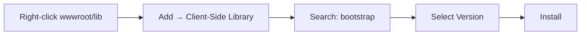

# Bootstrap Integration in ASP.NET Core MVC

## Table of Contents
1. [Introduction](#1-introduction)
2. [Installing Bootstrap with LibMan](#2-installing-bootstrap-with-libman)
3. [Integrating Bootstrap in Layout](#3-integrating-bootstrap-in-layout)
4. [Responsive Navbar](#4-responsive-navbar)
5. [Bootstrap Classes Reference](#5-bootstrap-classes-reference)
6. [Best Practices](#6-best-practices)
7. [Quick Reference](#7-quick-reference)

---

## 1. Introduction

### What is Bootstrap?
Bootstrap is the most popular CSS framework for developing responsive, mobile-first websites. It provides pre-built CSS classes and JavaScript components.

### Version Information
| Version | Release | Features |
|---------|---------|----------|
| Bootstrap 4 | 2018 | Flexbox, SASS |
| Bootstrap 5 | 2020 | No jQuery dependency, improved RTL |

---

## 2. Installing Bootstrap with LibMan

### What is LibMan?
Library Manager (LibMan) is a client-side library acquisition tool built into Visual Studio.

### Installation Steps



### Using LibMan CLI

```bash
# Install LibMan globally
dotnet tool install -g Microsoft.Web.LibraryManager.Cli

# Add Bootstrap
libman install bootstrap@5.3.0 -p cdnjs -d wwwroot/lib/bootstrap
```

### libman.json Configuration

```json
{
  "version": "1.0",
  "defaultProvider": "cdnjs",
  "libraries": [
    {
      "library": "bootstrap@5.3.0",
      "destination": "wwwroot/lib/bootstrap/"
    },
    {
      "library": "jquery@3.6.0",
      "destination": "wwwroot/lib/jquery/"
    }
  ]
}
```

### Folder Structure After Installation

```
wwwroot/
├── lib/
│   ├── bootstrap/
│   │   ├── css/
│   │   │   ├── bootstrap.css
│   │   │   ├── bootstrap.min.css
│   │   ├── js/
│   │   │   ├── bootstrap.js
│   │   │   ├── bootstrap.min.js
│   │   │   ├── bootstrap.bundle.js
│   │   │   └── bootstrap.bundle.min.js
│   └── jquery/
│       ├── jquery.js
│       └── jquery.min.js
├── css/
│   └── site.css
└── js/
    └── site.js
```

---

## 3. Integrating Bootstrap in Layout

### Basic Layout with Bootstrap

```cshtml
<!DOCTYPE html>
<html>
<head>
    <meta charset="utf-8" />
    <meta name="viewport" content="width=device-width, initial-scale=1.0">
    <title>@ViewBag.Title - Employee Management</title>
    
    @* Bootstrap CSS *@
    <environment include="Development">
        <link href="~/lib/bootstrap/css/bootstrap.css" rel="stylesheet" />
    </environment>
    <environment exclude="Development">
        <link rel="stylesheet"
              href="https://cdn.jsdelivr.net/npm/bootstrap@5.3.0/dist/css/bootstrap.min.css"
              asp-fallback-href="~/lib/bootstrap/css/bootstrap.min.css"
              asp-fallback-test-class="visually-hidden"
              asp-fallback-test-property="position"
              asp-fallback-test-value="absolute" />
    </environment>
    
    @* Custom CSS *@
    <link href="~/css/site.css" rel="stylesheet" />
</head>
<body>
    <!-- Navbar goes here -->
    
    <div class="container">
        @RenderBody()
    </div>
    
    @* Bootstrap JS with dependencies *@
    <environment include="Development">
        <script src="~/lib/jquery/jquery.js"></script>
        <script src="~/lib/bootstrap/js/bootstrap.bundle.js"></script>
    </environment>
    <environment exclude="Development">
        <script src="https://code.jquery.com/jquery-3.6.0.min.js"
                asp-fallback-src="~/lib/jquery/jquery.min.js"
                asp-fallback-test="window.jQuery">
        </script>
        <script src="https://cdn.jsdelivr.net/npm/bootstrap@5.3.0/dist/js/bootstrap.bundle.min.js"
                asp-fallback-src="~/lib/bootstrap/js/bootstrap.bundle.min.js"
                asp-fallback-test="window.bootstrap">
        </script>
    </environment>
    
    @RenderSection("Scripts", required: false)
</body>
</html>
```

### Line-by-Line Analysis
| Line | Code | Explanation |
|------|------|-------------|
| 5 | `meta viewport` | Required for responsive design |
| 9 | `environment include="Development"` | Local files for debugging |
| 11-17 | CDN with fallback | Production CDN with local fallback |
| 25 | `<div class="container">` | Bootstrap container for centered content |
| 32 | `bootstrap.bundle.js` | Includes Popper.js for dropdowns |

---

## 4. Responsive Navbar

### Complete Navbar Implementation

```cshtml
<nav class="navbar navbar-expand-sm bg-dark navbar-dark">
    <a class="navbar-brand" asp-controller="Home" asp-action="Index">
        
    </a>
    
    <button class="navbar-toggler" 
            type="button" 
            data-bs-toggle="collapse" 
            data-bs-target="#collapsibleNavbar">
        <span class="navbar-toggler-icon"></span>
    </button>
    
    <div class="collapse navbar-collapse" id="collapsibleNavbar">
        <ul class="navbar-nav">
            <li class="nav-item">
                <a class="nav-link" asp-controller="Home" asp-action="Index">List</a>
            </li>
            <li class="nav-item">
                <a class="nav-link" asp-controller="Home" asp-action="Create">Create</a>
            </li>
        </ul>
    </div>
</nav>
```

### Navbar Classes Explained

| Class | Purpose |
|-------|---------|
| `navbar` | Base navbar class |
| `navbar-expand-sm` | Expand on small screens and up |
| `bg-dark` | Dark background color |
| `navbar-dark` | Light text for dark backgrounds |
| `navbar-brand` | Brand/logo styling |
| `navbar-toggler` | Hamburger menu button |
| `navbar-collapse` | Collapsible content container |
| `navbar-nav` | Navigation list container |
| `nav-item` | Navigation item |
| `nav-link` | Navigation link |

### Responsive Breakpoints

| Class | Breakpoint | Screen Width |
|-------|------------|--------------|
| `navbar-expand-sm` | Small | ≥576px |
| `navbar-expand-md` | Medium | ≥768px |
| `navbar-expand-lg` | Large | ≥992px |
| `navbar-expand-xl` | Extra Large | ≥1200px |

---

## 5. Bootstrap Classes Reference

### Container Classes

| Class | Description |
|-------|-------------|
| `container` | Fixed width, responsive container |
| `container-fluid` | Full width container |
| `container-sm/md/lg/xl` | Responsive container at breakpoint |

### Grid System

```cshtml
<div class="row">
    <div class="col-md-6">Half width on medium+</div>
    <div class="col-md-6">Half width on medium+</div>
</div>

<div class="row">
    <div class="col-md-4">One third</div>
    <div class="col-md-4">One third</div>
    <div class="col-md-4">One third</div>
</div>
```

### Common Form Classes

| Class | Usage |
|-------|-------|
| `form-group` | Groups label and input |
| `form-control` | Styles inputs, selects, textareas |
| `form-label` | Styles labels |
| `form-check` | Checkbox/radio container |
| `form-check-input` | Checkbox/radio input |
| `form-check-label` | Checkbox/radio label |

### Button Classes

| Class | Appearance |
|-------|------------|
| `btn btn-primary` | Blue button |
| `btn btn-secondary` | Gray button |
| `btn btn-success` | Green button |
| `btn btn-danger` | Red button |
| `btn btn-warning` | Yellow button |
| `btn btn-info` | Light blue button |
| `btn btn-light` | Light button |
| `btn btn-dark` | Dark button |
| `btn btn-link` | Link-styled button |

### Spacing Utilities

**Format:** `{property}{sides}-{size}`

| Property | Meaning |
|----------|---------|
| `m` | Margin |
| `p` | Padding |

| Sides | Meaning |
|-------|---------|
| `t` | Top |
| `b` | Bottom |
| `l` | Left |
| `r` | Right |
| `x` | Left and right |
| `y` | Top and bottom |
| (none) | All sides |

| Size | Value |
|------|-------|
| `0` | 0 |
| `1` | 0.25rem |
| `2` | 0.5rem |
| `3` | 1rem |
| `4` | 1.5rem |
| `5` | 3rem |
| `auto` | auto |

**Examples:**
```cshtml
<div class="mt-3">Margin top 1rem</div>
<div class="px-4">Padding left and right 1.5rem</div>
<div class="mb-5">Margin bottom 3rem</div>
```

### Text Utilities

| Class | Effect |
|-------|--------|
| `text-center` | Center text |
| `text-left` | Left align |
| `text-right` | Right align |
| `text-primary` | Primary color |
| `text-danger` | Red/danger color |
| `text-muted` | Muted gray |
| `fw-bold` | Bold text |
| `fs-1` to `fs-6` | Font sizes |

### Alert Classes

```cshtml
<div class="alert alert-success">Success message</div>
<div class="alert alert-danger">Error message</div>
<div class="alert alert-warning">Warning message</div>
<div class="alert alert-info">Info message</div>
```

---

## 6. Best Practices

### DO ✅
| Practice | Reason |
|----------|--------|
| Use CDN in production | Faster loading, caching |
| Use `container` for content | Proper alignment and responsive layout |
| Use grid system for layouts | Consistent responsive design |
| Include viewport meta tag | Mobile responsiveness |
| Use `bootstrap.bundle.js` | Includes Popper.js for dropdowns |

### DON'T ❌
| Practice | Reason |
|----------|--------|
| Don't mix Bootstrap versions | Compatibility issues |
| Don't forget fallback scripts | Site breaks if CDN fails |
| Don't override Bootstrap classes directly | Use custom CSS instead |
| Don't include duplicate CSS/JS | Performance issues |

---

## 7. Quick Reference

### Required Meta Tag for Mobile

```html
<meta name="viewport" content="width=device-width, initial-scale=1.0">
```

### Minimum Bootstrap Setup

```cshtml
<!-- CSS -->
<link href="~/lib/bootstrap/css/bootstrap.min.css" rel="stylesheet" />

<!-- JS (at end of body) -->
<script src="~/lib/bootstrap/js/bootstrap.bundle.min.js"></script>
```

### Bootstrap Form Pattern

```cshtml
<form asp-action="Create" method="post">
    <div class="mb-3">
        <label asp-for="Name" class="form-label"></label>
        <input asp-for="Name" class="form-control" />
        <span asp-validation-for="Name" class="text-danger"></span>
    </div>
    
    <div class="mb-3">
        <label asp-for="Email" class="form-label"></label>
        <input asp-for="Email" class="form-control" />
        <span asp-validation-for="Email" class="text-danger"></span>
    </div>
    
    <button type="submit" class="btn btn-primary">Submit</button>
</form>
```

### Bootstrap Card Component

```cshtml
<div class="card" style="width: 18rem;">
    
    <div class="card-body">
        <h5 class="card-title">Employee Name</h5>
        <p class="card-text">Department: IT</p>
        <a asp-action="Details" asp-route-id="1" class="btn btn-primary">View</a>
    </div>
</div>
```

---

## 8. Interview Questions

1. **How do you install Bootstrap in ASP.NET Core?**
   - Using LibMan (Library Manager), NuGet package, CDN, or npm.

2. **What is LibMan?**
   - Library Manager - a client-side library acquisition tool built into Visual Studio for managing CSS/JS libraries.

3. **What is the purpose of bootstrap.bundle.js?**
   - It includes Popper.js bundled with Bootstrap JS, required for dropdowns, tooltips, and popovers.

4. **How do you make a navbar responsive?**
   - Use `navbar-expand-*` classes and `navbar-toggler` for hamburger menu on smaller screens.

5. **What is the Bootstrap grid system based on?**
   - 12-column flexbox grid system with responsive breakpoints.

6. **Why use CDN with fallback for Bootstrap?**
   - CDN provides faster loading through caching, fallback ensures the site works if CDN fails.
