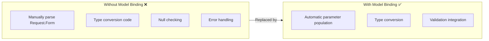
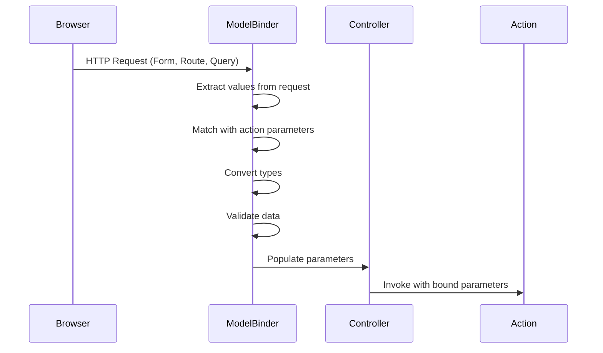

# Model Binding in ASP.NET Core MVC

## Table of Contents
1. [Introduction](#1-introduction)
2. [How Model Binding Works](#2-how-model-binding-works)
3. [Simple Type Binding](#3-simple-type-binding)
4. [Complex Type Binding](#4-complex-type-binding)
5. [Data Sources](#5-data-sources)
6. [Binding Attributes](#6-binding-attributes)
7. [Best Practices](#7-best-practices)
8. [Quick Reference](#8-quick-reference)

---

## 1. Introduction

### What is Model Binding?
Model Binding is the process of mapping HTTP request data (form values, route data, query strings) to action method parameters. It automates the data extraction from requests.

### Why Model Binding Matters



---

## 2. How Model Binding Works

### Model Binding Flow



### Data Source Priority (Default Order)
1. **Form values** - POST body data
2. **Route values** - URL segments
3. **Query strings** - URL parameters

---

## 3. Simple Type Binding

### Basic Example

```csharp
// URL: /Employee/Details/5
public ActionResult Details(int id)
{
    // id = 5 (bound from route)
    var employee = _repository.GetEmployee(id);
    return View(employee);
}
```

### Multiple Simple Types

```csharp
// URL: /Products/Search?category=Electronics&page=2
public ActionResult Search(string category, int page)
{
    // category = "Electronics" (from query string)
    // page = 2 (from query string)
    var products = _repository.Search(category, page);
    return View(products);
}
```

### Route and Query String Combined

```csharp
// Route: {controller}/{action}/{id}
// URL: /Employee/Edit/5?returnUrl=/Employees
public ActionResult Edit(int id, string returnUrl)
{
    // id = 5 (from route)
    // returnUrl = "/Employees" (from query string)
    return View();
}
```

---

## 4. Complex Type Binding

### Model Class

```csharp
public class Employee
{
    public int Id { get; set; }
    public string Name { get; set; }
    public string Email { get; set; }
    public int DepartmentId { get; set; }
}
```

### Controller Action

```csharp
[HttpPost]
[ValidateAntiForgeryToken]
public ActionResult Create(Employee employee)
{
    // employee object is automatically populated from form data
    if (ModelState.IsValid)
    {
        _repository.Add(employee);
        return RedirectToAction(nameof(Index));
    }
    return View(employee);
}
```

### Form View

```cshtml
@model Employee

<form asp-action="Create" method="post">
    <div class="form-group">
        <label asp-for="Name"></label>
        <input asp-for="Name" class="form-control" />
    </div>
    
    <div class="form-group">
        <label asp-for="Email"></label>
        <input asp-for="Email" class="form-control" />
    </div>
    
    <div class="form-group">
        <label asp-for="DepartmentId"></label>
        <select asp-for="DepartmentId" asp-items="ViewBag.Departments" class="form-control">
            <option value="">Select Department</option>
        </select>
    </div>
    
    <button type="submit" class="btn btn-primary">Create</button>
</form>
```

### How Complex Binding Works

| Form Field Name | Model Property | Value |
|-----------------|----------------|-------|
| `Name` | `Employee.Name` | Bound |
| `Email` | `Employee.Email` | Bound |
| `DepartmentId` | `Employee.DepartmentId` | Bound |

---

## 5. Data Sources

### Form Values (POST)

```csharp
[HttpPost]
public ActionResult Create(Employee employee)
{
    // Binds from form POST data
    return View();
}
```

### Route Values

```csharp
// Route: /Employee/Edit/{id}
public ActionResult Edit(int id)
{
    // id binds from route segment
    return View();
}
```

### Query String

```csharp
// URL: /Search?term=developer&page=1
public ActionResult Search(string term, int page)
{
    // term and page bind from query string
    return View();
}
```

### Controlling Data Source

```csharp
public ActionResult Example(
    [FromRoute] int id,           // Force from route
    [FromQuery] string filter,    // Force from query string
    [FromForm] string name,       // Force from form data
    [FromBody] Employee employee, // From request body (JSON)
    [FromHeader] string accept)   // From HTTP headers
{
    return View();
}
```

---

## 6. Binding Attributes

### [FromServices] - Dependency Injection

```csharp
public IActionResult Display([FromServices] IEmployeeService service)
{
    // service injected via DI, not from request
    var employees = service.GetAllEmployee();
    return Json(employees);
}
```

### [Bind] - Include/Exclude Properties

```csharp
[HttpPost]
public ActionResult Create([Bind("Name,Email,DepartmentId")] Employee employee)
{
    // Only binds Name, Email, DepartmentId - ignores Id and other properties
    if (ModelState.IsValid)
    {
        _repository.Add(employee);
        return RedirectToAction(nameof(Index));
    }
    return View(employee);
}
```

### [BindNever] - Never Bind

```csharp
public class Employee
{
    [BindNever]
    public int Id { get; set; }  // Never bound from request
    
    public string Name { get; set; }
}
```

### Binding Attributes Summary

| Attribute | Purpose |
|-----------|---------|
| `[FromRoute]` | Bind from route values |
| `[FromQuery]` | Bind from query string |
| `[FromForm]` | Bind from form data |
| `[FromBody]` | Bind from request body |
| `[FromHeader]` | Bind from HTTP headers |
| `[FromServices]` | Inject via DI |
| `[Bind]` | Include/exclude properties |
| `[BindNever]` | Never bind property |

---

## 7. IFormCollection (Not Recommended)

### Example

```csharp
[HttpPost]
public ActionResult Create(IFormCollection form)
{
    // Manual extraction - NOT RECOMMENDED
    string name = form["Name"];
    string email = form["Email"];
    int deptId = int.Parse(form["DepartmentId"]);
    
    Employee employee = new Employee
    {
        Name = name,
        Email = email,
        DepartmentId = deptId
    };
    
    _repository.Add(employee);
    return RedirectToAction(nameof(Index));
}
```

### Why IFormCollection is Not Recommended

| Issue | Explanation |
|-------|-------------|
| ❌ No type safety | Values are strings, manual conversion needed |
| ❌ No IntelliSense | Property names are strings |
| ❌ No validation | Must validate manually |
| ❌ Error prone | Typos in property names |
| ❌ More code | More boilerplate code |

---

## 8. HttpGet vs HttpPost

### HttpGet - Display Form

```csharp
// GET: /Employee/Create
[HttpGet]
public ActionResult Create()
{
    // Prepare data for form
    ViewBag.Departments = new SelectList(_repository.GetAllDepartment(), "Id", "Name");
    return View();
}
```

### HttpPost - Process Form

```csharp
// POST: /Employee/Create
[HttpPost]
[ValidateAntiForgeryToken]
public ActionResult Create(Employee employee)
{
    if (ModelState.IsValid)
    {
        _repository.Add(employee);
        return RedirectToAction(nameof(Index));
    }
    
    // Reload dropdown data if validation fails
    ViewBag.Departments = new SelectList(_repository.GetAllDepartment(), "Id", "Name");
    return View(employee);
}
```

### Complete CRUD Pattern

```csharp
public class EmployeeController : Controller
{
    // GET: Display list
    public ActionResult Index()
    {
        var employees = _repository.GetAllEmployee();
        return View(employees);
    }
    
    // GET: Show create form
    [HttpGet]
    public ActionResult Create()
    {
        LoadDropdowns();
        return View();
    }
    
    // POST: Create employee
    [HttpPost]
    [ValidateAntiForgeryToken]
    public ActionResult Create(Employee employee)
    {
        if (ModelState.IsValid)
        {
            _repository.Add(employee);
            return RedirectToAction(nameof(Index));
        }
        LoadDropdowns();
        return View(employee);
    }
    
    // GET: Show edit form
    [HttpGet]
    public ActionResult Edit(int id)
    {
        var employee = _repository.GetEmployee(id);
        if (employee == null) return NotFound();
        LoadDropdowns();
        return View(employee);
    }
    
    // POST: Update employee
    [HttpPost]
    [ValidateAntiForgeryToken]
    public ActionResult Edit(Employee employee)
    {
        if (ModelState.IsValid)
        {
            _repository.Update(employee);
            return RedirectToAction(nameof(Index));
        }
        LoadDropdowns();
        return View(employee);
    }
    
    private void LoadDropdowns()
    {
        ViewBag.Departments = new SelectList(
            _repository.GetAllDepartment(), "Id", "Name");
    }
}
```

---

## 9. Best Practices

### DO ✅

| Practice | Reason |
|----------|--------|
| Use complex types for forms | Type safety, validation |
| Use `[HttpPost]` for data changes | RESTful, prevents caching |
| Use `[ValidateAntiForgeryToken]` | Security |
| Use `[Bind]` to limit properties | Prevent over-posting |
| Reload dropdown data on validation failure | Form displays correctly |

### DON'T ❌

| Practice | Reason |
|----------|--------|
| Don't use `IFormCollection` | No type safety or validation |
| Don't skip `ModelState.IsValid` | Bypasses validation |
| Don't bind Id on Create | Can cause security issues |
| Don't forget anti-forgery tokens | CSRF vulnerability |

---

## 10. Quick Reference

### Model Binding Sources

| Source | Attribute | Priority |
|--------|-----------|----------|
| Form data | `[FromForm]` | 1 (highest) |
| Route values | `[FromRoute]` | 2 |
| Query string | `[FromQuery]` | 3 |
| Request body | `[FromBody]` | - |
| Headers | `[FromHeader]` | - |
| Services | `[FromServices]` | - |

### Create Form Pattern

```cshtml
<form asp-action="Create" method="post">
    @Html.AntiForgeryToken()
    <div asp-validation-summary="ModelOnly" class="text-danger"></div>
    
    <div class="form-group">
        <label asp-for="PropertyName"></label>
        <input asp-for="PropertyName" class="form-control" />
        <span asp-validation-for="PropertyName" class="text-danger"></span>
    </div>
    
    <button type="submit" class="btn btn-primary">Submit</button>
</form>
```

---

## 11. Interview Questions

1. **What is Model Binding in ASP.NET Core MVC?**
   - The mechanism that maps HTTP request data to action method parameters automatically.

2. **What are the data sources for Model Binding?**
   - Form values, Route values, Query strings, Request body, Headers.

3. **What is the priority order for binding sources?**
   - Form values → Route values → Query strings.

4. **Why should you avoid IFormCollection?**
   - No type safety, no IntelliSense, no automatic validation, error-prone.

5. **What does [FromServices] do?**
   - Injects a service from DI container instead of binding from request data.

6. **How do you prevent over-posting attacks?**
   - Use `[Bind]` attribute to specify which properties can be bound, or use ViewModels with only necessary properties.
