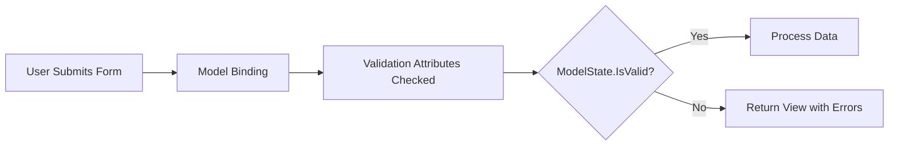

# Model Validation in ASP.NET Core MVC

## Table of Contents
1. [Introduction](#1-introduction)
2. [Data Annotations](#2-data-annotations)
3. [Validation Attributes](#3-validation-attributes)
4. [ModelState Validation](#4-modelstate-validation)
5. [Displaying Validation Errors](#5-displaying-validation-errors)
6. [Custom Error Messages](#6-custom-error-messages)
7. [Best Practices](#7-best-practices)
8. [Quick Reference](#8-quick-reference)

---

## 1. Introduction

### What is Model Validation?
Model Validation ensures that user input conforms to expected rules before processing. It uses Data Annotations (attributes) to define validation rules on model properties.

### Validation Flow



---

## 2. Data Annotations

### Required Namespace

```csharp
using System.ComponentModel.DataAnnotations;
using System.ComponentModel;
```

### Model with Validation

```csharp
using System.ComponentModel;
using System.ComponentModel.DataAnnotations;

public class Employee
{
    public int Id { get; set; }
    
    [Required]
    [DisplayName("Employee Name")]
    [MaxLength(50)]
    public string Name { get; set; }
    
    [Required]
    [DataType(DataType.EmailAddress)]
    [RegularExpression(@"^[a-zA-Z0-9_.+-]+@[a-zA-Z0-9-]+\.[a-zA-Z0-9-.]+$",
        ErrorMessage = "Invalid email format")]
    public string Email { get; set; }
    
    [Required]
    [DataType(DataType.Password)]
    [MinLength(6, ErrorMessage = "Password must be at least 6 characters")]
    public string Password { get; set; }
    
    [Compare("Password", ErrorMessage = "Passwords don't match")]
    public string ConfirmPassword { get; set; }
    
    [Range(18, 65, ErrorMessage = "Age must be between 18 and 65")]
    public int Age { get; set; }
    
    [Display(Name = "Department")]
    public int DepartmentId { get; set; }
}
```

---

## 3. Validation Attributes

### [Required]

```csharp
[Required]
public string Name { get; set; }

[Required(ErrorMessage = "Email is required")]
public string Email { get; set; }

[Required(AllowEmptyStrings = false)]
public string Description { get; set; }
```

### [MaxLength] and [MinLength]

```csharp
[MaxLength(50)]
public string Name { get; set; }

[MinLength(6)]
public string Password { get; set; }

[MinLength(6, ErrorMessage = "Minimum 6 characters")]
[MaxLength(20, ErrorMessage = "Maximum 20 characters")]
public string Username { get; set; }
```

### [StringLength]

```csharp
[StringLength(50, MinimumLength = 3, 
    ErrorMessage = "Name must be 3-50 characters")]
public string Name { get; set; }
```

### [Range]

```csharp
[Range(18, 65)]
public int Age { get; set; }

[Range(0.01, 10000.00, ErrorMessage = "Price must be between $0.01 and $10,000")]
public decimal Price { get; set; }

[Range(typeof(DateTime), "1/1/2000", "12/31/2030",
    ErrorMessage = "Date must be between 2000 and 2030")]
public DateTime StartDate { get; set; }
```

### [RegularExpression]

```csharp
[RegularExpression(@"^[a-zA-Z0-9_.+-]+@[a-zA-Z0-9-]+\.[a-zA-Z0-9-.]+$",
    ErrorMessage = "Invalid email format")]
public string Email { get; set; }

[RegularExpression(@"^\d{10}$", 
    ErrorMessage = "Phone must be 10 digits")]
public string Phone { get; set; }
```

### [Compare]

```csharp
[DataType(DataType.Password)]
public string Password { get; set; }

[Compare("Password", ErrorMessage = "Passwords don't match")]
public string ConfirmPassword { get; set; }
```

### [DataType]

```csharp
[DataType(DataType.EmailAddress)]
public string Email { get; set; }

[DataType(DataType.Password)]
public string Password { get; set; }

[DataType(DataType.PhoneNumber)]
public string Phone { get; set; }

[DataType(DataType.Date)]
public DateTime BirthDate { get; set; }

[DataType(DataType.Currency)]
public decimal Salary { get; set; }

[DataType(DataType.MultilineText)]
public string Description { get; set; }

[DataType(DataType.Url)]
public string Website { get; set; }
```

### [Display] and [DisplayName]

```csharp
[Display(Name = "Employee Name", Description = "Full name of employee")]
public string Name { get; set; }

// Or using DisplayName (simpler)
[DisplayName("Employee Name")]
public string Name { get; set; }
```

### All Validation Attributes Summary

| Attribute | Purpose | Example |
|-----------|---------|---------|
| `[Required]` | Field must have value | `[Required]` |
| `[MaxLength]` | Maximum string length | `[MaxLength(50)]` |
| `[MinLength]` | Minimum string length | `[MinLength(6)]` |
| `[StringLength]` | Min and max length | `[StringLength(50, MinimumLength = 3)]` |
| `[Range]` | Value range | `[Range(18, 65)]` |
| `[RegularExpression]` | Pattern matching | `[RegularExpression(@"\d+")]` |
| `[Compare]` | Compare two properties | `[Compare("Password")]` |
| `[DataType]` | UI hint (email, password) | `[DataType(DataType.Password)]` |
| `[EmailAddress]` | Email validation | `[EmailAddress]` |
| `[Phone]` | Phone validation | `[Phone]` |
| `[Url]` | URL validation | `[Url]` |
| `[CreditCard]` | Credit card validation | `[CreditCard]` |
| `[Display]` | Display name and metadata | `[Display(Name = "Full Name")]` |
| `[DisplayName]` | Display name (simpler) | `[DisplayName("Full Name")]` |

---

## 4. ModelState Validation

### Checking ModelState

```csharp
[HttpPost]
[ValidateAntiForgeryToken]
public ActionResult Create(Employee employee)
{
    if (ModelState.IsValid)
    {
        // All validation passed
        _repository.Add(employee);
        return RedirectToAction(nameof(Index));
    }
    
    // Validation failed - return view with errors
    LoadDropdowns();
    return View(employee);
}
```

### Line-by-Line Analysis
| Line | Code | Explanation |
|------|------|-------------|
| 1 | `[HttpPost]` | Handles POST requests only |
| 2 | `[ValidateAntiForgeryToken]` | CSRF protection |
| 3 | `Create(Employee employee)` | Model bound from form |
| 5 | `if (ModelState.IsValid)` | Check if all validations passed |
| 8 | `_repository.Add(employee)` | Process valid data |
| 9 | `return RedirectToAction(...)` | PRG pattern |
| 13 | `return View(employee)` | Return form with errors |

### Adding Custom Errors

```csharp
[HttpPost]
public ActionResult Create(Employee employee)
{
    // Custom validation
    if (_repository.EmailExists(employee.Email))
    {
        ModelState.AddModelError("Email", "Email already exists");
    }
    
    if (ModelState.IsValid)
    {
        _repository.Add(employee);
        return RedirectToAction(nameof(Index));
    }
    
    return View(employee);
}
```

### ModelState Methods

| Method | Purpose |
|--------|---------|
| `ModelState.IsValid` | Returns true if no errors |
| `ModelState.AddModelError(key, message)` | Add custom error |
| `ModelState.AddModelError("", message)` | Add model-level error |
| `ModelState.Clear()` | Clear all errors |
| `ModelState.Remove(key)` | Remove specific error |

---

## 5. Displaying Validation Errors

### Validation Summary

```cshtml
@* Show all errors *@
<div asp-validation-summary="All" class="text-danger"></div>

@* Show only model-level errors (key = "") *@
<div asp-validation-summary="ModelOnly" class="text-danger"></div>

@* Show no errors *@
<div asp-validation-summary="None" class="text-danger"></div>
```

### Individual Field Validation

```cshtml
<div class="form-group">
    <label asp-for="Name" class="control-label"></label>
    <input asp-for="Name" class="form-control" />
    <span asp-validation-for="Name" class="text-danger"></span>
</div>
```

### Complete Form with Validation

```cshtml
@model Employee

<form asp-action="Create" method="post">
    <div asp-validation-summary="ModelOnly" class="text-danger"></div>
    
    <div class="form-group">
        <label asp-for="Name" class="control-label"></label>
        <input asp-for="Name" class="form-control" />
        <span asp-validation-for="Name" class="text-danger"></span>
    </div>
    
    <div class="form-group">
        <label asp-for="Email" class="control-label"></label>
        <input asp-for="Email" class="form-control" />
        <span asp-validation-for="Email" class="text-danger"></span>
    </div>
    
    <div class="form-group">
        <label asp-for="Password" class="control-label"></label>
        <input asp-for="Password" class="form-control" />
        <span asp-validation-for="Password" class="text-danger"></span>
    </div>
    
    <div class="form-group">
        <label asp-for="ConfirmPassword" class="control-label"></label>
        <input asp-for="ConfirmPassword" class="form-control" />
        <span asp-validation-for="ConfirmPassword" class="text-danger"></span>
    </div>
    
    <button type="submit" class="btn btn-primary">Create</button>
</form>

@section Scripts {
    @{await Html.RenderPartialAsync("_ValidationScriptsPartial");}
}
```

### Client-Side Validation

Include after jQuery:
```cshtml
<script src="~/lib/jquery-validation/dist/jquery.validate.min.js"></script>
<script src="~/lib/jquery-validation-unobtrusive/jquery.validate.unobtrusive.min.js"></script>
```

Or use the partial:
```cshtml
@section Scripts {
    @{await Html.RenderPartialAsync("_ValidationScriptsPartial");}
}
```

---

## 6. Custom Error Messages

### Inline Error Messages

```csharp
[Required(ErrorMessage = "Name is required")]
[MaxLength(50, ErrorMessage = "Name cannot exceed 50 characters")]
public string Name { get; set; }
```

### Using Placeholders

```csharp
[Required(ErrorMessage = "{0} is required")]
[MaxLength(50, ErrorMessage = "{0} cannot exceed {1} characters")]
[Display(Name = "Employee Name")]
public string Name { get; set; }
// Error: "Employee Name is required"
// Error: "Employee Name cannot exceed 50 characters"
```

### Placeholder Reference

| Placeholder | Value |
|-------------|-------|
| `{0}` | Display name of property |
| `{1}` | First attribute parameter |
| `{2}` | Second attribute parameter |

---

## 7. Best Practices

### DO ✅

| Practice | Reason |
|----------|--------|
| Always check `ModelState.IsValid` | Ensures validation runs |
| Use client-side validation | Better UX |
| Use `[Display]` for friendly names | User-friendly errors |
| Include `_ValidationScriptsPartial` | Client validation works |
| Use `ModelOnly` for validation summary | Cleaner UI |

### DON'T ❌

| Practice | Reason |
|----------|--------|
| Don't skip server-side validation | Client validation can be bypassed |
| Don't use generic error messages | Not helpful to users |
| Don't forget `asp-validation-for` | Errors won't display |

---

## 8. Quick Reference

### Common Validation Patterns

```csharp
// Email
[Required]
[EmailAddress]
public string Email { get; set; }

// Password
[Required]
[DataType(DataType.Password)]
[MinLength(8)]
public string Password { get; set; }

// Phone
[Phone]
public string Phone { get; set; }

// URL
[Url]
public string Website { get; set; }

// Currency
[Range(0.01, double.MaxValue)]
[DataType(DataType.Currency)]
public decimal Price { get; set; }
```

### Validation Form Template

```cshtml
<form asp-action="Create" method="post">
    <div asp-validation-summary="ModelOnly" class="text-danger"></div>
    
    @foreach (var prop in new[] { "Name", "Email", "Phone" })
    {
        <div class="form-group">
            <label asp-for="@prop" class="control-label"></label>
            <input asp-for="@prop" class="form-control" />
            <span asp-validation-for="@prop" class="text-danger"></span>
        </div>
    }
    
    <button type="submit">Submit</button>
</form>

@section Scripts {
    @{await Html.RenderPartialAsync("_ValidationScriptsPartial");}
}
```

---

## 9. Interview Questions

1. **What is Model Validation in ASP.NET Core MVC?**
   - The process of validating user input using Data Annotations before processing.

2. **How do you check if validation passed in a controller?**
   - Use `ModelState.IsValid` which returns true if no validation errors.

3. **What is the difference between client-side and server-side validation?**
   - Client-side runs in browser (faster UX), server-side runs on server (security). Always use both.

4. **How do you display validation errors in a view?**
   - Use `asp-validation-summary` for all errors and `asp-validation-for` for individual field errors.

5. **What does [Compare] attribute do?**
   - Compares the value of one property with another (e.g., Password and ConfirmPassword).

6. **How do you add custom validation errors?**
   - Use `ModelState.AddModelError("PropertyName", "Error message")`.
