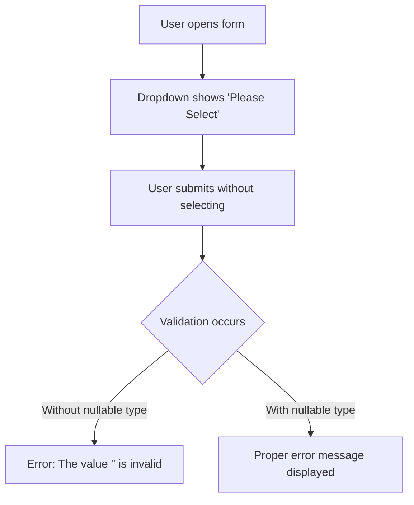

# List and Select Validation in ASP.NET Core MVC

## Table of Contents
1. [Introduction](#1-introduction)
2. [Select List with Required Validation](#2-select-list-with-required-validation)
3. [Nullable Types for Validation](#3-nullable-types-for-validation)
4. [Enum Binding and Validation](#4-enum-binding-and-validation)
5. [Common Issues and Solutions](#5-common-issues-and-solutions)
6. [Best Practices](#6-best-practices)
7. [Quick Reference](#7-quick-reference)

---

## 1. Introduction

### The Problem
Select lists (dropdowns) require special handling for required validation because:
- Unselected dropdown has empty string value (`""`)
- Value types (int, enum) can't be empty
- Default "Please Select" option needs proper handling

### Common Scenario



---

## 2. Select List with Required Validation

### Model with Select List Property

```csharp
public class Employee
{
    public int Id { get; set; }
    
    [Required]
    public string Name { get; set; }
    
    [Required(ErrorMessage = "Please select a department")]
    [Display(Name = "Department")]
    public int DepartmentId { get; set; }  // Non-nullable - Problem!
}
```

### Controller

```csharp
public class EmployeeController : Controller
{
    private readonly IEmployeeService _service;
    
    public ActionResult Create()
    {
        var departments = _service.GetAllDepartment();
        ViewData["DepartmentId"] = new SelectList(departments, "Id", "Name");
        return View();
    }
    
    [HttpPost]
    public ActionResult Create(Employee employee)
    {
        if (ModelState.IsValid)
        {
            _service.Add(employee);
            return RedirectToAction(nameof(Index));
        }
        
        var departments = _service.GetAllDepartment();
        ViewData["DepartmentId"] = new SelectList(departments, "Id", "Name", employee.DepartmentId);
        return View(employee);
    }
}
```

### View

```cshtml
@model Employee

<form asp-action="Create" method="post">
    <div asp-validation-summary="ModelOnly" class="text-danger"></div>
    
    <div class="form-group">
        <label asp-for="DepartmentId" class="control-label"></label>
        <select asp-for="DepartmentId" 
                asp-items="ViewBag.DepartmentId" 
                class="form-control">
            <option value="">Please Select</option>  @* Important! *@
        </select>
        <span asp-validation-for="DepartmentId" class="text-danger"></span>
    </div>
    
    <button type="submit" class="btn btn-primary">Create</button>
</form>
```

### The Problem

With `int DepartmentId` (non-nullable):
- Empty string `""` can't convert to `int`
- **Error:** "The value '' is invalid"
- `[Required]` error message never shown

---

## 3. Nullable Types for Validation

### Solution: Use Nullable Type

```csharp
public class Employee
{
    public int Id { get; set; }
    
    [Required]
    public string Name { get; set; }
    
    [Required(ErrorMessage = "Please select a department")]
    [Display(Name = "Department")]
    public int? DepartmentId { get; set; }  // Nullable int - Solution!
}
```

### Why This Works

| Scenario | Non-Nullable (`int`) | Nullable (`int?`) |
|----------|---------------------|-------------------|
| Empty selection | Can't convert "" to int | Converts to null |
| [Required] check | Never runs | Runs on null value |
| Error message | "The value '' is invalid" | Custom error message |

### Line-by-Line Analysis
| Line | Code | Explanation |
|------|------|-------------|
| `int? DepartmentId` | Nullable integer | Can accept null value |
| `value=""` on option | Empty string for "Please Select" | Converts to null for int? |
| `[Required]` | Required validation | Triggers on null value |

---

## 4. Enum Binding and Validation

### Enum Definition

```csharp
public enum Gender
{
    Male,
    Female,
    Other
}
```

### Model with Enum (Non-Nullable - Problem)

```csharp
public class Person
{
    [Required]
    public string Name { get; set; }
    
    [Required(ErrorMessage = "Please select a gender")]
    public Gender Gender { get; set; }  // Non-nullable enum - Problem!
}
```

### Solution: Nullable Enum

```csharp
public class Person
{
    [Required]
    public string Name { get; set; }
    
    [Required(ErrorMessage = "Please select a gender")]
    public Gender? Gender { get; set; }  // Nullable enum - Solution!
}
```

### View with Enum Dropdown

```cshtml
<div class="form-group">
    <label asp-for="Gender" class="control-label"></label>
    <select asp-for="Gender" 
            asp-items="Html.GetEnumSelectList<Gender>()" 
            class="form-control">
        <option value="">Please Select</option>
    </select>
    <span asp-validation-for="Gender" class="text-danger"></span>
</div>
```

### Generated HTML

```html
<select class="form-control" id="Gender" name="Gender">
    <option value="">Please Select</option>
    <option value="0">Male</option>
    <option value="1">Female</option>
    <option value="2">Other</option>
</select>
```

---

## 5. Common Issues and Solutions

### Issue 1: "The value '' is invalid"

**Cause:** Non-nullable type can't accept empty string

**Solution:** Make property nullable
```csharp
// Before (Problem)
public int DepartmentId { get; set; }

// After (Solution)
public int? DepartmentId { get; set; }
```

### Issue 2: Custom Error Not Showing

**Cause:** Type conversion fails before `[Required]` runs

**Solution:** Nullable type allows `[Required]` to execute
```csharp
[Required(ErrorMessage = "Department is required")]
public int? DepartmentId { get; set; }
```

### Issue 3: Dropdown Not Pre-Selecting Value on Edit

**Cause:** SelectList not receiving selected value

**Solution:** Pass selected value to SelectList
```csharp
// In Edit GET action
ViewData["DepartmentId"] = new SelectList(
    departments, 
    "Id", 
    "Name", 
    employee.DepartmentId);  // <-- Selected value
```

### Issue 4: Default Value Validation

**Cause:** Enum defaults to first value (0), int defaults to 0

**Solution:** Use nullable types
```csharp
// Enum without nullable defaults to Male (0)
public Gender Gender { get; set; }

// Nullable enum has no default selection
public Gender? Gender { get; set; }
```

---

## 6. Best Practices

### DO ✅

| Practice | Reason |
|----------|--------|
| Use nullable types for required dropdowns | Proper validation behavior |
| Add "Please Select" option with `value=""` | Clear user instruction |
| Reload dropdown data on validation failure | Form displays correctly |
| Use `[Required]` with custom message | User-friendly errors |

### DON'T ❌

| Practice | Reason |
|----------|--------|
| Don't use non-nullable for required dropdowns | Validation errors confusing |
| Don't skip "Please Select" option | User might miss selection |
| Don't forget to populate ViewBag on POST | Dropdown renders empty |

---

## 7. Quick Reference

### Complete Dropdown Validation Pattern

**Model:**
```csharp
public class Employee
{
    [Required(ErrorMessage = "Please select a department")]
    [Display(Name = "Department")]
    public int? DepartmentId { get; set; }
}
```

**Controller GET:**
```csharp
public ActionResult Create()
{
    ViewData["DepartmentId"] = new SelectList(
        _repository.GetAllDepartment(), "Id", "Name");
    return View();
}
```

**Controller POST:**
```csharp
[HttpPost]
public ActionResult Create(Employee employee)
{
    if (ModelState.IsValid)
    {
        _repository.Add(employee);
        return RedirectToAction(nameof(Index));
    }
    // Important: Reload dropdown data
    ViewData["DepartmentId"] = new SelectList(
        _repository.GetAllDepartment(), "Id", "Name", employee.DepartmentId);
    return View(employee);
}
```

**View:**
```cshtml
<div class="form-group">
    <label asp-for="DepartmentId"></label>
    <select asp-for="DepartmentId" 
            asp-items="ViewBag.DepartmentId" 
            class="form-control">
        <option value="">Please Select</option>
    </select>
    <span asp-validation-for="DepartmentId" class="text-danger"></span>
</div>
```

### Type Comparison

| Property Type | Empty Selection | Required Works | Error Message |
|--------------|-----------------|----------------|---------------|
| `int` | ❌ Error | ❌ No | "The value '' is invalid" |
| `int?` | ✅ null | ✅ Yes | Custom message |
| `Gender` (enum) | ❌ Defaults to 0 | ❌ No | None (0 is valid) |
| `Gender?` | ✅ null | ✅ Yes | Custom message |

---

## 8. Interview Questions

1. **Why use nullable types for dropdown required validation?**
   - Non-nullable types can't accept empty string, causing type conversion errors before `[Required]` validation runs.

2. **What error occurs with non-nullable dropdown and empty selection?**
   - "The value '' is invalid" - because empty string can't convert to int/enum.

3. **How do you bind an enum to a dropdown?**
   - Use `Html.GetEnumSelectList<EnumType>()` with `asp-items` attribute.

4. **Why add a "Please Select" option with `value=""`?**
   - Provides clear instruction and allows empty selection to be validated.

5. **What happens when you forget to reload ViewBag on POST?**
   - Dropdown renders empty when validation fails and form is returned.
