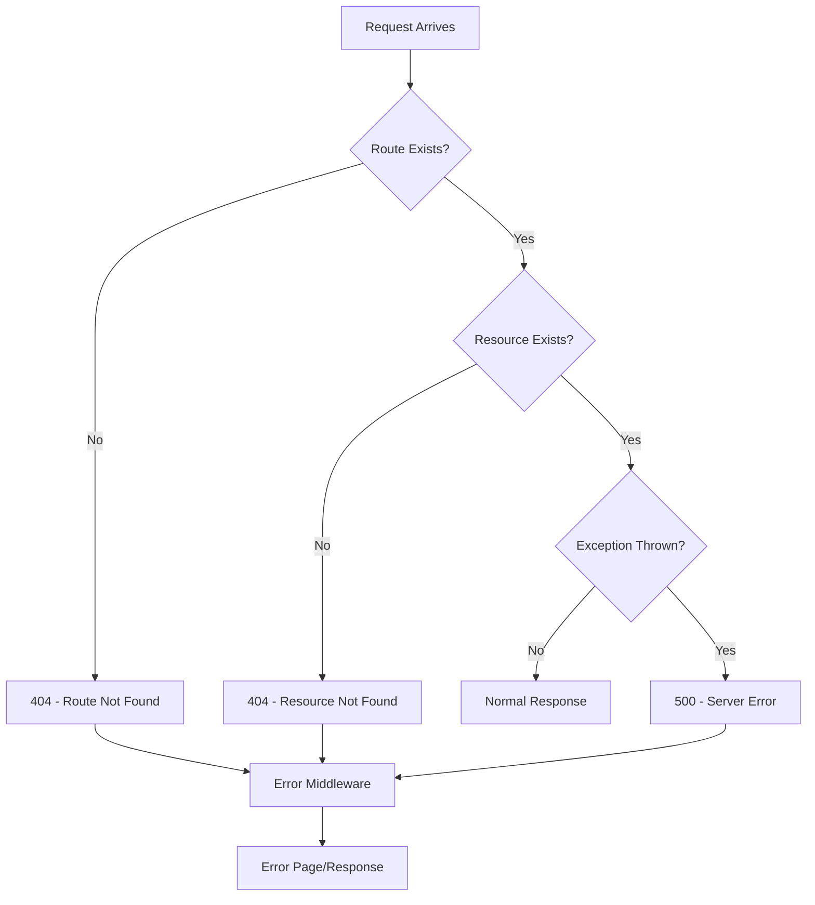

# Error Handling and 404 Pages in ASP.NET Core MVC

## Table of Contents
1. [Introduction](#1-introduction)
2. [Types of 404 Errors](#2-types-of-404-errors)
3. [Status Code Pages Middleware](#3-status-code-pages-middleware)
4. [Custom Error Pages](#4-custom-error-pages)
5. [Developer Exception Page](#5-developer-exception-page)
6. [Implementation Examples](#6-implementation-examples)
7. [Best Practices](#7-best-practices)
8. [Quick Reference](#8-quick-reference)

---

## 1. Introduction

### Why Error Handling Matters
Proper error handling improves user experience, provides helpful feedback, and maintains application security by not exposing sensitive information.

### Error Handling Flow



---

## 2. Types of 404 Errors

### Type 1: No Matching Route
- URL doesn't match any route template
- Example: `/nonexistent/page`

### Type 2: No Matching Resource
- Route exists but resource (data) not found
- Example: `/Employee/Details/9999` (employee ID 9999 doesn't exist)

### Handling Both Types

```csharp
// Type 2 - Resource not found
public ActionResult Details(int id)
{
    var employee = _repository.GetEmployee(id);
    if (employee == null)
    {
        Response.StatusCode = 404;
        return View("NotFound", id);
    }
    return View(employee);
}
```

---

## 3. Status Code Pages Middleware

### UseStatusCodePages

```csharp
// Program.cs
if (!app.Environment.IsDevelopment())
{
    app.UseExceptionHandler("/Home/Error");
    app.UseHsts();
}
else
{
    app.UseStatusCodePages();  // Simple text response
}
```

**Output for 404:** Plain text "Status Code: 404; Not Found"

### UseStatusCodePagesWithRedirects

```csharp
// Program.cs
app.UseStatusCodePagesWithRedirects("/Home/Error/{0}");
```

**Behavior:**
- `{0}` is replaced with status code
- Redirects to `/Home/Error/404`
- Issues 302 redirect, then shows error page

### UseStatusCodePagesWithReExecute

```csharp
// Program.cs
app.UseStatusCodePagesWithReExecute("/Home/Error/{0}");
```

**Behavior:**
- Re-executes request pipeline internally
- Original URL preserved in browser
- Original status code preserved

### Comparison

| Method | Browser URL | Status Code | Use Case |
|--------|-------------|-------------|----------|
| `UseStatusCodePages` | Unchanged | Original (404) | Development debugging |
| `UseStatusCodePagesWithRedirects` | `/Error/404` | 302 → 200 | When URL change is acceptable |
| `UseStatusCodePagesWithReExecute` | Unchanged | Original (404) | SEO-friendly, preserves URL |

---

## 4. Custom Error Pages

### Error Controller

```csharp
public class HomeController : Controller
{
    [Route("Home/Error/{statusCode}")]
    public IActionResult Error(int statusCode)
    {
        switch (statusCode)
        {
            case 404:
                ViewBag.ErrorMessage = "Sorry, the page you requested could not be found.";
                break;
            case 500:
                ViewBag.ErrorMessage = "Something went wrong on our end.";
                break;
            default:
                ViewBag.ErrorMessage = "An error occurred.";
                break;
        }
        
        return View("Error");
    }
}
```

### Error View

```cshtml
@{
    ViewData["Title"] = "Error";
}

<div class="text-center">
    <h1 class="text-danger">Error</h1>
    <h2>@ViewBag.ErrorMessage</h2>
    <p>
        Please contact support if the problem persists.
    </p>
    <a asp-controller="Home" asp-action="Index" class="btn btn-primary">
        Go to Home
    </a>
</div>
```

### Custom NotFound View

```cshtml
@model int?

<div class="text-center">
    <h1 class="text-warning">404 - Not Found</h1>
    @if (Model.HasValue)
    {
        <h2>Employee with ID = @Model was not found</h2>
    }
    else
    {
        <h2>The requested resource was not found</h2>
    }
    <a asp-controller="Home" asp-action="Index" class="btn btn-primary">
        Go to Home
    </a>
</div>
```

---

## 5. Developer Exception Page

### Purpose
Shows detailed exception information during development, including:
- Stack trace
- Query string parameters
- Cookies
- Headers

### Configuration

```csharp
// Program.cs
if (app.Environment.IsDevelopment())
{
    app.UseDeveloperExceptionPage();  // Detailed error info
}
else
{
    app.UseExceptionHandler("/Home/Error");  // User-friendly page
    app.UseHsts();
}
```

### Important Security Note

> ⚠️ **WARNING:** Never use `UseDeveloperExceptionPage()` in production! It exposes sensitive information.

---

## 6. Implementation Examples

### Complete Program.cs Configuration

```csharp
var builder = WebApplication.CreateBuilder(args);

builder.Services.AddControllersWithViews();

var app = builder.Build();

if (app.Environment.IsDevelopment())
{
    // Development: Detailed error page
    app.UseDeveloperExceptionPage();
}
else
{
    // Production: User-friendly error page
    app.UseExceptionHandler("/Home/Error");
    app.UseHsts();
}

// Handle status codes (404, 500, etc.)
app.UseStatusCodePagesWithReExecute("/Home/Error/{0}");

app.UseHttpsRedirection();
app.UseStaticFiles();
app.UseRouting();
app.UseAuthorization();

app.MapControllerRoute(
    name: "default",
    pattern: "{controller=Home}/{action=Index}/{id?}");

app.Run();
```

### Controller with Resource Not Found Handling

```csharp
public class EmployeeController : Controller
{
    private readonly IEmployeeService _repository;
    private readonly ILogger<EmployeeController> _logger;
    
    public EmployeeController(IEmployeeService repository, 
        ILogger<EmployeeController> logger)
    {
        _repository = repository;
        _logger = logger;
    }
    
    public ActionResult Details(int id)
    {
        _logger.LogInformation($"Getting employee with ID {id}");
        
        var employee = _repository.GetEmployee(id);
        
        if (employee == null)
        {
            _logger.LogWarning($"Employee with ID {id} not found");
            Response.StatusCode = 404;
            return View("NotFound", id);
        }
        
        return View(employee);
    }
    
    public ActionResult Delete(int id)
    {
        var employee = _repository.GetEmployee(id);
        
        if (employee == null)
        {
            return NotFound();  // Returns 404 status
        }
        
        return View(employee);
    }
}
```

### Line-by-Line Analysis
| Line | Code | Explanation |
|------|------|-------------|
| `if (employee == null)` | Check if resource exists | Handle missing data |
| `Response.StatusCode = 404` | Set HTTP status code | Proper SEO, proper error indication |
| `return View("NotFound", id)` | Return custom view | User-friendly message with context |
| `return NotFound()` | Built-in helper | Returns 404 status result |

---

## 7. Best Practices

### DO ✅

| Practice | Reason |
|----------|--------|
| Use `UseDeveloperExceptionPage` only in development | Security |
| Use `UseStatusCodePagesWithReExecute` | Preserves URL and status code |
| Log errors before returning error pages | Debugging |
| Provide helpful error messages | UX |
| Include navigation back to safe pages | User recovery |

### DON'T ❌

| Practice | Reason |
|----------|--------|
| Don't show stack traces in production | Security risk |
| Don't use generic error messages | Not helpful |
| Don't forget to set status codes | SEO and caching |
| Don't expose sensitive data in errors | Security risk |

---

## 8. Quick Reference

### Error Handling Middleware Order

```csharp
// Must be early in the pipeline
if (app.Environment.IsDevelopment())
{
    app.UseDeveloperExceptionPage();
}
else
{
    app.UseExceptionHandler("/Error");
    app.UseHsts();
}

app.UseStatusCodePagesWithReExecute("/Error/{0}");

// Rest of middleware...
```

### Built-in Result Methods

| Method | Status Code | Use Case |
|--------|-------------|----------|
| `NotFound()` | 404 | Resource not found |
| `BadRequest()` | 400 | Invalid request |
| `Unauthorized()` | 401 | Authentication required |
| `Forbid()` | 403 | Access denied |
| `StatusCode(code)` | Custom | Any status code |

### Status Code Middleware Comparison

| Method | URL Changed | Status Preserved | Best For |
|--------|-------------|------------------|----------|
| `UseStatusCodePages` | No | Yes | Development |
| `UseStatusCodePagesWithRedirects` | Yes | No (302) | Simple cases |
| `UseStatusCodePagesWithReExecute` | No | Yes | Production |

---

## 9. Interview Questions

1. **What's the difference between UseStatusCodePagesWithRedirects and UseStatusCodePagesWithReExecute?**
   - `WithRedirects` issues a 302 redirect changing the URL and losing the original status code. `WithReExecute` preserves both URL and status code.

2. **Why shouldn't you use UseDeveloperExceptionPage in production?**
   - It exposes sensitive information like stack traces, source code lines, and configuration values.

3. **How do you handle "resource not found" vs "route not found" 404 errors?**
   - Status code pages middleware handles route not found. Controller logic with `Response.StatusCode = 404` handles resource not found.

4. **What does the {0} placeholder represent in error page paths?**
   - It's replaced with the HTTP status code (404, 500, etc.).

5. **What's the NotFound() helper method?**
   - A controller helper that returns a 404 status result.
