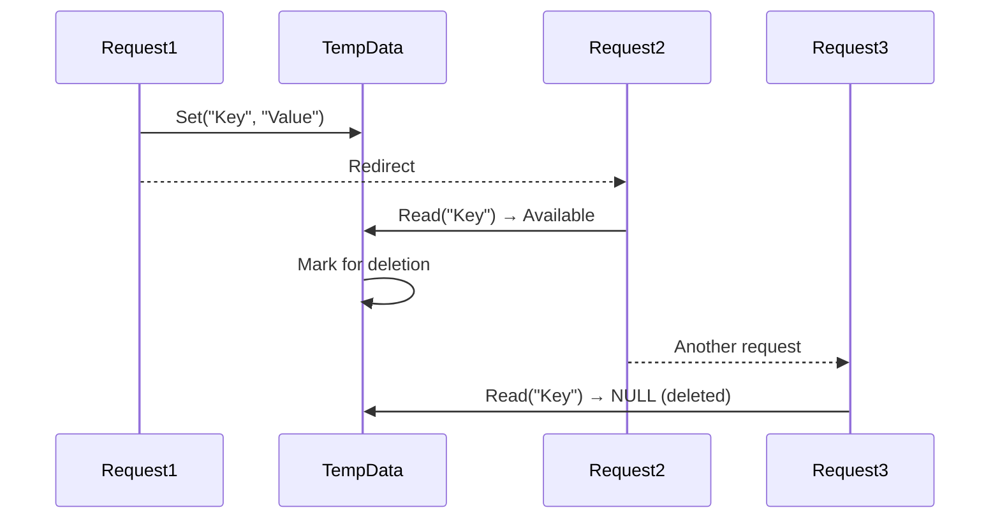
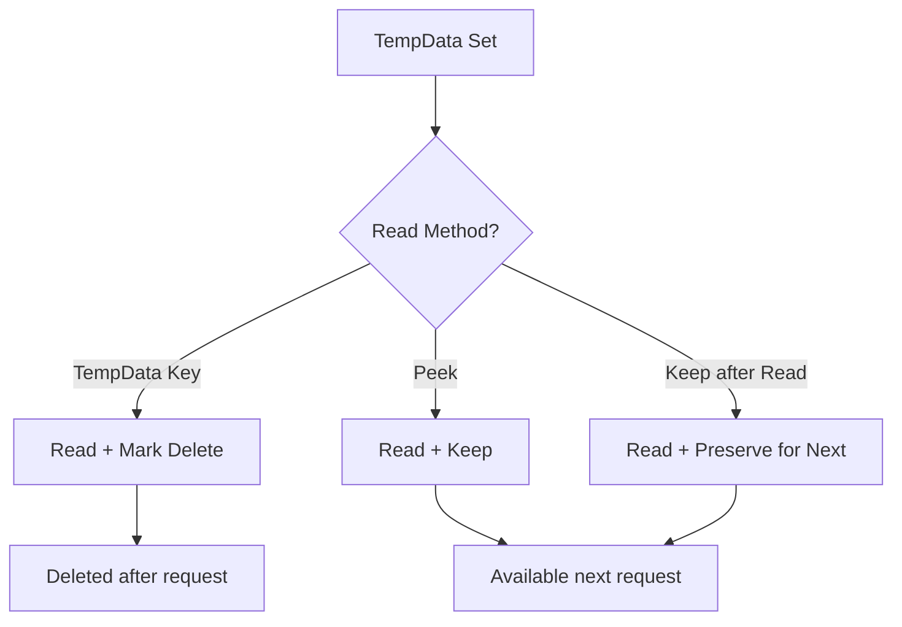
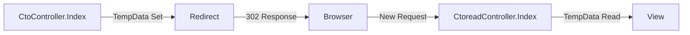
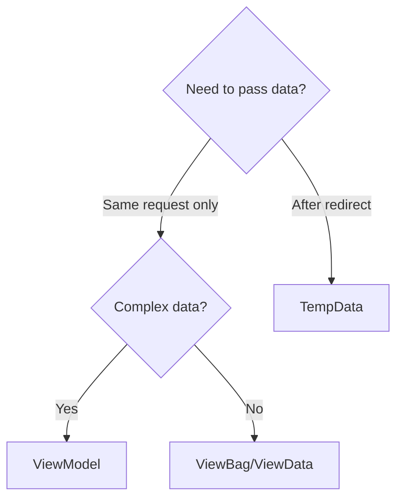

# TempData in ASP.NET Core MVC

## Table of Contents
1. [Introduction](#1-introduction)
2. [TempData Basics](#2-tempdata-basics)
3. [Keep and Peek Methods](#3-keep-and-peek-methods)
4. [Controller to Controller Transfer](#4-controller-to-controller-transfer)
5. [Comparison with ViewData/ViewBag](#5-comparison-with-viewdataviewbag)
6. [Best Practices](#6-best-practices)
7. [Quick Reference](#7-quick-reference)

---

## 1. Introduction

### What is TempData?
TempData is a dictionary for storing data that persists across HTTP redirects (two consecutive requests). It's ideal for passing messages between actions.

### TempData Lifecycle



### Key Characteristics
| Feature | Description |
|---------|-------------|
| **Lifetime** | Current + Next request |
| **Storage** | Session or Cookies (configurable) |
| **Type** | Dictionary<string, object> |
| **Use Case** | Passing data across redirects |

---

## 2. TempData Basics

### Setting and Reading TempData

**Controller:**
```csharp
public class AtoAController : Controller
{
    public IActionResult Index()
    {
        TempData["Message"] = "Welcome to Vita";
        return RedirectToAction("Read");
    }
    
    public IActionResult Read()
    {
        if (TempData.ContainsKey("Message"))
        {
            ViewBag.Data = TempData["Message"].ToString();
        }
        return View();
    }
}
```

**View (Read.cshtml):**
```cshtml
@ViewBag.Data

@* If you refresh, the data is gone! *@
```

### Line-by-Line Analysis
| Line | Code | Explanation |
|------|------|-------------|
| `TempData["Message"] = "Welcome"` | Set TempData | Stores value for next request |
| `return RedirectToAction("Read")` | Redirect | Issues 302, starts new request |
| `TempData.ContainsKey("Message")` | Check existence | Avoid null errors |
| `TempData["Message"]` | Read value | Marks for deletion after read |

### Reading TempData in View

```cshtml
@if (TempData.ContainsKey("Countries"))
{
    @TempData["Countries"].ToString()
}
```

---

## 3. Keep and Peek Methods

### The Problem
TempData is deleted after being read. Sometimes you need to read it multiple times.

### Keep() Method

Preserves TempData for the next request after reading it.

```csharp
public IActionResult Read()
{
    return View();
}

public IActionResult ReadKeepData()
{
    if (TempData.ContainsKey("Countries"))
        ViewBag.KeptData = TempData["Countries"];
    
    return View();
}
```

```cshtml
@* Read.cshtml *@
@if (TempData.ContainsKey("Countries"))
{
    @TempData["Countries"].ToString()
}

@* Keep the data for next request *@
@{
    TempData.Keep("Countries");  // Returns void, so use @{}
}

<a asp-action="ReadKeepData">Read Kept Data</a>
```

**View (ReadKeepData.cshtml):**
```cshtml
@ViewBag.KeptData
@* Data is available because we called Keep() *@
```

### Peek() Method

Reads TempData without marking it for deletion.

```csharp
public class PeekController : Controller
{
    public IActionResult Index()
    {
        TempData["Countries"] = "Welcome to Vita";
        return RedirectToAction(nameof(PRead));
    }
    
    public IActionResult PRead()
    {
        return View();
    }
    
    public IActionResult ReadPeekData()
    {
        if (TempData.ContainsKey("Countries"))
            ViewBag.KeptData = TempData["Countries"];
        
        return View();
    }
}
```

```cshtml
@* PRead.cshtml *@
@if (TempData.ContainsKey("Countries"))
{
    @TempData["Countries"].ToString()
}

@* Peek reads without deleting *@
@TempData.Peek("Countries")

<a asp-action="ReadPeekData">Read Peek Data</a>
```

### Keep vs Peek Comparison

| Method | Read Data | Mark for Deletion | Syntax |
|--------|-----------|-------------------|--------|
| `TempData["Key"]` | Yes | Yes (after read) | `TempData["Key"]` |
| `TempData.Keep("Key")` | No (keeps) | No (preserves) | `TempData.Keep("Key")` |
| `TempData.Peek("Key")` | Yes | No | `TempData.Peek("Key")` |



---

## 4. Controller to Controller Transfer

### Passing Data Between Controllers

**Source Controller:**
```csharp
public class CtoController : Controller
{
    public IActionResult Index()
    {
        TempData["Name"] = "Vidyanidhi";
        return RedirectToAction("Index", "Ctoread");  // Different controller!
    }
}
```

**Destination Controller:**
```csharp
public class CtoreadController : Controller
{
    public IActionResult Index()
    {
        if (TempData.ContainsKey("Name"))
            ViewBag.Data = TempData["Name"].ToString();
        
        return View();
    }
}
```

**View (Ctoread/Index.cshtml):**
```cshtml
@{
    ViewData["Title"] = "Ctoread/Index";
}

<h1>Index</h1>
@ViewBag.Data
```

### Data Flow Diagram



---

## 5. Comparison with ViewData/ViewBag

### Complete Comparison Table

| Feature | ViewData | ViewBag | TempData |
|---------|----------|---------|----------|
| **Type** | Dictionary | Dynamic | Dictionary |
| **Lifetime** | Current request | Current request | Current + Next request |
| **Survives Redirect** | ❌ No | ❌ No | ✅ Yes |
| **Type Casting** | Required | Not required | Required |
| **Storage** | Memory | Memory | Session/Cookie |
| **Use Case** | Controller → View | Controller → View | Controller → Redirect → Controller/View |
| **Introduced** | MVC 1.0 | MVC 3.0 | MVC 1.0 |

### When to Use Each



| Scenario | Use |
|----------|-----|
| Main view data | ViewModel |
| Page title | ViewBag |
| Success/Error after redirect | TempData |
| Dropdown data | ViewData/ViewBag |
| Data between controllers | TempData |

---

## 6. Best Practices

### DO ✅
| Practice | Reason |
|----------|--------|
| Use for success/error messages after redirect | Common pattern |
| Check `ContainsKey()` before reading | Avoid null errors |
| Use `Peek()` for read-only access | Preserves data |
| Keep TempData small | Session storage limits |

### DON'T ❌
| Practice | Reason |
|----------|--------|
| Don't use for large objects | Performance issues |
| Don't rely on for critical data | Can be lost |
| Don't store sensitive data | Session can be hijacked |
| Don't use instead of proper state management | Not designed for that |

---

## 7. Quick Reference

### TempData Methods

| Method | Purpose |
|--------|---------|
| `TempData["Key"] = value` | Set value |
| `TempData["Key"]` | Read value (marks for deletion) |
| `TempData.ContainsKey("Key")` | Check if key exists |
| `TempData.Keep("Key")` | Preserve for next request |
| `TempData.Peek("Key")` | Read without marking for deletion |
| `TempData.Remove("Key")` | Explicitly remove |
| `TempData.Clear()` | Remove all |

### Common Pattern: Success Message After Create

```csharp
// Create action
[HttpPost]
public ActionResult Create(Employee employee)
{
    if (ModelState.IsValid)
    {
        _repository.Add(employee);
        TempData["SuccessMessage"] = "Employee created successfully!";
        return RedirectToAction(nameof(Index));
    }
    return View(employee);
}

// Index action
public ActionResult Index()
{
    var employees = _repository.GetAllEmployee();
    return View(employees);
}
```

```cshtml
@* Index.cshtml *@
@if (TempData["SuccessMessage"] != null)
{
    <div class="alert alert-success">
        @TempData["SuccessMessage"]
    </div>
}

@* Rest of view... *@
```

---

## 8. Interview Questions

1. **What is TempData and when would you use it?**
   - TempData stores data that persists across redirects. Use it for passing messages (success, error) between actions after a redirect.

2. **How long does TempData persist?**
   - For the current request and the next request only. After being read, it's deleted (unless Keep() or Peek() is used).

3. **What's the difference between Keep() and Peek()?**
   - `Keep()` preserves data after reading. `Peek()` reads without marking for deletion. Both preserve data for the next request.

4. **Where is TempData stored?**
   - By default in session state, but can be configured to use cookies.

5. **Can TempData survive multiple redirects?**
   - Only if you use `Keep()` or `Peek()` on each read.

6. **What's the difference between TempData and Session?**
   - TempData auto-deletes after read, designed for short-term data. Session persists until timeout/logout, designed for user session data.
