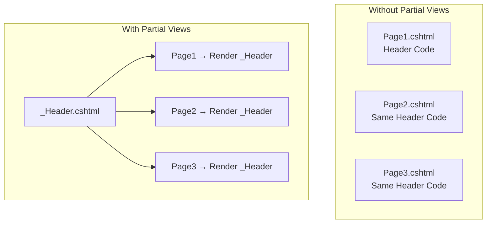
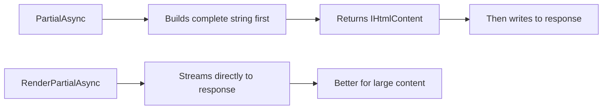

# Partial Views in ASP.NET Core MVC

## Table of Contents
1. [Introduction](#1-introduction)
2. [Creating Partial Views](#2-creating-partial-views)
3. [Rendering Partial Views](#3-rendering-partial-views)
4. [Passing Data to Partial Views](#4-passing-data-to-partial-views)
5. [Use Cases](#5-use-cases)
6. [Best Practices](#6-best-practices)
7. [Quick Reference](#7-quick-reference)

---

## 1. Introduction

### What are Partial Views?
Partial views are reusable view components that render HTML fragments. They help avoid code duplication by encapsulating common UI elements.

### Why Use Partial Views?



### Benefits
| Benefit | Description |
|---------|-------------|
| **Reusability** | Define once, use everywhere |
| **Maintainability** | Change in one place updates all usages |
| **Organization** | Breaks large views into manageable parts |
| **Performance** | Can be cached independently |

---

## 2. Creating Partial Views

### Naming Convention
Partial view files start with underscore (`_`) to indicate they're not standalone.

```
Views/
├── Shared/
│   ├── _Layout.cshtml
│   ├── _LoginPartial.cshtml
│   ├── _ValidationScriptsPartial.cshtml
│   └── _EmployeeCard.cshtml
├── Home/
│   ├── Index.cshtml
│   └── _HomeHeader.cshtml  (Home-specific partial)
```

### Simple Partial View

**_EmployeeCard.cshtml:**
```cshtml
@model Employee

<div class="card" style="width: 18rem;">
    <div class="card-body">
        <h5 class="card-title">@Model.Name</h5>
        <p class="card-text">Email: @Model.Email</p>
        <p class="card-text">Department: @Model.Department?.Name</p>
        <a asp-action="Details" asp-route-id="@Model.Id" class="btn btn-primary">
            View Details
        </a>
    </div>
</div>
```

### Partial View Without Model

**_SocialMediaLinks.cshtml:**
```cshtml
<div class="social-links">
    <a href="https://facebook.com" target="_blank">
        <i class="fab fa-facebook"></i>
    </a>
    <a href="https://twitter.com" target="_blank">
        <i class="fab fa-twitter"></i>
    </a>
    <a href="https://linkedin.com" target="_blank">
        <i class="fab fa-linkedin"></i>
    </a>
</div>
```

---

## 3. Rendering Partial Views

### Method 1: Partial Tag Helper (Recommended)

```cshtml
<partial name="_EmployeeCard" model="Model" />
```

### Method 2: Html.PartialAsync

```cshtml
@await Html.PartialAsync("_EmployeeCard", Model)
```

### Method 3: Html.RenderPartialAsync

```cshtml
@{
    await Html.RenderPartialAsync("_EmployeeCard", Model);
}
```

### Method 4: Relative Paths

```cshtml
@await Html.PartialAsync("../Account/_LoginPartial.cshtml")
```

### Comparison of Methods

| Method | Returns | Performance | Syntax |
|--------|---------|-------------|--------|
| `<partial>` | - | Good | `<partial name="..." />` |
| `Html.PartialAsync` | `IHtmlContent` | Good | `@await Html.PartialAsync("...")` |
| `Html.RenderPartialAsync` | Streams directly | Better | `@{ await Html.RenderPartialAsync(...); }` |

### When to Use RenderPartialAsync



---

## 4. Passing Data to Partial Views

### Passing Model

```cshtml
@model IEnumerable<Employee>

@foreach (var employee in Model)
{
    <partial name="_EmployeeCard" model="employee" />
}
```

### Passing ViewData

```cshtml
<partial name="_EmployeeCard" 
         model="Model" 
         view-data="@(new ViewDataDictionary(ViewData) { 
             { "ShowActions", true } 
         })" />
```

### Using ViewData in Partial

```cshtml
@model Employee

<div class="card">
    <div class="card-body">
        <h5>@Model.Name</h5>
        
        @if ((bool?)ViewData["ShowActions"] ?? false)
        {
            <a asp-action="Edit" asp-route-id="@Model.Id">Edit</a>
            <a asp-action="Delete" asp-route-id="@Model.Id">Delete</a>
        }
    </div>
</div>
```

---

## 5. Use Cases

### 1. Employee List with Cards

**Index.cshtml:**
```cshtml
@model IEnumerable<Employee>

<div class="row">
    @foreach (var employee in Model)
    {
        <div class="col-md-4 mb-3">
            <partial name="_EmployeeCard" model="employee" />
        </div>
    }
</div>
```

### 2. Validation Scripts Partial

**_ValidationScriptsPartial.cshtml:**
```cshtml
<script src="~/lib/jquery-validation/dist/jquery.validate.min.js"></script>
<script src="~/lib/jquery-validation-unobtrusive/jquery.validate.unobtrusive.min.js"></script>
```

**Usage in views:**
```cshtml
@section Scripts {
    @{ await Html.RenderPartialAsync("_ValidationScriptsPartial"); }
}
```

### 3. Login/Logout Partial in Layout

**_Layout.cshtml:**
```cshtml
<nav class="navbar">
    <div class="navbar-nav ms-auto">
        <partial name="_LoginPartial" />
    </div>
</nav>
```

**_LoginPartial.cshtml:**
```cshtml
@inject SignInManager<ApplicationUser> SignInManager
@inject UserManager<ApplicationUser> UserManager

@if (SignInManager.IsSignedIn(User))
{
    <a asp-action="Logout" asp-controller="Account">Logout (@User.Identity.Name)</a>
}
else
{
    <a asp-action="Login" asp-controller="Account">Login</a>
    <a asp-action="Register" asp-controller="Account">Register</a>
}
```

### 4. Reusable Form Components

**_AddressForm.cshtml:**
```cshtml
@model AddressViewModel

<div class="form-group">
    <label asp-for="Street"></label>
    <input asp-for="Street" class="form-control" />
    <span asp-validation-for="Street" class="text-danger"></span>
</div>

<div class="row">
    <div class="col-md-6">
        <div class="form-group">
            <label asp-for="City"></label>
            <input asp-for="City" class="form-control" />
        </div>
    </div>
    <div class="col-md-6">
        <div class="form-group">
            <label asp-for="PostalCode"></label>
            <input asp-for="PostalCode" class="form-control" />
        </div>
    </div>
</div>
```

---

## 6. Best Practices

### DO ✅
| Practice | Reason |
|----------|--------|
| Start partial names with underscore | Convention distinguishes from views |
| Place shared partials in Views/Shared | Accessible from all controllers |
| Use strongly-typed models | Type safety |
| Use `<partial>` tag helper | Clean, readable syntax |
| Use `RenderPartialAsync` for performance | Streams directly |

### DON'T ❌
| Practice | Reason |
|----------|--------|
| Don't make partials too complex | Better as View Components |
| Don't access services directly | Use dependency injection |
| Don't deep nest partials | Performance and debugging |

---

## 7. Quick Reference

### Rendering Syntax Summary

```cshtml
@* Tag Helper (Preferred) *@
<partial name="_PartialName" />
<partial name="_PartialName" model="Model" />

@* PartialAsync *@
@await Html.PartialAsync("_PartialName")
@await Html.PartialAsync("_PartialName", Model)

@* RenderPartialAsync (best performance) *@
@{ await Html.RenderPartialAsync("_PartialName"); }
@{ await Html.RenderPartialAsync("_PartialName", Model); }

@* With relative path *@
@await Html.PartialAsync("../Account/_LoginPartial.cshtml")
```

### Partial View Discovery Order

1. `Views/{ControllerName}/_PartialName.cshtml`
2. `Views/Shared/_PartialName.cshtml`
3. `Areas/{AreaName}/Views/{ControllerName}/_PartialName.cshtml`
4. `Areas/{AreaName}/Views/Shared/_PartialName.cshtml`

---

## 8. Interview Questions

1. **What is a Partial View?**
   - A reusable view component that renders HTML fragments, used to avoid code duplication.

2. **What naming convention is used for partial views?**
   - Partial view files start with underscore (`_`) to indicate they're not standalone.

3. **What's the difference between Html.PartialAsync and Html.RenderPartialAsync?**
   - `PartialAsync` returns IHtmlContent after building complete string. `RenderPartialAsync` streams directly to response, better for large content.

4. **How do you pass data to a partial view?**
   - Through the `model` parameter or `view-data` attribute on the partial tag helper.

5. **Where should shared partial views be placed?**
   - In the `Views/Shared` folder to be accessible from all controllers.

6. **When should you use View Components instead of Partial Views?**
   - When the partial needs complex logic, database access, or its own controller-like functionality.
