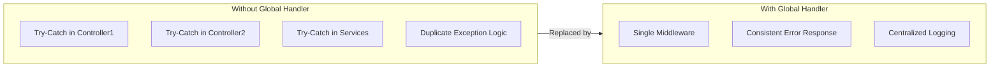
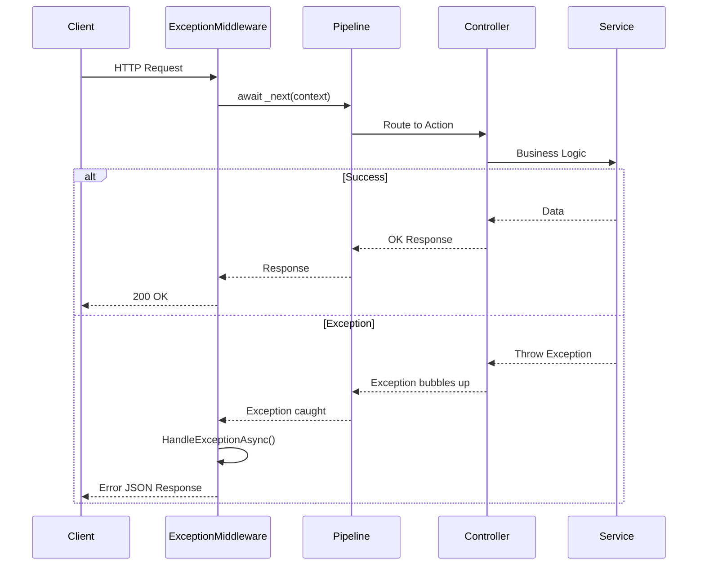

# Global Exception Handling Middleware in ASP.NET Core MVC

## Table of Contents
1. [Introduction](#1-introduction)
2. [Problems with Try-Catch](#2-problems-with-try-catch)
3. [Custom Exception Middleware](#3-custom-exception-middleware)
4. [Implementation](#4-implementation)
5. [Execution Flow](#5-execution-flow)
6. [Best Practices](#6-best-practices)
7. [Quick Reference](#7-quick-reference)

---

## 1. Introduction

### What is Global Exception Handling?
Global exception handling centralizes all exception handling logic in a single middleware, eliminating the need for try-catch blocks in every action method.

### Benefits



---

## 2. Problems with Try-Catch

### Traditional Approach

```csharp
[ApiController]
[Route("api/[controller]")]
public class CustomerController : Controller
{
    private readonly ICustomerService _customerService;
    private readonly ILogger<CustomerController> _logger;

    public CustomerController(ICustomerService customerService, 
        ILogger<CustomerController> logger)
    {
        _customerService = customerService;
        _logger = logger;
    }

    [HttpGet]
    public IActionResult GetCustomers()
    {
        try
        {
            _logger.LogInformation("Getting customer details");
            
            var result = _customerService.GetCustomers();
            if (result == null)
                throw new ApplicationException("Error fetching customer details");

            return Ok(result);
        }
        catch (Exception e)
        {
            _logger.LogError(e.Message);
            return BadRequest("Internal server error");
        }
    }
}
```

### Problems

| Issue | Description |
|-------|-------------|
| **Code Duplication** | Try-catch in every action |
| **Maintenance Burden** | Update logic in multiple places |
| **Inconsistent Handling** | Different error responses |
| **Bloated Controllers** | Double the lines of code |
| **Missed Exceptions** | Easy to forget try-catch |
| **Layer Mapping** | Exception mapping between layers |

---

## 3. Custom Exception Middleware

### Middleware Structure

```csharp
public class ExceptionHandlingMiddleware
{
    private readonly RequestDelegate _next;
    private readonly ILogger<ExceptionHandlingMiddleware> _logger;

    public ExceptionHandlingMiddleware(RequestDelegate next, 
        ILogger<ExceptionHandlingMiddleware> logger)
    {
        _next = next;
        _logger = logger;
    }

    public async Task InvokeAsync(HttpContext httpContext)
    {
        try
        {
            await _next(httpContext);
        }
        catch (Exception ex)
        {
            await HandleExceptionAsync(httpContext, ex);
        }
    }

    private async Task HandleExceptionAsync(HttpContext context, Exception exception)
    {
        _logger.LogError(exception, "An unhandled exception occurred");
        
        var code = HttpStatusCode.InternalServerError;  // 500

        var result = new BaseResponseDTO<string>()
        {
            ErrorCode = (int)HttpStatusCode.InternalServerError,
            ErrorMessage = exception.Message,
            Succeed = false,
        };

        var jsonResult = JsonConvert.SerializeObject(result);
        context.Response.ContentType = "application/json";
        context.Response.StatusCode = (int)code;
        await context.Response.WriteAsync(jsonResult);
    }
}
```

### Line-by-Line Analysis

| Line | Code | Explanation |
|------|------|-------------|
| `RequestDelegate _next` | Next middleware reference | Chain of responsibility pattern |
| `ILogger<T> _logger` | Logger injection | For error logging |
| `await _next(httpContext)` | Call next middleware | Passes request down pipeline |
| `catch (Exception ex)` | Catch any exception | Centralized error handling |
| `HttpStatusCode.InternalServerError` | HTTP 500 | Default error status |
| `context.Response.WriteAsync(jsonResult)` | Write response | Return JSON error to client |

---

## 4. Implementation

### Step 1: Create Response DTO

```csharp
public class BaseResponseDTO<T>
{
    public int ErrorCode { get; set; }
    public string ErrorMessage { get; set; }
    public bool Succeed { get; set; }
    public T Data { get; set; }
}
```

### Step 2: Create Middleware Class

```csharp
using System.Net;
using System.Text.Json;

namespace MVCMiddleware
{
    public class ExceptionHandlingMiddleware
    {
        private readonly RequestDelegate _next;
        private readonly ILogger<ExceptionHandlingMiddleware> _logger;

        public ExceptionHandlingMiddleware(RequestDelegate next, 
            ILogger<ExceptionHandlingMiddleware> logger)
        {
            _next = next;
            _logger = logger;
        }

        public async Task InvokeAsync(HttpContext httpContext)
        {
            try
            {
                await _next(httpContext);
            }
            catch (Exception ex)
            {
                _logger.LogError(ex, "Unhandled exception occurred");
                await HandleExceptionAsync(httpContext, ex);
            }
        }

        private async Task HandleExceptionAsync(HttpContext context, Exception exception)
        {
            context.Response.ContentType = "application/json";
            
            var response = new BaseResponseDTO<string>();
            
            switch (exception)
            {
                case ApplicationException:
                    context.Response.StatusCode = (int)HttpStatusCode.BadRequest;
                    response.ErrorCode = 400;
                    response.ErrorMessage = exception.Message;
                    break;
                    
                case KeyNotFoundException:
                    context.Response.StatusCode = (int)HttpStatusCode.NotFound;
                    response.ErrorCode = 404;
                    response.ErrorMessage = "Resource not found";
                    break;
                    
                case UnauthorizedAccessException:
                    context.Response.StatusCode = (int)HttpStatusCode.Unauthorized;
                    response.ErrorCode = 401;
                    response.ErrorMessage = "Unauthorized access";
                    break;
                    
                default:
                    context.Response.StatusCode = (int)HttpStatusCode.InternalServerError;
                    response.ErrorCode = 500;
                    response.ErrorMessage = "Internal server error";
                    break;
            }
            
            response.Succeed = false;
            
            var jsonResult = JsonSerializer.Serialize(response);
            await context.Response.WriteAsync(jsonResult);
        }
    }
}
```

### Step 3: Register in Program.cs

```csharp
var builder = WebApplication.CreateBuilder(args);

builder.Services.AddControllersWithViews();

var app = builder.Build();

// Register exception handling middleware - early in pipeline!
app.UseMiddleware<ExceptionHandlingMiddleware>();

app.UseHttpsRedirection();
app.UseStaticFiles();
app.UseRouting();
app.UseAuthorization();

app.MapControllerRoute(
    name: "default",
    pattern: "{controller=Home}/{action=Index}/{id?}");

app.Run();
```

### Step 4: Clean Controller Code

```csharp
[ApiController]
[Route("api/[controller]")]
public class CustomerController : Controller
{
    private readonly ICustomerService _customerService;
    private readonly ILogger<CustomerController> _logger;

    public CustomerController(ICustomerService customerService, 
        ILogger<CustomerController> logger)
    {
        _customerService = customerService;
        _logger = logger;
    }

    [HttpGet]
    public IActionResult GetCustomers()
    {
        _logger.LogInformation("Getting customer details");
        
        var result = _customerService.GetCustomers();
        if (result.Count == 0)
            throw new ApplicationException("Invalid Token");

        return Ok(result);
        
        // No try-catch needed! Middleware handles exceptions
    }
}
```

---

## 5. Execution Flow



---

## 6. Best Practices

### DO ✅

| Practice | Reason |
|----------|--------|
| Place middleware early in pipeline | Catch exceptions from all subsequent middleware |
| Log exceptions with full details | Debugging and monitoring |
| Return consistent error format | API consumers expect predictable responses |
| Use exception types for categorization | Different handling for different errors |
| Don't expose internal errors to client | Security |

### DON'T ❌

| Practice | Reason |
|----------|--------|
| Don't send stack traces to client | Security risk |
| Don't log sensitive data | Privacy/security |
| Don't return exception.Message to user | May contain sensitive info |
| Don't catch and swallow exceptions | Hiding problems |

---

## 7. Quick Reference

### Middleware Registration Order

```csharp
var app = builder.Build();

// Exception handling first!
app.UseMiddleware<ExceptionHandlingMiddleware>();

// Then other middleware
app.UseHttpsRedirection();
app.UseStaticFiles();
app.UseRouting();
app.UseAuthentication();
app.UseAuthorization();

app.MapControllerRoute(...);
app.Run();
```

### Common Exception Types

| Exception Type | HTTP Status | Use Case |
|---------------|-------------|----------|
| `ApplicationException` | 400 | Business logic errors |
| `ArgumentException` | 400 | Invalid arguments |
| `KeyNotFoundException` | 404 | Resource not found |
| `UnauthorizedAccessException` | 401 | Authentication required |
| `InvalidOperationException` | 400 | Invalid state |
| `Exception` (default) | 500 | Unexpected errors |

### Error Response Template

```json
{
    "errorCode": 500,
    "errorMessage": "Internal server error",
    "succeed": false,
    "data": null
}
```

---

## 8. Interview Questions

1. **What is the advantage of global exception handling middleware?**
   - Centralizes exception handling, eliminates duplicate try-catch blocks, ensures consistent error responses.

2. **Where should the exception middleware be placed in the pipeline?**
   - Early in the pipeline so it can catch exceptions from all subsequent middleware and controllers.

3. **What is RequestDelegate?**
   - A function delegate that represents the next component in the middleware pipeline.

4. **Should you return exception.Message directly to the client?**
   - No, it may contain sensitive information. Return generic messages and log details server-side.

5. **How do you handle different exception types differently?**
   - Use switch statement on exception type to set appropriate HTTP status codes and messages.
