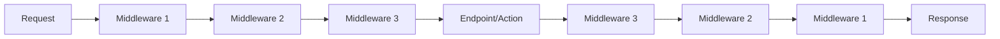
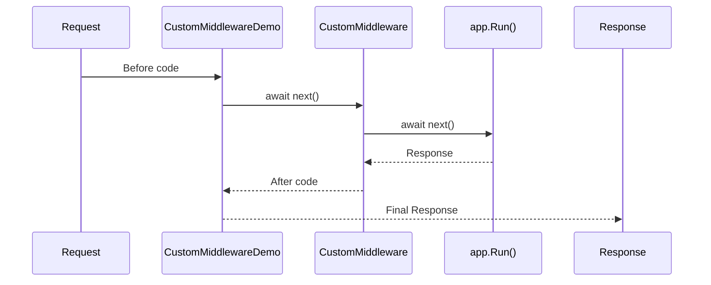

# Custom Middleware Creation in ASP.NET Core MVC

## Table of Contents
1. [Introduction](#1-introduction)
2. [Two Ways to Create Middleware](#2-two-ways-to-create-middleware)
3. [IMiddleware Interface Approach](#3-imiddleware-interface-approach)
4. [Convention-Based Approach](#4-convention-based-approach)
5. [Middleware Pipeline](#5-middleware-pipeline)
6. [Best Practices](#6-best-practices)
7. [Quick Reference](#7-quick-reference)

---

## 1. Introduction

### What is Middleware?
Middleware is software that's assembled into an application pipeline to handle requests and responses. Each component chooses whether to pass the request to the next component.

### Middleware Pipeline



---

## 2. Two Ways to Create Middleware

| Approach | Registration | DI Support |
|----------|-------------|------------|
| **IMiddleware Interface** | Requires service registration | Yes (via DI) |
| **Convention-Based** | Direct UseMiddleware<T> | Yes (constructor injection) |

---

## 3. IMiddleware Interface Approach

### Step 1: Create Middleware Class

```csharp
using Microsoft.AspNetCore.Http;
using System.Threading.Tasks;

namespace WebApplication1
{
    public class CustomMiddlewareDemo : IMiddleware
    {
        public async Task InvokeAsync(HttpContext context, RequestDelegate next)
        {
            // Before next middleware
            await context.Response.WriteAsync("Hello from Custom Middleware\n");
            
            // Call next middleware
            await next(context);
            
            // After next middleware (response path)
        }
    }
}
```

### Step 2: Register in Program.cs

```csharp
var builder = WebApplication.CreateBuilder(args);

builder.Services.AddControllersWithViews();

// Step 1: Register middleware as a service
builder.Services.AddTransient<CustomMiddlewareDemo>();

var app = builder.Build();

// Step 2: Use the middleware
app.UseMiddleware<CustomMiddlewareDemo>();

// Terminal middleware
app.Run(async context => 
    await context.Response.WriteAsync("Hello from Terminal"));

app.Run();
```

### Line-by-Line Analysis
| Line | Code | Explanation |
|------|------|-------------|
| `class CustomMiddlewareDemo : IMiddleware` | Implements interface | Framework-defined contract |
| `InvokeAsync(HttpContext, RequestDelegate)` | Required method | Called for each request |
| `await next(context)` | Call next middleware | Passes request forward |
| `AddTransient<CustomMiddlewareDemo>()` | Register with DI | Required for IMiddleware |
| `UseMiddleware<CustomMiddlewareDemo>()` | Add to pipeline | Activates middleware |

---

## 4. Convention-Based Approach

### Step 1: Create Middleware Class

```csharp
using Microsoft.AspNetCore.Builder;
using Microsoft.AspNetCore.Http;
using System.Threading.Tasks;

namespace MVCMiddleware
{
    public class Middleware
    {
        private readonly RequestDelegate _next;

        public Middleware(RequestDelegate next)
        {
            _next = next;
        }

        public async Task Invoke(HttpContext httpContext)
        {
            // Before next middleware (request path)
            await httpContext.Response.WriteAsync("Hello Custom Middleware\n");
            
            // Call next middleware
            await _next(httpContext);
            
            // After next middleware (response path)
        }
    }

    // Extension method for cleaner registration
    public static class MiddlewareExtensions
    {
        public static IApplicationBuilder UseCustomMiddleware(
            this IApplicationBuilder builder)
        {
            return builder.UseMiddleware<Middleware>();
        }
    }
}
```

### Step 2: Register in Program.cs

```csharp
var builder = WebApplication.CreateBuilder(args);

builder.Services.AddControllersWithViews();

var app = builder.Build();

// Use the middleware (option 1)
app.UseMiddleware<Middleware>();

// Or use extension method (option 2)
app.UseCustomMiddleware();

app.MapControllerRoute(
    name: "default",
    pattern: "{controller=Home}/{action=Index}/{id?}");

app.Run();
```

### Key Differences from IMiddleware

| Aspect | IMiddleware | Convention-Based |
|--------|-------------|------------------|
| Registration | `AddTransient<T>()` required | Not required |
| Constructor | Any parameters via DI | Must have `RequestDelegate` |
| Method name | Must be `InvokeAsync` | Can be `Invoke` or `InvokeAsync` |
| Method params | Fixed signature | Can have additional DI params |

---

## 5. Middleware Pipeline

### Multiple Middleware Example

```csharp
var builder = WebApplication.CreateBuilder(args);

builder.Services.AddControllersWithViews();
builder.Services.AddTransient<CustomMiddlewareDemo>();

var app = builder.Build();

// Middleware executes in order
app.UseMiddleware<CustomMiddlewareDemo>();  // 1st
app.UseCustomMiddleware();                   // 2nd

// Terminal middleware (doesn't call next)
app.Run(async context => 
    await context.Response.WriteAsync("Hello"));

app.Run();
```

### Execution Order



### Short-Circuiting

```csharp
public async Task Invoke(HttpContext context)
{
    if (context.Request.Path.StartsWithSegments("/blocked"))
    {
        context.Response.StatusCode = 403;
        await context.Response.WriteAsync("Blocked!");
        return;  // Short-circuit - don't call next
    }
    
    await _next(context);
}
```

---

## 6. Middleware with Dependencies

### Injecting Services

```csharp
public class LoggingMiddleware
{
    private readonly RequestDelegate _next;
    private readonly ILogger<LoggingMiddleware> _logger;

    public LoggingMiddleware(RequestDelegate next, 
        ILogger<LoggingMiddleware> logger)
    {
        _next = next;
        _logger = logger;  // Constructor injection
    }

    public async Task Invoke(HttpContext context, 
        IUserService userService)  // Method injection
    {
        _logger.LogInformation($"Request: {context.Request.Path}");
        
        var user = await userService.GetCurrentUser();
        
        await _next(context);
        
        _logger.LogInformation($"Response: {context.Response.StatusCode}");
    }
}
```

---

## 7. Best Practices

### DO ✅

| Practice | Reason |
|----------|--------|
| Keep middleware focused | Single responsibility |
| Use async/await | Non-blocking I/O |
| Call next when appropriate | Pipeline continues |
| Create extension methods | Cleaner registration |
| Handle exceptions gracefully | Don't crash pipeline |

### DON'T ❌

| Practice | Reason |
|----------|--------|
| Don't block with .Result or .Wait() | Deadlocks |
| Don't write to response after next() returns | Response may be sent |
| Don't do heavy processing | Impacts all requests |
| Don't modify response headers after body written | Exception |

---

## 8. Quick Reference

### Middleware Template

```csharp
public class MyMiddleware
{
    private readonly RequestDelegate _next;

    public MyMiddleware(RequestDelegate next)
    {
        _next = next;
    }

    public async Task InvokeAsync(HttpContext context)
    {
        // Before
        
        await _next(context);
        
        // After
    }
}

public static class MyMiddlewareExtensions
{
    public static IApplicationBuilder UseMyMiddleware(
        this IApplicationBuilder builder)
    {
        return builder.UseMiddleware<MyMiddleware>();
    }
}
```

### Built-in Middleware Order

```csharp
app.UseExceptionHandler();      // First - catch exceptions
app.UseHsts();
app.UseHttpsRedirection();
app.UseStaticFiles();           // Serve static files early
app.UseRouting();
app.UseAuthentication();        // Who are you?
app.UseAuthorization();         // Are you allowed?
app.UseSession();
app.UseEndpoints();             // Last - handle request
```

---

## 9. Interview Questions

1. **What is the difference between IMiddleware and convention-based middleware?**
   - IMiddleware requires service registration and has a fixed signature. Convention-based uses RequestDelegate in constructor and is more flexible.

2. **What is RequestDelegate?**
   - A function delegate representing the next middleware in the pipeline.

3. **How do you short-circuit the pipeline?**
   - Don't call `await next(context)` - just return after writing response.

4. **Why is middleware order important?**
   - Each middleware can modify request/response. Order determines what each middleware sees.

5. **Can middleware have dependencies?**
   - Yes, via constructor injection or method injection in the Invoke method.

6. **What is a terminal middleware?**
   - Middleware that doesn't call next(), ending the pipeline (like `app.Run()`).
