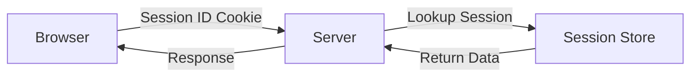
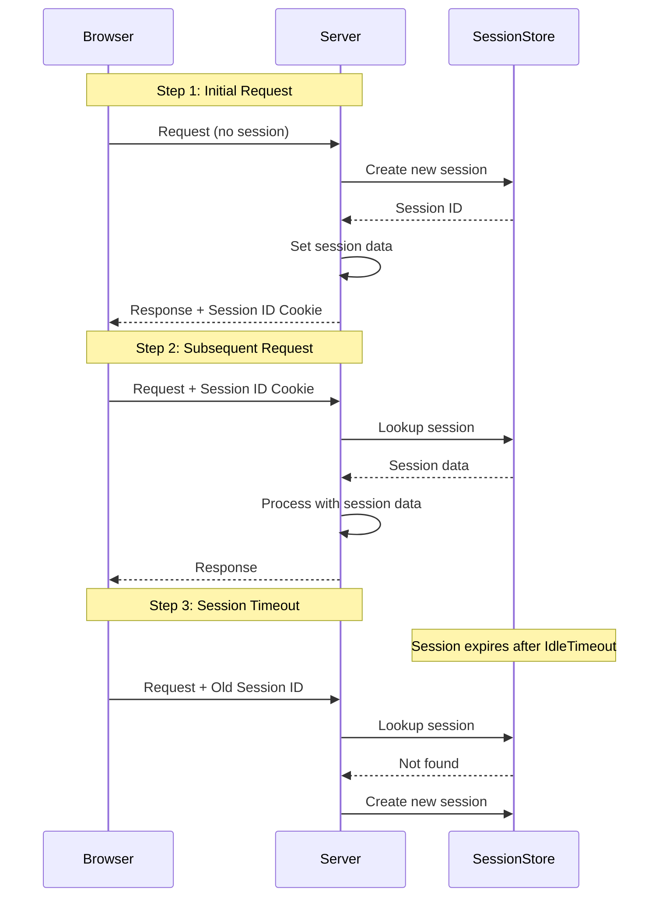

# Session State in ASP.NET Core MVC

## Table of Contents
1. [Introduction](#1-introduction)
2. [Session Configuration](#2-session-configuration)
3. [Working with Session](#3-working-with-session)
4. [Session Lifecycle](#4-session-lifecycle)
5. [Accessing Session in Views](#5-accessing-session-in-views)
6. [Session Types](#6-session-types)
7. [Best Practices](#7-best-practices)
8. [Quick Reference](#8-quick-reference)

---

## 1. Introduction

### What is Session State?
Session state stores user data on the server while maintaining a session ID cookie on the client. It persists data across multiple requests from the same user.

### Session Architecture



### Key Characteristics
| Feature | Description |
|---------|-------------|
| **Storage** | Server-side (memory, SQL, Redis) |
| **Identification** | Cookie with Session ID |
| **Scope** | Per-user, browser-specific |
| **Default Timeout** | 20 minutes |
| **Data Types** | String, Int32, byte[] |

---

## 2. Session Configuration

### Basic Configuration

```csharp
var builder = WebApplication.CreateBuilder(args);

builder.Services.AddControllersWithViews();

// Add distributed memory cache (required for session)
builder.Services.AddDistributedMemoryCache();

// Configure session
builder.Services.AddSession(options =>
{
    options.IdleTimeout = TimeSpan.FromMinutes(30);
    options.Cookie.HttpOnly = true;
    options.Cookie.IsEssential = true;
});

var app = builder.Build();

// ... other middleware

app.UseSession();  // Must be before UseEndpoints

app.MapControllerRoute(...);

app.Run();
```

### Session Options Explained

```csharp
builder.Services.AddSession(options =>
{
    // Session expires after this idle time
    options.IdleTimeout = TimeSpan.FromMinutes(30);
    
    // I/O timeout for session operations
    options.IOTimeout = TimeSpan.FromSeconds(10);
    
    // Cookie name (default: .AspNetCore.Session)
    options.Cookie.Name = ".MyApp.Session";
    
    // Prevent JavaScript access
    options.Cookie.HttpOnly = true;
    
    // GDPR compliance
    options.Cookie.IsEssential = true;
    
    // Cookie path
    options.Cookie.Path = "/";
    
    // HTTPS only
    options.Cookie.SecurePolicy = CookieSecurePolicy.Always;
    
    // CSRF protection
    options.Cookie.SameSite = SameSiteMode.Strict;
});
```

| Option | Default | Purpose |
|--------|---------|---------|
| `IdleTimeout` | 20 min | Session expiration after inactivity |
| `IOTimeout` | 1 min | Max time for session I/O operations |
| `Cookie.Name` | .AspNetCore.Session | Cookie name |
| `Cookie.HttpOnly` | true | Block JavaScript access |
| `Cookie.IsEssential` | false | GDPR bypass |
| `Cookie.SecurePolicy` | None | HTTPS requirement |

---

## 3. Working with Session

### Setting Session Values

```csharp
public class HomeController : Controller
{
    const string SessionName = "_Name";
    const string SessionAge = "_Age";

    public IActionResult Index()
    {
        // Set string value
        HttpContext.Session.SetString(SessionName, "DAC");
        
        // Set integer value
        HttpContext.Session.SetInt32(SessionAge, 24);
        
        return View();
    }
}
```

### Reading Session Values

```csharp
public IActionResult About()
{
    // Get string value
    ViewBag.Name = HttpContext.Session.GetString(SessionName);
    
    // Get integer value
    ViewBag.Age = HttpContext.Session.GetInt32(SessionAge);
    
    return View();
}
```

### Checking Session Existence

```csharp
public IActionResult Index()
{
    if (HttpContext.Session.GetString(SessionName) != null)
    {
        ViewBag.Name = HttpContext.Session.GetString(SessionName);
        ViewBag.Age = HttpContext.Session.GetInt32(SessionAge);
        return View();
    }
    
    return RedirectToAction("Login");
}
```

### Removing Session Values

```csharp
[HttpPost]
public ActionResult Logout()
{
    // Remove specific session key
    HttpContext.Session.Remove(SessionName);
    
    // Or clear all session data
    HttpContext.Session.Clear();
    
    return RedirectToAction("Login");
}
```

---

## 4. Session Lifecycle

### Session Flow



### Session Behaviors
| Behavior | Description |
|----------|-------------|
| Browser-specific | Each browser has unique session |
| Not shared across browsers | Opening new browser = new session |
| Deleted on browser close | Session cookie is non-persistent |
| Timeout | Expires after IdleTimeout of inactivity |
| No client notification | No callback when session expires |

---

## 5. Accessing Session in Views

### Using @Context

```cshtml
@using Microsoft.AspNetCore.Http

<h1>@Context.Session.GetString("_Name")</h1>
```

### Using IHttpContextAccessor

**Register in Program.cs:**
```csharp
builder.Services.AddSingleton<IHttpContextAccessor, HttpContextAccessor>();
```

**In View:**
```cshtml
@using Microsoft.AspNetCore.Http
@inject IHttpContextAccessor HttpContextAccessor

@{
    ViewData["Title"] = "Home Page";
}

<div class="text-left">
    <b>User Name:</b> @HttpContextAccessor?.HttpContext?.Session.GetString("_UserName")
    <br />
    <b>User Id:</b> @HttpContextAccessor?.HttpContext?.Session.GetInt32("_UserId")
</div>
```

---

## 6. Session Types

### In-Memory Session (Default)

```csharp
builder.Services.AddDistributedMemoryCache();
builder.Services.AddSession();
```

**Characteristics:**
- Stored in server memory
- Lost on app restart
- Not suitable for web farms

### Distributed SQL Server Session

```csharp
// NuGet: Microsoft.Extensions.Caching.SqlServer

builder.Services.AddDistributedSqlServerCache(options =>
{
    options.ConnectionString = 
        builder.Configuration.GetConnectionString("SessionDB");
    options.SchemaName = "dbo";
    options.TableName = "MySessions";
});

builder.Services.AddSession(options =>
{
    options.IdleTimeout = TimeSpan.FromMinutes(30);
    options.Cookie.HttpOnly = true;
    options.Cookie.IsEssential = true;
});
```

**Create Session Table:**
```bash
dotnet tool install --global dotnet-sql-cache
dotnet sql-cache create "ConnectionString" dbo MySessions
```

### Comparison

| Type | Storage | Persistence | Web Farm |
|------|---------|-------------|----------|
| **In-Memory** | Server RAM | No | No |
| **SQL Server** | Database | Yes | Yes |
| **Redis** | Redis Cache | Yes | Yes |

---

## 7. Best Practices

### DO ✅
| Practice | Reason |
|----------|--------|
| Check for null before reading | Session may expire |
| Use constants for session keys | Avoid typos |
| Keep session data small | Performance |
| Use distributed session for scaling | Web farm support |
| Set appropriate timeout | Balance UX and resources |

### DON'T ❌
| Practice | Reason |
|----------|--------|
| Don't store large objects | Memory issues |
| Don't store sensitive data unencrypted | Security |
| Don't rely on session for critical data | Can be lost |
| Don't forget UseSession() middleware | Session won't work |

---

## 8. Quick Reference

### Session Methods

| Method | Purpose |
|--------|---------|
| `SetString(key, value)` | Store string |
| `GetString(key)` | Retrieve string |
| `SetInt32(key, value)` | Store integer |
| `GetInt32(key)` | Retrieve integer |
| `Set(key, byte[])` | Store byte array |
| `Get(key)` | Retrieve byte array |
| `Remove(key)` | Remove specific key |
| `Clear()` | Remove all session data |

### Storing Complex Objects

```csharp
// Extension methods for JSON serialization
public static class SessionExtensions
{
    public static void Set<T>(this ISession session, string key, T value)
    {
        session.SetString(key, JsonSerializer.Serialize(value));
    }

    public static T Get<T>(this ISession session, string key)
    {
        var value = session.GetString(key);
        return value == null ? default : JsonSerializer.Deserialize<T>(value);
    }
}

// Usage
HttpContext.Session.Set("Employee", employee);
var emp = HttpContext.Session.Get<Employee>("Employee");
```

---

## 9. Interview Questions

1. **What is Session State in ASP.NET Core?**
   - Server-side storage of user data using a client-side session ID cookie.

2. **Where is session data stored by default?**
   - In-memory cache on the server (AddDistributedMemoryCache).

3. **What happens when session times out?**
   - Session data is deleted from the store; next request creates new session.

4. **How is session different from cookies?**
   - Session: server-side, larger data, more secure. Cookies: client-side, limited size, less secure.

5. **What is the default session timeout?**
   - 20 minutes of inactivity.

6. **When would you use distributed session?**
   - In web farm/load-balanced environments where requests may hit different servers.
