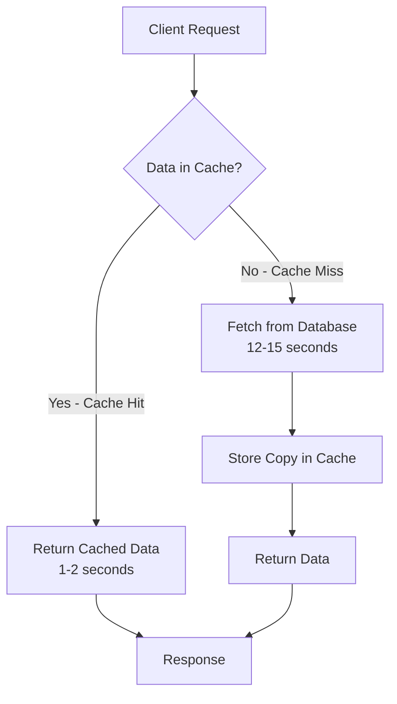
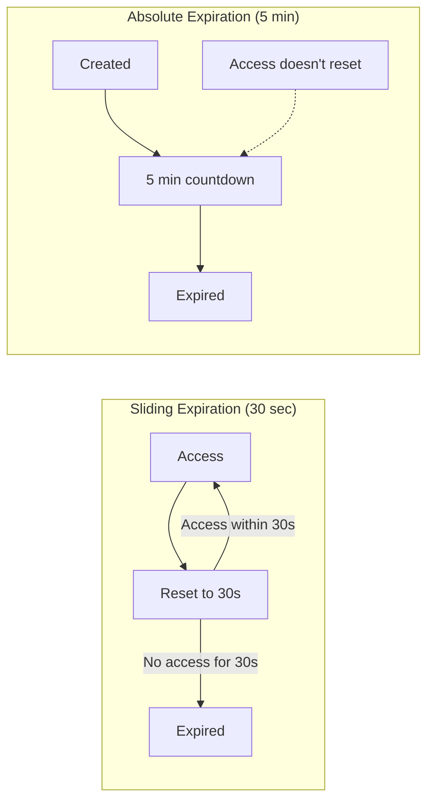

# In-Memory Caching in ASP.NET Core MVC

## Table of Contents
1. [Introduction](#1-introduction)
2. [Configuration](#2-configuration)
3. [Core Methods](#3-core-methods)
4. [Expiration Policies](#4-expiration-policies)
5. [Complete CRUD Cache Example](#5-complete-crud-cache-example)
6. [Removing Cache Data](#6-removing-cache-data)
7. [IMemoryCache Interface Details](#7-imemorycache-interface-details)
8. [Best Practices](#8-best-practices)
9. [Interview Questions](#9-interview-questions)

---

## 1. Introduction

### What is In-Memory Caching?
In-memory caching stores data directly in the web server's memory (RAM), avoiding repeated database queries for frequently accessed data.

### Cache Hit and Cache Miss



### Key Concepts
| Concept | Description |
|---------|-------------|
| **Cache Hit** | Data found in cache - fast retrieval |
| **Cache Miss** | Data not in cache - must fetch from source |
| **Eviction** | Automatic or manual removal of cached data |
| **Expiration** | Time-based cache invalidation |

### Advantages and Disadvantages

| Advantages | Disadvantages |
|------------|---------------|
| ✅ Much faster than distributed cache | ❌ Not suitable for multi-server/cloud deployments |
| ✅ Easy to implement | ❌ Difficult to maintain consistency across servers |
| ✅ No network latency | ❌ Data lost on app restart |
| ✅ Suitable for small-scale apps | ❌ Consumes server memory |

---

## 2. Configuration

### Step 1: Add NuGet Package (If Needed)
The `Microsoft.Extensions.Caching.Memory` package is included by default in ASP.NET Core.

### Step 2: Register in Program.cs

```csharp
var builder = WebApplication.CreateBuilder(args);

// Register In-Memory Cache service
builder.Services.AddMemoryCache();
builder.Services.AddControllersWithViews();

var app = builder.Build();
// ... rest of configuration
```

### Step 3: Inject into Controller

```csharp
using Microsoft.Extensions.Caching.Memory;

public class HomeController : Controller
{
    private readonly IMemoryCache _memoryCache;
    private readonly IEmployeeService _employeeService;

    public HomeController(IMemoryCache memoryCache, 
        IEmployeeService employeeService)
    {
        _memoryCache = memoryCache;
        _employeeService = employeeService;
    }
}
```

---

## 3. Core Methods

### Method 1: TryGetValue Pattern

```csharp
public IActionResult Index()
{
    DateTime currentTime;
    
    // Try to get value from cache
    bool isExist = _memoryCache.TryGetValue("CacheTime", out currentTime);
    
    if (!isExist)
    {
        // Cache miss - fetch fresh data
        currentTime = DateTime.Now;
        
        // Set cache options
        var cacheEntryOptions = new MemoryCacheEntryOptions()
            .SetSlidingExpiration(TimeSpan.FromSeconds(30));
        
        // Store in cache
        _memoryCache.Set("CacheTime", currentTime, cacheEntryOptions);
    }
    
    return View(currentTime);
}
```

### Line-by-Line Analysis
| Line | Code | Explanation |
|------|------|-------------|
| `TryGetValue("CacheTime", out currentTime)` | Check cache | Returns true if found, assigns value |
| `if (!isExist)` | Cache miss check | Only fetch if not cached |
| `SetSlidingExpiration(30 sec)` | Expiration policy | Resets timer on each access |
| `_memoryCache.Set(...)` | Store in cache | With key, value, and options |

### Method 2: Get Method

```csharp
public IActionResult Index()
{
    DateTime? cachedTime = _memoryCache.Get<DateTime?>("CacheTime");
    
    if (cachedTime == null)
    {
        cachedTime = DateTime.Now;
        _memoryCache.Set("CacheTime", cachedTime, TimeSpan.FromMinutes(5));
    }
    
    return View(cachedTime);
}
```

### Method 3: GetOrCreate Pattern (Recommended)

```csharp
public IActionResult Index()
{
    var currentTime = _memoryCache.GetOrCreate("CacheTime", entry =>
    {
        entry.SlidingExpiration = TimeSpan.FromSeconds(45);
        return DateTime.Now;
    });
    
    return View(currentTime);
}
```

**Why GetOrCreate is Recommended:**
- Atomic operation - handles race conditions
- Cleaner code - single method call
- Cache miss logic encapsulated

### Method 4: GetOrCreateAsync

```csharp
public async Task<IActionResult> Index()
{
    var employees = await _memoryCache.GetOrCreateAsync("Employees", async entry =>
    {
        entry.AbsoluteExpirationRelativeToNow = TimeSpan.FromMinutes(10);
        return await _employeeService.GetAllEmployeesAsync();
    });
    
    return View(employees);
}
```

---

## 4. Expiration Policies

### Sliding Expiration
Resets timer on each access. Cache expires after specified period of **inactivity**.

```csharp
var cacheOptions = new MemoryCacheEntryOptions()
    .SetSlidingExpiration(TimeSpan.FromSeconds(30));

// Or using property
cacheOptions.SlidingExpiration = TimeSpan.FromSeconds(30);
```

### Absolute Expiration
Cache expires at a **fixed time**, regardless of access.

```csharp
// Using TimeSpan (relative to now)
_cache.Set("key", item, TimeSpan.FromDays(1));

// Using DateTime (specific date/time)
_cache.Set("key", item, new DateTime(2025, 1, 1));

// Using options
var cacheOptions = new MemoryCacheEntryOptions()
    .SetAbsoluteExpiration(TimeSpan.FromMinutes(30));
```

### Combined Expiration (Best Practice)

```csharp
var cacheOptions = new MemoryCacheEntryOptions
{
    AbsoluteExpirationRelativeToNow = TimeSpan.FromDays(30),
    SlidingExpiration = TimeSpan.FromDays(7)
};
// Expires after 7 days of inactivity OR 30 days total (whichever first)
```

### Comparison Diagram



---

## 5. Complete CRUD Cache Example

### Using Cache with Employee List

```csharp
public class HomeController : Controller
{
    private readonly IMemoryCache _cache;
    private readonly IEmployeeService _service;
    private const string CacheKey = "EmployeeList";

    public HomeController(IMemoryCache cache, IEmployeeService service)
    {
        _cache = cache;
        _service = service;
    }

    public ViewResult AllEmployees()
    {
        if (!_cache.TryGetValue(CacheKey, out List<Employee> employees))
        {
            // Cache miss - fetch from database
            employees = _service.GetAllEmployee().ToList();

            var cacheOptions = new MemoryCacheEntryOptions()
                .SetSlidingExpiration(TimeSpan.FromMinutes(5))
                .SetAbsoluteExpiration(TimeSpan.FromMinutes(30));

            _cache.Set(CacheKey, employees, cacheOptions);
        }

        return View(employees);
    }

    [HttpPost]
    public IActionResult Create(Employee employee)
    {
        if (ModelState.IsValid)
        {
            _service.Add(employee);
            
            // Invalidate cache after data change
            _cache.Remove(CacheKey);
            
            return RedirectToAction(nameof(AllEmployees));
        }
        return View(employee);
    }
}
```

### View Showing Current vs Cached Time

```cshtml
@model DateTime?

<div class="row">
    <div class="col-md-3">
        <h3>Current Time: @DateTime.Now.ToString()</h3>
    </div>
    <div class="col-md-3">
        <h3>Cached Time: @Model?.ToString()</h3>
    </div>
</div>
```

---

## 6. Removing Cache Data

### Manual Removal

```csharp
[HttpPost]
public IActionResult RemoveCache()
{
    _memoryCache.Remove("CacheTime");
    return View("Index");
}
```

### Automatic Eviction
Cache is automatically evicted in these cases:

| Eviction Reason | Description |
|-----------------|-------------|
| **Sliding Expiration** | No access within specified time |
| **Absolute Expiration** | Fixed time elapsed |
| **Memory Pressure** | System needs memory |
| **Size Limit Reached** | Cache size limit exceeded |

### View with Remove Button

```cshtml
@model DateTime?

<form asp-controller="Home" asp-action="RemoveCache" method="post">
    <input type="submit" class="btn btn-danger" value="Remove Cache" />
</form>

<div class="row">
    <div class="col-md-3">
        <h3>Current Time: @DateTime.Now.ToString()</h3>
    </div>
    <div class="col-md-3">
        <h3>Cache Time: @(Model != null ? Model.ToString() : "Cache is not available")</h3>
    </div>
</div>
```

---

## 7. IMemoryCache Interface Details

### Interface Definition

```csharp
public interface IMemoryCache : IDisposable
{
    bool TryGetValue(object key, out object value);
    ICacheEntry CreateEntry(object key);
    void Remove(object key);
}
```

### Extension Methods

```csharp
public static class CacheExtensions
{
    public static TItem Get<TItem>(this IMemoryCache cache, object key);
    
    public static TItem Set<TItem>(this IMemoryCache cache, 
        object key, TItem value, MemoryCacheEntryOptions options);
    
    public static bool TryGetValue<TItem>(this IMemoryCache cache, 
        object key, out TItem value);
    
    public static TItem GetOrCreate<TItem>(this IMemoryCache cache, 
        object key, Func<ICacheEntry, TItem> factory);
    
    public static Task<TItem> GetOrCreateAsync<TItem>(this IMemoryCache cache, 
        object key, Func<ICacheEntry, Task<TItem>> factory);
}
```

### MemoryCacheEntryOptions Properties

| Property | Type | Purpose |
|----------|------|---------|
| `AbsoluteExpiration` | DateTimeOffset? | Exact expiration time |
| `AbsoluteExpirationRelativeToNow` | TimeSpan? | Expiration from now |
| `SlidingExpiration` | TimeSpan? | Inactivity timeout |
| `Priority` | CacheItemPriority | Eviction priority |
| `Size` | long? | Cache entry size |
| `PostEvictionCallbacks` | List | Callbacks on eviction |

---

## 8. Best Practices

### DO ✅

| Practice | Reason |
|----------|--------|
| Use `GetOrCreate` / `GetOrCreateAsync` | Atomic, cleaner code |
| Combine sliding + absolute expiration | Balance freshness and resources |
| Use descriptive cache keys | Easy debugging |
| Invalidate cache after data updates | Prevent stale data |
| Cache read-heavy, rarely-changed data | Best ROI |

### DON'T ❌

| Practice | Reason |
|----------|--------|
| Don't cache frequently changing data | Stale data issues |
| Don't use for multi-server apps | Use distributed cache |
| Don't cache sensitive data without care | Memory can be accessed |
| Don't forget to handle null returns | Cache may be evicted |

---

## 9. Interview Questions

1. **What is the difference between cache hit and cache miss?**
   - Cache hit: Data found in cache. Cache miss: Data not found, must be fetched from source.

2. **How do you register IMemoryCache?**
   - Call `builder.Services.AddMemoryCache()` in Program.cs.

3. **What is the difference between sliding and absolute expiration?**
   - Sliding: Resets timer on each access. Absolute: Fixed expiration time regardless of access.

4. **What is GetOrCreate and why is it recommended?**
   - Atomic method that returns cached value or creates it if missing. Recommended because it handles race conditions and provides cleaner code.

5. **What happens to in-memory cache on app restart?**
   - All cached data is lost. Use distributed cache for persistence.

6. **When should you NOT use in-memory caching?**
   - Multi-server environments (use distributed cache), frequently changing data, very large datasets.

7. **How do you invalidate cache after data changes?**
   - Call `_cache.Remove("key")` after update/create/delete operations.

8. **What is the IMemoryCache interface?**
   - The interface for in-memory caching with methods: TryGetValue, CreateEntry, Remove, plus extension methods.
