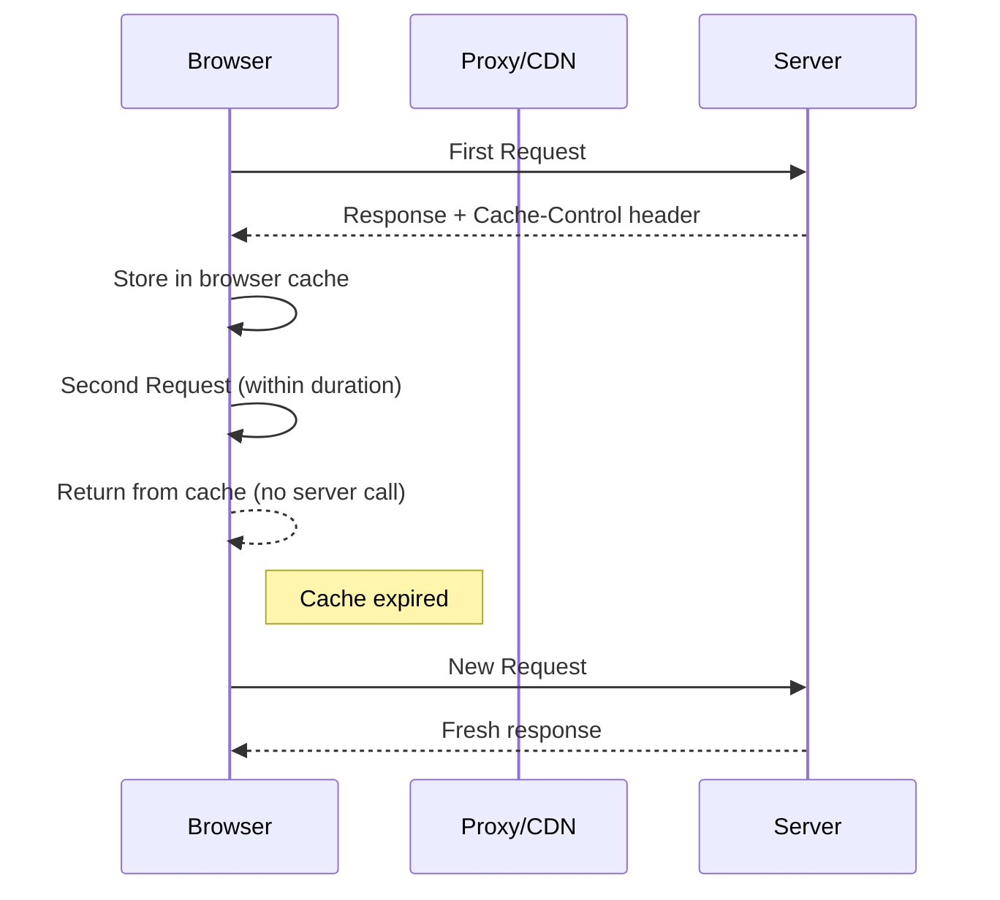
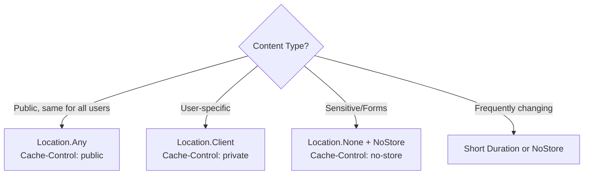

# Response Caching in ASP.NET Core MVC

## Table of Contents
1. [Introduction](#1-introduction)
2. [ResponseCache Attribute](#2-responsecache-attribute)
3. [Cache Profiles](#3-cache-profiles)
4. [Cache Location Options](#4-cache-location-options)
5. [VaryBy Configurations](#5-varyby-configurations)
6. [Complete Configuration Example](#6-complete-configuration-example)
7. [Browser Compatibility Note](#7-browser-compatibility-note)
8. [Best Practices](#8-best-practices)
9. [Interview Questions](#9-interview-questions)

---

## 1. Introduction

### What is Response Caching?
Response caching stores HTTP responses on the client (browser) or proxy servers using HTTP cache headers. Unlike in-memory caching which stores data on the server, response caching uses the browser's cache.

### How It Works



### Key Differences from In-Memory Caching

| Aspect | In-Memory Cache | Response Cache |
|--------|----------------|----------------|
| **Location** | Server memory | Browser/Proxy |
| **Per User** | Can be shared | Per browser |
| **Network** | Reduced DB calls | Reduced HTTP requests |
| **Control** | Server controlled | HTTP headers |

---

## 2. ResponseCache Attribute

### Basic Usage

```csharp
[ResponseCache(Duration = 3600)]  // Cache for 1 hour (3600 seconds)
public IActionResult Index()
{
    return View();
}
```

**Generated Header:** `Cache-Control: public, max-age=3600`

### Duration Parameter
Duration is measured in **seconds**:

| Duration Value | Time |
|---------------|------|
| 60 | 1 minute |
| 3600 | 1 hour |
| 86400 | 1 day |
| 604800 | 1 week |

### Disable Caching (For Sensitive Pages)

```csharp
[ResponseCache(Location = ResponseCacheLocation.None, NoStore = true)]
public IActionResult Login()
{
    return View();
}
```

**Generated Headers:**
- `Cache-Control: no-store, no-cache`
- `Pragma: no-cache` (for older proxies)

> ⚠️ **Important:** Both `Location.None` AND `NoStore = true` are required. `NoStore` sends "no-store" header, but older proxies don't understand it. `Location.None` adds "no-cache" to cache-control and pragma headers.

---

## 3. Cache Profiles

### Why Use Cache Profiles?
- Define caching settings once, use everywhere
- Consistent caching across application
- Easy to modify in one place

### Configuration in Program.cs

```csharp
var builder = WebApplication.CreateBuilder(args);

builder.Services.AddControllersWithViews(options =>
{
    // Cache for 1 hour
    options.CacheProfiles.Add("Hourly", new CacheProfile()
    {
        Duration = 60 * 60  // 3600 seconds
    });
    
    // Cache for 1 week
    options.CacheProfiles.Add("Weekly", new CacheProfile()
    {
        Duration = 60 * 60 * 24 * 7  // 604800 seconds
    });
    
    // No caching
    options.CacheProfiles.Add("NoCache", new CacheProfile()
    {
        Location = ResponseCacheLocation.None,
        NoStore = true
    });
});

// Required for VaryByQueryKeys
builder.Services.AddResponseCaching();

var app = builder.Build();

// Add Response Caching Middleware
app.UseResponseCaching();
app.UseRouting();
// ... rest of configuration
```

### Using Cache Profiles in Controllers

```csharp
public class HomeController : Controller
{
    [ResponseCache(CacheProfileName = "Hourly")]
    public IActionResult Index()
    {
        return View();
    }
    
    [ResponseCache(CacheProfileName = "Weekly")]
    public IActionResult StaticContent()
    {
        return View();
    }
    
    [ResponseCache(CacheProfileName = "NoCache")]
    public IActionResult Login()
    {
        return View();
    }
}
```

---

## 4. Cache Location Options

### ResponseCacheLocation Enum

```csharp
public enum ResponseCacheLocation
{
    Any,      // Cache anywhere (browser + proxy)
    Client,   // Cache only on client browser
    None      // Don't cache
}
```

### Usage Examples

```csharp
// Public - cache on browser AND proxies/CDNs
[ResponseCache(Duration = 60, Location = ResponseCacheLocation.Any)]
public IActionResult PublicContent() => View();

// Private - cache ONLY on browser (user-specific content)
[ResponseCache(Duration = 60, Location = ResponseCacheLocation.Client)]
public IActionResult UserDashboard() => View();

// No cache - sensitive content
[ResponseCache(Location = ResponseCacheLocation.None, NoStore = true)]
public IActionResult Checkout() => View();
```

### Generated Headers Comparison

| Location | Cache-Control Header | Use Case |
|----------|---------------------|----------|
| `Any` | `public, max-age=N` | Public content |
| `Client` | `private, max-age=N` | User-specific data |
| `None` | `no-cache` | Dynamic content |
| `None + NoStore` | `no-store, no-cache` | Sensitive data |

### Decision Diagram



---

## 5. VaryBy Configurations

### VaryByHeader
Cache different versions based on HTTP header values.

```csharp
// Different cache for different browsers
[ResponseCache(Duration = 60, VaryByHeader = "User-Agent")]
public IActionResult Index() => View();

// Different cache for different languages
[ResponseCache(Duration = 60, VaryByHeader = "Accept-Language")]
public IActionResult Content() => View();
```

### VaryByQueryKeys
Cache different versions based on query string parameters.

**Requires Response Caching Middleware:**
```csharp
builder.Services.AddResponseCaching();
// ...
app.UseResponseCaching();
```

**Usage:**
```csharp
// Different cache for ?page=1 vs ?page=2 vs ?sort=name
[ResponseCache(Duration = 60, VaryByQueryKeys = new[] { "page", "sort" })]
public IActionResult Products(int page, string sort) => View();
```

### VaryByHeader Values

| Header | Use Case |
|--------|----------|
| `User-Agent` | Different browsers |
| `Accept-Language` | Different languages |
| `Accept-Encoding` | Different compression |
| `Cookie` | Different sessions |

---

## 6. Complete Configuration Example

### Full Program.cs

```csharp
using Microsoft.AspNetCore.Mvc;
using Microsoft.EntityFrameworkCore;

var builder = WebApplication.CreateBuilder(args);

// Configure MVC with cache profiles
builder.Services.AddControllersWithViews(options =>
{
    options.CacheProfiles.Add("Hourly", new CacheProfile()
    {
        Duration = 60 * 60  // 1 hour
    });
    options.CacheProfiles.Add("Weekly", new CacheProfile()
    {
        Duration = 60 * 60 * 24 * 7  // 7 days
    });
});

// Database context
builder.Services.AddDbContextPool<AppDbContext>(options =>
    options.UseSqlServer(builder.Configuration.GetConnectionString("Default")));

// Services
builder.Services.AddScoped<IEmployeeRepository, SqlEmployeeRepository>();

// Caching services
builder.Services.AddMemoryCache();
builder.Services.AddResponseCaching();

var app = builder.Build();

if (!app.Environment.IsDevelopment())
{
    app.UseExceptionHandler("/Home/Error");
    app.UseHsts();
}

app.UseHttpsRedirection();
app.UseStaticFiles();

// Response caching middleware - before routing
app.UseResponseCaching();

app.UseRouting();
app.UseAuthorization();

app.MapControllerRoute(
    name: "default",
    pattern: "{controller=Home}/{action=Index}/{id?}");

app.Run();
```

### Controller Example

```csharp
public class HomeController : Controller
{
    // Uses Hourly profile
    [ResponseCache(CacheProfileName = "Hourly")]
    public IActionResult Index() => View();
    
    // Explicit duration
    [ResponseCache(Duration = 300)]  // 5 minutes
    public IActionResult About() => View();
    
    // Different cache per search query
    [ResponseCache(Duration = 60, VaryByQueryKeys = new[] { "q" })]
    public IActionResult Search(string q) => View();
    
    // Never cache login
    [ResponseCache(Location = ResponseCacheLocation.None, NoStore = true)]
    public IActionResult Login() => View();
}
```

---

## 7. Browser Compatibility Note

> ⚠️ **Important:** Response caching behavior is **browser-dependent**.

| Browser | Support |
|---------|---------|
| Firefox | ✅ Full support |
| Chrome | ⚠️ Limited (may not respect all headers) |
| Edge | ✅ Full support |
| Safari | ✅ Full support |

### Recommendation
For consistent caching behavior across browsers, combine response caching with in-memory caching on the server:

```csharp
// Server-side cache for reliability
var data = _memoryCache.GetOrCreate("key", entry => {
    entry.SlidingExpiration = TimeSpan.FromMinutes(5);
    return GetData();
});

// Plus client-side for reduced requests
[ResponseCache(Duration = 60)]
```

---

## 8. Best Practices

### DO ✅

| Practice | Reason |
|----------|--------|
| Use cache profiles | Centralized, maintainable |
| Set short durations for dynamic content | Freshness |
| Use `Location.Client` for user-specific content | Privacy |
| Use `NoStore` for sensitive data | Security |
| Add `VaryByHeader` for localized content | Correct versions |

### DON'T ❌

| Practice | Reason |
|----------|--------|
| Don't cache authenticated pages with `public` | Security |
| Don't set long durations for frequently changing data | Stale content |
| Don't cache forms with CSRF tokens | Security |
| Don't rely only on response caching | Browser-dependent |

---

## 9. Interview Questions

1. **What is Response Caching?**
   - HTTP-based caching that stores responses in the browser or proxy using Cache-Control headers.

2. **What is the difference between In-Memory and Response Caching?**
   - In-Memory: Server-side, stores application data. Response: Client-side, stores HTTP responses.

3. **What are Cache Profiles?**
   - Named, reusable caching configurations defined in Program.cs.

4. **When would you use `Location = Client`?**
   - For user-specific responses that shouldn't be shared on proxies/CDNs.

5. **Why do you need both `Location.None` AND `NoStore = true`?**
   - `NoStore` sends "no-store" header but older proxies don't understand it. `Location.None` adds "no-cache" for compatibility.

6. **What is `VaryByHeader` used for?**
   - Creates different cached versions based on HTTP header values (e.g., language, browser).

7. **Is Response Caching reliable across all browsers?**
   - No, it's browser-dependent. Firefox supports it well, but Chrome may not respect all headers. Use with server-side caching for reliability.

8. **How do you add Response Caching Middleware?**
   - Add `builder.Services.AddResponseCaching()` and `app.UseResponseCaching()` in Program.cs.
