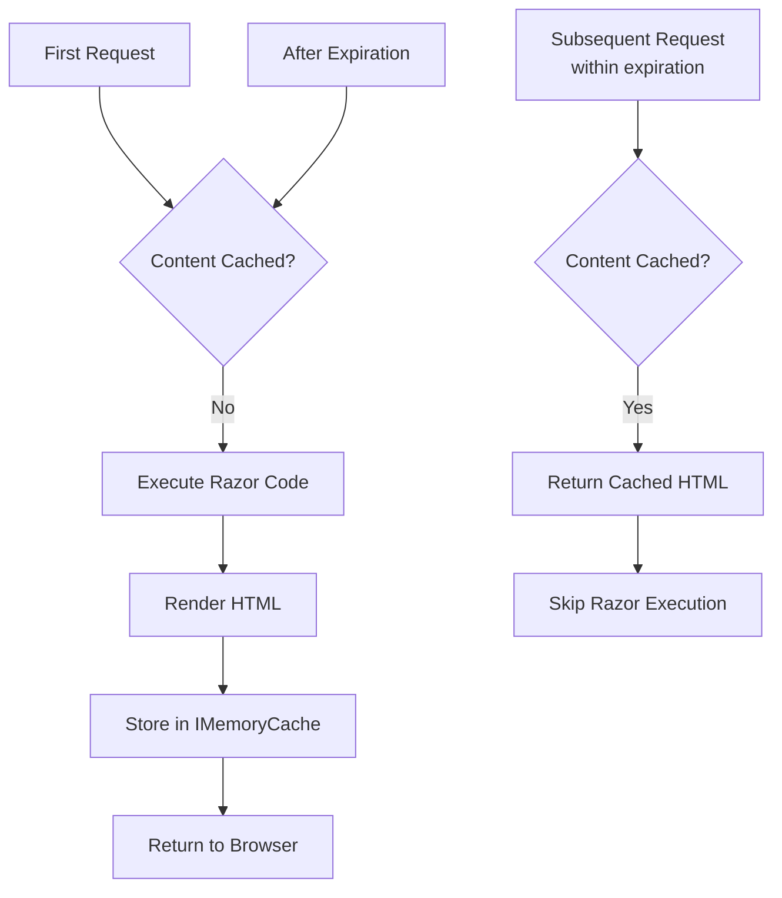

# Cache Tag Helper in ASP.NET Core MVC

## Table of Contents
1. [Introduction](#1-introduction)
2. [Basic Usage](#2-basic-usage)
3. [Expiration Attributes](#3-expiration-attributes)
4. [Vary-By Attributes](#4-vary-by-attributes)
5. [Controller Setup](#5-controller-setup)
6. [Complete Examples](#6-complete-examples)
7. [Best Practices](#7-best-practices)
8. [Interview Questions](#8-interview-questions)

---

## 1. Introduction

### What is Cache Tag Helper?
The Cache Tag Helper provides the ability to cache sections of a Razor view using the server's IMemoryCache. Unlike manually using IMemoryCache in controllers, you wrap view content in `<cache>` tags for automatic caching.

### How It Works



### Key Points
- Uses server-side IMemoryCache internally
- Default expiration is **20 minutes** if not specified
- Only caches the HTML output, not data
- First request executes code and caches result

---

## 2. Basic Usage

### Simple Cache

```cshtml
<cache>
    <p>Current Time: @DateTime.Now</p>
</cache>
```

**Behavior:** Content cached for 20 minutes (default). Refresh shows same time until cache expires.

### With Enabled Flag

```cshtml
@{
    var enableCaching = !User.IsInRole("Admin");  // Don't cache for admins
}

<cache enabled="@enableCaching">
    <p>Current Time: @DateTime.Now</p>
</cache>
```

### Controller Setup

The Cache Tag Helper uses IMemoryCache internally. You must register it:

```csharp
// Program.cs
builder.Services.AddMemoryCache();
builder.Services.AddControllersWithViews();
```

---

## 3. Expiration Attributes

### expires-on (Absolute Date/Time)

```cshtml
<cache expires-on="@new DateTime(2025, 1, 29, 17, 02, 0)">
    <p>Current Time Inside Cache: @DateTime.Now</p>
</cache>
```
**Expires at exactly** January 29, 2025 at 5:02 PM.

### expires-after (Absolute Duration)

```cshtml
<cache expires-after="@TimeSpan.FromSeconds(120)">
    <p>Current Time Inside Cache: @DateTime.Now</p>
</cache>
```
**Expires after** 120 seconds from first request. Access does NOT reset timer.

### expires-sliding (Sliding Duration)

```cshtml
<cache expires-sliding="@TimeSpan.FromSeconds(60)">
    <p>Current Time Inside Cache: @DateTime.Now</p>
</cache>
```
**Expires after** 60 seconds of inactivity. Each access **resets** the timer.

### Comparison

| Attribute | Timer Resets on Access | Use Case |
|-----------|----------------------|----------|
| `expires-on` | No (fixed date) | Content valid until specific date |
| `expires-after` | No (fixed duration) | Time-sensitive data |
| `expires-sliding` | Yes | Active session content |

### Combined Expiration

```cshtml
<cache expires-after="@TimeSpan.FromMinutes(30)" 
       expires-sliding="@TimeSpan.FromMinutes(5)">
    <p>Cached Content</p>
</cache>
```
Expires after 5 minutes of inactivity OR 30 minutes total (whichever first).

---

## 4. Vary-By Attributes

### vary-by-user
Different cache for each authenticated user.

```cshtml
<cache vary-by-user="true">
    <p>Welcome @User.Identity?.Name</p>
    <p>User-specific content cached</p>
</cache>
```

### vary-by-header
Different cache based on HTTP header values.

```cshtml
<cache vary-by-header="User-Agent">
    <p>Browser-specific content</p>
    <p>Current Time: @DateTime.Now</p>
</cache>
```
**Use Case:** Different browsers see different cached versions.

### vary-by-query
Different cache based on query string parameters.

```cshtml
<cache vary-by-query="Make,Model">
    <p>Product listing for Make=@Context.Request.Query["Make"], 
       Model=@Context.Request.Query["Model"]</p>
    <p>Current Time: @DateTime.Now</p>
</cache>
```
**URLs like** `?Make=Honda&Model=Civic` get separate cache.

### vary-by-route
Different cache based on route parameter values.

```cshtml
<cache vary-by-route="Make,Model">
    <p>Product details</p>
    <p>Current Time: @DateTime.Now</p>
</cache>
```
**Routes like** `/Products/Honda/Civic` get separate cache.

### vary-by-cookie
Different cache based on cookie values.

```cshtml
<cache vary-by-cookie="theme">
    <div class="themed-content">Content varies by theme preference</div>
</cache>
```

### vary-by (Custom Key)
Custom cache key expression.

```cshtml
<cache vary-by="@Model.CategoryId">
    <h3>Category: @Model.CategoryName</h3>
    <p>Products in this category...</p>
</cache>
```

---

## 5. Controller Setup

### Program.cs Configuration

```csharp
var builder = WebApplication.CreateBuilder(args);

// Required for Cache Tag Helper
builder.Services.AddMemoryCache();
builder.Services.AddControllersWithViews();

var app = builder.Build();
// ... rest of configuration
```

### Controller with IMemoryCache

```csharp
using Microsoft.Extensions.Caching.Memory;

public class CacheDemoController : Controller
{
    private readonly IMemoryCache _cache;
    
    public CacheDemoController(IMemoryCache cache)
    {
        _cache = cache;
    }
    
    public IActionResult Index()
    {
        return View();
    }
}
```

---

## 6. Complete Examples

### Example 1: User Dashboard

```cshtml
@{
    ViewData["Title"] = "Dashboard";
}

<h1>Dashboard</h1>

<cache expires-after="@TimeSpan.FromMinutes(5)" vary-by-user="true">
    <div class="card">
        <div class="card-header">
            Welcome, @User.Identity?.Name
        </div>
        <div class="card-body">
            <p>Last loaded: @DateTime.Now</p>
            @* Expensive operation cached per user *@
            @await Component.InvokeAsync("UserStats")
        </div>
    </div>
</cache>
```

### Example 2: Product Listing with Filters

```cshtml
<cache expires-sliding="@TimeSpan.FromMinutes(10)" 
       vary-by-query="category,sort,page">
    <div class="product-list">
        @foreach (var product in Model.Products)
        {
            <div class="product-card">
                <h3>@product.Name</h3>
                <p>$@product.Price</p>
            </div>
        }
    </div>
</cache>
```

### Example 3: Static Footer with Long Cache

```cshtml
<footer>
    <cache expires-after="@TimeSpan.FromHours(24)">
        <div class="footer-content">
            <p>© @DateTime.Now.Year Company Name</p>
            <p>Generated at: @DateTime.Now.ToString("g")</p>
            @* Links, social media, etc. *@
        </div>
    </cache>
</footer>
```

### Example 4: Conditional Caching

```cshtml
@{
    bool shouldCache = !User.IsInRole("Admin") && !ViewBag.IsPreview;
}

<cache enabled="@shouldCache" 
       expires-after="@TimeSpan.FromMinutes(30)">
    <div class="content">
        @* Content only cached for non-admin users *@
        <p>Regular content here...</p>
    </div>
</cache>
```

### Example 5: Cache with Priority

```cshtml
<cache expires-sliding="@TimeSpan.FromMinutes(5)" 
       priority="Microsoft.Extensions.Caching.Memory.CacheItemPriority.High">
    <nav class="main-navigation">
        @* Important navigation - kept longer under memory pressure *@
        <a asp-action="Index">Home</a>
        <a asp-action="Products">Products</a>
    </nav>
</cache>
```

---

## 7. Best Practices

### DO ✅

| Practice | Reason |
|----------|--------|
| Cache expensive Razor computations | Performance |
| Use vary-by-user for personalized content | Correct data per user |
| Set appropriate expiration | Balance freshness and performance |
| Use enabled flag for conditional caching | Flexibility |
| Cache static/semi-static content | Best ROI |

### DON'T ❌

| Practice | Reason |
|----------|--------|
| Don't cache forms | CSRF tokens become invalid |
| Don't cache error messages | Confusing UX |
| Don't cache sensitive data without vary-by-user | Security |
| Don't cache frequently changing data | Stale content |

### What to Cache

| Good Candidates | Bad Candidates |
|----------------|----------------|
| Navigation menus | Forms with CSRF tokens |
| Footer content | Error messages |
| Sidebar widgets | User notifications |
| Product listings | Shopping cart totals |
| Static content blocks | Real-time data |

---

## 8. Interview Questions

1. **What is the Cache Tag Helper?**
   - A Razor tag helper that caches rendered view content using server-side IMemoryCache.

2. **What is the default expiration time?**
   - 20 minutes if no expiration attribute is specified.

3. **Difference between expires-after and expires-sliding?**
   - `expires-after`: Fixed duration from first request. `expires-sliding`: Duration resets on each access.

4. **When would you use vary-by-user?**
   - When cached content is different for each authenticated user (dashboards, personalized content).

5. **Where is Cache Tag Helper content stored?**
   - In server memory via IMemoryCache (same as in-memory caching).

6. **Can you cache partial views with Cache Tag Helper?**
   - Yes, wrap `@await Html.PartialAsync(...)` or `@await Component.InvokeAsync(...)` in `<cache>` tags.

7. **What happens on first request?**
   - Razor code executes, HTML is rendered and stored in cache.

8. **How do you disable caching for certain users?**
   - Use `enabled="@condition"` attribute with a boolean expression.

9. **What is priority attribute used for?**
   - Sets cache eviction priority under memory pressure (Low, Normal, High, NeverRemove).

10. **Can you combine multiple vary-by attributes?**
    - Yes, use multiple attributes together for fine-grained cache keys.
