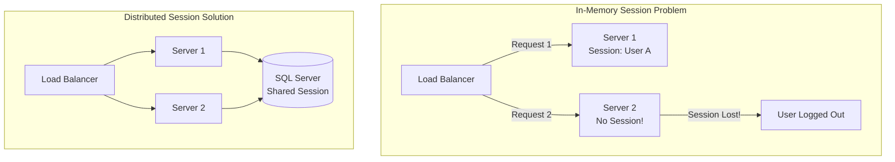
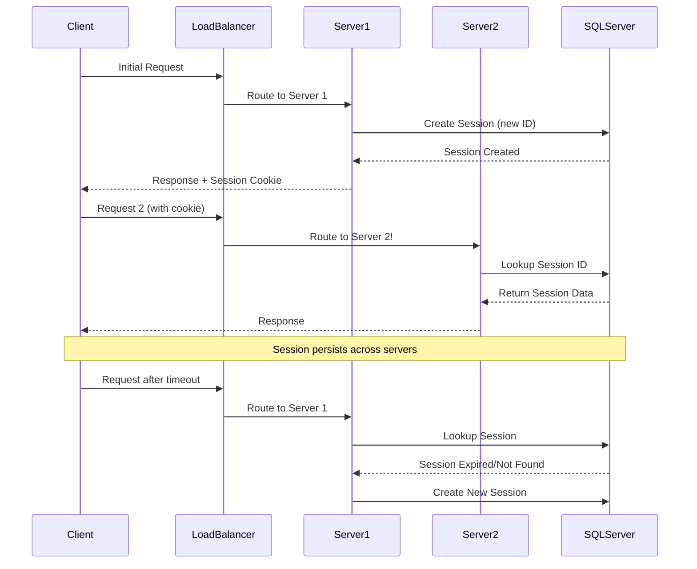
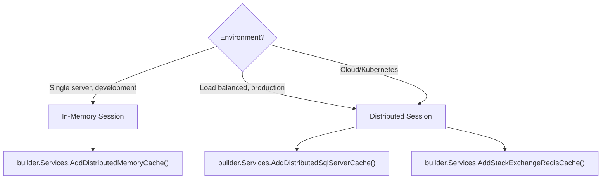

# Distributed Session with SQL Server in ASP.NET Core MVC

## Table of Contents
1. [Introduction](#1-introduction)
2. [Why Distributed Session](#2-why-distributed-session)
3. [Setup and Configuration](#3-setup-and-configuration)
4. [Session Usage](#4-session-usage)
5. [Session Lifecycle](#5-session-lifecycle)
6. [In-Memory vs Distributed Comparison](#6-in-memory-vs-distributed-comparison)
7. [Best Practices](#7-best-practices)
8. [Interview Questions](#8-interview-questions)

---

## 1. Introduction

### What is Distributed Session?
Distributed Session stores session data in an external store (SQL Server, Redis) instead of server memory, enabling session sharing across multiple server instances in load-balanced environments.

### State Management Overview

| Storage Approach | Storage Mechanism |
|-----------------|-------------------|
| Cookies | HTTP cookies (client-side) |
| Session state | HTTP cookies + **server-side** app code |
| TempData | HTTP cookies or session state |
| Query strings | HTTP query strings |
| Hidden fields | HTTP form fields |
| HttpContext.Items | Server-side app code |
| Cache | Server-side app code |

### Session Characteristics
- **Per-user global variable** - data accessible from any page
- **User-specific** - each user has their own session
- **Browser-specific** - not shared across browsers
- **Default timeout** - 20 minutes

---

## 2. Why Distributed Session

### The Problem with In-Memory Session



### When to Use Distributed Session

| Scenario | In-Memory | Distributed |
|----------|-----------|-------------|
| Single server | ✅ Yes | Optional |
| Load balanced / Web farm | ❌ No | ✅ Required |
| Cloud deployment | ❌ No | ✅ Required |
| App restart persistence | ❌ No | ✅ Yes |
| Multiple application instances | ❌ No | ✅ Yes |

---

## 3. Setup and Configuration

### Step 1: Install NuGet Packages

```bash
Install-Package Microsoft.EntityFrameworkCore.SqlServer
Install-Package Microsoft.Extensions.Caching.SqlServer
```

### Step 2: Create Session Database Table

First, install the dotnet-sql-cache tool globally:

```bash
dotnet tool install --global dotnet-sql-cache
```

Then create the session table:

```bash
dotnet sql-cache create "Data Source=LAPTOP\SQLSERVER2022;Initial Catalog=SessionDB;Integrated Security=True;TrustServerCertificate=True" dbo MySessions
```

> **Note:** Replace connection string with your SQL Server details.

### Generated Table Structure

```sql
CREATE TABLE [dbo].[MySessions] (
    [Id] nvarchar(449) NOT NULL,           -- Session ID
    [Value] varbinary(max) NOT NULL,       -- Session data
    [ExpiresAtTime] datetimeoffset NOT NULL,
    [SlidingExpirationInSeconds] bigint NULL,
    [AbsoluteExpiration] datetimeoffset NULL,
    PRIMARY KEY ([Id])
);
```

### Step 3: Configure in Program.cs

```csharp
var builder = WebApplication.CreateBuilder(args);

builder.Services.AddControllersWithViews();

// Configure your main DbContext
builder.Services.AddDbContext<MyDbContext>(options =>
    options.UseSqlServer(builder.Configuration.GetConnectionString("EFCoreDBConnection")));

// Configure Distributed SQL Server Cache for session
builder.Services.AddDistributedSqlServerCache(options =>
{
    // Connection string to session database
    options.ConnectionString = builder.Configuration.GetConnectionString("EFCoreDBConnection");
    
    // Database schema where session table is located
    options.SchemaName = "dbo";
    
    // Session table name (created by dotnet sql-cache)
    options.TableName = "MySessions";
});

// Configure Session
builder.Services.AddSession(options =>
{
    // Session expires after 30 minutes of inactivity
    options.IdleTimeout = TimeSpan.FromMinutes(30);
    
    // Prevent JavaScript access to session cookie
    options.Cookie.HttpOnly = true;
    
    // Essential for GDPR compliance
    options.Cookie.IsEssential = true;
    
    // Optional: Custom cookie name
    options.Cookie.Name = ".MyApp.Session";
});

// Required for accessing session in views
builder.Services.AddSingleton<IHttpContextAccessor, HttpContextAccessor>();

var app = builder.Build();

// Add session middleware - after UseRouting, before authorization
app.UseRouting();
app.UseSession();
app.UseAuthorization();

app.MapControllerRoute(
    name: "default",
    pattern: "{controller=Home}/{action=Index}/{id?}");

app.Run();
```

### Step 4: appsettings.json

```json
{
  "ConnectionStrings": {
    "EFCoreDBConnection": "Data Source=localhost;Initial Catalog=SessionDB;Integrated Security=True;TrustServerCertificate=True"
  }
}
```

---

## 4. Session Usage

### Setting Session Values

```csharp
public class HomeController : Controller
{
    const string SessionName = "_Name";
    const string SessionAge = "_Age";
    
    public IActionResult Index()
    {
        // Set string value
        HttpContext.Session.SetString(SessionName, "DAC");
        
        // Set integer value
        HttpContext.Session.SetInt32(SessionAge, 24);
        
        return View();
    }
}
```

### Reading Session Values

```csharp
public IActionResult About()
{
    // Get string value
    ViewBag.Name = HttpContext.Session.GetString(SessionName);
    
    // Get integer value (nullable)
    ViewBag.Age = HttpContext.Session.GetInt32(SessionAge);
    
    return View();
}
```

### Checking Session Before Use

```csharp
public IActionResult Index()
{
    if (HttpContext.Session.GetString(SessionName) != null)
    {
        ViewBag.Name = HttpContext.Session.GetString(SessionName);
        ViewBag.Age = HttpContext.Session.GetInt32(SessionAge);
        return View();
    }
    
    // No session - redirect to login
    return RedirectToAction("Create");
}
```

### Removing Session Values

```csharp
[HttpPost]
public ActionResult Logout()
{
    // Remove specific key
    HttpContext.Session.Remove(SessionName);
    
    // OR clear all session data
    HttpContext.Session.Clear();
    
    return RedirectToAction("Login");
}
```

### Accessing Session in Views

**Option 1: Using @Context**
```cshtml
@using Microsoft.AspNetCore.Http

<h1>@Context.Session.GetString("_Name")</h1>
```

**Option 2: Using IHttpContextAccessor**
```cshtml
@using Microsoft.AspNetCore.Http
@inject IHttpContextAccessor HttpContextAccessor

<div class="text-left">
    <b>User Name:</b> @HttpContextAccessor?.HttpContext?.Session.GetString("_UserName")
    <br />
    <b>User Id:</b> @HttpContextAccessor?.HttpContext?.Session.GetInt32("_UserId")
</div>
```

---

## 5. Session Lifecycle

### Complete Session Flow



### Session Behaviors

| Behavior | Description |
|----------|-------------|
| Browser-specific | Each browser has unique session |
| Not shared | Opening new browser = new session |
| Cookie-based ID | Session ID stored in cookie |
| Server-side data | Actual data stored in SQL Server |
| Idle timeout | Default 20 minutes |
| No client notification | No callback when session expires |

---

## 6. In-Memory vs Distributed Comparison

### Detailed Comparison

| Aspect | In-Memory (In-Proc) | Distributed (Out-Proc) |
|--------|---------------------|------------------------|
| **Storage** | Server RAM | External (SQL, Redis) |
| **Speed** | ⚡ Faster | ⚡⚡ Slightly slower |
| **Scalability** | ❌ Single server only | ✅ Multi-server |
| **Persistence** | ❌ Lost on restart | ✅ Survives restart |
| **Setup** | ✅ Easy | ⚠️ More complex |
| **Cost** | ✅ Free | ⚠️ DB/cache server |
| **Consistency** | ❌ Per-server | ✅ Shared state |

### When to Choose



---

## 7. Best Practices

### DO ✅

| Practice | Reason |
|----------|--------|
| Use distributed session for web farms | Consistency |
| Always check for null before reading | Session may expire |
| Use constants for session keys | Avoid typos |
| Keep session data small | DB storage size |
| Set appropriate timeout | Balance UX and resources |
| Clean up expired sessions | Database maintenance |

### DON'T ❌

| Practice | Reason |
|----------|--------|
| Don't store large objects | Serialization overhead |
| Don't rely on session for critical data | Can expire anytime |
| Don't skip error handling | Database may be unavailable |
| Don't store sensitive data unencrypted | Security |

### Session Configuration Options

```csharp
builder.Services.AddSession(options =>
{
    options.IdleTimeout = TimeSpan.FromMinutes(30);
    options.IOTimeout = TimeSpan.FromSeconds(10);
    options.Cookie.Name = ".MyApp.Session";
    options.Cookie.HttpOnly = true;
    options.Cookie.IsEssential = true;
    options.Cookie.Path = "/";
    options.Cookie.SecurePolicy = CookieSecurePolicy.Always;
    options.Cookie.SameSite = SameSiteMode.Strict;
});
```

---

## 8. Interview Questions

1. **When should you use distributed session?**
   - In load-balanced, cloud, or multi-server environments where requests may hit different servers.

2. **What's the difference from in-memory session?**
   - Distributed: External store (SQL/Redis), shared across servers, survives restarts. In-Memory: Server RAM, per-server, lost on restart.

3. **How do you create the SQL session table?**
   - Install `dotnet tool install --global dotnet-sql-cache`, then run `dotnet sql-cache create "connection" dbo TableName`.

4. **What happens if the database is unavailable?**
   - Session operations will fail. Implement error handling and consider fallback strategies.

5. **Is the session API different from in-memory?**
   - No, the API is identical (SetString, GetString, etc.). Only the storage configuration differs.

6. **What is stored in SQL Server vs the cookie?**
   - Cookie: Only session ID. SQL Server: All session data (Values column).

7. **What is IdleTimeout?**
   - Time of inactivity before session expires. Default is 20 minutes.

8. **Can you use Redis instead of SQL Server?**
   - Yes, use `AddStackExchangeRedisCache()` instead for better performance.

9. **How do you check if a session exists before reading?**
   - Check if `HttpContext.Session.GetString("key") != null` before using the value.

10. **What are the advantages of distributed session?**
    - Scalability, persistence across restarts, shared state across servers, suitable for cloud deployments.
