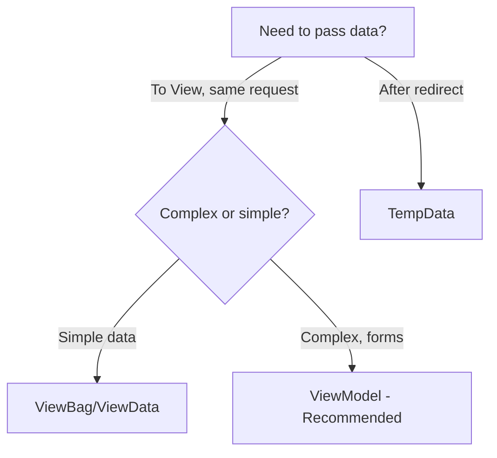
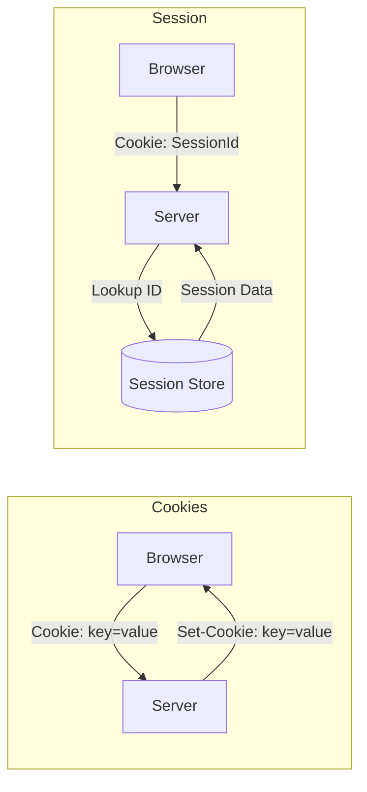
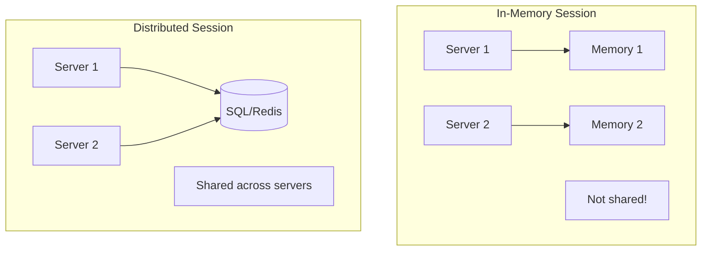
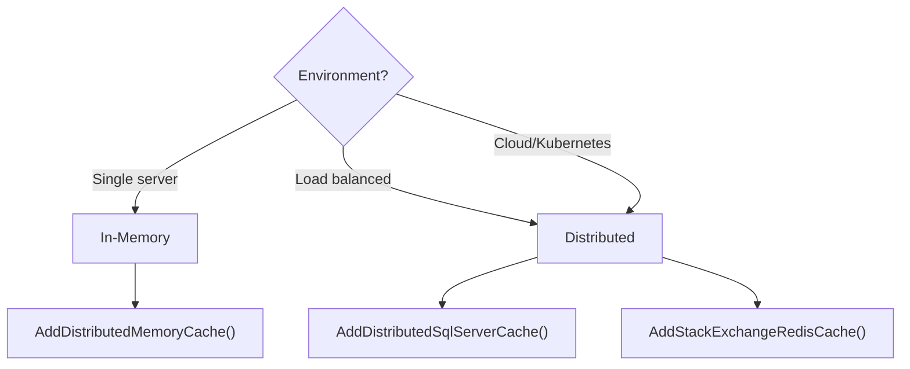
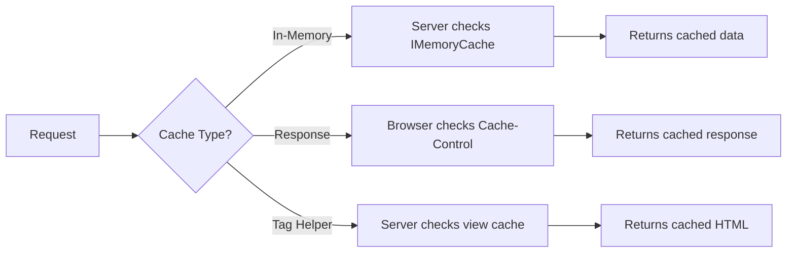
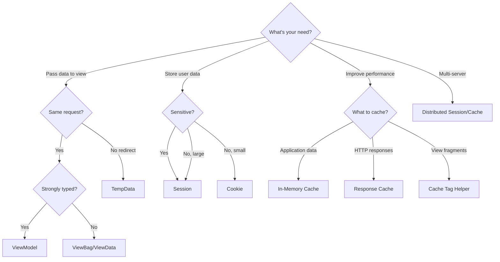

# State Management Complete Comparison in ASP.NET Core MVC

## Table of Contents
1. [Overview](#1-overview)
2. [Detailed Comparison Matrix](#2-detailed-comparison-matrix)
3. [ViewData vs ViewBag vs TempData](#3-viewdata-vs-viewbag-vs-tempdata)
4. [Session vs Cookies](#4-session-vs-cookies)
5. [In-Memory vs Distributed Session](#5-in-memory-vs-distributed-session)
6. [Caching Types](#6-caching-types)
7. [Decision Guide](#7-decision-guide)
8. [Quick Reference](#8-quick-reference)
9. [Interview Questions](#9-interview-questions)

---

## 1. Overview

### State Management Approaches

| Approach | Storage | Mechanism |
|----------|---------|-----------|
| **Cookies** | Client | HTTP cookies |
| **Session** | Server | HTTP cookies + server code |
| **TempData** | Server | HTTP cookies or session |
| **Query strings** | URL | HTTP query strings |
| **Hidden fields** | Page | HTTP form fields |
| **HttpContext.Items** | Server | Server-side, single request |
| **Cache** | Server | Server-side app code |

---

## 2. Detailed Comparison Matrix

### Complete Comparison

| Feature | ViewData | ViewBag | TempData | Session | Cookie | Cache |
|---------|----------|---------|----------|---------|--------|-------|
| **Storage** | Server | Server | Server | Server | Client | Server |
| **Type** | Dictionary | Dynamic | Dictionary | Dictionary | String | Generic |
| **Lifetime** | Current request | Current request | Current + Next | Configurable | Configurable | Configurable |
| **Survives Redirect** | ❌ | ❌ | ✅ | ✅ | ✅ | N/A |
| **Type Safe** | ❌ | ❌ | ❌ | ❌ | ❌ | ✅ |
| **IntelliSense** | ❌ | ❌ | ❌ | ❌ | ❌ | ✅ |
| **Per User** | ✅ | ✅ | ✅ | ✅ | ✅ | Configurable |
| **Size Limit** | None | None | Session-based | Configurable | ~4KB | Memory |
| **Security** | 🟢 High | 🟢 High | 🟢 High | 🟢 High | 🔴 Low | 🟢 High |

---

## 3. ViewData vs ViewBag vs TempData

### Syntax Comparison

```csharp
// ViewData - Dictionary with string keys
ViewData["Message"] = "Hello";
var msg = (string)ViewData["Message"];  // Casting required

// ViewBag - Dynamic wrapper
ViewBag.Message = "Hello";
var msg = ViewBag.Message;  // No casting

// TempData - Persists across redirects
TempData["Message"] = "Hello";
var msg = TempData["Message"]?.ToString();
```

### Key Differences



| Aspect | ViewData | ViewBag | TempData |
|--------|----------|---------|----------|
| **Scope** | Controller → View | Controller → View | Controller → Redirect → Controller/View |
| **Casting** | Required | Not required | Required |
| **Survives Redirect** | ❌ No | ❌ No | ✅ Yes |
| **Auto-deleted** | After request | After request | After read |
| **Keep data** | N/A | N/A | `Keep()` or `Peek()` |

### TempData Keep vs Peek

```csharp
// Normal read - marked for deletion
var value = TempData["Key"];  // Deleted after request

// Peek - read without marking for deletion
var value = TempData.Peek("Key");  // Survives to next request

// Keep - preserve after reading
var value = TempData["Key"];
TempData.Keep("Key");  // Survives to next request
```

---

## 4. Session vs Cookies

### Storage Comparison



### Detailed Comparison

| Aspect | Session | Cookies |
|--------|---------|---------|
| **Data Storage** | Server (memory/DB) | Client browser |
| **Data Sent** | Only session ID | All cookie data |
| **Size Limit** | Configurable | ~4KB per cookie |
| **Security** | 🟢 More secure | 🔴 Less secure |
| **Default Timeout** | 20 minutes | Set by Expires |
| **User Access** | No | Yes (can read/modify) |
| **Browser Close** | Ends session | Persistent cookies survive |

### When to Use Which

| Scenario | Use |
|----------|-----|
| Sensitive data (user ID) | Session |
| Remember me functionality | Cookie |
| Shopping cart (logged in) | Session |
| User preferences | Cookie |
| Large amounts of data | Session |
| Login state | Session |
| Analytics tracking | Cookie |

---

## 5. In-Memory vs Distributed Session

### Architecture Comparison



### Comparison

| Aspect | In-Memory | Distributed |
|--------|-----------|-------------|
| **Storage** | Server RAM | SQL Server/Redis |
| **Speed** | ⚡ Fast | ⚡⚡ Slightly slower |
| **Multi-server** | ❌ No | ✅ Yes |
| **Survives restart** | ❌ No | ✅ Yes |
| **Setup** | Easy | More complex |
| **Use case** | Development, single server | Production, web farms |

### When to Use



---

## 6. Caching Types

### Three Types of Caching

| Type | Storage | Scope | Use Case |
|------|---------|-------|----------|
| **In-Memory Cache** | Server RAM | Application-wide | Expensive computations, DB queries |
| **Response Cache** | Browser/Proxy | Per-response | Static pages, API responses |
| **Cache Tag Helper** | Server RAM | View fragments | Partial view caching |

### Comparison



### Quick Syntax

```csharp
// In-Memory Cache
var data = _cache.GetOrCreate("key", entry => {
    entry.SlidingExpiration = TimeSpan.FromMinutes(5);
    return GetExpensiveData();
});

// Response Cache
[ResponseCache(Duration = 60)]
public IActionResult Index() => View();
```

```cshtml
@* Cache Tag Helper *@
<cache expires-after="@TimeSpan.FromMinutes(5)">
    <p>@DateTime.Now</p>
</cache>
```

---

## 7. Decision Guide

### Complete Decision Flowchart



### Quick Reference Table

| Need | Best Choice | Alternative |
|------|-------------|-------------|
| Page title | ViewBag | ViewData |
| Form data to view | ViewModel | ViewData |
| Success message after redirect | TempData | - |
| User login state | Session | - |
| Remember me | Cookie | - |
| User preferences | Cookie | Session |
| Expensive DB query | In-Memory Cache | - |
| Static page caching | Response Cache | - |
| Partial view caching | Cache Tag Helper | - |
| Web farm session | Distributed Session | - |

---

## 8. Quick Reference

### Setting Syntax

```csharp
// ViewData
ViewData["Key"] = value;

// ViewBag
ViewBag.Key = value;

// TempData
TempData["Key"] = value;

// Session
HttpContext.Session.SetString("Key", value);
HttpContext.Session.SetInt32("Key", intValue);

// Cookie
Response.Cookies.Append("Key", value, options);

// Cache
_cache.Set("Key", value, cacheOptions);
```

### Getting Syntax

```csharp
// ViewData
var val = ViewData["Key"]?.ToString();

// ViewBag
var val = ViewBag.Key;

// TempData  
var val = TempData["Key"];
var val = TempData.Peek("Key");  // Don't mark for deletion

// Session
var val = HttpContext.Session.GetString("Key");
var intVal = HttpContext.Session.GetInt32("Key");

// Cookie
var val = Request.Cookies["Key"];

// Cache
var val = _cache.Get<T>("Key");
var val = _cache.GetOrCreate("Key", entry => GetData());
```

---

## 9. Interview Questions

1. **What is the difference between ViewData, ViewBag, and TempData?**
   - ViewData/ViewBag: Single request only, controller to view. TempData: Survives redirect, deleted after read.

2. **When would you use Session vs Cookie?**
   - Session: Sensitive data, server-side, larger data. Cookie: Preferences, remember me, client-side.

3. **What are the different caching types in ASP.NET Core?**
   - In-Memory (IMemoryCache), Response Caching (browser), Cache Tag Helper (view fragments), Distributed Cache.

4. **What is the difference between In-Memory and Distributed Session?**
   - In-Memory: Server RAM, single server. Distributed: External store (SQL/Redis), multi-server support.

5. **How does TempData survive redirects?**
   - Stored in session or cookies. Data persists until read, then marked for deletion.

6. **What is the Keep() method in TempData?**
   - Preserves TempData for the next request after it has been read.

7. **What is the Peek() method in TempData?**
   - Reads TempData without marking it for deletion.

8. **When should you use Cache Tag Helper vs In-Memory Cache?**
   - Cache Tag Helper: Caching Razor view content. In-Memory: Caching application data/objects.

9. **What is the default session timeout?**
   - 20 minutes of inactivity.

10. **Why are cookies less secure than session?**
    - Cookies are stored client-side and can be read/modified by users or malicious scripts.
