# 📚 Introduction to ASP.NET Core Web API

> **Complete Guide from Fundamentals to Implementation**

---

## 🎯 What is a Web API?

A **Web API** (Application Programming Interface) is a set of HTTP endpoints that allow different applications to communicate with each other over the internet. It acts as a bridge between a client (browser, mobile app, or another server) and a backend server.

```
┌─────────────────┐         HTTP Request          ┌─────────────────┐
│                 │  ────────────────────────────▶│                 │
│   Client App    │                               │    Web API      │
│  (Browser/App)  │  ◀────────────────────────────│    Server       │
│                 │         HTTP Response         │                 │
└─────────────────┘       (JSON/XML Data)         └─────────────────┘
```

### Key Characteristics of Web API

| Feature | Description |
|---------|-------------|
| **Stateless** | Each request is independent; server doesn't store client state |
| **HTTP-Based** | Uses standard HTTP methods (GET, POST, PUT, DELETE) |
| **Resource-Oriented** | Endpoints represent resources (e.g., `/api/members`) |
| **Format-Agnostic** | Can return JSON, XML, or other formats |
| **Platform-Independent** | Any client that can make HTTP requests can consume it |

---

## 🌐 REST (Representational State Transfer)

REST is an **architectural style** for designing networked applications. RESTful APIs follow specific principles:

### REST Principles


### REST vs SOAP Comparison

| Aspect | REST | SOAP |
|--------|------|------|
| **Protocol** | HTTP only | HTTP, SMTP, TCP |
| **Data Format** | JSON, XML, HTML | XML only |
| **Performance** | Faster, lightweight | Slower, more overhead |
| **Standards** | Flexible | Strict WS-* standards |
| **Caching** | Built-in HTTP caching | Complex caching |
| **Learning Curve** | Easy | Steep |

---

## 🔧 HTTP Methods (CRUD Operations)

HTTP methods define the action to perform on a resource:

```mermaid
graph LR
    subgraph "HTTP Methods → CRUD Operations"
        GET["GET<br>📖 Read"]
        POST["POST<br>➕ Create"]
        PUT["PUT<br>✏️ Update"]
        DELETE["DELETE<br>🗑️ Delete"]
        PATCH["PATCH<br>📝 Partial Update"]
    end
```



### Detailed HTTP Methods

| Method | Purpose | Request Body | Response Body | Idempotent |
|--------|---------|--------------|---------------|------------|
| **GET** | Retrieve resource(s) | No | Yes | ✅ Yes |
| **POST** | Create new resource | Yes | Yes (created item) | ❌ No |
| **PUT** | Replace entire resource | Yes | Yes (updated item) | ✅ Yes |
| **PATCH** | Partial update | Yes | Yes | ✅ Yes |
| **DELETE** | Remove resource | No | Optional | ✅ Yes |

> **Idempotent**: Making the same request multiple times produces the same result.

---

## 📊 HTTP Status Codes

Status codes indicate the result of an HTTP request:

### Success Codes (2xx)

| Code | Name | Usage |
|------|------|-------|
| **200** | OK | Successful GET, PUT, PATCH, DELETE |
| **201** | Created | Successful POST (resource created) |
| **204** | No Content | Successful DELETE (no response body) |

### Client Error Codes (4xx)

| Code | Name | Usage |
|------|------|-------|
| **400** | Bad Request | Invalid request data |
| **401** | Unauthorized | Authentication required |
| **403** | Forbidden | Authenticated but not authorized |
| **404** | Not Found | Resource doesn't exist |
| **409** | Conflict | Resource conflict (e.g., duplicate) |

### Server Error Codes (5xx)

| Code | Name | Usage |
|------|------|-------|
| **500** | Internal Server Error | Unhandled server exception |
| **502** | Bad Gateway | Invalid response from upstream server |
| **503** | Service Unavailable | Server temporarily unavailable |

---

## 🔄 Request/Response Cycle


---

## 📝 JSON as Data Format

**JSON (JavaScript Object Notation)** is the standard data format for Web APIs:

### JSON Structure

```json
{
  "memberId": 1,
  "firstName": "Kirtesh",
  "lastName": "Trivedi",
  "address": "Mumbai",
  "isActive": true,
  "skills": ["C#", "ASP.NET", "Web API"],
  "department": {
    "id": 101,
    "name": "Development"
  }
}
```

### JSON vs XML Comparison

| Aspect | JSON | XML |
|--------|------|-----|
| **Syntax** | Lightweight, key-value | Verbose, tag-based |
| **Readability** | Easy to read | More complex |
| **Data Size** | Smaller | Larger |
| **Parsing** | Faster | Slower |
| **Native JavaScript** | Yes | No |

---

## ⚖️ Web API vs MVC

| Aspect | Web API | MVC |
|--------|---------|-----|
| **Purpose** | Data services | Web pages with views |
| **Returns** | JSON/XML data | HTML views |
| **Base Class** | `ControllerBase` | `Controller` |
| **View Support** | No | Yes |
| **Content Negotiation** | Yes | Limited |
| **Typical Clients** | Mobile apps, SPAs, other services | Browsers |

### Visual Comparison


---

## 🏗️ Basic Web API Controller Structure

Here's a complete example of a basic Web API controller:

```csharp
using Microsoft.AspNetCore.Mvc;         // Line 1: Import MVC namespace for controller attributes
using APIMemberAPIvirsion08.Models;     // Line 2: Import Models namespace for Member class
using APIMemberAPIvirsion08.Services;   // Line 3: Import Services namespace for IMembers interface

namespace APIMemberAPIvirsion08.Controllers  // Line 4: Define controller namespace
{
    [Route("api/[controller]")]             // Line 5: Define route template - URL will be /api/member
    [ApiController]                          // Line 6: Enable API-specific behaviors:
                                             //         - Automatic model validation
                                             //         - Automatic 400 response for invalid models
                                             //         - Attribute routing requirement
    public class MemberController : ControllerBase  // Line 7: Inherit from ControllerBase (not Controller)
                                                     //         ControllerBase is for APIs (no view support)
    {
        private readonly IMembers member;   // Line 8: Declare private field for dependency injection

        public MemberController(IMembers mem)  // Line 9: Constructor with dependency injection
        {
            member = mem;                   // Line 10: Assign injected service to field
        }

        // GET: api/member
        [HttpGet]                           // Line 11: Map to HTTP GET method
        public IEnumerable<Members> Get()   // Line 12: Return all members as a collection
        {
            return member.GetAllMember();   // Line 13: Call service method to get all members
        }

        // GET: api/member/5
        [HttpGet("{id:int}")]               // Line 14: Map to GET with integer route parameter
        public Members Get(int id)          // Line 15: Return single member by ID
        {
            return member.GetMember(id);    // Line 16: Call service to get specific member
        }

        // POST: api/member
        [HttpPost]                          // Line 17: Map to HTTP POST method
        public Members Post([FromBody] Members memberpost)  // Line 18: Bind JSON body to parameter
        {
            return member.Add(memberpost);  // Line 19: Add new member and return it
        }

        // PUT: api/member/5
        [HttpPut("{id}")]                   // Line 20: Map to HTTP PUT with id parameter
        public Members Put(int id, [FromBody] Members memberput)  // Line 21: Bind both route and body
        {
            return member.Update(id, memberput);  // Line 22: Update member and return result
        }

        // DELETE: api/member/5
        [HttpDelete("{id}")]                // Line 23: Map to HTTP DELETE with id parameter
        public void Delete(int id)          // Line 24: No return value (void)
        {
            member.Delete(id);              // Line 25: Delete member by ID
        }
    }
}
```

### Execution Flow for GET Request


---

## 📋 Quick Revision Points

| Concept | Key Point |
|---------|-----------|
| **Web API** | HTTP endpoints for data exchange between applications |
| **REST** | Architectural style using HTTP methods for CRUD |
| **GET** | Read/retrieve resources (idempotent) |
| **POST** | Create new resources (not idempotent) |
| **PUT** | Replace entire resource (idempotent) |
| **DELETE** | Remove resource (idempotent) |
| **JSON** | Lightweight data format, standard for APIs |
| **Status Codes** | 2xx = Success, 4xx = Client Error, 5xx = Server Error |
| **[ApiController]** | Enables automatic model validation and routing |
| **ControllerBase** | Base class for API controllers (no view support) |

---

## 🎯 Key Takeaways

1. **Web API** = HTTP-based service that returns data (not HTML views)
2. **REST** = Architectural style using standard HTTP methods
3. **JSON** = Primary data format for Web APIs
4. **HTTP Methods** map directly to **CRUD operations**
5. **Status Codes** communicate the result of each request
6. **[ApiController]** attribute enables API-specific behaviors
7. **ControllerBase** is the correct base class for API controllers

---

## 📚 Interview Questions

**Q1: What is the difference between Web API and WCF?**
> Web API is lightweight, uses HTTP only, and returns JSON/XML. WCF is a comprehensive framework supporting multiple protocols (HTTP, TCP, Named Pipes) and formats, but is more complex to configure.

**Q2: Why do we use [ApiController] attribute?**
> It enables automatic model validation (returns 400 for invalid models), automatic HTTP 400 responses, binding source inference ([FromBody] for complex types), and requires attribute routing.

**Q3: What is the difference between Controller and ControllerBase?**
> `ControllerBase` provides API-specific features without view support. `Controller` inherits from `ControllerBase` and adds view-related methods like `View()`, `PartialView()`, etc.

**Q4: What is idempotency in REST APIs?**
> An operation is idempotent if calling it multiple times produces the same result. GET, PUT, DELETE are idempotent; POST is not (creates new resource each time).

---

*Next: [02_Why_DotNet_Core_WebAPI.md](02_Why_DotNet_Core_WebAPI.md) - Why choose .NET Core for Web API development*
