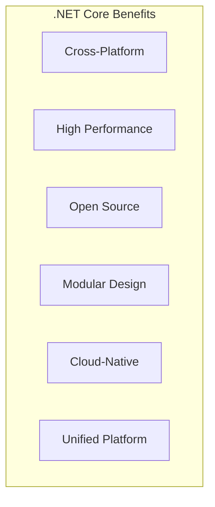
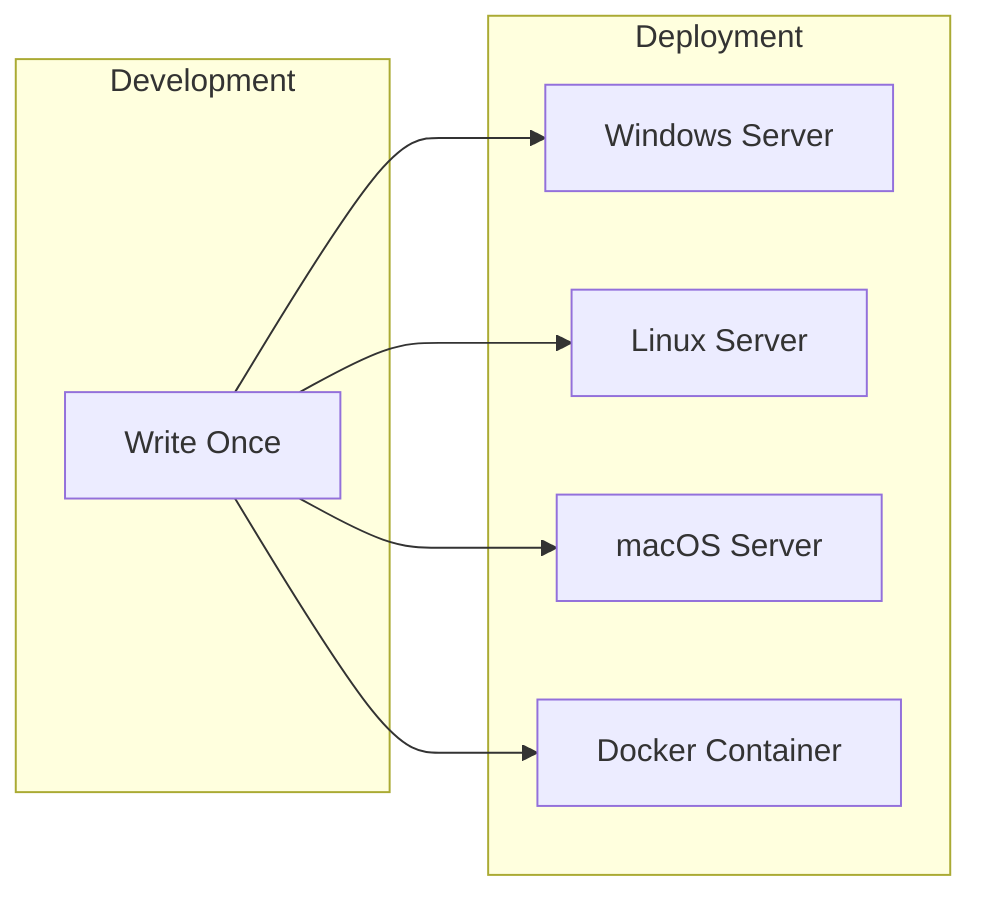
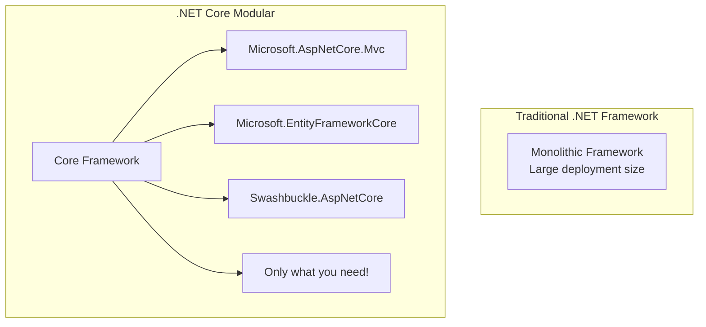
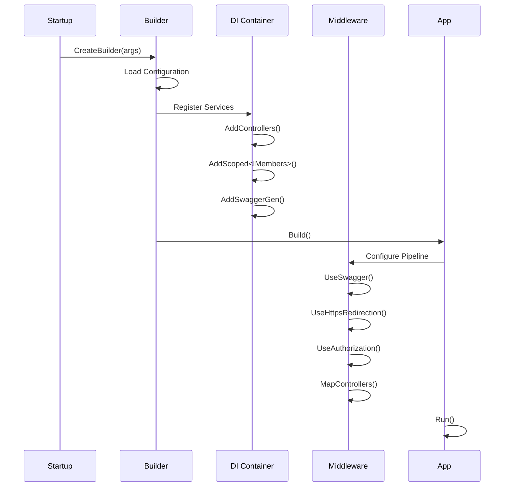
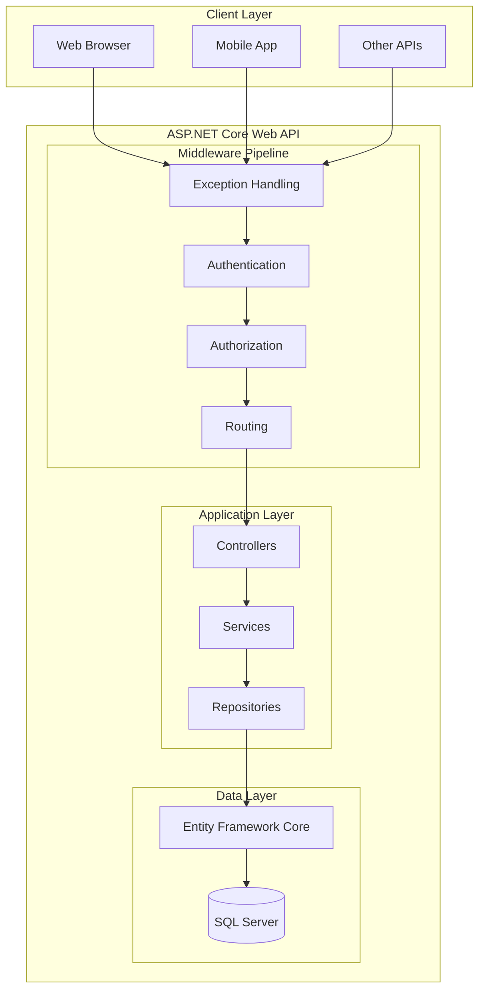

# 📚 Why .NET Core Web API?

> **Understanding the Benefits of .NET Core for API Development**

---

## 🎯 Introduction

.NET Core is Microsoft's modern, cross-platform, high-performance framework for building web applications and APIs. It represents a complete reimagining of the .NET Framework, designed for the cloud era.



---

## 🔄 .NET Core vs .NET Framework

### Key Differences

| Aspect | .NET Core | .NET Framework |
|--------|-----------|----------------|
| **Platform** | Windows, Linux, macOS | Windows only |
| **Deployment** | Self-contained or framework-dependent | Framework required on server |
| **Performance** | Highly optimized, faster | Good, but heavier |
| **Open Source** | ✅ Yes (MIT License) | ❌ No (proprietary) |
| **Architecture** | Modular, NuGet-based | Monolithic |
| **Side-by-Side** | Multiple versions can coexist | Single version per machine |
| **Container Support** | Excellent (Docker) | Limited |
| **Development** | Active development | Maintenance mode |

### Visual Comparison

```
┌────────────────────────────────────────────────────────────────┐
│                      .NET FRAMEWORK                             │
│  ┌──────────────────────────────────────────────────────────┐  │
│  │               Windows Only                                │  │
│  │  ┌─────────┐ ┌─────────┐ ┌─────────┐ ┌─────────┐        │  │
│  │  │   ASP   │ │  WCF    │ │  WPF    │ │ WinForms│        │  │
│  │  │   .NET  │ │         │ │         │ │         │        │  │
│  │  └─────────┘ └─────────┘ └─────────┘ └─────────┘        │  │
│  └──────────────────────────────────────────────────────────┘  │
└────────────────────────────────────────────────────────────────┘

┌────────────────────────────────────────────────────────────────┐
│                        .NET CORE                                │
│  ┌──────────────────────────────────────────────────────────┐  │
│  │     Windows        Linux          macOS                  │  │
│  │  ┌─────────────────────────────────────────────────────┐ │  │
│  │  │              ASP.NET Core                           │ │  │
│  │  │    (MVC + Web API + Razor Pages + Blazor)          │ │  │
│  │  └─────────────────────────────────────────────────────┘ │  │
│  │         Lightweight  •  Modular  •  High Performance     │  │
│  └──────────────────────────────────────────────────────────┘  │
└────────────────────────────────────────────────────────────────┘
```

---

## 🚀 Key Benefits of .NET Core Web API

### 1. Cross-Platform Development



**Benefits:**
- Develop on Windows, deploy to Linux
- Use Linux servers (cost savings)
- Leverage containerization (Docker, Kubernetes)
- Freedom to choose hosting environment

---

### 2. High Performance (Kestrel Server)

Kestrel is a lightweight, high-performance web server built into .NET Core:

```
┌─────────────────────────────────────────────────────────────┐
│                    Request Flow                              │
│                                                              │
│  ┌─────────┐      ┌─────────┐      ┌───────────────────┐   │
│  │ Client  │─────▶│  Nginx  │─────▶│  Kestrel Server   │   │
│  │         │      │  IIS    │      │  (ASP.NET Core)   │   │
│  └─────────┘      │  Apache │      └───────────────────┘   │
│                   └─────────┘                               │
│               Reverse Proxy        Application Server       │
└─────────────────────────────────────────────────────────────┘
```

**Performance Characteristics:**
| Metric | Kestrel | IIS (Classic) |
|--------|---------|---------------|
| Requests/sec | ~7 million | ~1 million |
| Memory Usage | Lower | Higher |
| Startup Time | Fast | Slower |
| Cross-Platform | ✅ Yes | ❌ No |

---

### 3. Modular Design (NuGet Packages)

.NET Core uses a "pay for what you use" model:



**Example: Minimal Dependencies**

```xml
<!-- .csproj file - Only required packages -->
<ItemGroup>
    <PackageReference Include="Microsoft.EntityFrameworkCore.SqlServer" Version="8.0.0" />
    <PackageReference Include="Swashbuckle.AspNetCore" Version="6.5.0" />
</ItemGroup>
```

---

### 4. Built-in Dependency Injection

.NET Core has a first-class DI container:

```csharp
// Program.cs - Built-in DI Configuration
var builder = WebApplication.CreateBuilder(args);

// Line-by-line explanation:
builder.Services.AddControllers();                              // Add MVC controllers
builder.Services.AddScoped<IMembers, MembersRepository>();      // Register service (per-request)
builder.Services.AddDbContextPool<AppdbContext>(options =>      // Register EF Core context
    options.UseSqlServer(connectionString));
builder.Services.AddTransient<IBookRepository, SqlBookRepository>(); // Register (new each time)
```

**DI Lifetimes:**
| Lifetime | Description | Use Case |
|----------|-------------|----------|
| `AddSingleton` | One instance for app lifetime | Caching, configuration |
| `AddScoped` | One instance per HTTP request | DbContext, repositories |
| `AddTransient` | New instance each time | Lightweight, stateless services |

---

### 5. Unified MVC and Web API

In .NET Core, MVC and Web API are unified:

```csharp
// Same controller can serve both views and JSON
[Route("api/[controller]")]
[ApiController]
public class MemberController : ControllerBase  // Web API
{
    [HttpGet]
    public IEnumerable<Members> Get() => memberService.GetAll();
}

// MVC Controller (inherits from Controller, not ControllerBase)
public class HomeController : Controller  // MVC with Views
{
    public IActionResult Index() => View();
}
```

---

### 6. Minimal Hosting Model (Program.cs)

.NET 6+ uses a simplified hosting model:

```csharp
// Complete Program.cs with line-by-line explanation

using APIMemberAPIvirsion08.Repository;  // Line 1: Import repository namespace
using APIMemberAPIvirsion08.Services;    // Line 2: Import services interface namespace

var builder = WebApplication.CreateBuilder(args);  // Line 3: Create builder with default config
                                                   //         - Loads appsettings.json
                                                   //         - Configures logging
                                                   //         - Sets up Kestrel

// Add services to the container (Dependency Injection)
builder.Services.AddControllers();                 // Line 4: Register MVC controllers
                                                   //         - Enables routing
                                                   //         - Enables model binding

builder.Services.AddScoped<IMembers, MembersRepository>();  // Line 5: Register custom service
                                                             //         - New instance per request

// Learn more about configuring Swagger/OpenAPI at https://aka.ms/aspnetcore/swashbuckle
builder.Services.AddEndpointsApiExplorer();        // Line 6: Enable endpoint discovery for Swagger
builder.Services.AddSwaggerGen();                  // Line 7: Add Swagger generator

var app = builder.Build();                         // Line 8: Build the application
                                                   //         - Creates WebApplication instance
                                                   //         - Finalizes DI container

// Configure the HTTP request pipeline (Middleware)
if (app.Environment.IsDevelopment())               // Line 9: Check if development environment
{
    app.UseSwagger();                              // Line 10: Enable Swagger JSON endpoint
    app.UseSwaggerUI();                            // Line 11: Enable Swagger UI
}

app.UseHttpsRedirection();                         // Line 12: Redirect HTTP to HTTPS

app.UseAuthorization();                            // Line 13: Enable authorization middleware

app.MapControllers();                              // Line 14: Map controller routes
                                                   //         - Enables attribute routing

app.Run();                                         // Line 15: Run the application
                                                   //         - Starts Kestrel
                                                   //         - Listens for requests
```

### Execution Flow



---

### 7. Configuration System

.NET Core provides a flexible configuration system:

```json
// appsettings.json
{
  "Logging": {
    "LogLevel": {
      "Default": "Information",
      "Microsoft.AspNetCore": "Warning"
    }
  },
  "ConnectionStrings": {
    "EmployeeDBConnection": "Data Source=(localdb)\\ProjectModels;Initial Catalog=Demoempdept;Integrated Security=True"
  },
  "AllowedHosts": "*"
}
```

**Configuration Sources (Priority Order):**
```
1. Command-line arguments (highest priority)
2. Environment variables
3. User secrets (Development)
4. appsettings.{Environment}.json
5. appsettings.json (lowest priority)
```

---

### 8. Swagger/OpenAPI Integration

Built-in API documentation:

```csharp
// Enable Swagger in Program.cs
builder.Services.AddEndpointsApiExplorer();
builder.Services.AddSwaggerGen();

// Configure in pipeline
if (app.Environment.IsDevelopment())
{
    app.UseSwagger();      // Generates /swagger/v1/swagger.json
    app.UseSwaggerUI();    // Provides interactive UI at /swagger
}
```

**Swagger UI Features:**
- Interactive API testing
- Request/response examples
- Model schemas
- Parameter documentation

---

## 📊 Architecture Overview



---

## 📋 Quick Revision Points

| Feature | Description |
|---------|-------------|
| **Cross-Platform** | Run on Windows, Linux, macOS |
| **Kestrel** | High-performance HTTP server |
| **DI Built-in** | First-class dependency injection |
| **Modular** | NuGet packages - pay for what you use |
| **Unified** | MVC and Web API in same framework |
| **Configuration** | Flexible JSON-based configuration |
| **Swagger** | Built-in API documentation |
| **Open Source** | MIT License, community-driven |

---

## 🎯 Key Takeaways

1. **.NET Core** = Modern, cross-platform, high-performance
2. **Kestrel** = Built-in web server, faster than IIS
3. **Modular** = Only include packages you need
4. **DI Container** = Built-in dependency injection
5. **Configuration** = Flexible appsettings.json + environment variables
6. **Swagger** = Built-in API documentation
7. **Program.cs** = Minimal hosting model (single file setup)

---

## 📚 Interview Questions

**Q1: Why choose .NET Core over .NET Framework?**
> Cross-platform support, better performance with Kestrel, modular design, built-in DI, active development, and containerization support.

**Q2: What is Kestrel?**
> Kestrel is a cross-platform, high-performance web server included in ASP.NET Core. It can be used alone or behind a reverse proxy (IIS, Nginx, Apache).

**Q3: What is the difference between AddSingleton, AddScoped, and AddTransient?**
> - **Singleton**: One instance for entire app lifetime
> - **Scoped**: New instance per HTTP request
> - **Transient**: New instance every time it's requested

**Q4: What is the role of Program.cs in .NET Core?**
> Program.cs is the entry point that configures the application host, registers services in the DI container, configures the middleware pipeline, and starts the application.

---

*Next: [03_Project_Structure_Setup.md](03_Project_Structure_Setup.md) - Complete project structure and configuration*
