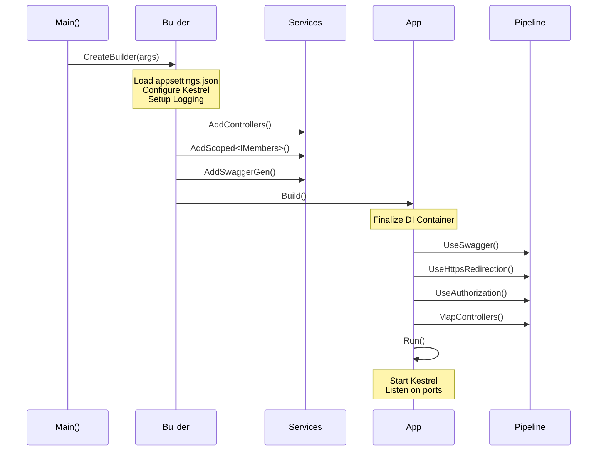
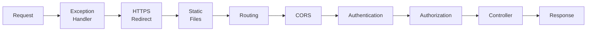

# 📚 Project Structure and Setup

> **Complete Guide to ASP.NET Core Web API Project Organization**

---

## 🎯 Creating a Web API Project

### Using Visual Studio

```
1. File → New → Project
2. Select "ASP.NET Core Web API"
3. Configure:
   - Project Name: APIMemberAPIvirsion08
   - Framework: .NET 8.0
   - Authentication: None
   - Configure for HTTPS: ✅
   - Enable OpenAPI support: ✅
4. Click Create
```

### Using .NET CLI

```bash
dotnet new webapi -n APIMemberAPIvirsion08 -f net8.0
cd APIMemberAPIvirsion08
dotnet run
```

---

## 📁 Standard Project Structure

```
APIMemberAPIvirsion08/
├── 📁 Controllers/
│   ├── MemberController.cs        # API endpoints
│   └── WeatherForecastController.cs
├── 📁 Models/
│   └── Members.cs                 # Data models
├── 📁 Services/
│   └── IMembers.cs                # Service interfaces
├── 📁 Repository/
│   └── MembersRepository.cs       # Data access
├── 📁 Properties/
│   └── launchSettings.json        # Debug configuration
├── appsettings.json               # App configuration
├── appsettings.Development.json   # Dev-specific config
├── Program.cs                     # Application entry point
└── APIMemberAPIvirsion08.csproj   # Project file
```

### Folder Responsibilities

| Folder | Purpose | Example Files |
|--------|---------|---------------|
| **Controllers** | HTTP request handling | MemberController.cs |
| **Models** | Data structures/entities | Members.cs, Employee.cs |
| **Services** | Interface definitions | IMembers.cs, IEmployeeService.cs |
| **Repository** | Data access implementation | MembersRepository.cs |
| **Properties** | Project metadata | launchSettings.json |

---

## 📄 Program.cs - Application Entry Point

Complete `Program.cs` with detailed line-by-line explanation:

```csharp
// ════════════════════════════════════════════════════════════════════
// IMPORTS - Bringing in required namespaces
// ════════════════════════════════════════════════════════════════════
using APIMemberAPIvirsion08.Repository;  // Line 1: Repository implementations
using APIMemberAPIvirsion08.Services;    // Line 2: Service interfaces

// ════════════════════════════════════════════════════════════════════
// BUILDER PHASE - Configure services (Dependency Injection Container)
// ════════════════════════════════════════════════════════════════════
var builder = WebApplication.CreateBuilder(args);
// Line 3: Creates a WebApplicationBuilder
//         - Reads configuration from appsettings.json
//         - Sets up default logging (Console, Debug, EventSource)
//         - Configures Kestrel web server
//         - Picks up environment variables
//         - args: Command-line arguments passed to the app

// Add services to the container.
builder.Services.AddControllers();
// Line 4: Registers MVC Controller services
//         - Enables controller discovery
//         - Enables model binding
//         - Enables input/output formatters (JSON)
//         - Enables routing

builder.Services.AddScoped<IMembers, MembersRepository>();
// Line 5: Registers our custom service
//         - IMembers: Interface (abstraction)
//         - MembersRepository: Implementation
//         - AddScoped: New instance per HTTP request
//         - This enables constructor injection in controllers

// Learn more about configuring Swagger/OpenAPI
builder.Services.AddEndpointsApiExplorer();
// Line 6: Registers endpoint explorer
//         - Required for Swagger to discover endpoints
//         - Maps minimal APIs and controllers

builder.Services.AddSwaggerGen();
// Line 7: Registers Swagger generator
//         - Generates OpenAPI specification
//         - Creates swagger.json at runtime

// ════════════════════════════════════════════════════════════════════
// BUILD PHASE - Create the application
// ════════════════════════════════════════════════════════════════════
var app = builder.Build();
// Line 8: Builds the WebApplication
//         - Finalizes the DI container (no more registrations)
//         - Creates the middleware pipeline foundation
//         - Returns WebApplication instance

// ════════════════════════════════════════════════════════════════════
// MIDDLEWARE PHASE - Configure HTTP request pipeline
// ════════════════════════════════════════════════════════════════════
// Configure the HTTP request pipeline.
if (app.Environment.IsDevelopment())
// Line 9: Check current environment
//         - Development: Local machine
//         - Staging: Pre-production
//         - Production: Live environment
{
    app.UseSwagger();
    // Line 10: Adds Swagger middleware
    //          - Endpoint: /swagger/v1/swagger.json
    //          - Generates OpenAPI spec dynamically
    
    app.UseSwaggerUI();
    // Line 11: Adds Swagger UI middleware
    //          - Endpoint: /swagger
    //          - Interactive API documentation
    //          - "Try it out" functionality
}

app.UseHttpsRedirection();
// Line 12: HTTPS Redirection middleware
//          - Redirects HTTP requests to HTTPS
//          - 307 Temporary Redirect
//          - Security best practice

app.UseAuthorization();
// Line 13: Authorization middleware
//          - Evaluates [Authorize] attributes
//          - Checks user claims and roles
//          - Returns 401/403 if unauthorized
//          Note: UseAuthentication() would come before this if using auth

app.MapControllers();
// Line 14: Endpoint routing middleware
//          - Maps controller actions to routes
//          - Uses [Route] and [Http*] attributes
//          - Creates endpoint metadata

// ════════════════════════════════════════════════════════════════════
// RUN PHASE - Start the application
// ════════════════════════════════════════════════════════════════════
app.Run();
// Line 15: Starts the web server
//          - Blocks the calling thread
//          - Listens for incoming HTTP requests
//          - Continues until shutdown signal (Ctrl+C)
```

### Execution Flow Diagram



---

## ⚙️ launchSettings.json

Controls how the application launches during development:

```json
{
  "$schema": "http://json.schemastore.org/launchsettings.json",
  "iisSettings": {
    "windowsAuthentication": false,    // Disable Windows Auth
    "anonymousAuthentication": true,   // Allow anonymous requests
    "iisExpress": {
      "applicationUrl": "http://localhost:52390",  // IIS Express URL
      "sslPort": 44343                             // HTTPS port
    }
  },
  "profiles": {
    "http": {
      "commandName": "Project",           // Run as Kestrel
      "dotnetRunMessages": true,          // Show dotnet run messages
      "launchBrowser": true,              // Auto-open browser
      "launchUrl": "swagger",             // Open Swagger UI
      "applicationUrl": "http://localhost:5221",
      "environmentVariables": {
        "ASPNETCORE_ENVIRONMENT": "Development"
      }
    },
    "https": {
      "commandName": "Project",
      "dotnetRunMessages": true,
      "launchBrowser": true,
      "launchUrl": "swagger",
      "applicationUrl": "https://localhost:7116;http://localhost:5221",
      "environmentVariables": {
        "ASPNETCORE_ENVIRONMENT": "Development"
      }
    },
    "IIS Express": {
      "commandName": "IISExpress",        // Use IIS Express
      "launchBrowser": true,
      "launchUrl": "swagger",
      "environmentVariables": {
        "ASPNETCORE_ENVIRONMENT": "Development"
      }
    }
  }
}
```

### Key Settings Explained

| Setting | Purpose |
|---------|---------|
| `commandName` | "Project" = Kestrel, "IISExpress" = IIS Express |
| `applicationUrl` | URLs the app listens on |
| `launchUrl` | Page to open on launch |
| `environmentVariables` | Set environment (Development/Staging/Production) |
| `sslPort` | HTTPS port for IIS Express |

---

## 📋 appsettings.json

Application configuration file:

```json
{
  "Logging": {
    "LogLevel": {
      "Default": "Information",           // Default log level
      "Microsoft.AspNetCore": "Warning"   // Reduce ASP.NET noise
    }
  },
  "ConnectionStrings": {
    "EmployeeDBConnection": "Data Source=(localdb)\\ProjectModels;Initial Catalog=Demoempdept;Integrated Security=True"
  },
  "AllowedHosts": "*",
  "AppSettings": {
    "ApiKey": "your-api-key-here",
    "MaxItemsPerPage": 100
  }
}
```

### Accessing Configuration in Code

```csharp
// Method 1: In Program.cs
var connectionString = builder.Configuration.GetConnectionString("EmployeeDBConnection");

// Method 2: Using IConfiguration injection
public class MyService
{
    private readonly IConfiguration _config;
    
    public MyService(IConfiguration config)
    {
        _config = config;
        var maxItems = _config.GetValue<int>("AppSettings:MaxItemsPerPage");
    }
}
```

---

## 📦 Project File (.csproj)

```xml
<Project Sdk="Microsoft.NET.Sdk.Web">

  <PropertyGroup>
    <TargetFramework>net8.0</TargetFramework>    <!-- Target .NET version -->
    <Nullable>enable</Nullable>                   <!-- Enable nullable types -->
    <ImplicitUsings>enable</ImplicitUsings>       <!-- Auto-import common namespaces -->
  </PropertyGroup>

  <ItemGroup>
    <!-- EF Core for SQL Server -->
    <PackageReference Include="Microsoft.EntityFrameworkCore.SqlServer" Version="8.0.0" />
    
    <!-- Swagger/OpenAPI -->
    <PackageReference Include="Swashbuckle.AspNetCore" Version="6.5.0" />
  </ItemGroup>

</Project>
```

---

## 🔧 Middleware Pipeline Order

The order of middleware registration matters:

```csharp
// ✅ CORRECT ORDER
app.UseExceptionHandler("/error");  // 1. Handle exceptions first
app.UseHsts();                       // 2. Security headers
app.UseHttpsRedirection();           // 3. Redirect to HTTPS
app.UseStaticFiles();                // 4. Serve static files
app.UseRouting();                    // 5. Match routes
app.UseCors();                       // 6. CORS policy
app.UseAuthentication();             // 7. Identify user
app.UseAuthorization();              // 8. Check permissions
app.MapControllers();                // 9. Execute controller
```



---

## 📊 Environment-Based Configuration

.NET Core supports environment-specific configuration:

```
appsettings.json                    # Base configuration (always loaded)
appsettings.Development.json        # Development overrides
appsettings.Staging.json            # Staging overrides
appsettings.Production.json         # Production overrides
```

### Environment Detection

```csharp
if (app.Environment.IsDevelopment())
{
    // Development-only code
    app.UseSwagger();
    app.UseDeveloperExceptionPage();
}
else if (app.Environment.IsStaging())
{
    // Staging-only code
}
else if (app.Environment.IsProduction())
{
    // Production-only code
    app.UseExceptionHandler("/error");
}
```

---

## 📋 Quick Revision Points

| Component | File | Purpose |
|-----------|------|---------|
| **Entry Point** | Program.cs | Configure DI, middleware, run app |
| **Configuration** | appsettings.json | App settings, connection strings |
| **Launch Settings** | launchSettings.json | Debug profiles, URLs, environment |
| **Project** | .csproj | NuGet packages, target framework |
| **Controllers** | Controllers/*.cs | Handle HTTP requests |
| **Models** | Models/*.cs | Data structures |
| **Services** | Services/*.cs | Business logic interfaces |
| **Repository** | Repository/*.cs | Data access implementations |

---

## 🎯 Key Takeaways

1. **Program.cs** = Single file for DI registration and middleware configuration
2. **launchSettings.json** = Development-time settings only (not deployed)
3. **appsettings.json** = Runtime configuration (deployed with app)
4. **Middleware Order** = Critical for security and functionality
5. **Environment** = Development/Staging/Production affects behavior
6. **DI Container** = Register all services before `Build()`

---

## 📚 Interview Questions

**Q1: What is the purpose of Program.cs in .NET Core?**
> Program.cs is the entry point that creates the host, configures dependency injection, sets up the middleware pipeline, and starts the application.

**Q2: What is the difference between appsettings.json and launchSettings.json?**
> appsettings.json contains runtime configuration (deployed with app). launchSettings.json contains development-time settings like URLs and environment variables (not deployed).

**Q3: Why does middleware order matter?**
> Middleware executes in registration order. For example, Authentication must come before Authorization, and Exception handling should be first to catch all errors.

**Q4: What happens if you call Build() multiple times?**
> You cannot. Once Build() is called, the DI container is finalized and no more services can be registered.

---

*Next: [04_Controllers_Routing.md](04_Controllers_Routing.md) - Controllers, Routing, and Attribute-Based Configuration*
