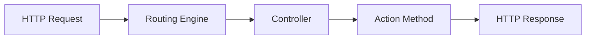
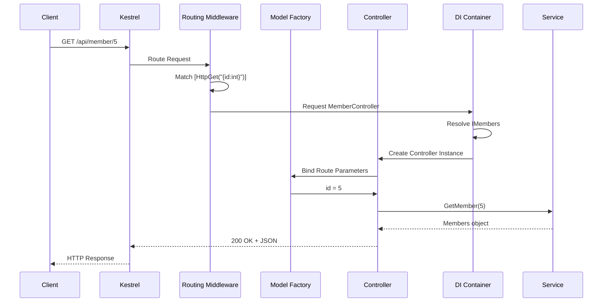

# 📚 Controllers and Routing in ASP.NET Core Web API

> **Complete Guide to Building API Controllers and Configuring Routes**

---

## 🎯 What is a Controller?

A **Controller** is a class that handles incoming HTTP requests, processes them, and returns responses. In Web API, controllers inherit from `ControllerBase` and are decorated with specific attributes.



---

## 🏗️ Controller Anatomy

### Complete Controller Example with Line-by-Line Explanation

```csharp
// ════════════════════════════════════════════════════════════════════
// IMPORTS - Required namespaces
// ════════════════════════════════════════════════════════════════════
using Microsoft.AspNetCore.Mvc;         // Line 1: Core MVC types
                                         //         - ControllerBase
                                         //         - Route, HttpGet, etc.
using APIMemberAPIvirsion08.Models;     // Line 2: Our data models
using APIMemberAPIvirsion08.Services;   // Line 3: Service interfaces
using System.Collections.Generic;       // Line 4: IEnumerable<T>

namespace APIMemberAPIvirsion08.Controllers  // Line 5: Controller namespace
{
    // ════════════════════════════════════════════════════════════════
    // ROUTE ATTRIBUTE - Define base URL path
    // ════════════════════════════════════════════════════════════════
    [Route("api/[controller]")]
    // Line 6: Attribute Routing
    //         - "api/" = Literal path segment
    //         - "[controller]" = Token replaced by controller name
    //         - Result: /api/member (from "MemberController")
    //         - Case-insensitive matching
    
    // ════════════════════════════════════════════════════════════════
    // API CONTROLLER ATTRIBUTE - Enable API behaviors
    // ════════════════════════════════════════════════════════════════
    [ApiController]
    // Line 7: Enables API-specific features:
    //         ✅ Automatic model validation (returns 400 for invalid models)
    //         ✅ Automatic [FromBody] inference for complex types
    //         ✅ Automatic [FromRoute] inference for route parameters
    //         ✅ Problem details for error responses
    //         ✅ Requires attribute routing (no conventional routing)
    
    // ════════════════════════════════════════════════════════════════
    // CONTROLLER CLASS - Inherit from ControllerBase
    // ════════════════════════════════════════════════════════════════
    public class MemberController : ControllerBase
    // Line 8: Controller class definition
    //         - Naming convention: <Name>Controller
    //         - [controller] token uses "Member" (strips "Controller")
    //         - ControllerBase: API controller (no view support)
    //         - Controller: MVC controller (has view support)
    {
        // ════════════════════════════════════════════════════════════
        // DEPENDENCY INJECTION - Private readonly field
        // ════════════════════════════════════════════════════════════
        private readonly IMembers member;
        // Line 9: Declare service dependency
        //         - readonly: Can only be set in constructor
        //         - IMembers: Interface (abstraction)
        //         - Follows Dependency Inversion Principle

        public MemberController(IMembers mem)
        // Line 10: Constructor injection
        //          - DI container provides IMembers implementation
        //          - No "new" keyword - loosely coupled
        {
            member = mem;
            // Line 11: Assign injected service to field
        }

        // ════════════════════════════════════════════════════════════
        // GET ALL - Retrieve all resources
        // ════════════════════════════════════════════════════════════
        [HttpGet]
        // Line 12: Maps to HTTP GET /api/member
        //          - No route parameter = returns all
        public IEnumerable<Members> Get()
        // Line 13: Returns collection of Members
        //          - IEnumerable<T> serialized to JSON array
        {
            return member.GetAllMember();
            // Line 14: Call service method
        }

        // ════════════════════════════════════════════════════════════
        // GET BY ID - Retrieve single resource with route constraint
        // ════════════════════════════════════════════════════════════
        [HttpGet("{id:int}")]
        // Line 15: Maps to HTTP GET /api/member/5
        //          - {id} = Route parameter
        //          - :int = Route constraint (must be integer)
        //          - Prevents /api/member/abc from matching
        public Members Get(int id)
        // Line 16: Parameter name must match route parameter
        {
            return member.GetMember(id);
            // Line 17: Call service with ID
        }

        // ════════════════════════════════════════════════════════════
        // GET BY NAME - Overloaded GET with string parameter
        // ════════════════════════════════════════════════════════════
        [HttpGet("{name}")]
        // Line 18: Maps to HTTP GET /api/member/John
        //          - No constraint = matches any string
        //          - Route precedence: specific ({id:int}) before generic ({name})
        public IEnumerable<Members> Get(string name)
        // Line 19: Returns members matching name
        {
            return member.GetAllMemberbyname(name);
            // Line 20: Call service with name filter
        }

        // ════════════════════════════════════════════════════════════
        // GET BY ADDRESS - Named route segment
        // ════════════════════════════════════════════════════════════
        [HttpGet("Address/{address}")]
        // Line 21: Maps to HTTP GET /api/member/Address/Mumbai
        //          - "Address" = Literal segment in URL
        //          - {address} = Parameter placeholder
        public IEnumerable<Members> GetAddress(string address)
        // Line 22: Different method name is OK
        //          - Route template determines URL, not method name
        {
            return member.GetAllMemberbyaddress(address);
            // Line 23: Call service with address filter
        }

        // ════════════════════════════════════════════════════════════
        // POST - Create new resource
        // ════════════════════════════════════════════════════════════
        [HttpPost]
        // Line 24: Maps to HTTP POST /api/member
        public Members Post([FromBody] Members memberpost)
        // Line 25: [FromBody] binds request body JSON to object
        //          - Automatic with [ApiController]
        //          - Deserializes JSON to Members object
        {
            return member.Add(memberpost);
            // Line 26: Add and return created member
        }

        // ════════════════════════════════════════════════════════════
        // PUT - Update existing resource
        // ════════════════════════════════════════════════════════════
        [HttpPut("{id}")]
        // Line 27: Maps to HTTP PUT /api/member/5
        public Members Put(int id, [FromBody] Members memberput)
        // Line 28: Both route parameter and body are bound
        //          - id: From URL
        //          - memberput: From request body
        {
            return member.Update(id, memberput);
            // Line 29: Update and return modified member
        }

        // ════════════════════════════════════════════════════════════
        // DELETE - Remove resource
        // ════════════════════════════════════════════════════════════
        [HttpDelete("{id}")]
        // Line 30: Maps to HTTP DELETE /api/member/5
        public void Delete(int id)
        // Line 31: void return = 204 No Content response
        {
            member.Delete(id);
            // Line 32: Delete member by ID
        }
    }
}
```

---

## 🎨 [ApiController] Attribute Features

```mermaid
graph TB
    API[ApiController Attribute]
    API --> A[Automatic Model Validation]
    API --> B[Binding Source Inference]
    API --> C[Problem Details Response]
    API --> D[Attribute Routing Required]
    
    A --> A1[Returns 400 for invalid models]
    B --> B1[[FromBody] for complex types]
    B --> B2[[FromRoute] for route params]
    C --> C1[RFC 7807 error format]
    D --> D1[No conventional routing]
```

### Without [ApiController]

```csharp
// Must manually check ModelState
[HttpPost]
public IActionResult Post([FromBody] Members member)
{
    if (!ModelState.IsValid)
    {
        return BadRequest(ModelState);  // Manual validation
    }
    return Ok(_service.Add(member));
}
```

### With [ApiController]

```csharp
// Automatic validation - returns 400 automatically for invalid model
[HttpPost]
public Members Post([FromBody] Members member)
{
    return _service.Add(member);  // ModelState checked automatically
}
```

---

## 🛤️ Routing Patterns

### Route Template Syntax

| Syntax | Meaning | Example |
|--------|---------|---------|
| `api/` | Literal path segment | `/api/...` |
| `[controller]` | Controller name token | `Member` from `MemberController` |
| `[action]` | Action name token | Method name |
| `{id}` | Required parameter | Must be provided |
| `{id?}` | Optional parameter | Can be omitted |
| `{id=5}` | Default value | Uses 5 if not provided |
| `{id:int}` | Route constraint | Must be integer |

### Route Examples

```csharp
// Basic routes
[Route("api/[controller]")]           // /api/member
[Route("api/v1/[controller]")]        // /api/v1/member
[Route("[controller]")]               // /member

// Action-level routes
[HttpGet]                             // /api/member
[HttpGet("{id}")]                     // /api/member/5
[HttpGet("{id:int}")]                 // /api/member/5 (int only)
[HttpGet("search/{term}")]            // /api/member/search/john
[HttpGet("~/api/special")]            // /api/special (overrides base)
```

---

## 🔒 Route Constraints

| Constraint | Description | Example |
|------------|-------------|---------|
| `int` | Matches integer | `{id:int}` |
| `bool` | Matches boolean | `{active:bool}` |
| `datetime` | Matches DateTime | `{date:datetime}` |
| `decimal` | Matches decimal | `{price:decimal}` |
| `double` | Matches double | `{weight:double}` |
| `float` | Matches float | `{rating:float}` |
| `guid` | Matches GUID | `{id:guid}` |
| `long` | Matches long | `{id:long}` |
| `minlength(n)` | Min string length | `{name:minlength(3)}` |
| `maxlength(n)` | Max string length | `{name:maxlength(50)}` |
| `length(n)` | Exact length | `{code:length(6)}` |
| `length(m,n)` | Length range | `{code:length(4,8)}` |
| `min(n)` | Min value | `{age:min(18)}` |
| `max(n)` | Max value | `{age:max(120)}` |
| `range(m,n)` | Value range | `{age:range(18,65)}` |
| `alpha` | Alphabetic only | `{name:alpha}` |
| `regex(expr)` | Regex pattern | `{code:regex(^[A-Z]{{2}}\\d{{4}}$)}` |

### Constraint Examples

```csharp
[HttpGet("{id:int:min(1):max(1000)}")]
// Must be integer between 1 and 1000

[HttpGet("{name:alpha:minlength(2):maxlength(50)}")]
// Must be alphabetic, 2-50 characters

[HttpGet("{code:regex(^[A-Z]{{3}}$)}")]
// Must be exactly 3 uppercase letters
```

---

## ⚖️ ControllerBase vs Controller

| Feature | ControllerBase | Controller |
|---------|----------------|------------|
| **Purpose** | Web API | MVC with Views |
| **View Support** | ❌ No | ✅ Yes |
| **View()** | ❌ No | ✅ Yes |
| **PartialView()** | ❌ No | ✅ Yes |
| **Json()** | ✅ Yes | ✅ Yes |
| **Ok()** | ✅ Yes | ✅ Yes |
| **NotFound()** | ✅ Yes | ✅ Yes |
| **BadRequest()** | ✅ Yes | ✅ Yes |
| **TempData** | ❌ No | ✅ Yes |
| **ViewData** | ❌ No | ✅ Yes |

### When to Use Each

```csharp
// Web API - Use ControllerBase
[ApiController]
public class MemberController : ControllerBase  // No view methods needed
{
    [HttpGet]
    public IEnumerable<Members> Get() => _service.GetAll();
}

// MVC - Use Controller
public class HomeController : Controller  // Need View() method
{
    public IActionResult Index() => View();
}
```

---

## 📊 Request Flow Diagram



---

## 🔧 Multiple Route Attributes

```csharp
// Multiple routes for same action
[HttpGet]
[HttpGet("all")]
[HttpGet("list")]
public IEnumerable<Members> GetAll()
{
    return _service.GetAll();
}
// Matches: /api/member, /api/member/all, /api/member/list
```

---

## 📋 Quick Revision Points

| Concept | Description |
|---------|-------------|
| `[Route("api/[controller]")]` | Base route for controller |
| `[ApiController]` | Enables API behaviors |
| `ControllerBase` | Base class for API controllers |
| `[HttpGet]` | Maps to HTTP GET |
| `[HttpGet("{id}")]` | GET with route parameter |
| `[HttpGet("{id:int}")]` | GET with integer constraint |
| `[FromBody]` | Bind from request body |
| `[FromRoute]` | Bind from URL segment |
| `[FromQuery]` | Bind from query string |

---

## 🎯 Key Takeaways

1. **[ApiController]** = Automatic validation + binding inference
2. **[Route]** = Attribute routing (required with [ApiController])
3. **[controller]** token = Uses class name minus "Controller"
4. **ControllerBase** = For APIs (no view support)
5. **Route Constraints** = Validate parameters in URL
6. **Constructor Injection** = DI provides dependencies

---

## 📚 Interview Questions

**Q1: What is the purpose of [ApiController] attribute?**
> It enables API-specific behaviors: automatic model validation (400 for invalid models), binding source inference, problem details for errors, and requirement for attribute routing.

**Q2: What is the difference between ControllerBase and Controller?**
> ControllerBase is for APIs (no view support). Controller inherits from ControllerBase and adds view-related methods like View(), PartialView(), ViewData, and TempData.

**Q3: How does [controller] token work in routing?**
> It's replaced with the controller class name minus the "Controller" suffix. MemberController becomes "member" (case-insensitive).

**Q4: What are route constraints?**
> Route constraints validate URL parameters. `{id:int}` only matches integers, `{name:alpha}` only matches alphabetic strings.

---

*Next: [05_HTTP_Methods_CRUD.md](05_HTTP_Methods_CRUD.md) - Complete CRUD Operations with HTTP Methods*
